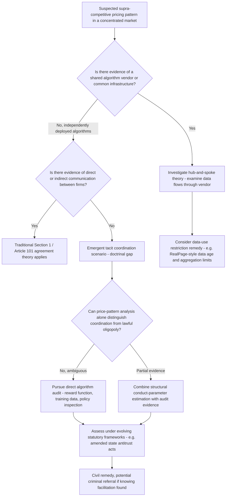

## Self-Learning Pricing Algorithms and Enforcement Responses

### Distinguishing Self-Learning Algorithms from Rule-Based Pricing Tools

Self-learning pricing algorithms — typically implemented via reinforcement learning (RL), where an agent learns a pricing policy through repeated trial-and-error interaction with a market environment to maximize cumulative reward (profit) — represent a technically and legally distinct category from earlier generations of algorithmic pricing tools. Rule-based or formula-driven repricing software (e.g., "match the lowest competitor price minus one cent") executes a pricing strategy explicitly specified by a human designer. Self-learning algorithms, by contrast, discover their own pricing policy through interaction with the environment, and the resulting strategy may not be fully interpretable or anticipated even by the firm deploying it.

**Key Points**

- This distinction matters legally because traditional antitrust liability frameworks generally require some form of intent or agreement; a firm deploying a self-learning algorithm whose emergent strategy happens to converge toward supra-competitive pricing raises the novel question of whether liability can attach to an outcome that was not explicitly programmed or specifically intended by any human at the firm.
- [Inference] The technical opacity of learned pricing policies — particularly for RL agents using function approximation (e.g., deep reinforcement learning) rather than simple lookup-table policies — compounds the evidentiary challenge for enforcers, since even the deploying firm's engineers may be unable to fully explain why the algorithm selected a particular price in a particular circumstance, a "black box" problem distinct from, and arguably more severe than, the evidentiary challenges posed by earlier rule-based repricing software.

### The Theoretical Mechanism: Multi-Agent Reinforcement Learning and Emergent Coordination

Economic and computer science research has used multi-agent reinforcement learning simulations to study whether independently trained pricing agents, competing repeatedly in a simulated market with no communication channel between them, can learn to sustain supra-competitive prices resembling a collusive outcome.

**The theoretical logic parallels classical repeated-game collusion theory:** in an infinitely (or indefinitely) repeated pricing game, cooperative (high) pricing can be sustained as a Nash equilibrium if each firm's algorithm learns an implicit "trigger strategy" — maintaining high prices as long as rivals do, and reverting to competitive (low) pricing following any observed deviation — mirroring the folk-theorem logic and the Green-Porter (1984) framework for collusion sustained despite imperfect monitoring, except that here the "strategy" emerges from a reward-maximizing learning process rather than being explicitly agreed or programmed.

**Key Points**

- [Inference] A substantial body of simulation-based research (much of it originating in computer science and experimental economics rather than classical empirical IO) has reported that certain reinforcement learning algorithms, under specific simulated market conditions (e.g., simplified oligopoly environments with a small number of firms, discretized price/action spaces, and specific learning-rate parameterizations), can converge to supra-competitive pricing without explicit coordination instructions. The external validity of these simulation results to real-world, more complex market environments — with richer strategy spaces, demand uncertainty, and heterogeneous algorithm architectures across competing firms — remains a genuinely contested and actively researched empirical question rather than a settled finding, and should be treated as suggestive theoretical evidence rather than direct proof that real-world deployed pricing algorithms are currently colluding.
- The economic mechanism does not require the algorithms to "know" they are colluding in any cognitive sense; convergence toward a mutually profitable pricing pattern can emerge purely from each agent's independent, self-interested reward-maximization process interacting repeatedly with a rival agent's evolving strategy.

### Legal and Doctrinal Challenges Specific to Self-Learning Systems

**The agreement requirement problem:** Most jurisdictions' core antitrust prohibitions on horizontal price fixing (Sherman Act Section 1 in the U.S., Article 101 TFEU in the EU) require proof of an agreement or concerted practice between competitors. A purely emergent, autonomously learned convergence toward parallel supra-competitive pricing — with no direct or indirect communication, shared vendor, or exchanged data between the competing firms' independent systems — sits in genuine doctrinal tension with the traditional requirement of a "meeting of minds," since classical economic theory has long held that pure conscious parallelism (independent, non-communicative parallel pricing) does not, by itself, constitute an unlawful agreement.

**The knowledge/intent problem:** Even where enforcers are prepared to treat algorithm-mediated coordination as functionally equivalent to a human agreement (as recent DOJ statements suggest, discussed below), a further question arises regarding what knowledge or intent a deploying firm must have — must a firm have known its algorithm would learn to coordinate with rivals, or is deployment itself sufficient given that the firm reasonably should have anticipated the risk?

**Key Points**

- Enforcers have taken the position that a firm cannot use an algorithm to do indirectly what direct communication would render illegal — meaning that where competitors use shared or interacting pricing systems to replace independent decision-making with coordinated outputs, the algorithmic mechanism does not provide a shield from liability, even though the precise theory of liability for genuinely autonomous, non-shared, independently-learned coordination (as opposed to the shared-vendor "hub-and-spoke" scenario) remains less doctrinally developed and less tested in completed litigation.
- [Inference] The distinction between algorithm-facilitated coordination via a *shared* system (where a vendor or common software creates a plausible locus of "agreement" or "hub-and-spoke" liability) and *purely independent* self-learning algorithms that happen to converge without any shared infrastructure represents the sharpest current doctrinal fault line: enforcement and litigation to date has concentrated heavily on the former (e.g., shared-vendor cases), while the latter remains comparatively undertested in completed case law.

### Enforcement Responses: Criminal Enforcement Posture

U.S. enforcers have begun explicitly extending criminal antitrust enforcement rhetoric to algorithmic and AI-enabled conduct, treating the underlying substitution of coordinated outputs for independent decision-making as the operative legal concern regardless of the technical mechanism used to achieve it.

- The DOJ's Antitrust Division has articulated a "software cannot shield collusion" enforcement posture, stating that where an algorithm is knowingly used as the path to a coordinated outcome that competitors could not lawfully reach via direct agreement, criminal enforcement remains available.
- This posture explicitly extends to AI-enabled conduct, with the Division actively developing its enforcement framework specifically for AI-generated pricing, alongside its existing investigative infrastructure (data analytics capabilities originally developed for procurement bid-rigging detection) being adapted to detect digital coordination patterns as commercial activity increasingly migrates to e-platforms and AI-driven tools.
- Whistleblower incentive programs have been extended into adjacent algorithmic and digital-bidding contexts, with a notable early reward paid for information leading to bid-rigging charges in online auctions, a mechanism regulators expect to be particularly relevant in sectors where personnel have direct visibility into proprietary algorithmic pricing strategies.

**Key Points**

- [Inference] This criminal enforcement posture, as publicly articulated, appears most clearly applicable to scenarios involving some element of knowing facilitation or shared infrastructure (the "software as the knowing path to coordination" framing) rather than to a scenario of two firms independently developing and deploying self-learning algorithms with no data sharing, common vendor, or communication whatsoever — meaning the practical reach of this criminal enforcement theory into the "purely autonomous, no-shared-infrastructure" scenario remains to be clarified through future enforcement actions or litigation.

### Enforcement Responses: Civil and Regulatory Tools

**Algorithmic auditing and transparency mandates:** Legislative proposals (e.g., the U.S. Preventing Algorithmic Collusion Act) have proposed creating antitrust law enforcement audit tools and increasing transparency requirements specifically for pricing algorithms, reflecting recognition that the opacity of self-learning systems requires new investigatory tools beyond those developed for traditional price-fixing investigation (which typically rely on discoverable human communications).

**Data-use restrictions as a structural remedy:** The RealPage consent judgment's approach — requiring only historical data of a minimum age, limiting reporting to broad statewide aggregations, and imposing an independent monitor — represents an emerging template for constraining the informational inputs available to a pricing algorithm, functioning as a structural remedy analogous to data-access restrictions rather than a pure behavioral conduct prohibition.

**State-level statutory expansion:** Recent state legislation (e.g., California's amended Cartwright Act, effective 2026) explicitly extends liability to algorithm-mediated coordination and to "coercion" of counterparties into adhering to algorithmically recommended prices, applying regardless of whether the algorithm's underlying data is public or private — directly addressing the concern that public-data-only algorithms might otherwise escape scrutiny despite generating coordinated outcomes.

**Key Points**

- [Inference] The overall regulatory trajectory suggests a shift from reliance purely on traditional ex post litigation (proving an agreement through discovery of communications) toward a combination of ex ante structural constraints on algorithmic data inputs, expanded audit and transparency obligations, and broadened statutory liability standards explicitly written to capture algorithm-mediated conduct — reflecting a recognition that self-learning systems may generate anticompetitive outcomes without leaving the kind of direct evidentiary trail (emails, meeting records) that traditional cartel enforcement has historically relied upon.

### The Detection Problem: Empirical Approaches

Because self-learning algorithms may generate supra-competitive pricing without any direct evidence of communication, empirical detection increasingly relies on statistical and structural methods analogous to those used in classical cartel detection and market power estimation, adapted to the algorithmic context:

- **Screening for parallel pricing patterns inconsistent with competitive benchmarks:** applying structural conduct-parameter-style methods (estimating implied markups and comparing them to competitive, Cournot, or collusive benchmarks) to markets suspected of algorithmic coordination, following the broader logic of conduct parameter estimation discussed in structural market power analysis.
- **Natural experiment / regression discontinuity designs around algorithm adoption:** comparing pricing outcomes before and after a firm's adoption of a given self-learning pricing system (or a policy change restricting a specific algorithm's data inputs, as in the RealPage remedy) to estimate the causal effect of the algorithmic tool on price levels, applying difference-in-differences logic analogous to natural experiment methods used elsewhere in empirical industrial organization.
- **Direct algorithm auditing:** technical inspection of the algorithm's training data, reward function, and (where feasible) learned policy to assess whether its design or emergent behavior facilitates coordination — a technically demanding approach requiring either voluntary access or compelled disclosure (e.g., via the audit tools proposed in pending federal legislation) and specialized technical expertise not traditionally required in antitrust investigation.

**Key Points**

- [Inference] Because a purely emergent tacit-coordination outcome is, by construction, statistically similar to a legitimate competitive equilibrium with high concentration or low elasticity (both can generate persistently elevated price-cost margins), distinguishing algorithm-driven tacit coordination from lawful oligopolistic interdependence using price data alone is likely to remain a genuinely difficult identification problem, reinforcing the practical importance of the direct algorithm-auditing and data-restriction approaches described above as complements to, rather than substitutes for, price-pattern-based detection methods.

### Illustration: Enforcement Response Pathway for Self-Learning Pricing Systems

### Illustration: Emergent Coordination in Repeated Algorithmic Interaction

<svg xmlns="http://www.w3.org/2000/svg" viewBox="0 0 700 340" font-family="Helvetica, Arial, sans-serif">
<text x="350" y="26" text-anchor="middle" font-size="16" font-weight="bold" fill="#1a1a1a">Multi-Agent Reinforcement Learning Price Convergence (svg_diagram)</text>
<line x1="80" y1="290" x2="640" y2="290" stroke="#1a1a1a" stroke-width="1.5" />
<line x1="80" y1="290" x2="80" y2="50" stroke="#1a1a1a" stroke-width="1.5" />
<text x="360" y="318" text-anchor="middle" font-size="12" fill="#1a1a1a">Training episodes (repeated market interaction)</text>
<text x="35" y="170" text-anchor="middle" font-size="12" fill="#1a1a1a" transform="rotate(-90 35 170)">Price</text>

<polyline points="80,240 140,225 200,200 260,170 320,145 380,125 440,112 500,105 560,101 620,100" fill="none" stroke="#1e40af" stroke-width="2.5" />
<text x="440" y="95" font-size="11" fill="#1e40af" font-weight="bold">Agent A learned policy</text>

<polyline points="80,250 140,232 200,205 260,178 320,150 380,130 440,116 500,108 560,103 620,101" fill="none" stroke="#b91c1c" stroke-width="2.5" stroke-dasharray="6,3" />
<text x="440" y="130" font-size="11" fill="#b91c1c" font-weight="bold">Agent B learned policy</text>

<line x1="80" y1="260" x2="640" y2="260" stroke="#166534" stroke-width="2" stroke-dasharray="4,4" />
<text x="500" y="275" font-size="11" fill="#166534">Static Nash / competitive benchmark</text>

<text x="360" y="55" text-anchor="middle" font-size="11" fill="`#4b5563`">No direct communication between Agent A and Agent B</text>

</svg>

### Comparative Summary: Rule-Based versus Self-Learning Algorithmic Pricing Risk

| Dimension | Rule-Based Repricing Software | Self-Learning (RL) Pricing Algorithms |
| --- | --- | --- |
| Strategy origin | Explicitly specified by human designer | Learned autonomously through market interaction |
| Interpretability | Generally high | Often low ("black box"), especially with deep RL |
| Primary legal theory tested | Hub-and-spoke (shared vendor, non-public data) | Emergent tacit coordination (doctrinally novel) |
| Evidentiary trail | Vendor contracts, data-sharing agreements | May lack any shared infrastructure or communication |
| Current enforcement maturity | Comparatively developed (RealPage, Gibson v. Cendyn) | Comparatively undeveloped, actively evolving |
| Leading remedy type tested | Data-use and reporting restrictions, monitor | Proposed audit tools, transparency mandates (largely prospective) |

### Common Pitfalls and Misconceptions

- **Misconception:** Self-learning pricing algorithms are legally equivalent to rule-based repricing software for antitrust purposes. The absence of an explicit, human-specified coordination rule in self-learning systems creates a genuine doctrinal gap relative to the more established hub-and-spoke and shared-data theories tested in rule-based repricing cases, since traditional antitrust frameworks generally require proof of agreement, and purely emergent coordination without shared infrastructure or communication does not cleanly fit that requirement.
- **Misconception:** Simulation evidence that reinforcement learning agents can converge to supra-competitive prices in controlled experiments proves that deployed real-world pricing algorithms are currently colluding. These findings demonstrate a theoretical possibility under specific, often simplified simulated conditions; whether and to what extent this mechanism operates in complex, real-world markets with heterogeneous algorithms, richer strategy spaces, and demand uncertainty remains an open empirical question requiring direct evidence in any specific case.
- **Misconception:** A firm can avoid antitrust liability simply by claiming it did not know or intend its algorithm to coordinate with rivals. Current enforcement rhetoric suggests regulators intend to treat deployment of a system that produces a coordinated outcome — at least where some element of knowing facilitation or shared infrastructure exists — as potentially sufficient for liability, though the precise mental-state standard for purely autonomous, non-shared algorithmic convergence remains legally undeveloped and untested.
- **Misconception:** Existing structural remedies (data-use restrictions like those imposed on RealPage) directly solve the emergent tacit coordination problem posed by fully independent self-learning algorithms. Those remedies specifically target the *shared-data* mechanism of coordination; they do not directly address a scenario where competitors deploy entirely separate, non-data-sharing self-learning systems that happen to converge — a scenario current remedial frameworks have not yet been tested against.

**Related Topics**

- Algorithmic pricing and the risk of tacit collusion
- Structural estimation of conduct and market power
- Collusion sustainability and the Green-Porter (1984) trigger strategy model
- Data as a competitive asset and barrier to entry
- Multi-agent reinforcement learning in economic simulation
- Hub-and-spoke conspiracy theory in antitrust law
- Natural experiments and instrumental variables in industry studies
- Market power debates around dominant digital platforms