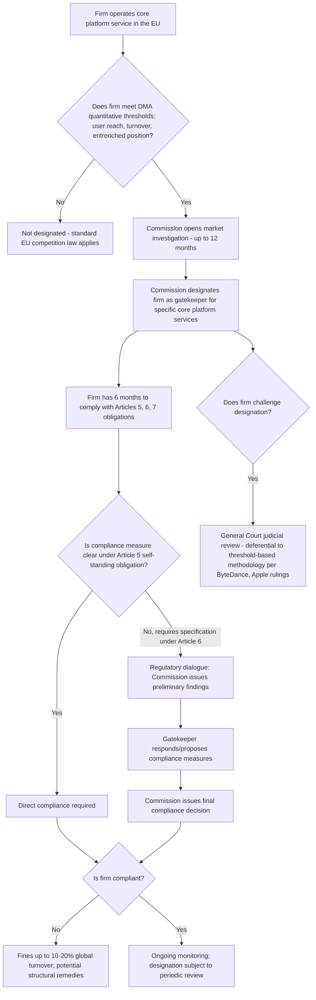

## Gatekeeper Regulation and the EU Digital Markets Act

### Legislative Purpose and the Ex Ante Regulatory Model

The Digital Markets Act (DMA), entering into force in November 2022 with most substantive provisions applying from May 2023, represents the European Union's foundational shift toward **ex ante** regulation of large digital platforms, in contrast to the traditional **ex post** competition law model requiring case-by-case proof of anticompetitive conduct and effect under Articles 101 and 102 TFEU. The DMA builds a digital level playing field with clear rights and rules for large online platforms designated as "gatekeepers," and ensures that gatekeepers do not abuse their position, rather than applying standard EU competition law provisions requiring proof of a specific antitrust violation.

**Key Points**

- Rather than applying standard EU competition law, the DMA imposes specific, predetermined obligations and prohibitions directly on designated large platforms, functioning as a regulatory rulebook rather than a case-by-case enforcement statute.
- This design directly parallels the ex ante versus ex post institutional design trade-off long discussed in natural monopoly and network industry regulation: ex ante rules offer speed and predictability at the cost of requiring the legislature to correctly anticipate which categories of conduct warrant blanket prohibition, while ex post enforcement preserves flexibility but incurs the delay and evidentiary burden of individual litigation.

### The Gatekeeper Designation Mechanism

The DMA does not apply to every digital business; it applies specifically to **gatekeepers** — large digital platforms providing one or more "core platform services" (CPS) that act as important gateways between business users and end users. Designation is based on scale, gateway importance, and durability of market position, assessed using defined objective criteria set out in the Regulation, including indicators such as user reach and, contextually, market share and entrenched position.

**Designated core platform service categories** under the DMA include online intermediation services, online search engines, online social networking services, video-sharing platform services, number-independent interpersonal communication services, operating systems, web browsers, virtual assistants, cloud computing services, and online advertising services.

**Key Points**

- The Commission designated its initial cohort of gatekeepers in September 2023, with seven companies — Alphabet, Amazon, Apple, ByteDance, Meta, Microsoft, and Booking — designated as gatekeepers and 23 of their online services classified as core platform services subject to obligations.
- Designation determinations are not static: following review of a designated firm's specific arguments, the Commission concluded Apple does not qualify as a gatekeeper with respect to Apple Ads and Apple Maps, since neither platform service was found to constitute an important gateway for business users to reach end users — a finding based on considerations including Apple Maps' relatively low overall EU usage and Apple Ads' very limited scale, illustrating that gatekeeper status is assessed service-by-service rather than applied uniformly across a firm's entire product portfolio.
- Gatekeepers have six months from the date of designation to comply with the substantive obligations under Articles 5, 6, and 7 DMA, meaning measurable changes in gatekeeper behavior typically lag the designation decision itself by several months.

### Core Substantive Obligations

The DMA's substantive requirements are organized primarily under three articles, each targeting a distinct category of gatekeeper conduct:

**Article 5 (self-standing obligations):** A set of prohibitions applying automatically upon designation without requiring further specification, including prohibitions on combining personal data across different core platform services without user consent, prohibitions on anti-steering provisions restricting business users from directing customers to offers outside the gatekeeper's platform, and requirements permitting business users to promote and conclude contracts with end users outside the gatekeeper's platform.

**Article 6 (obligations susceptible of being further specified):** A broader set of conduct requirements subject to regulatory dialogue and specification, including prohibitions on self-preferencing in ranking, requirements for interoperability of number-independent interpersonal communication services, restrictions on using non-public business-user data to compete with those business users, and requirements enabling data portability for end users.

**Article 7 (interoperability obligations for communication services):** Specific technical interoperability requirements for number-independent interpersonal communication services (messaging platforms), phased in over time by messaging function.

**Key Points**

- Under the original DMA, the obligation imposed on designated gatekeepers such as Google was structured around identifying specific structural barriers to entry — for instance, the asymmetry of access to user-generated data (queries, clicks, rankings) was identified as a structural barrier, requiring gatekeepers to provide access to such data to competing services operating within the same functional market, directly echoing the "data as a competitive asset and barrier to entry" concerns discussed elsewhere in digital-market competition analysis.
- [Inference] The distinction between Article 5's self-executing prohibitions and Article 6's obligations requiring further regulatory specification reflects a deliberate legislative design choice: Article 5 provisions are intended to apply with minimal interpretive discretion (reducing compliance uncertainty), while Article 6 provisions anticipate ongoing regulatory dialogue between the Commission and each gatekeeper to tailor implementation to the specific technical and business context of each designated service.

### Enforcement Mechanics and the Regulatory Dialogue Process

DMA enforcement operates through a distinctive "regulatory dialogue" process rather than a purely adjudicative model: the Commission engages directly with designated gatekeepers regarding proposed compliance measures, potentially issuing preliminary findings and awaiting responses before finalizing compliance requirements.

- In April 2026, the European Commission sent preliminary findings to Google outlining proposed measures to comply with the DMA; the Commission's final decision on these measures was expected by late July 2026, illustrating the multi-stage, iterative character of DMA compliance assessment relative to a single binary liability determination in traditional antitrust litigation.
- Non-compliance can result in fines of up to 10% of a gatekeeper's total worldwide annual turnover (rising to 20% for repeat infringements), and, in cases of systematic non-compliance, the Commission holds the power to impose additional remedies including behavioral or structural remedies up to and including divestiture, reflecting the DMA's design as a regulatory backstop with meaningfully severe penalties for non-compliance.

**Key Points**

- [Inference] The iterative "preliminary findings then final decision" enforcement structure represents a middle ground between the fully adjudicative, single-decision model of traditional ex post antitrust litigation and a purely negotiated compliance regime, intended to give designated gatekeepers an opportunity to propose and refine compliance measures before facing formal infringement findings and associated fines.

### Judicial Review of Gatekeeper Designations

A developing body of case law from the EU General Court has begun to clarify the scope and limits of judicial review available to companies challenging their gatekeeper designation or specific obligations.

- In earlier ByteDance cases, the General Court dismissed the TikTok owner's challenge to its designation as a gatekeeper, confirming that the DMA's statutory presumptions can carry significant weight where the relevant quantitative thresholds are met and are not manifestly called into question by sufficiently substantiated evidence — establishing a relatively deferential standard of review toward the Commission's threshold-based designation methodology.
- In a July 2026 judgment addressing joined cases brought by Apple, the General Court dismissed Apple's challenges to its designation as a gatekeeper and confirmed the Commission's delineation of software application stores as a single core platform service, while also clarifying that challenges to specific obligations or classifications lacking independent legal effects are inadmissible — meaning firms generally cannot separately challenge sub-components of a designation decision that do not independently produce binding legal consequences.
- Taken together, the developing body of DMA case law is broadly supportive of the Commission's ability to operate the new ex ante digital markets competition regime, while also establishing certain procedural limitations and safeguards on how designation decisions may be challenged.

**Key Points**

- [Inference] The relatively deferential judicial posture toward the Commission's quantitative threshold-based designation methodology (as opposed to a more searching, market-power-style economic analysis akin to traditional Article 102 dominance assessment) reflects a structural feature of the ex ante regulatory model: by design, the DMA substitutes bright-line, largely quantitative thresholds for the more open-ended economic dominance analysis traditionally required under Article 102, and the courts' deference to this threshold-based approach is consistent with — and arguably necessary for — the DMA's stated goal of providing greater ex ante legal certainty relative to traditional competition law enforcement.

### The First Statutory Review (2026)

The DMA required a statutory review process, with the Commission's formal review report published in April 2026 (COM(2026) 178).

- The Commission's review found that, just over two years since the DMA became fully applicable to designated gatekeepers, the regulation achieved a tangible positive impact toward its core objective of making EU digital markets fairer and more contestable, while also identifying implementation and enforcement challenges that slowed progress toward the DMA's objectives.
- The report's overall conclusion was that the DMA remains fit for purpose and does not require legislative revision at this stage, while identifying specific areas requiring particular focus going forward, notably how the DMA applies to artificial intelligence and cloud computing services.
- Regarding cloud computing services specifically, the Commission indicated it is investigating whether Article 6(7) (which mandates interoperability with gatekeeper-controlled services) could be extended to apply to cloud services, with cloud-specific gatekeeper designations expected to be decided by November 2026 and the outcome of the broader interoperability investigation not due until May 2027.
- Regarding the potential inclusion of generative AI as a designated core platform service category, the review's accompanying Staff Working Document reported that stakeholder feedback reflected multiple divergent "schools of thought," including the position that vertically integrated AI services already fall within existing DMA coverage and that what is needed is strict enforcement of existing obligations (such as Article 6(7)) rather than new categories of designation.

**Key Points**

- Industry stakeholders have expressed concern that DMA compliance has increasingly become a "guessing game" for companies as regulatory expectations and requirements continue to shift, with calls for the review process to provide a genuine evaluation of real-world outcomes rather than a purely formal assessment, and for the Commission to act as a neutral arbiter carefully weighing input from all stakeholders including the designated gatekeepers themselves.
- [Inference] The decision to leave the DMA's core legislative framework unchanged while flagging AI and cloud computing as areas for continued focus suggests the Commission's current strategy favors extending or clarifying the application of existing obligations (such as Article 6(7) interoperability requirements) to new technology categories through interpretation and enforcement guidance, rather than pursuing near-term legislative amendment — though this approach itself has been characterized by some industry stakeholders as contributing to the compliance uncertainty noted above.

### Comparative Positioning: DMA versus the UK's Strategic Market Status Regime

| Dimension | EU Digital Markets Act | UK Digital Markets, Competition and Consumers Act (DMCC) |
| --- | --- | --- |
| Designation methodology | Threshold-based, largely quantitative (user reach, turnover, market capitalization) | Firm-specific "Strategic Market Status" (SMS) assessment by the CMA |
| Obligations structure | Fixed list of statutory obligations (Articles 5, 6, 7) applying to all gatekeepers | Tailored conduct requirements determined per designated firm, per service |
| Designated entities (as of 2026) | Alphabet, Amazon, Apple, ByteDance, Meta, Microsoft, Booking | Google (general search/search advertising); Apple and Google (mobile platforms) |
| Judicial review posture | General Court deferential to threshold-based designation, per ByteDance and Apple rulings | Still developing as SMS conduct requirements are finalized |

**Key Points**

- [Inference] The EU's uniform, threshold-triggered obligation set versus the UK's firm-specific, tailored conduct-requirement model represents two distinct institutional design choices for implementing the same underlying ex ante regulatory philosophy: the EU model prioritizes predictability and equal treatment across designated firms at the potential cost of one-size-fits-all obligations poorly suited to some firms' specific business models, while the UK model prioritizes tailoring to firm-specific circumstances at the potential cost of a slower, more resource-intensive per-firm designation and remedy-design process.

### Illustration: DMA Gatekeeper Regulatory Lifecycle

### Common Pitfalls and Misconceptions

- **Misconception:** DMA gatekeeper designation applies uniformly to a firm's entire business once triggered. Designation operates at the level of specific core platform services, not the firm as a whole — as illustrated by Apple's successful argument that Apple Ads and Apple Maps do not independently qualify as gatekeeper services despite Apple's designation for other services such as its mobile operating system and app store.
- **Misconception:** The DMA replaces traditional EU competition law (Articles 101/102 TFEU) for digital markets. The DMA operates as a complementary, parallel regulatory regime imposing predetermined ex ante obligations on designated gatekeepers; traditional competition law enforcement (as illustrated by ongoing Article 102-based proceedings against designated gatekeepers, including interim measures against Meta) continues to apply alongside DMA obligations.
- **Misconception:** DMA obligations are fixed and unchanging once a firm is designated. The regulatory dialogue process under Article 6, the ongoing statutory review process, and ongoing investigations into extending obligations to new categories (cloud computing, generative AI) all indicate that gatekeeper obligations are subject to continued regulatory evolution and specification even after initial designation.
- **Misconception:** Judicial review of gatekeeper status functions as a full merits review of market power comparable to a traditional Article 102 dominance investigation. General Court rulings to date (ByteDance, Apple) indicate a comparatively deferential standard of review toward the Commission's quantitative threshold-based designation methodology, reflecting the DMA's deliberate substitution of bright-line criteria for open-ended economic dominance analysis.

**Related Topics**

- Market power debates around dominant digital platforms
- Data as a competitive asset and barrier to entry
- Essential facilities doctrine and mandated access remedies
- Access pricing in network industries (comparative ex ante regulatory design)
- UK Digital Markets, Competition and Consumers Act and Strategic Market Status regime
- Algorithmic pricing and the risk of tacit collusion
- Interoperability mandates and mandated data portability
- Deregulation case studies in telecoms, airlines, and utilities (comparative ex ante vs. ex post regulatory design)