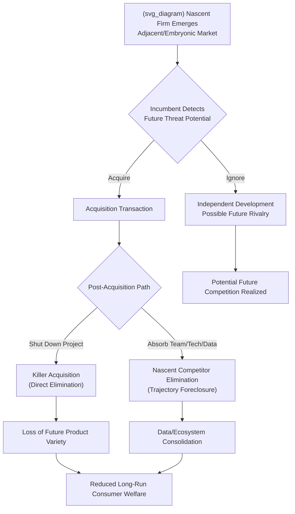

## Killer Acquisitions and Nascent Competitor Theories of Harm

### Definition and Conceptual Overview

A **killer acquisition** occurs when an incumbent firm acquires a target — typically an innovative startup or early-stage competitor — with the primary purpose of discontinuing the target's competing project before it matures into a viable market threat, rather than to integrate, develop, or commercialize the acquired technology. The term was formalized in the economics literature by Cunningham, Ederer, and Ma (2021), who studied the phenomenon in pharmaceutical markets.

A **nascent competitor theory of harm** is broader: it captures antitrust concern over an incumbent acquiring a firm that does not yet compete directly with the incumbent but has the potential — technological, positional, or strategic — to develop into a significant future competitor or entry threat. The acquisition removes this potential competitive constraint before it can materialize, either by shutting the target down (the killer acquisition subcase) or by absorbing it and neutralizing its independent trajectory.

Both theories depart from traditional merger analysis, which centers on loss of *existing* competition between two current rivals measurable via market shares, concentration indices, and observed price effects. Nascent competitor and killer acquisition theories instead concern the loss of *future or potential* competition — competition that has not yet occurred and may never occur with certainty, but whose probability-weighted value to consumers is nonetheless economically significant.

---

### Why Traditional Merger Tools Struggle Here

**Key Points**

- **Absence of current overlap**: Standard structural screens (HHI, market share thresholds under merger guidelines) are typically triggered by horizontal overlap in a *defined* relevant market. A nascent competitor may operate in an adjacent, embryonic, or as-yet-unlabeled market, so no overlap is detected.
- **Counterfactual uncertainty**: The theory rests on a counterfactual — what the target *would have become* absent acquisition. This is inherently probabilistic and unobservable, unlike measurable current output or pricing.
- **Small deal-value thresholds**: Historically, many notification regimes rely on target revenue or asset-size thresholds (e.g., the U.S. HSR Act's size-of-transaction/size-of-person tests). A pre-revenue or low-revenue startup with high strategic value can fall below these thresholds entirely, meaning many killer acquisitions escape *ex ante* review altogether. This gap is often called the "**killer acquisition loophole**" or **enforcement blind spot**.
- **Low observed price**: Many of these targets are acquired in "acqui-hire" or technology-absorption deals where no product price exists yet, undermining price-effects-based econometric tools (e.g., merger simulation, upward pricing pressure indices) that require observable pricing data.

---

### The Cunningham–Ederer–Ma (2021) Framework

**Key Points**

- Studied acquisitions of pharmaceutical drug projects by incumbent firms, focusing on cases with overlapping therapeutic categories between acquirer and target drug candidates.
- Found that acquired drug projects were significantly more likely to be **discontinued** when they overlapped with the acquirer's existing product portfolio, compared to non-overlapping acquisitions.
- Estimated that a non-trivial share (in their sample, on the order of **5–7%** of acquisitions) exhibited patterns consistent with killer acquisition motives — i.e., discontinuation driven by defensive elimination of a substitute product rather than commercial infeasibility.
- Proposed a **difference-in-differences / hazard-model** empirical strategy: compare development discontinuation rates for overlapping vs. non-overlapping acquired projects, controlling for project quality, development stage, and therapeutic area, to isolate a "**killer effect**" net of ordinary attrition. [Inference: exact discontinuation-rate estimate and methodology details are as reported in the original study; readers should consult the primary source for precise coefficients, as replication studies have produced varying magnitude estimates.]

This paper became the empirical anchor cited by competition authorities worldwide when justifying expanded scrutiny of pharma and tech acquisitions.

---

### Theoretical Mechanisms of Harm

#### 1. Direct Elimination (Killer Acquisition Proper)

The incumbent buys the target specifically to shut down a product or research program that would have competed with or cannibalized the incumbent's existing revenue stream. Harm arises because the counterfactual world — where the target develops independently — would have delivered a competing product, more innovation, and downward price pressure.

#### 2. Nascent/Potential Competition Elimination

The target need not be shut down; it may be absorbed and its technology, data, or team redirected. Harm arises because the target's *independent trajectory* — which could have led to platform entry, vertical integration, or disruptive innovation — is foreclosed. This is common in digital markets: acquiring a small app, feature, or dataset that could have evolved into a platform-level competitor (e.g., a photo-sharing app that could have become a social network competitor).

#### 3. Data and Ecosystem Consolidation

In digital markets specifically, acquisitions of nascent firms can entrench dominance not through product elimination but through **data aggregation** — combining the target's user data with the incumbent's existing data assets to raise barriers to entry for *other* future entrants, reinforcing network effects and switching costs.

#### 4. Signaling and Ecosystem Chilling Effects

Beyond the individual deal, a pattern of nascent-competitor acquisitions can create a **"kill zone"** — a documented phenomenon [Inference: term is used descriptively in industry and policy discussion, with varying degrees of empirical support] where venture capital investment in market segments adjacent to a dominant platform declines because investors anticipate the incumbent will either acquire or replicate any successful entrant, reducing the expected independent return on investment.

---

### Formal Economic Framing

Let $\pi_I$ denote incumbent profit under continued competition from the nascent rival, and $\pi_I^M$ denote incumbent profit if the rival is eliminated (monopoly or reduced-rivalry profit). The incumbent's acquisition premium ceiling is bounded by the value of eliminating this future competitive threat:

$$V_{acquisition} = \sum_{t=0}^{T} \frac{p_t \cdot (\pi_I^M - \pi_I)}{(1+r)^t}$$

where $p_t$ is the probability the target successfully matures into an effective competitor by period $t$, and $r$ is the discount rate. A key insight from the theoretical literature (e.g., Motta and Peitz, 2021 for the EU context) is that the incumbent may be willing to pay a price *above* the target's standalone value precisely because $\pi_I^M - \pi_I > 0$ — the acquisition value is driven by **avoided competition**, not by synergies or efficiencies from integration. This creates a testable asymmetry: killer-acquisition-motivated premiums correlate with the acquirer's existing market power and product overlap, not with conventional efficiency indicators (cost complementarities, R&D synergy potential).

---

### Evidentiary and Screening Approaches Used by Authorities

**Key Points**

- **Internal documents review**: Regulators (notably the European Commission and UK CMA) place heavy weight on the acquirer's internal strategy documents, board presentations, and emails discussing rationale — looking for language indicating an intent to "neutralize," "eliminate," or "buy before they become a threat."
- **Acquisition pattern analysis ("serial acquirer" scrutiny)**: Authorities examine a firm's cumulative acquisition history over a period (e.g., the EU's review of a "string of pearls" strategy) rather than assessing each small deal in isolation, since individually sub-threshold deals can cumulatively entrench dominance.
- **R&D pipeline and discontinuation tracking**: Post-merger monitoring of whether acquired projects are continued, redirected, or shelved, especially relevant in pharma and biotech.
- **Ex post "call-in" powers**: Some jurisdictions have introduced mechanisms allowing regulators to review a transaction after closing even if it fell below standard notification thresholds, if there is reason to suspect anticompetitive intent (e.g., Germany's transaction-value threshold reform in 2017, and the UK's "share of supply" test, which has no minimum revenue floor).

---

### Illustrative Diagram: Nascent Competitor Elimination Pathway

---

### Real-World Case Illustrations

**Example**

- **Facebook/Instagram (2012) and Facebook/WhatsApp (2014)**: Frequently cited *ex post* as paradigm nascent-competitor cases. At acquisition, Instagram and WhatsApp were not direct substitutes for Facebook's core product, but both possessed user-growth trajectories and feature sets that could plausibly have evolved into competing social/communication platforms. Subsequent regulatory retrospectives (notably the U.S. FTC's 2020s litigation against Meta) argued these deals were structured, in part, to neutralize potential rivals. [Unverified: characterization of intent remains contested in ongoing/concluded litigation and is Meta's position that these were pro-competitive, efficiency-driven deals; courts and regulators have reached differing conclusions across jurisdictions and time.]
- **Pharmaceutical portfolio acquisitions**: The Cunningham-Ederer-Ma dataset documents cases where an acquirer's pipeline drug in the same therapeutic class as the target's candidate was discontinued shortly after acquisition closing, consistent with defensive elimination rather than resource reallocation to a superior candidate.
- **Illumina/Grail (EU and US, 2021–2023)**: A vertical/nascent case (not classic horizontal killer acquisition) where Illumina, a dominant DNA-sequencing supplier, acquired Grail, a cancer-detection test developer using Illumina's own sequencing technology, raising foreclosure concerns for *rival* test developers dependent on Illumina's platform — illustrating how nascent-competitor logic extends beyond simple product-elimination to input foreclosure. The European Commission blocked the deal; Illumina was later ordered to divest Grail following prolonged litigation. [Inference: procedural history summarized at a high level; specific dates and court rulings should be verified against current regulatory records as the matter involved multiple appeals.]

---

### Policy Responses and Proposed Reforms

**Key Points**

- **Lowering notification thresholds**: Introducing transaction-value-based thresholds (rather than relying solely on target revenue) to capture high-value, low-revenue acquisitions — Germany and Austria pioneered this approach in 2017.
- **Reversing the burden of proof for dominant acquirers**: Proposals (e.g., in EU and UK policy discussions) to require an incumbent with an "ecosystem" or gatekeeper position to demonstrate a transaction is *not* anticompetitive, rather than requiring the authority to prove harm — conceptually mirrored in the EU's **Digital Markets Act (DMA)**, which imposes a mandatory notification obligation on designated "gatekeepers" for all acquisitions in the digital sector, regardless of standard merger-control thresholds.
- **Structural presumptions for serial acquirers**: Treating a pattern of small acquisitions in a specific technology space by a dominant firm as raising a rebuttable presumption of anticompetitive purpose.
- **Effects-based vs. intent-based standards debate**: A live policy tension exists between requiring proof of *likely competitive effects* (harder to establish given counterfactual uncertainty) versus permitting *intent evidence* (internal documents showing a purpose to eliminate competition) to carry significant evidentiary weight — courts differ in how much weight subjective intent should receive absent effects evidence. [Speculation: the long-run optimal evidentiary standard remains an active area of academic and judicial debate without settled consensus.]

---

### Critiques and Counterarguments

**Key Points**

- **Innovation incentive concern**: Some economists argue that acquisition is a critical **exit route** for startup founders and venture investors; restricting killer acquisitions too aggressively could reduce the expected return on innovation investment, thereby *reducing* overall startup formation and R&D — a chilling effect operating in the opposite direction from the "kill zone" concern.
- **False positive risk**: Not all discontinued projects reflect anticompetitive motive; many acquired projects are shelved for legitimate reasons (technical infeasibility, redundant R&D, portfolio prioritization). Distinguishing genuine killer acquisitions from ordinary post-merger rationalization is empirically difficult and prone to false positives if intent evidence is weighted too heavily.
- **Measurement difficulty**: Because the counterfactual (independent success probability of the target) is unobservable, welfare-loss quantification carries wide uncertainty bands, complicating remedy design and judicial review standards that require a reasonable degree of evidentiary certainty.

---

**Related Topics**

- Potential competition doctrine in traditional antitrust law (pre-digital origins)
- Digital Markets Act (DMA) gatekeeper obligations and ex ante merger notification
- Ecosystem and platform envelopment strategies
- Kill zones and venture capital investment deterrence
- Vertical foreclosure theories of harm (input and platform access)
- Merger control threshold reform (transaction-value tests)
- Burden-of-proof allocation in dominant-firm acquisitions
- Innovation-economics tradeoffs in merger policy (static vs. dynamic efficiency)