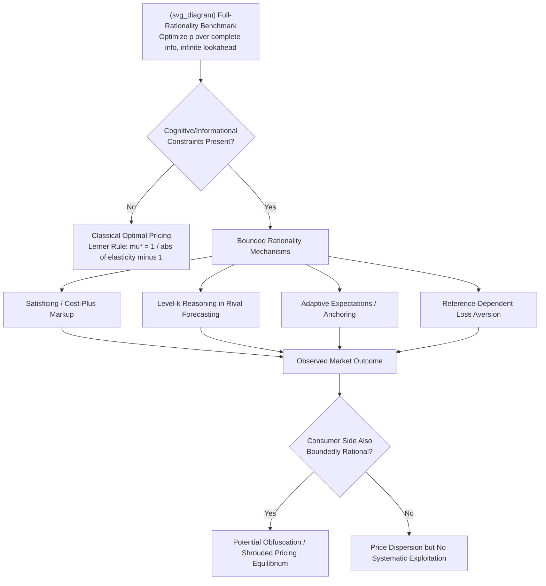

## Bounded Rationality in Firm Pricing and Strategy

### Definition and Conceptual Foundations

**Bounded rationality**, a term originating with Herbert Simon (1955, 1956), describes decision-making by agents whose cognitive capacity, information access, and time are limited, such that they cannot perform the unlimited optimization assumed under full rationality. Rather than maximizing over the entire feasible choice set using complete information, boundedly rational agents use **heuristics**, **satisficing rules**, and **simplified decision procedures** that yield "good enough" outcomes given constraints on computation and information processing.

In Industrial Organization, applying bounded rationality to *firms* — rather than only consumers — represents a significant departure from the classical IO paradigm, which typically models firms as unitary, fully rational profit-maximizers solving well-specified optimization problems (e.g., Cournot, Bertrand, or monopoly pricing under perfect foresight). Behavioral IO instead asks: what happens to market outcomes, pricing, entry, and competitive dynamics when firms themselves — through their managers, pricing algorithms, or organizational routines — exhibit systematic deviations from full optimization?

---

### Why Firm-Level Bounded Rationality Matters for IO

**Key Points**

- **Departure from backward induction**: Classical game-theoretic IO models (e.g., limit pricing, predatory pricing, Stackelberg leadership) rely on firms correctly anticipating rivals' best responses through unlimited backward induction. Bounded rationality relaxes this, allowing for models where firms use simpler forecasting rules (e.g., adaptive expectations, naive best response, level-$k$ reasoning).
- **Organizational vs. individual decision-maker distinction**: Unlike bounded rationality in individual consumer choice, firm decisions pass through organizational structures — hierarchies, incentive schemes, information filtering through middle management — which can amplify, dampen, or distort cognitive limitations present at the individual level.
- **Persistence in competitive markets**: A standard objection to any bounded-rationality theory is that competitive pressure and market selection should eliminate systematically suboptimal firms over time. Behavioral IO addresses this directly by modeling conditions under which biased firms *survive*, and even *outperform* fully rational rivals, particularly under demand-side frictions (e.g., consumer bounded rationality that rewards obfuscation) or barriers to imitation/learning.

---

### Core Theoretical Mechanisms

#### 1. Managerial Cognitive Limits and Satisficing

Following Simon, managers may set prices using **satisficing rules** — targeting an acceptable profit margin or market share rather than the profit-maximizing price implied by marginal-cost-equals-marginal-revenue conditions. This is formalized in **cost-plus** or **markup pricing** models, where price is set as:

$$p = c(1 + \mu)$$

with $c$ the unit cost and $\mu$ a conventional or rule-of-thumb markup, rather than the theoretically optimal markup derived from the elasticity of demand, $\mu^* = \frac{1}{|\varepsilon| - 1}$ (the inverse elasticity/Lerner rule under standard monopoly pricing). The gap between $\mu$ and $\mu^*$ is a direct, testable signature of bounded rationality in pricing behavior.

#### 2. Level-$k$ and Cognitive Hierarchy Models in Oligopoly

Standard Nash equilibrium assumes each firm correctly models rivals as *also* playing equilibrium strategies (infinite-depth reasoning). **Level-$k$ models** posit that firms reason only a finite number of steps: a level-0 firm plays a naive or non-strategic anchor action; a level-1 firm best-responds to a level-0 rival; a level-2 firm best-responds to a level-1 rival, and so forth. Applied to Cournot or Bertrand competition, this can generate systematic deviations from Nash predictions that better match observed pricing dispersion and slow convergence in experimental oligopoly markets. [Inference: the specific depth of reasoning (typical level-1 to level-3 estimates) reported in the experimental economics literature varies by study design and market context.]

#### 3. Adaptive and Rule-of-Thumb Expectations

Instead of rational expectations (correctly forecasting future demand, rival prices, or cost shocks using all available information), firms may use **adaptive expectations**:

$$p_t^e = p_{t-1}^e + \lambda(p_{t-1} - p_{t-1}^e)$$

where $\lambda \in (0,1]$ is an adjustment speed parameter. This generates gradual, backward-looking price adjustment rather than instantaneous jumps to new equilibria following demand or cost shocks — consistent with observed **price stickiness** and slow pass-through of cost changes in many industries.

#### 4. Reference-Dependent and Loss-Averse Firm Behavior

Firms (or their managers) may evaluate outcomes relative to a **reference point** (e.g., last period's profit, a sales target, or a competitor's price) rather than in absolute terms, exhibiting loss aversion in strategic decisions — for instance, being more willing to cut prices to avoid falling below a market-share reference point than to raise prices by an equivalent amount above it. This asymmetry can generate rigid pricing in one direction and flexible pricing in the other.

#### 5. Anchoring and Status Quo Bias in Pricing

Firms may anchor future prices heavily on historical prices or "focal point" round numbers (e.g., $9.99, $19.99), reflecting cognitive shortcuts rather than continuous re-optimization. This partially explains **nominal price rigidity** even in the absence of formal menu costs.

#### 6. Bounded Rationality in Strategic Entry and Exit Decisions

Overconfidence and optimism bias among entrepreneurs/managers are used to explain persistently high **market entry rates into unprofitable industries** — a well-documented empirical puzzle where observed entry exceeds what rational expected-value calculations would predict, consistent with managers systematically overestimating their probability of success relative to rivals (the "**better-than-average effect**" applied to firm founders).

---

### Formal Modeling Approaches

**Key Points**

- **Quantal Response Equilibrium (QRE)**: Generalizes Nash equilibrium by assuming firms choose better responses probabilistically rather than deterministically optimal ones, with response probability increasing in expected payoff according to a logit-type function:

  $$Pr(a_i) = \frac{\exp(\beta \cdot \pi_i(a_i, a_{-i}))}{\sum_{a_i' \in A_i} \exp(\beta \cdot \pi_i(a_i', a_{-i}))}$$

  where $\beta \geq 0$ is a "rationality parameter" — as $\beta \to \infty$, QRE converges to standard Nash equilibrium; as $\beta \to 0$, choices approach uniform randomness. QRE is widely used to fit experimental oligopoly pricing data that deviates systematically from point-prediction Nash equilibria.
- **Rule-based / Evolutionary Game-Theoretic Models**: Firms are endowed with a population of candidate pricing rules (e.g., imitate-the-best, myopic best response, fixed markup); rules survive or are replaced based on relative profitability over time, generating market dynamics driven by an evolutionary selection process rather than instantaneous optimization (Nelson and Winter's evolutionary theory of the firm is the foundational reference here).
- **Sparse/Limited-Attention Models (Gabaix, 2014, "sparsity-based" bounded rationality)**: Firms optimize over a simplified mental model that ignores or down-weights variables perceived as less salient, formalized via a sparse maximization operator that selects a subset of relevant state variables to attend to, rather than the full state space assumed under full rationality.

---

### Interaction with Consumer-Side Bounded Rationality

A distinguishing feature of behavioral IO is that firm-level and consumer-level bounded rationality **interact strategically**. Key results include:

- **Obfuscation and shrouded pricing**: If firms are sophisticated (rational) while *consumers* are boundedly rational (e.g., naive about add-on fees, unable to compute total cost of ownership, or subject to present bias), firms have a profit incentive to strategically design complex pricing structures (drip pricing, shrouded attributes) to exploit — rather than correct — consumer limitations, a result formalized by Gabaix and Laibson (2006).
- **Two-sided bounded rationality**: When *both* sides exhibit limits, market outcomes depend on the relative degree of sophistication; a firm's own cognitive limits may inadvertently reduce exploitative obfuscation (a boundedly rational firm may fail to identify or design the most exploitative pricing scheme available), producing ambiguous overall welfare effects relative to the fully-rational-firm/naive-consumer benchmark.
- **Level-$k$ competition between rational and heuristic firms**: Markets with a mix of sophisticated and rule-of-thumb firms can generate stable price dispersion in equilibrium — a departure from the "law of one price" prediction under homogeneous full rationality — since heuristic firms do not fully undercut to the competitive price.

---

### Empirical Evidence and Applications

**Key Points**

- **Survey and lab evidence on markup pricing**: Field surveys of managers (e.g., studies following Blinder et al.'s price-setting surveys) consistently find that a substantial share of firms report using cost-plus or rule-of-thumb pricing rather than formal demand-elasticity-based optimization, and cite "customer relations" or "fairness" concerns as reasons for price rigidity — motivations not straightforwardly reducible to profit-maximizing calculation.
- **Experimental oligopoly markets**: Laboratory Bertrand and Cournot experiments repeatedly find prices/quantities that deviate from Nash predictions in directions consistent with bounded rationality (e.g., supra-competitive prices in Bertrand settings with few firms, inconsistent with the sharp Bertrand paradox prediction of marginal-cost pricing at $n=2$ firms). [Inference: the magnitude and persistence of such deviations vary considerably by experimental design, number of periods, and feedback structure, and should not be treated as a single universal quantitative result.]
- **Algorithmic pricing as a modern bounded-rationality proxy**: A growing literature examines whether **pricing algorithms** (e.g., reinforcement-learning-based pricing bots) exhibit bounded-rationality-like properties — converging to supra-competitive collusive-like outcomes not through explicit communication but through simple adaptive learning rules that fail to fully account for rivals' long-run responses. This connects behavioral IO to contemporary algorithmic collusion debates in digital markets. [Speculation: whether observed algorithmic collusion in simulation studies (e.g., Calvano et al., 2020) generalizes robustly to real-world deployed pricing systems remains an active empirical question, given differences between controlled simulation environments and live market conditions.]

---

### Illustrative Diagram: Bounded Rationality in the Firm Pricing Decision Chain

---

### Worked Example: Markup Deviation from Optimal Lerner Pricing

**Example**

Consider a firm facing constant marginal cost $c = \$40$ and a demand elasticity of $\varepsilon = -2.5$ at the relevant price range. The theoretically optimal markup under full rationality is:

$$\mu^* = \frac{1}{|\varepsilon| - 1} = \frac{1}{2.5 - 1} = \frac{1}{1.5} \approx 0.667$$

implying an optimal price $p^* = c(1 + \mu^*) = 40 \times 1.667 \approx \$66.67$.

Suppose the firm instead uses a conventional industry rule-of-thumb markup of $\mu = 0.50$ (a round, easily communicated figure), setting $p = 40 \times 1.5 = \$60$. This boundedly rational price is **below** the profit-maximizing level, forgoing potential margin — a pattern consistent with survey evidence that firms often under-price relative to formal optimization when relying on simple heuristics, particularly when elasticity estimation is costly or uncertain. Conversely, in markets with substantial consumer switching frictions or search costs (raising perceived elasticity uncertainty), some heuristic-pricing firms have been found to **over-price** relative to a fully-optimized benchmark, illustrating that the direction of the deviation is context-dependent rather than uniformly one-directional. [Inference: the direction and magnitude of markup deviation in any specific real-world market depends on firm-specific and industry-specific factors and cannot be assumed to generalize from this illustrative numerical example.]

---

### Policy and Antitrust Implications

**Key Points**

- **Merger simulation caveats**: Standard merger simulation models (e.g., unilateral effects analysis using discrete-choice demand estimation) typically assume Bertrand-Nash pricing by fully rational firms. If a target/acquirer market involves boundedly rational pricing (e.g., markup or rule-of-thumb pricing), simulated post-merger price effects derived from the standard model may be **mis-calibrated**, motivating growing methodological interest in incorporating behavioral pricing rules into merger evaluation frameworks. [Speculation: the practical adoption of behavioral pricing assumptions into formal agency merger simulation guidelines remains limited and inconsistent across jurisdictions as of the most recent public agency guidance.]
- **Consumer protection and obfuscation regulation**: If firm sophistication combined with consumer bounded rationality is a driver of shrouded-pricing harm, remedies may focus on **disclosure mandates** (e.g., all-in pricing requirements, standardized cost-of-ownership disclosures) rather than conduct remedies aimed at addressing firm-side behavior directly, since the underlying exploitative incentive stems from the demand side.
- **Algorithmic pricing oversight**: Regulatory interest (e.g., from competition authorities examining algorithmic collusion) increasingly considers whether firms deploying pricing algorithms with bounded-rationality-like adaptive learning dynamics should face different scrutiny than firms engaging in explicit price-fixing, given the absence of traditional intent or communication evidence.

---

### Critiques and Open Questions

**Key Points**

- **Market selection critique**: A long-standing objection (associated with Milton Friedman's "as-if" methodology) holds that competitive market selection should eliminate persistently boundedly rational firms, rendering the assumption of full rationality a reasonable "as-if" approximation for surviving firms even if individual decision processes are not literally optimizing. Behavioral IO responds by showing selection is slow, imperfect, or actively rewards certain biases under specific demand-side conditions (e.g., obfuscation profitability), but the debate over the *speed and completeness* of market selection remains unresolved. [Speculation: the empirical resolution of this debate likely varies substantially by industry structure, entry/exit costs, and information transparency, and no single generalizable answer currently commands consensus in the literature.]
- **Identification challenge**: Distinguishing a firm using a genuine cognitive heuristic from a firm making a fully rational choice under *unobserved* costs or constraints (e.g., a markup rule that is actually optimal given unmodeled menu costs or reputational concerns) is empirically difficult, raising ongoing questions about how convincingly bounded-rationality models can be identified separately from richer fully-rational models with additional frictions.

---

**Related Topics**

- Behavioral consumer theory: shrouded attributes, drip pricing, and add-on markets
- Menu costs and nominal price rigidity models
- Quantal response equilibrium and experimental industrial organization
- Algorithmic collusion and tacit coordination via pricing bots
- Evolutionary game theory and firm survival dynamics (Nelson-Winter tradition)
- Level-$k$ reasoning and cognitive hierarchy models in oligopoly experiments
- Managerial overconfidence and entry/exit decision-making under uncertainty
- Behavioral merger simulation methodologies