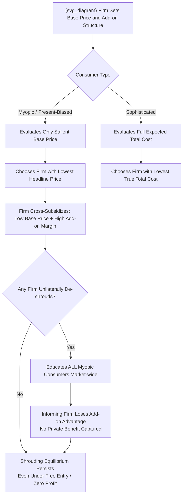

## Consumer Biases and Exploitation of Shrouded Attributes

### Definition and Conceptual Overview

**Shrouded attributes** are components of a product's total price or quality that are not fully or immediately disclosed to consumers at the point of the primary purchase decision — such as add-on fees, back-end charges, or contingent costs that only materialize later (e.g., after purchase, under specific usage conditions, or upon contract renewal). The foundational formal treatment is Gabaix and Laibson (2006), "Shrouded Attributes, Consumer Myopia, and Information Suppression in Competitive Markets," which shows that shrouding can persist as a stable equilibrium outcome even in fully competitive markets with free entry — a result that runs counter to the classical intuition that competition should drive prices toward full-cost, transparent pricing.

This topic sits within **behavioral IO** because it requires two departures from the standard fully-rational, fully-informed consumer model: (1) consumers exhibit **bounded rationality or myopia** regarding attributes not made salient at the point of purchase, and (2) firms — who may themselves be fully rational — have a profit-maximizing incentive to **exploit rather than correct** this limitation, rather than competing it away through transparent disclosure.

---

### The Gabaix-Laibson Shrouding Model

**Key Points**

- **Base-good and add-on structure**: The market is modeled with a **base good** (advertised, salient, heavily price-competed) and an **add-on** (shrouded, low-salience, high-margin). Firms compete fiercely on the base-good price — often pricing it near or below cost — while extracting profit through the shrouded add-on.
- **Myopic vs. sophisticated consumers**: The model distinguishes **myopic consumers**, who do not anticipate or fully account for the add-on cost when choosing among firms, from **sophisticated consumers**, who correctly forecast total cost of ownership (base price plus expected add-on cost) and choose accordingly.
- **The "curse of debiasing" result**: A central and counterintuitive finding is that if a firm unilaterally **de-shrouds** — voluntarily discloses the add-on cost transparently to educate myopic consumers — this education spills over to all firms in the market (since myopic consumers, once informed, then shop rationally across all firms), eliminating the informing firm's competitive advantage from shrouding while incurring the cost of disclosure. This creates a **prisoner's dilemma-like equilibrium** in which no individual firm has a unilateral incentive to de-shroud, even though full transparency would be more efficient in aggregate.
- **Persistence under competition**: Because the shrouding equilibrium can be sustained even with free entry and firms earning zero economic profit overall (losses on the base good offset by gains on the add-on), the model demonstrates that **perfect competition does not guarantee full-cost price transparency** — a significant theoretical departure from the classical welfare theorems' informational assumptions.

---

### Formal Structure of the Base Model

Let $p$ denote the price of the base good, $a$ denote the price of the add-on (marginal cost $c_a$), and $c$ denote the marginal cost of the base good. A firm's profit per customer combines both components:

$$\pi = (p - c) + \theta \cdot (a - c_a)$$

where $\theta \in [0,1]$ is the probability a given consumer purchases or incurs the add-on. Under Bertrand-style competition on the salient base good among symmetric firms, competitive pressure drives:

$$p \to c - \theta(a - c_a)$$

meaning the base price can fall **below marginal cost**, cross-subsidized by anticipated add-on revenue — a pattern consistent with real-world "loss leader" or low headline-price strategies in industries with prominent shrouded fees. Myopic consumers, who evaluate offers using $p$ alone rather than the full expected cost $p + \theta a$, are systematically drawn to the firm offering the lowest *headline* price regardless of total cost — even if a rival offers a lower true total cost.

---

### Behavioral Mechanisms Underlying Shrouding Exploitation

#### 1. Salience and Limited Attention

Consumers allocate limited cognitive attention disproportionately to the most **salient** price component (following Bordalo, Gennaioli, and Shleifer's salience theory), typically the prominently advertised headline price, while under-weighting or ignoring less salient components disclosed in fine print, contingent clauses, or post-transaction stages.

#### 2. Present Bias and Cost Deferral

Consumers with **present-biased (hyperbolic) preferences** systematically underweight future or delayed costs relative to immediate costs. A shrouded fee triggered only upon a future contingency (e.g., an overdraft fee, a late payment penalty, a data-overage charge) is discounted more heavily by a present-biased consumer than by an exponential (time-consistent) discounter, making deferred-fee structures disproportionately profitable to shroud from such consumers.

#### 3. Overconfidence About Own Future Behavior

Consumers often overestimate their own future self-control or usage discipline — for example, underestimating the probability they will incur a late fee, exceed a data cap, or fail to cancel a free-trial subscription before auto-renewal. This "**projection bias**" or optimism about one's own future compliance makes contingent shrouded fees particularly effective, since the consumer discounts not just the fee's magnitude but its subjective probability of applying to them.

#### 4. Complexity and Bounded Processing Capacity

When total cost requires integrating multiple components (base price, tax, shipping, financing charges, insurance add-ons), the **cognitive cost of computing total expected cost** itself acts as a shrouding mechanism, independent of formal information suppression — the information may be technically disclosed but requires costly processing that a bounded-rationality consumer will not undertake for every purchase.

---

### Canonical Real-World Examples

**Example**

- **Printer ink / razor-and-blades pricing**: Low upfront hardware price (printer, razor handle) with high-margin, less salient recurring consumable costs (ink cartridges, blade refills) — a classic base-good/add-on structure, though [Inference: whether specific instances reflect deliberate shrouding versus standard price discrimination via two-part tariffs is debated in the literature and depends on case-specific evidence of consumer myopia].
- **Hotel resort fees and airline ancillary fees**: Advertised room/ticket price excludes mandatory resort fees, baggage fees, or seat-selection charges revealed later in the booking process — a widely studied case in the "drip pricing" literature, which several consumer protection authorities (e.g., the U.S. FTC, UK CMA) have targeted with all-in pricing disclosure rules.
- **Banking overdraft and late fees**: Checking accounts advertised as "free" with revenue concentrated in overdraft fees, contingent on consumer usage patterns and behavioral lapses rather than on the advertised base product.
- **Subscription auto-renewal and free-trial conversion**: Low or zero-cost trial periods that auto-convert to a recurring subscription unless actively cancelled, exploiting both present bias (deferring the cancellation task) and inattention (forgetting the trial's existence).
- **Mortgage and credit card teaser rates**: Low advertised introductory interest rate with a shrouded, substantially higher rate applying after an initial period or upon a triggering event (e.g., a single late payment), targeted at consumers who underestimate the probability of triggering the higher rate.

---

### Related Behavioral Pricing Strategies

**Key Points**

- **Drip pricing**: Sequentially revealing additional mandatory charges throughout a purchase flow rather than in the initial advertised price, exploiting **sunk-cost-like commitment** as consumers who have invested time in the purchase process become less likely to abandon the transaction even upon discovering additional charges.
- **Partitioned pricing**: Breaking a single price into multiple separately listed components (e.g., base price + "processing fee" + "service fee"), which behavioral pricing research finds can reduce the *perceived* total price relative to an equivalent single all-inclusive price, even when the mathematical total is identical or fully disclosed — a documented anomaly inconsistent with the rational-consumer prediction that arithmetic decomposition should not affect perceived magnitude.
- **Price framing and reference-price manipulation**: Presenting a "discount" from an inflated reference/list price to create a perception of savings, exploiting reference-dependence in consumer valuation (prospect-theory-style anchoring on the stated original price).
- **Complexity as a deliberate strategy (obfuscation)**: Deliberately increasing the complexity of pricing plans (e.g., telecom or energy tariff structures with many bundled options) to raise consumer search and comparison costs, discouraging switching and price comparison even absent literal information suppression — formalized in related obfuscation models (e.g., Ellison and Wolitzky, 2012 on search-cost manipulation).

---

### Illustrative Diagram: Shrouded Attribute Exploitation Mechanism

---

### Empirical Evidence

**Key Points**

- **Field experiments on drip pricing disclosure**: Studies manipulating the timing and prominence of mandatory fee disclosure (e.g., in online hotel or ticket booking) generally find that **delayed fee disclosure increases total purchase conversion and total revenue** relative to fully transparent all-in pricing shown upfront, consistent with the theoretical prediction that shrouding exploits limited attention/comparison at the point of initial choice. [Inference: specific effect-size estimates vary considerably across study contexts, product categories, and disclosure-timing designs, and should not be treated as a single universal magnitude.]
- **Bank overdraft fee studies**: Empirical work on U.S. checking-account overdraft behavior finds that a disproportionate share of overdraft revenue is concentrated among a relatively small subset of repeat-fee-incurring consumers, a pattern consistent with exploitation of a subgroup exhibiting systematic present bias or inattention rather than uniform exposure across the consumer population. [Inference: precise concentration statistics are study- and time-period-specific; readers should consult current regulatory data (e.g., CFPB reports) for up-to-date figures.]
- **"Sophistication premium" evidence**: Cross-sectional studies in credit card and telecom markets find that financially sophisticated or higher-numeracy consumers systematically pay lower total costs than less sophisticated consumers for observably similar products, consistent with a market equilibrium in which shrouded costs are effectively transferred from sophisticated to naive consumers.

---

### Welfare and Distributional Implications

Shrouded-attribute equilibria typically generate a **cross-subsidy from myopic/naive consumers to sophisticated consumers**, since sophisticated consumers can select products that minimize their true total cost (e.g., avoiding add-ons entirely) while myopic consumers disproportionately bear the shrouded charges. This has two distinct welfare dimensions:

1. **Aggregate efficiency loss**: If shrouding induces costly information-processing avoidance, comparison-cost distortions, or misallocation toward products that are not truly lowest-total-cost, it generates a standard efficiency loss relative to the full-information competitive benchmark.
2. **Distributional/regressivity concern**: Because financial sophistication and susceptibility to present bias or inattention often correlate with socioeconomic and demographic factors, shrouded-fee revenue models can function as a **regressive transfer mechanism**, disproportionately extracting surplus from lower-income, lower-numeracy, or otherwise more time/attention-constrained consumers. [Speculation: the precise magnitude of this regressivity varies substantially by market and is an active area of applied empirical research rather than a settled universal finding.]

---

### Policy and Regulatory Responses

**Key Points**

- **All-in / total-price disclosure mandates**: Requiring the headline advertised price to include all mandatory fees (banning drip pricing of *mandatory* charges), implemented in various forms by the U.S. FTC's rulemaking on unfair or deceptive junk fees, the EU's Unfair Commercial Practices Directive, and airline-specific full-fare advertising rules.
- **Standardized disclosure formats**: Mandating simplified, comparable disclosure formats (e.g., APR standardization in consumer credit, standardized nutrition labels as an analogous non-price example) to reduce the cognitive cost of comparison, directly targeting the bounded-processing-capacity mechanism rather than the salience/present-bias mechanism.
- **Default and cancellation-friction regulation**: Rules requiring easy cancellation mechanisms proportionate to the ease of sign-up (e.g., "click to cancel" requirements for subscriptions), targeting exploitation of present bias and task-deferral rather than pure information shrouding.
- **Cooling-off periods and mandatory reminders**: Requiring pre-renewal notification for auto-renewing subscriptions, directly countering the inattention/forgetting mechanism underlying shrouded renewal-fee exploitation.
- **Limits on regulatory effectiveness**: The Gabaix-Laibson "curse of debiasing" logic implies that *voluntary* disclosure alone is insufficient to unwind a shrouding equilibrium, since no individual firm benefits from unilateral transparency — reinforcing the case for **mandatory, market-wide** disclosure rules rather than relying on competitive or reputational forces to self-correct.

---

### Critiques and Open Questions

**Key Points**

- **Two-part tariff efficiency counter-argument**: Some economists caution that not all base-good/add-on pricing structures reflect exploitative shrouding; certain two-part tariff structures can be efficient price-discrimination mechanisms (e.g., screening high- and low-usage consumer types), and regulatory intervention risks conflating efficient nonlinear pricing with genuinely exploitative shrouding absent clear evidence of consumer myopia.
- **Heterogeneous sophistication and market segmentation**: Because shrouding profitability depends on the *share* of myopic versus sophisticated consumers in the market, predicting which markets will sustain shrouding equilibria versus converge to transparent pricing requires empirically estimating this population mix — a nontrivial identification challenge, particularly as digital comparison tools may be gradually increasing the effective sophistication share in some markets. [Speculation: the long-run trajectory of shrouding prevalence as digital price-comparison technology diffuses is not conclusively established in the current literature.]
- **Enforcement and definitional boundary**: Regulators face the practical challenge of distinguishing "shrouding" (exploitative suppression) from ordinary product complexity or legitimate optional-feature pricing, complicating the design of precise, non-overbroad disclosure rules.

---

**Related Topics**

- Bounded rationality in firm pricing and strategy
- Salience theory and reference-dependent consumer choice
- Search-cost models and price obfuscation (Ellison-Wolitzky)
- Behavioral consumer protection regulation (junk fees, drip pricing rules)
- Present bias, hyperbolic discounting, and time-inconsistent consumer choice
- Two-part tariffs and nonlinear pricing under full rationality (as a contrast benchmark)
- Algorithmic personalized pricing and digital dark patterns
- Financial product complexity and consumer financial literacy interventions