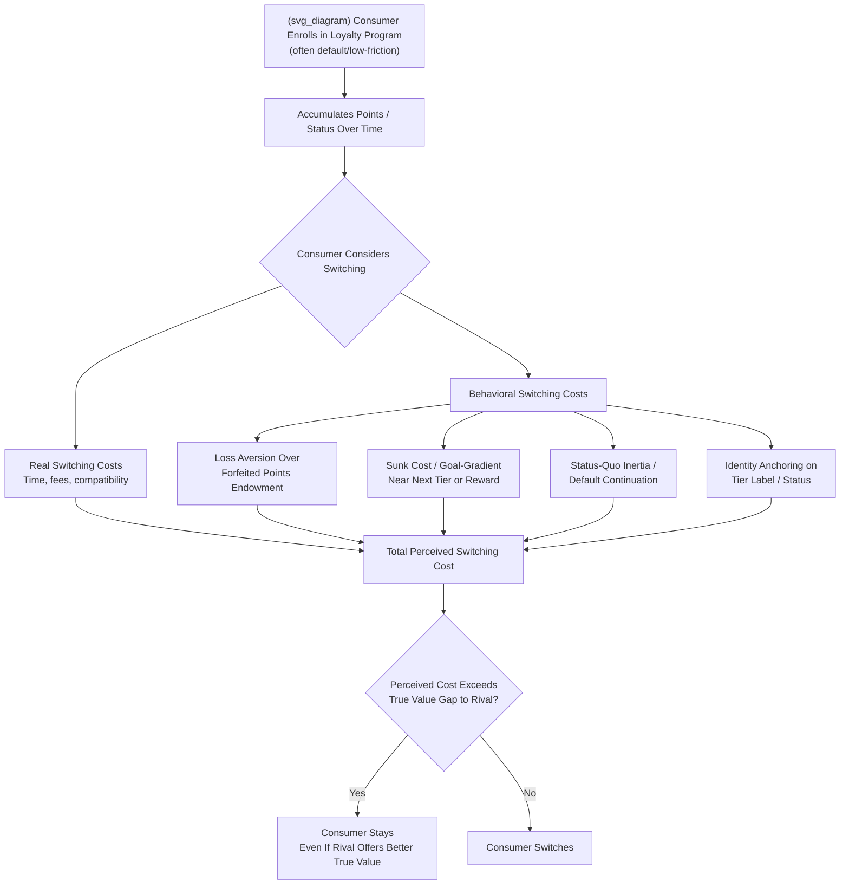

## Behavioral Explanations for Loyalty Programs and Switching Frictions

### Definition and Conceptual Overview

**Loyalty programs** are structured reward schemes (points, tiers, cashback, frequent-flyer miles) that incentivize repeat purchase from a single firm. **Switching frictions** (or switching costs) are the broader category of factors — monetary, procedural, or psychological — that make it costly for a consumer to move from an incumbent supplier to a rival. Classical IO treats switching costs largely as **contractual or technological** (e.g., cancellation fees, compatibility costs, learning curves). **Behavioral IO** extends this by showing that a substantial share of effective switching frictions arise not from real economic costs but from **cognitive and psychological biases** — and that loyalty programs are frequently *designed* to exploit these biases rather than merely to reward genuine value delivered to the consumer.

This reframes the loyalty program from a pure demand-stimulation or price-discrimination tool (the traditional IO view, following the two-part tariff and frequent-flyer-program literature of Banerjee and Summers, 1987, and Klemperer's classic switching-cost framework) into a mechanism that can generate **artificial retention** — lock-in unsupported by underlying superior value — with corresponding welfare and competition-policy implications.

---

### Classical (Non-Behavioral) Switching Cost Baseline

**Key Points**

Before layering in behavioral effects, it is useful to establish the standard Klemperer (1987, 1995) framework, since behavioral explanations are typically presented as *additions to*, not full replacements of, this baseline:

- **Real/transactional switching costs**: Time and effort to research alternatives, transfer data or account history, learn a new product interface, or pay explicit termination fees.
- **Contractual switching costs**: Early termination penalties, minimum contract terms, bundled multi-product discounts that would be forfeited by partial switching.
- **The "harvesting the installed base" result**: Klemperer shows that switching costs generate a two-stage competitive dynamic — firms compete aggressively for *new* customers ("bargain then ripoff" or "invest then harvest" pricing) while charging higher prices to their existing, locked-in customer base, since switching costs soften price competition for the installed base even under otherwise competitive market structure.

Behavioral IO's contribution is to show that loyalty programs and psychological switching frictions can replicate and amplify this harvesting dynamic **even without any real transactional or contractual cost**, purely through biases in consumer perception and decision-making.

---

### Behavioral Mechanisms Underlying Switching Frictions

#### 1. Status Quo Bias and Default Effects

Consumers exhibit a systematic preference for maintaining their current choice, independent of any objective switching cost, documented extensively in the behavioral economics literature (Samuelson and Zeckhauser, 1988). Applied to loyalty programs, once a consumer is enrolled (often via an automatic or low-friction default enrollment), continuing to patronize that firm becomes the "default" action requiring no active decision, while switching requires an active, effortful choice to deviate.

#### 2. Endowment Effect and Loss Aversion Over Accumulated Points

Once a consumer has accumulated loyalty points, miles, or tier status, these become part of a **reference point** the consumer is loss-averse over. Switching to a competitor implies **forfeiting** the accumulated balance, which is psychologically weighted as a loss (following prospect theory's loss-aversion coefficient, typically estimated in the range where losses are felt roughly twice as intensely as equivalent gains). Critically, this is a **behavioral** switching cost because the accumulated points often have low or even negative true economic value relative to the effort of redeeming them (breakage, redemption restrictions), yet still generate strong retention.

#### 3. Sunk Cost Fallacy

Consumers who have invested time, money, or effort accumulating status within a program (e.g., progressing toward the next loyalty tier) exhibit a tendency to continue investing to "complete" the goal, even when the continuation decision should, from a rational forward-looking perspective, ignore the sunk investment entirely. This is distinct from the endowment effect: it concerns *ongoing* commitment to reach a goal rather than loss aversion over an already-held asset.

#### 4. Goal-Gradient Effect

Behavioral research (building on Hull's original goal-gradient hypothesis, applied to loyalty programs by Kivetz, Urminsky, and Zheng, 2006) finds that consumers accelerate effort and purchase frequency as they perceive themselves nearing a reward threshold (e.g., "2 more purchases until your free item"), and that programs with **artificial head starts** (e.g., a 12-stamp card pre-stamped with 2 stamps, framed as "10 remaining" rather than a fresh 10-stamp card) generate measurably faster completion rates despite requiring identical actual effort — a well-replicated finding demonstrating that perceived proximity to a goal, not just objective distance, drives behavior.

#### 5. Complexity and Points-Valuation Obfuscation

Loyalty currencies (points, miles) are typically **non-transparent in real monetary value**, redemption terms are complex and subject to unilateral change by the issuing firm, and expiration/breakage rules are often obscure. This complexity functions similarly to shrouded attributes: it prevents consumers from accurately computing the true value of "loyalty" being accumulated, making comparison across firms' loyalty offers difficult and reducing effective competitive pressure on the *quality* of the loyalty benefit itself.

#### 6. Anchoring on Nominal Tier Labels

Tiered status systems (e.g., "Gold," "Platinum," "Elite") create identity- and status-based anchors that can generate switching resistance independent of the tier's objective monetary benefit, tapping into social-identity and self-signaling motivations rather than pure economic calculation — consumers may resist switching partly to avoid the psychological cost of "downgrading" perceived status.

#### 7. Present Bias in Redemption and Renewal Decisions

Similar to shrouded-attribute exploitation, present-biased consumers may underweight the future effort required to research and switch to a better alternative, perpetually deferring the comparison-shopping task ("I'll look into switching later"), which — combined with inertia — can generate persistent loyalty to an objectively inferior provider.

---

### Formal Framing: Behavioral vs. Real Switching Cost Decomposition

The effective switching cost a consumer perceives, $SC_{effective}$, can be decomposed as:

$$SC_{effective} = SC_{real} + SC_{behavioral}$$

where $SC_{real}$ captures genuine transactional/contractual costs (time, fees, compatibility loss) and $SC_{behavioral}$ captures the loss-aversion-weighted value of forfeited points, sunk-cost-driven continuation motivation, status-quo inertia, and identity/status anchoring. A key empirical and policy-relevant implication is that $SC_{behavioral}$ can be **manipulated by firm program design** (e.g., steeper goal gradients, opaque point valuations, artificially inflated status thresholds) independent of any change in the underlying product quality or price — meaning firms can increase retention and reduce effective competitive pressure purely through psychological program architecture, without improving the value delivered to consumers.

A simplified consumer switching decision under loss aversion can be represented as: the consumer switches only if

$$\Delta V_{new firm} > SC_{real} + \lambda \cdot V_{points forfeited}$$

where $\Delta V_{new firm}$ is the true value gain from switching, and $\lambda > 1$ is the loss-aversion coefficient applied to the forfeited points balance — meaning even a program offering objectively lower value per dollar spent can retain the consumer if the *forfeiture-weighted* accumulated balance exceeds the value gap.

---

### Illustrative Diagram: Behavioral Loyalty Lock-In Mechanism

---

### Worked Example: Goal-Gradient Effect in Points Design

**Example**

An airline loyalty program requires 50,000 miles for a free flight. Consider two equivalent program designs offering the objectively identical net requirement:

- **Design A**: Consumer starts at 0 miles, needs 50,000 to redeem.
- **Design B**: Consumer receives a 10,000-mile enrollment bonus immediately, framed as "40,000 miles to go," with the same total 50,000-mile threshold.

Despite requiring the same 40,000 additional miles of spending-driven accumulation from the consumer's actual starting point in Design B, framing the position as *already 20% complete toward the goal* (rather than as a fresh full-distance target) has been shown in the loyalty-program behavioral literature to increase subsequent purchase frequency and reduce perceived program abandonment relative to an equivalent fresh-start design. [Inference: this stylized 50,000/10,000 example is illustrative of the general goal-gradient mechanism documented by Kivetz, Urminsky, and Zheng (2006) and related studies; specific effect magnitudes are context- and program-dependent and should not be read as a precise universal quantitative claim.]

---

### Empirical Evidence

**Key Points**

- **Head-start effect replication**: Multiple field experiments (café stamp cards, retail point programs) find that pre-stamped "head start" cards are completed significantly faster than equivalent fresh-start cards requiring the same net number of additional purchases, robust across several retail contexts. [Inference: exact completion-rate differentials vary by study and product category.]
- **Airline frequent-flyer switching resistance**: Survey and revealed-preference studies in the airline industry find that consumers with higher accumulated mile balances or elite status exhibit systematically lower price elasticity of demand and lower propensity to switch carriers even when a rival offers a materially lower fare for a comparable route, consistent with the loss-aversion/endowment mechanism over accumulated status.
- **Breakage and redemption-friction evidence**: Industry and academic analyses of loyalty program economics document that a significant share of issued loyalty points/miles are never redeemed ("**breakage**"), and that redemption terms (blackout dates, limited award inventory, point devaluation via unilateral program changes) are frequently structured in ways that reduce the realized value of the program below its nominal accumulation value — consistent with the interpretation that programs are partly designed around retention psychology rather than purely as value-transfer mechanisms. [Inference: precise breakage rates are proprietary and vary substantially by industry and program; publicly cited estimates should be treated as illustrative rather than authoritative without a specific current source.]

---

### Loyalty Programs as a Price Discrimination and Foreclosure Tool

Loyalty programs also serve legitimate, non-behavioral economic functions that must be distinguished analytically from purely exploitative lock-in:

- **Third-degree price discrimination**: Rewarding high-frequency/high-value customers with better effective prices can be an efficient mechanism for extracting surplus from low-elasticity segments while offering competitive terms to price-sensitive, high-elasticity segments — a standard, welfare-ambiguous (not necessarily harmful) price discrimination rationale.
- **Genuine cost-based justification**: Repeat-customer relationships can reduce a firm's marketing, underwriting, or customer-service costs, providing a legitimate efficiency basis for rewarding loyalty independent of any behavioral exploitation.
- **Foreclosure concern in competition policy**: When switching frictions (behavioral or real) are large enough, loyalty programs can function similarly to **exclusive dealing or bundling arrangements**, raising rivals' effective cost of customer acquisition and potentially supporting a dominant firm's position — a concern that has surfaced in competition-authority scrutiny of loyalty and rewards programs in sectors such as airlines, telecoms, and increasingly digital "super-app" ecosystems bundling multiple services under a single loyalty currency.

---

### Policy and Regulatory Implications

**Key Points**

- **Points valuation transparency mandates**: Proposed and, in some jurisdictions, enacted disclosure requirements aim to force clearer statement of point/mile monetary value and redemption terms, directly targeting the complexity-driven obfuscation mechanism.
- **Portability and interoperability remedies**: In network-effect-heavy or multi-sided platform contexts, mandating point/status portability or cross-program recognition (analogous to number portability in telecoms) has been proposed as a remedy to reduce artificial behavioral lock-in, allowing consumers to switch providers without full forfeiture of accumulated loyalty value.
- **Sunset and expiration regulation**: Rules limiting unilateral point devaluation, requiring advance notice of expiration, or capping blackout-date restrictions address the redemption-friction dimension of behavioral switching costs.
- **Distinguishing legitimate discrimination from exploitative lock-in**: A recurring policy challenge is designing intervention that curbs behaviorally exploitative program design (e.g., deliberately opaque point devaluation, artificially steep goal gradients disconnected from genuine value) without undermining the legitimate price-discrimination and cost-efficiency rationale for rewarding genuine repeat-customer relationships. [Speculation: the appropriate regulatory line between the two remains contested and is likely to continue evolving as competition authorities gain more empirical evidence on program-specific consumer harm.]

---

### Critiques and Open Questions

**Key Points**

- **Revealed preference counter-argument**: Some economists argue that if consumers rationally value loyalty program membership (even accounting for real switching costs), continued patronage may reflect genuine preference rather than exploitation, and that behavioral explanations risk being invoked too readily without clean identification separating true consumer welfare loss from simply strong brand preference or genuine service quality differentiation.
- **Heterogeneity in susceptibility**: As with shrouded attributes, the behavioral switching-cost literature generally finds substantial heterogeneity in consumer susceptibility to these biases (varying by financial sophistication, time constraints, and status motivation), meaning aggregate market-level effects mask potentially large distributional variation in who bears the cost of behaviorally-induced lock-in.
- **Measurement difficulty**: Cleanly isolating the behavioral component ($SC_{behavioral}$) from the real component ($SC_{real}$) of switching costs in observational data is empirically challenging, since both typically move together and are rarely subject to the kind of controlled experimental variation needed for precise decomposition outside of specific well-designed field experiments.

---

**Related Topics**

- Klemperer switching-cost framework and installed-base harvesting
- Consumer biases and exploitation of shrouded attributes
- Bounded rationality in firm pricing and strategy
- Prospect theory: loss aversion and reference-dependent preferences
- Two-sided platform lock-in and multi-homing frictions
- Price discrimination via loyalty and rewards program design
- Behavioral consumer protection: default rules and disclosure mandates
- Network effects, portability remedies, and digital ecosystem bundling