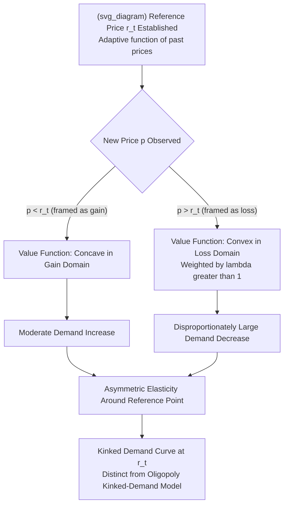

## Framing Effects and Reference-Dependent Demand

### Definition and Conceptual Overview

**Reference-dependent demand** describes consumer valuation and choice that depends not only on the absolute characteristics of a good (its price, quality, quantity) but on how those characteristics compare to a psychologically salient **reference point** — typically a status quo, expectation, recent price, or a competitor's price. **Framing effects** refer to the empirical finding that objectively identical choices or information can produce systematically different consumer decisions depending on how the choice is *presented* — the wording, ordering, default, or visual/numerical structure of the offer — even when the underlying economic substance is held constant.

Both concepts trace to **prospect theory** (Kahneman and Tversky, 1979) and its extension to reference-dependent consumer choice (Tversky and Kahneman, 1991; Kőszegi and Rabin, 2006). In Industrial Organization, these concepts matter because they imply that **demand is not a stable, presentation-invariant function of price and quality alone** — a foundational assumption underlying standard demand estimation, welfare analysis, and merger simulation. If demand shifts systematically with framing, then (a) firms have an additional strategic lever — presentation design — independent of and layered atop price competition, and (b) standard revealed-preference-based welfare inference becomes complicated, since the same "preferences" can generate different observed choices under different frames.

---

### Prospect Theory Foundations

**Key Points**

- **Reference point**: A baseline against which outcomes are evaluated as gains or losses, rather than in terms of final absolute wealth or consumption states as under expected utility theory. The reference point is typically the status quo, but can be shifted by expectations, recent experience, or a firm's chosen framing.
- **Loss aversion**: Losses relative to the reference point are weighted more heavily than equivalent-sized gains, commonly parameterized with a **loss-aversion coefficient** $\lambda > 1$ (frequently estimated around 2, though this varies substantially by context and elicitation method).
- **Diminishing sensitivity**: The value function is concave in the gain domain and convex in the loss domain — marginal psychological impact declines the further an outcome is from the reference point, in both directions.
- **The prospect theory value function**:

$$v(x) = \begin{cases} x^{\alpha} & x \geq 0 \\ -\lambda(-x)^{\beta} & x < 0 \end{cases}$$

where $x$ is the outcome measured relative to the reference point, $\alpha, \beta \in (0,1)$ govern diminishing sensitivity, and $\lambda > 1$ governs loss aversion. This S-shaped, kinked-at-the-origin function is the formal engine generating the demand anomalies discussed below.

---

### Core Manifestations in Consumer Demand

#### 1. Reference-Dependent Price Sensitivity (Asymmetric Elasticity)

Because losses are weighted more heavily than gains, consumers typically respond **more strongly to a price increase** (a loss relative to the reference price) **than to an equivalent-sized price decrease** (a gain relative to the reference price). This generates an **asymmetric demand elasticity** around the reference price — a kinked demand curve at the reference point — distinct from, though sometimes confused with, the classical oligopoly kinked-demand-curve model (which derives kinks from *rival response asymmetry* rather than individual consumer loss aversion).

#### 2. Reference Price Formation and Updating

The reference price itself is not fixed; it is typically modeled as an **adaptive/backward-looking function** of recently observed prices (own past purchase price, recently advertised price, or a habituated "usual" price):

$$r_t = \gamma \cdot r_{t-1} + (1-\gamma) \cdot p_{t-1}$$

where $r_t$ is the reference price at time $t$, $p_{t-1}$ is the most recently observed price, and $\gamma \in (0,1)$ is a memory/persistence parameter. This has direct implications for **dynamic pricing strategy**: a firm considering a permanent price increase may find it optimal to implement the increase gradually (allowing the reference point to adapt upward incrementally) rather than as a single large jump, which would generate a larger perceived loss and correspondingly larger demand contraction.

#### 3. The Endowment Effect and WTA-WTP Gap

Reference-dependence predicts a systematic gap between a consumer's **willingness-to-accept (WTA)** to give up a good they possess and their **willingness-to-pay (WTP)** to acquire the same good if they do not possess it, since possession shifts the reference point such that giving up the good is coded as a loss. This WTA/WTP gap is one of the most robustly replicated findings in experimental behavioral economics and has direct pricing implications for trade-in programs, free trials (which shift the reference point toward possession before the purchase decision), and return/refund policy design.

#### 4. Attraction and Compromise Effects (Choice-Set Framing)

Consumer choice among multiple options is influenced by the **composition of the choice set itself**, not just the attributes of each option in isolation — violating the classical independence-of-irrelevant-alternatives (IIA) property assumed in standard discrete-choice demand models (e.g., basic logit).

- **Compromise effect**: An option positioned as the "middle" choice among three (e.g., small/medium/large, or basic/premium/deluxe pricing tiers) gains disproportionate share simply from being the compromise position, independent of its intrinsic attribute value — a well-documented mechanism directly exploited in **tiered pricing/menu design** (e.g., the classic "decoy" premium tier added primarily to make the mid-tier appear as a reasonable compromise).
- **Attraction (decoy) effect**: Adding a third option that is strictly dominated by one existing option (but not the other) increases the market share of the dominating option, even though a fully rational consumer's ranking of the original two options should be unaffected by the presence of an irrelevant, dominated alternative.

#### 5. Framing of Price Changes: Gains vs. Losses, Discounts vs. Surcharges

Economically identical price differentials produce different consumer responses depending on whether they are framed as a **discount for one payment method** (a gain) versus a **surcharge for another** (a loss) — the classic credit-card-surcharge/cash-discount framing distinction documented by Thaler (1980), which is economically equivalent in absolute terms but generates measurably different consumer acceptance and behavioral response due to loss aversion over the surcharge frame.

#### 6. Anchoring in Reference Price Advertising

Advertising a "was $X, now $Y" reference price (**manufacturer's suggested retail price** or "original price" framing) shifts the consumer's reference point upward, making the actual selling price appear as a larger relative gain than an equivalent absolute price presented without a reference anchor — a strategy directly targeted by regulatory rules (discussed below) requiring reference prices to reflect genuine, previously-charged prices rather than inflated anchors.

---

### Implications for Demand Estimation and IO Modeling

**Key Points**

- **Kőszegi-Rabin (2006) rational expectations reference-dependent model**: A key theoretical advance formalizes the reference point not as a fixed historical anchor but as the consumer's own **rational expectation** about the outcome, generating a model where the reference point is *endogenous* to the consumer's beliefs about the transaction, allowing the framework to be embedded within otherwise standard rational-expectations equilibrium models while retaining loss-aversion-driven demand asymmetries. This model has become the standard workhorse for incorporating reference-dependence into applied IO and macro-labor demand models.
- **Violation of standard demand system assumptions**: Classical discrete-choice demand estimation (e.g., nested logit, BLP-style random-coefficients logit used in merger simulation) typically assumes stable preferences over final consumption bundles, independent of the framing or presentation of the choice set. Reference-dependence implies these estimated demand parameters may be **frame-specific** rather than structural/stable, complicating out-of-sample counterfactual simulation (e.g., predicting demand response to a merger-induced price change using demand estimates derived from a different historical pricing/framing regime).
- **Implications for the Lerner Index and markup estimation**: If elasticity is asymmetric around a reference price (steeper for price increases than decreases), standard elasticity-based markup and market power inference — which typically assumes a single, symmetric local elasticity — can be biased depending on whether the estimation sample is drawn primarily from price-increase or price-decrease episodes relative to the prevailing reference point.

---

### Illustrative Diagram: Reference-Dependent Value Function and Asymmetric Demand Response

---

### Worked Example: Asymmetric Response to Price Change

**Example**

Suppose a firm's product has a stable reference price of $r = \$50$, and baseline quantity demanded at that price is $Q_0 = 1{,}000$ units. Using illustrative prospect-theory-consistent parameters ($\lambda = 2$ for the loss-aversion weighting applied to price increases relative to $r$), consider two scenarios:

- **Price decreases to $45** (a $5 gain relative to reference): demand rises to, say, $Q = 1{,}080$ units — an 8% increase.
- **Price increases to $55** (a $5 loss relative to reference): under symmetric (non-reference-dependent) elasticity, demand would be predicted to fall to approximately 920 units (an 8% decrease). Under reference-dependent, loss-averse demand, the response is disproportionately larger — demand might fall to, say, 840 units (a 16% decrease), reflecting the doubled psychological weight applied to the loss-framed price change.

[Inference: the specific numerical demand figures (1,080, 920, 840 units) in this example are illustrative constructions to demonstrate the qualitative asymmetric-elasticity mechanism predicted by loss aversion, calibrated loosely to a $\lambda \approx 2$ parameter commonly cited in the literature; they are not derived from a specific empirical study and should not be cited as an estimated real-world demand response.]

This asymmetry has a direct strategic implication: a firm facing a cost shock may find it more profitable to **delay or gradually phase in price increases** (allowing the reference point to adapt) than to implement the full pass-through immediately, since immediate large increases trigger the steeper loss-domain demand response.

---

### Empirical Evidence

**Key Points**

- **Reference-dependent labor supply and consumer studies**: While much of the original empirical grounding for reference-dependence comes from labor supply (e.g., taxi driver daily-income-target studies) and financial-market studies, subsequent applied IO and marketing research has documented analogous asymmetric price-response patterns in retail scanner data, with price increases generating larger elasticity magnitudes than equivalent price decreases across multiple product categories. [Inference: the size of this asymmetry varies considerably across product categories, consumer segments, and study methodologies; no single universal elasticity-asymmetry ratio applies across all markets.]
- **Decoy/compromise effect experiments**: Extensively replicated in controlled experimental settings across product categories (subscription tiers, consumer electronics, restaurant menu pricing), consistently showing share shifts toward the "compromise" or "target" option induced purely by choice-set composition changes, independent of the intrinsic value of the added option.
- **Reference-price advertising regulation studies**: Empirical work examining markets before and after "was/now" reference-price advertising restrictions generally finds measurable declines in the prevalence of inflated reference-price claims following stricter disclosure rules, though effects on ultimate consumer welfare (versus mere compliance with claim formatting) are less consistently documented. [Speculation: whether such restrictions meaningfully reduce reference-dependence-driven demand distortion versus simply shifting firms to alternative framing strategies remains an open empirical question.]

---

### Policy and Regulatory Implications

**Key Points**

- **Reference-price advertising rules**: Regulations (e.g., FTC guides on former-price comparisons in the U.S., similar consumer-protection rules in the EU and UK) require that advertised "original" or "list" prices reflect a genuine, bona fide prior selling price for a reasonable duration, directly targeting the anchoring-via-inflated-reference-point mechanism.
- **Choice architecture and menu design scrutiny**: While rarely the subject of direct antitrust or consumer-protection enforcement in isolation, decoy/compromise-effect-driven menu design intersects with broader "dark patterns" regulatory discussions, particularly in digital contexts where tiered subscription or pricing menus can be dynamically tested and optimized to exploit framing biases at scale.
- **Merger simulation caveats**: Given that reference-dependence can bias standard elasticity estimates depending on the historical price-change sample composition (increases vs. decreases), competition authorities conducting merger simulation using historical scanner or transaction data should, in principle, account for this asymmetry when the counterfactual merger-induced price change direction (typically an increase) differs systematically from the estimation sample's composition. [Speculation: the extent to which competition agencies currently incorporate reference-dependent asymmetric elasticity adjustments into standard merger simulation practice varies by jurisdiction and case, and is not uniformly established as standard methodology.]

---

### Critiques and Open Questions

**Key Points**

- **Reference point identification problem**: A central methodological challenge is that the reference point itself is not directly observable and must be inferred or assumed (e.g., last purchase price, expected price, list price), and different reasonable assumptions about reference-point formation can generate materially different predicted demand responses — weakening the out-of-sample predictive precision of reference-dependent models relative to simpler stable-preference models in some applications.
- **Market selection and learning counter-argument**: As with other behavioral IO mechanisms, critics note that repeat-purchase markets with experienced consumers may exhibit reference-dependence effects that attenuate with consumer learning and market maturity, raising questions about the persistence of framing effects in markets characterized by frequent, low-stakes, repeated transactions versus infrequent, high-stakes purchases (e.g., housing, automobiles) where reference-dependence effects are more robustly documented.
- **Distinguishing framing effects from legitimate information transmission**: Not all "framing" is manipulative — providing a genuine reference price (e.g., a true historical average) can convey useful information reducing search costs, complicating the normative case for blanket restriction of reference-price-based advertising absent evidence the reference point is inflated or fabricated.

---

**Related Topics**

- Prospect theory and the value function (Kahneman-Tversky, Kőszegi-Rabin)
- Bounded rationality in firm pricing and strategy
- Consumer biases and exploitation of shrouded attributes
- Behavioral explanations for loyalty programs and switching frictions
- Decoy effects and tiered/menu pricing design
- Reference-price advertising regulation (FTC former-price guides)
- Discrete-choice demand estimation and IIA violations
- Dynamic pricing and reference-point adaptation strategies