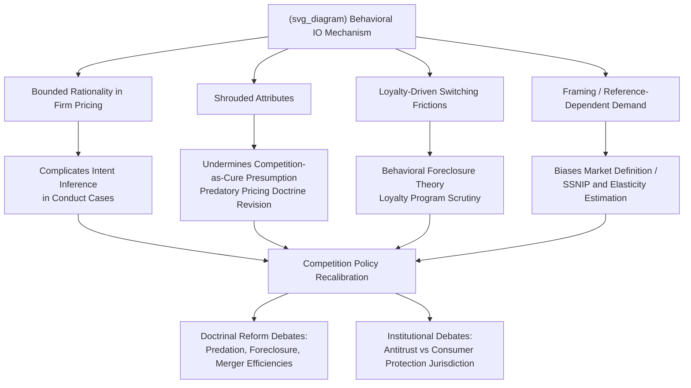

## Implications of Behavioral Biases for Competition Policy

### Definition and Conceptual Overview

This topic synthesizes the preceding behavioral IO mechanisms — bounded rationality in firm pricing, shrouded attributes, loyalty-driven switching frictions, and framing/reference-dependent demand — into their **collective implications for how competition policy is designed, enforced, and interpreted**. The central question is: if both firms and consumers systematically deviate from the full-rationality benchmark underlying classical antitrust economics, how should the goals, tools, and legal standards of competition policy adapt?

Traditional competition policy (in the U.S., EU, and most jurisdictions) is built on a **neoclassical welfare framework**: market power is identified through price-cost margins, market definition, and concentration measures; consumer harm is measured via price and output effects relative to a competitive counterfactual; and remedies target structural or conduct-based restoration of competitive rivalry, on the assumption that increased competition among rational firms will pass through to rational consumers as lower prices and greater choice. Behavioral IO challenges each link in this chain, motivating a body of scholarship — sometimes termed "**behavioral antitrust**" — examining whether and how enforcement should be recalibrated.

---

### Why Behavioral Biases Complicate the Standard Competition Policy Framework

**Key Points**

- **Competition does not guarantee welfare-improving outcomes when consumers are boundedly rational**: The Gabaix-Laibson shrouding result demonstrates that even *perfectly competitive* markets with free entry can sustain exploitative pricing structures (cross-subsidized base goods, high-margin shrouded add-ons) — meaning the traditional antitrust presumption that "more competition is better" can fail when the harm stems from consumer-side information processing limits rather than firm-side market power.
- **Market definition and market power measurement may be biased**: Standard tools like the SSNIP test (Small but Significant Non-transitory Increase in Price) and diversion-ratio estimation assume consumers respond to price changes according to stable, rational demand elasticities. If elasticity is asymmetric (loss-averse), frame-dependent, or systematically distorted by shrouding/obfuscation, estimated elasticities — and therefore market definition boundaries and merger-simulation price-effect predictions — may not reflect the "true" underlying competitive constraint.
- **Behaviorally-induced switching costs mimic classical market power indicators**: High customer retention and price insensitivity among an installed base — normally interpreted as evidence of either genuine product superiority or contractual lock-in — may instead reflect purely psychological switching frictions (loss aversion over loyalty points, status-quo bias, goal-gradient effects), meaning observed low churn is not necessarily an efficient market outcome nor straightforward evidence of illegal exclusionary conduct; it requires case-specific behavioral diagnosis.
- **Firm-side bounded rationality complicates conduct interpretation**: If firms themselves use heuristic pricing or exhibit managerial biases (overconfidence in entry, satisficing pricing), conduct that appears to reflect exclusionary *intent* (e.g., unusual pricing patterns) may instead reflect ordinary managerial heuristics, complicating the evidentiary weight competition authorities should place on internal documents or pricing anomalies as intent evidence.

---

### Behavioral Reinterpretation of Core Antitrust Doctrines

#### 1. Predatory Pricing and Below-Cost Pricing

Classical predatory pricing analysis (e.g., the Areeda-Turner cost-based test, and the *Brooke Group* recoupment requirement in U.S. law) assumes a rational incumbent sets prices below cost only if it can later recoup losses through subsequent supra-competitive pricing once rivals exit. Behavioral IO complicates this: the Gabaix-Laibson framework shows firms can **rationally and sustainably** price a base good below marginal cost as a *permanent* equilibrium feature (cross-subsidized by shrouded add-on margins), not as a temporary predatory investment requiring eventual recoupment — meaning below-cost base-good pricing is not necessarily evidence of predatory intent or a signal requiring the traditional recoupment showing, but may reflect ordinary shrouded-pricing business models (e.g., "razor and blades," freemium software).

#### 2. Exclusionary Conduct via Behavioral Switching Costs

If a dominant firm deliberately designs loyalty programs or point systems to maximize behavioral (rather than real) switching costs — e.g., engineering steep goal gradients, opaque point devaluation, or default auto-enrollment — this raises a novel theory of exclusionary conduct: **behavioral foreclosure**, where rivals are excluded not through price or efficiency but through exploitation of consumer psychology. This sits alongside, but is analytically distinct from, traditional loyalty-rebate and exclusive-dealing foreclosure theories (e.g., the EU's *Intel* case line concerning loyalty rebates), which focus on the *economic* structure of rebate conditionality rather than the *psychological* mechanism of retention.

#### 3. Merger Review and the Behavioral Efficiencies Defense

Merging parties frequently claim efficiencies (cost savings, product improvements) as a defense against a presumption of competitive harm. Behavioral IO raises the question of whether claimed "efficiencies" — such as a merged firm's ability to design more effective (i.e., more retention-maximizing) loyalty or bundling programs — should be credited as genuine consumer-welfare-enhancing efficiencies, or discounted/rejected as **behaviorally-exploitative retention gains** that do not reflect genuine product improvement. This distinction is analytically difficult but increasingly relevant given proposed mergers explicitly premised on combining loyalty programs or customer data assets (relevant also to the killer-acquisition and nascent-competitor literature).

#### 4. Unfair and Deceptive Practices vs. Antitrust: Jurisdictional Overlap

Many shrouded-attribute and framing-effect harms (drip pricing, dark patterns, deceptive reference pricing) fall more naturally under **consumer protection law** (e.g., FTC Act Section 5's "unfair or deceptive acts or practices" standard, UK/EU unfair commercial practices directives) than under traditional antitrust/competition law, which is oriented around market structure and rivalry rather than individual transactional fairness. Behavioral antitrust scholarship has prompted debate over whether competition authorities should expand their scope to address demand-side behavioral harms directly, or whether this is better left to specialized consumer-protection regimes — with growing institutional convergence in some jurisdictions (e.g., agencies with combined competition-and-consumer-protection mandates, such as the UK's CMA and Australia's ACCC) increasingly integrating both lenses in a single case.

---

### Illustrative Diagram: Behavioral Biases Mapped to Competition Policy Tools

---

### Proposed Reforms and Analytical Frameworks

**Key Points**

- **"Behavioral market power" concept**: Some scholars (e.g., work building on Hanson and Kysar's earlier "market manipulation" theory in tort/regulatory contexts, extended to antitrust) propose recognizing a distinct form of market power derived not from market share/concentration but from a firm's ability to exploit systematic consumer biases at scale — potentially warranting scrutiny even in markets that would appear unconcentrated or competitive under standard structural metrics.
- **Augmented SSNIP/market definition methodology**: Proposals to adjust market definition tests to account for asymmetric, reference-dependent, or shrouded-attribute-distorted elasticity estimates, rather than assuming a single stable elasticity figure derived from standard price-variation data. [Speculation: the practical operationalization of a formally adjusted SSNIP test incorporating behavioral elasticity asymmetries has not been consistently adopted as standard agency methodology across major jurisdictions as of the most recent public guidance, and remains primarily an academic proposal.]
- **Ex ante disclosure and choice-architecture regulation as a complement to ex post enforcement**: Given the evidentiary difficulty of proving behavioral exploitation harm using traditional antitrust tools (price/output effects), many behavioral antitrust proposals favor **ex ante structural remedies** — mandatory disclosure standards, default-rule regulation, dark-pattern prohibitions — over case-by-case ex post litigation, on the reasoning that behavioral harms are often diffuse, hard to quantify individually, and better addressed through rule-based prevention (paralleling the regulatory responses already discussed for shrouded attributes and loyalty programs).
- **Digital-market-specific codification**: The EU's **Digital Markets Act (DMA)** and analogous digital-sector-specific regulatory proposals in other jurisdictions incorporate several provisions directly responsive to behavioral IO concerns — e.g., restrictions on "dark patterns" in gatekeeper platform design, data-portability requirements (addressing behavioral lock-in), and consent-flow regulation — representing a shift toward **codified, sector-specific behavioral competition rules** rather than relying solely on general-purpose antitrust doctrine applied case-by-case.

---

### Empirical and Institutional Evidence of Adoption

**Key Points**

- **UK CMA behavioral economics unit**: The UK Competition and Markets Authority has an institutionalized behavioral economics function and has explicitly incorporated behavioral analysis into market studies (e.g., its review of online platforms and digital advertising, and its retail banking and insurance market studies examining loyalty-penalty pricing — the practice of charging higher renewal prices to inattentive existing customers, closely related to the switching-friction mechanisms discussed above).
- **"Loyalty penalty" regulatory findings**: UK regulatory investigations (e.g., in general insurance and telecoms) have documented that existing/renewing customers systematically pay higher prices than new customers for economically identical products, attributed substantially to consumer inattention and status-quo bias rather than cost differences — leading to specific pricing-practice remedies (e.g., FCA rules requiring UK home and motor insurers to offer renewal prices no higher than equivalent new-customer prices, effective 2022). [Inference: specific regulatory rule details and effective dates should be verified against current FCA/CMA publications, as rules and their scope may be updated over time.]
- **FTC "click-to-cancel" and junk-fee rulemaking**: U.S. FTC rulemaking efforts targeting subscription cancellation friction and mandatory fee disclosure represent direct regulatory responses to the present-bias and shrouded-attribute mechanisms discussed in prior behavioral IO topics, illustrating the practical translation of behavioral IO theory into consumer-protection-oriented (rather than classical antitrust) policy instruments. [Inference: the specific legal status, implementation timeline, and any related litigation concerning such rulemaking is subject to ongoing legal and political developments; readers should verify current status against up-to-date regulatory sources.]

---

### Critiques and Open Questions

**Key Points**

- **Risk of enforcement overreach and false positives**: Critics (largely from the Chicago School and post-Chicago traditions) caution that behavioral antitrust risks licensing intervention against ordinary, efficient business practices (e.g., legitimate loyalty programs, standard price discrimination, genuine low-price loss-leader strategies) based on speculative or unproven claims of consumer exploitation, given the practical difficulty of cleanly distinguishing exploitative behavioral design from legitimate marketing and pricing innovation.
- **Institutional competence concerns**: Effectively identifying and remedying behavioral harms may require expertise (experimental design, psychological measurement) that traditional competition agencies, built around economic and legal analysis, are not fully equipped to deploy consistently and rigorously across a large caseload, raising practical implementation concerns distinct from the theoretical case for intervention.
- **Standard-setting difficulty**: Unlike price-cost-based tests with reasonably objective (if imperfect) quantitative thresholds, behavioral harm often lacks an equivalently precise, generally-accepted quantitative threshold for "how much" framing manipulation or shrouding constitutes actionable harm versus permissible marketing practice, complicating the development of predictable, administrable legal standards. [Speculation: whether a workable, broadly-accepted quantitative or bright-line behavioral-harm standard will emerge, versus enforcement remaining primarily case-by-case and fact-intensive, is an unresolved question in the ongoing academic and policy literature.]
- **Cross-jurisdictional divergence**: The degree of institutional adoption of behavioral competition policy tools varies substantially across jurisdictions (with the UK and EU generally more receptive than the traditionally Chicago-School-influenced U.S. antitrust framework, though this has been evolving), meaning the practical implications of behavioral IO for competition policy remain unevenly and incompletely operationalized on a global basis as of current practice.

---

**Related Topics**

- Bounded rationality in firm pricing and strategy
- Consumer biases and exploitation of shrouded attributes
- Behavioral explanations for loyalty programs and switching frictions
- Framing effects and reference-dependent demand
- Digital Markets Act and gatekeeper regulation
- Predatory pricing doctrine and the recoupment requirement
- Loyalty rebates and exclusive dealing (EU *Intel* line of cases)
- Consumer protection vs. antitrust institutional design and jurisdictional overlap
- Killer acquisitions and nascent competitor theories of harm