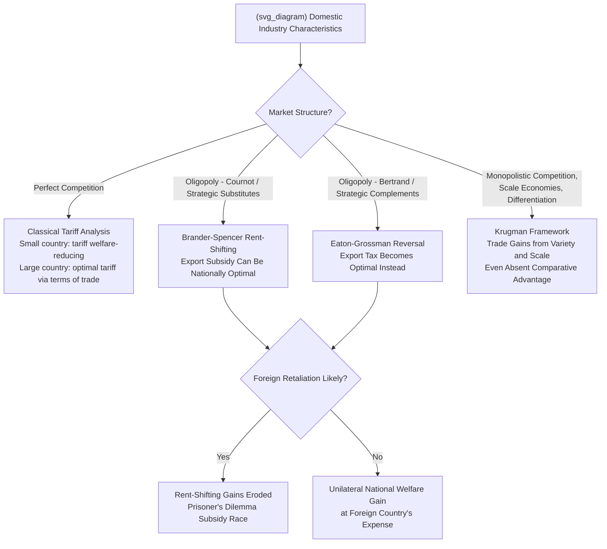

## Trade Policy Interactions with Domestic Market Structure

### Definition and Conceptual Overview

This topic examines how **trade policy instruments** — tariffs, quotas, subsidies, and non-tariff barriers — interact with **domestic market structure** (the degree of concentration, entry conditions, and competitive conduct within a national industry) to jointly determine prices, output, welfare, and strategic firm behavior. Unlike standard trade theory, which frequently assumes perfectly competitive markets on both sides of a border, this field — sometimes termed **"strategic trade theory"** or **trade and industrial organization** — explicitly models trade policy's effects when domestic and/or foreign markets are imperfectly competitive (oligopolistic, monopolistic, or characterized by economies of scale), because the welfare and strategic implications of a given trade policy differ substantially depending on the underlying market structure it operates within.

The foundational insight, developed primarily by Brander and Spencer (1985) and Krugman (1979, 1980) in the "new trade theory" tradition, is that **trade policy conclusions derived under perfect competition can reverse or substantially change once market structure is imperfectly competitive** — a tariff or subsidy that would be welfare-reducing in a competitive framework can become welfare-improving (from a national perspective) when domestic or foreign firms hold market power, because trade policy can be used to strategically shift oligopoly rents between countries.

---

### Baseline: Trade Policy Under Perfect Competition (Classical Benchmark)

**Key Points**

- **Standard tariff analysis**: Under perfect competition, a tariff imposed by a "small" country (unable to affect world prices) is unambiguously welfare-reducing domestically, generating a deadweight loss from both the consumption distortion and the production distortion, illustrated by the standard triangle-loss diagram in trade textbooks.
- **Optimal tariff for a "large" country**: A large country with monopsony power in world markets can improve its terms of trade via a tariff, generating a theoretically positive **optimal tariff** even under competitive market assumptions — but this comes at the foreign country's expense and invites retaliation, a standard result independent of domestic market structure.
- **This benchmark is the departure point** for strategic trade theory: once domestic or foreign firms hold market power (as in most manufacturing industries characterized by scale economies — aircraft, semiconductors, automobiles), the classical small-country/large-country dichotomy is insufficient, because policy can shift oligopoly *rents*, not just terms-of-trade prices.

---

### Strategic Trade Policy Under Oligopoly

#### 1. The Brander-Spencer Export Subsidy Model

In the canonical Brander-Spencer (1985) setup, a domestic firm and a foreign firm compete as **Cournot duopolists** in a third-country market (or the domestic market, in variants), each choosing quantity. Because Cournot competition exhibits **strategic substitutes** behavior (an increase in one firm's output causes the rival's best-response quantity to fall), a government subsidy to the domestic firm's exports:

- Lowers the domestic firm's effective marginal cost, causing it to credibly commit to a higher output level;
- The foreign rival, observing this commitment (in a sequential or Stackelberg-like structure), rationally reduces its own output in response;
- This shifts market share and profit from the foreign firm to the domestic firm by **more than the cost of the subsidy**, generating a net national welfare gain (rent-shifting from the foreign country to the domestic country) even though the policy would be classically inefficient under perfect competition.

The key formal condition is that the **subsidy acts as a strategic commitment device** — analogous to Stackelberg leadership achieved through cost reduction rather than direct move-order commitment — that shifts the reaction function in the domestic firm's favor.

#### 2. Eaton-Grossman Reversal: Bertrand Competition Changes the Sign

A critical qualification, formalized by Eaton and Grossman (1986), shows that the Brander-Spencer rent-shifting result is **highly sensitive to the mode of competition**. If firms compete in **prices (Bertrand)** rather than quantities (Cournot) — i.e., if strategic complements rather than substitutes characterize the interaction — the optimal strategic trade policy **reverses sign**: an export subsidy is no longer optimal, and an **export tax** becomes the rent-shifting-optimal policy instead, since under Bertrand competition a domestic firm benefits from committing to *higher*, not lower, effective costs (softening price competition), the opposite mechanism from Cournot.

This sensitivity to strategic-form assumptions (Cournot vs. Bertrand, quantity vs. price competition) is one of the most important — and policy-humbling — results in the strategic trade literature: the *sign* of the theoretically optimal intervention flips depending on an assumption (mode of competition) that is often difficult to verify empirically for any specific real-world industry.

#### 3. Krugman's Monopolistic Competition and Scale Economies Framework

Krugman's (1979, 1980) alternative new trade theory framework emphasizes **monopolistic competition with increasing returns to scale and product differentiation**, rather than oligopolistic strategic interaction. In this framework:

- Trade liberalization allows firms to access larger combined markets, enabling greater exploitation of scale economies and generating a **larger variety of differentiated products** available to consumers in each country (intra-industry trade), distinct from classical comparative-advantage-driven inter-industry trade.
- This generates a welfare gain from trade **even between economically identical countries** with no comparative advantage differences, purely from scale-economy exploitation and increased product variety — a result inconsistent with classical Ricardian/Heckscher-Ohlin models, which require underlying cost or factor-endowment asymmetries to generate mutually beneficial trade.
- Tariff protection in this framework tends to **reduce the number of varieties available and firm-level scale economies exploited**, generating welfare losses distinct from, but complementary to, the classical deadweight-loss mechanism.

---

### Formal Rent-Shifting Condition (Cournot Case)

Consider domestic firm $D$ and foreign firm $F$ competing as Cournot duopolists in quantity, with linear inverse demand $P = a - b(q_D + q_F)$ and constant marginal costs $c_D, c_F$. Standard Cournot best-response functions yield equilibrium output:

$$q_D^* = \frac{a - 2c_D + c_F}{3b}, \quad q_F^* = \frac{a - 2c_F + c_D}{3b}$$

A per-unit export subsidy $s$ to the domestic firm reduces its effective marginal cost to $c_D - s$. Differentiating domestic firm profit with respect to the subsidy and evaluating the net national welfare effect (domestic firm profit gain minus subsidy cost, ignoring domestic consumption effects in the third-market export case) yields an **optimal subsidy** $s^* > 0$ under the standard Cournot/strategic-substitutes assumption, whose magnitude depends on the slope of the foreign firm's reaction function — i.e., on **how aggressively the foreign rival cuts output in response to the domestic firm's expansion**. The steeper (more negatively sloped) this reaction function, the larger the optimal rent-shifting subsidy. [Inference: this is the standard qualitative comparative-static result of the Brander-Spencer model; the exact algebraic solution for $s^*$ depends on the specific demand and cost parameterization and is presented here in simplified linear form for illustration.]

---

### Illustrative Diagram: Strategic Trade Policy Decision Tree by Market Structure

---

### Interaction with Domestic Market Concentration

**Key Points**

- **Number of domestic firms matters**: The Brander-Spencer rent-shifting logic is typically derived for a single domestic national champion competing against a single (or few) foreign rival(s). As the number of domestic firms increases, domestic firms increasingly compete *against each other* as well as against foreign rivals, diluting and eventually eliminating the rent-shifting rationale for subsidization — implying **strategic trade policy is most applicable to concentrated, scale-economy-intensive industries** (aircraft manufacturing being the canonical Boeing/Airbus illustrative case in the original literature) rather than to fragmented, competitive domestic industries.
- **Domestic market power and pass-through of trade protection**: When a protected domestic industry is itself concentrated, tariff or quota protection can allow domestic firms to **raise domestic prices above the competitive benchmark**, compounding the classical deadweight loss with an additional domestic market-power markup — meaning the welfare cost of protection is systematically understated by models assuming competitive domestic pass-through of the tariff-inclusive world price.
- **Import competition as a domestic competitive discipline substitute**: A well-documented empirical finding across trade and IO literature is that import competition can act as a substitute for domestic antitrust enforcement in disciplining concentrated domestic industries — trade liberalization increasing effective rivalry and reducing domestic markups, a mechanism explored extensively in trade-and-productivity studies (e.g., work following Tybout and others on developing-country manufacturing liberalization episodes) documenting markup compression following tariff reductions. [Inference: the magnitude of markup compression varies substantially by country, industry, and time period studied; specific quantitative estimates should be verified against the relevant primary empirical sources rather than treated as a universal parameter.]

---

### Non-Tariff Barriers and Market Structure

**Key Points**

- **Quotas vs. tariffs under imperfect competition**: Under monopoly or oligopoly, quotas and tariffs are **not equivalent** even when calibrated to generate the same import volume — a departure from the classical competitive-market tariff-quota equivalence result. A quota fixes quantity directly, converting a foreign exporter facing a domestic monopolist into a residual-demand-constrained competitor, which can alter strategic incentives (e.g., incentivizing quality upgrading to capture more value per unit within a fixed quota, a phenomenon documented in the "voluntary export restraint" literature on 1980s U.S.-Japan automobile trade).
- **Standards, regulations, and strategic non-tariff protection**: Product standards, technical regulations, and local-content requirements can function as de facto trade barriers whose protective effect interacts with domestic market structure — concentrated domestic industries with lobbying power are more likely to successfully shape standards in ways that raise foreign rivals' compliance costs disproportionately (a "regulatory capture" mechanism connecting trade policy design to domestic industry concentration).
- **State subsidies and countervailing duty interactions**: Under WTO rules, subsidies deemed to cause material injury to a domestic industry can trigger **countervailing duties**; the injury determination itself typically requires assessing the domestic industry's market structure and the subsidized imports' price and volume effects on that specific structure, directly operationalizing trade-and-market-structure interaction in trade remedy law.

---

### Empirical Evidence

**Key Points**

- **Aircraft industry (Boeing-Airbus)**: The most frequently cited real-world illustration of Brander-Spencer-style strategic trade policy dynamics, given the industry's extreme scale economies, high fixed R&D costs, and effective global duopoly structure, with both governments having historically provided various forms of launch aid, export credit support, and R&D subsidies — generating extensive, long-running WTO dispute settlement litigation between the U.S. and EU. [Inference: the precise characterization of specific subsidy programs as WTO-consistent or inconsistent has been the subject of extensive, evolving litigation findings; readers should consult current WTO dispute settlement records for case-specific rulings rather than treating this as a settled economic characterization.]
- **Empirical rent-shifting magnitude estimates**: Applied studies attempting to calibrate Brander-Spencer-style models to specific industries (aircraft, semiconductors) generally find that the theoretically optimal subsidy is highly sensitive to assumed demand elasticities, cost parameters, and — critically — the assumed mode of competition (Cournot vs. Bertrand), such that empirical calibration exercises frequently produce a wide range of estimated optimal intervention levels rather than a single robust point estimate. [Inference: this sensitivity to underlying assumptions is a well-documented critique in the applied strategic trade literature and is not specific to any single study.]
- **Markup compression from trade liberalization**: Cross-country empirical studies of trade liberalization episodes (particularly in developing economies undergoing significant tariff reductions) commonly find evidence of reduced domestic price-cost margins in previously protected, concentrated industries following liberalization, consistent with the import-competition-as-competitive-discipline mechanism. [Inference: specific magnitude estimates are context-dependent across the empirical trade-and-productivity literature and vary by study design and time period.]

---

### Policy Implications and Practical Limitations

**Key Points**

- **Retaliation and the strategic trade "prisoner's dilemma"**: Because rent-shifting gains from unilateral strategic trade intervention typically come at a foreign rival's expense, the foreign government has a symmetric incentive to retaliate with its own subsidy, potentially resulting in a mutual subsidy race that dissipates the rent-shifting gains for both countries while imposing fiscal costs — a standard game-theoretic caution against unilateral strategic trade policy even when the underlying rent-shifting logic is theoretically valid in a one-shot setting.
- **Informational demands on policymakers**: Correctly calibrating a rent-shifting-optimal subsidy or tax requires accurate knowledge of the mode of competition (Cournot vs. Bertrand), demand elasticities, and rival cost structures — informational requirements that are difficult for real-world policymakers to satisfy with confidence, and where **getting the sign wrong** (per the Eaton-Grossman result) can make intervention actively welfare-reducing rather than merely ineffective.
- **WTO constraints on strategic trade policy tools**: Multilateral trade rules (WTO Agreement on Subsidies and Countervailing Measures) constrain the direct use of export subsidies for many manufactured goods among member countries, meaning much of the practical policy debate has shifted toward less directly regulated instruments — R&D subsidies, government procurement preferences, state-owned enterprise support, and export credit financing — whose strategic trade effects are analytically similar but face different legal constraints. [Speculation: the evolving landscape of industrial policy and trade rules, particularly amid recent shifts toward more active industrial policy in several major economies, may be reshaping the practical relevance and legal boundaries of strategic trade policy tools; readers should consult current trade policy sources for the latest developments given how actively this area is evolving.]

---

### Critiques and Open Questions

**Key Points**

- **Sensitivity to unverifiable assumptions**: The central practical critique of strategic trade theory (raised extensively even by its original proponents, including Krugman) is that policy prescriptions are highly sensitive to model assumptions — number of firms, mode of competition, demand curvature — that are difficult to verify empirically with the confidence required to justify real-world intervention, generating significant caution among the original theorists themselves about direct policy application despite the theoretical elegance of the rent-shifting result.
- **General equilibrium and cross-industry effects**: Partial-equilibrium oligopoly models of strategic trade policy typically abstract from broader general-equilibrium effects (e.g., resource reallocation costs, exchange rate effects, cross-industry subsidy competition for scarce factors), which can offset or reverse the apparent partial-equilibrium national welfare gains once embedded in a fuller economy-wide framework.
- **Political economy capture concerns**: Because the theoretical case for strategic trade intervention is narrow (specific market structures, specific competition modes) but the practical temptation to invoke "strategic industry" rationales for protection is broad, there is a well-recognized risk that strategic trade policy arguments are used to rationalize politically-motivated protectionism for industries that do not actually meet the narrow theoretical conditions under which such intervention would be nationally welfare-improving.

---

**Related Topics**

- Brander-Spencer export subsidy model and Cournot rent-shifting
- Eaton-Grossman reversal under Bertrand competition
- Krugman's monopolistic competition and new trade theory
- Import competition as a domestic antitrust substitute
- WTO Agreement on Subsidies and Countervailing Measures
- Non-tariff barriers, quotas, and voluntary export restraints under imperfect competition
- Industrial policy and national champion strategies
- Cross-border merger review and international competition policy coordination