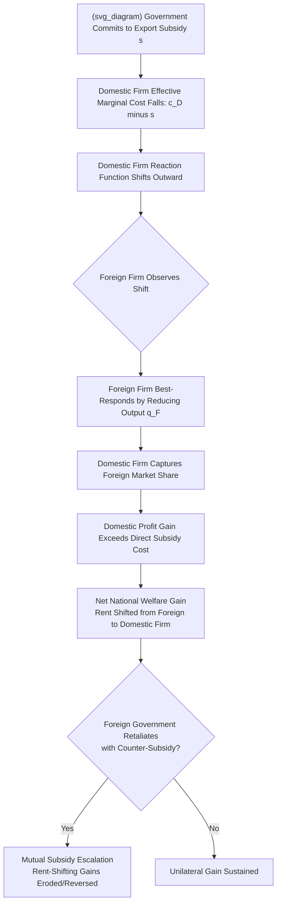

## Strategic Trade Policy and Export Subsidies

### Definition and Conceptual Overview

**Strategic trade policy** refers to government intervention — subsidies, taxes, or other instruments — designed to shift the outcome of oligopolistic competition between domestic and foreign firms in the domestic country's favor, thereby capturing a larger share of the excess profits ("rents") available in imperfectly competitive, typically scale-economy-intensive industries. **Export subsidies** are the most extensively studied instrument in this literature: direct or indirect government payments that reduce a domestic exporting firm's effective marginal cost or otherwise enhance its competitive position in foreign or third-country markets.

This topic focuses specifically on the theoretical mechanics, canonical models, and policy debate surrounding **export subsidies as a strategic rent-shifting tool** — building on and narrowing the broader trade-and-market-structure interactions covered in the adjacent topic on trade policy and domestic market structure. The foundational contribution is Brander and Spencer (1985), "Export Subsidies and International Market Share Rivalry," which formalized the conditions under which a government subsidy to a single domestic exporting firm competing against a foreign rival can raise national welfare — a result that directly contradicts the classical free-trade prescription derived under perfect competition.

---

### The Core Brander-Spencer Mechanism

**Key Points**

- **Setting**: A domestic firm and a single foreign firm compete as **Cournot quantity-setting duopolists** selling into a third-country market (eliminating domestic consumption effects from the analysis, isolating the pure rent-shifting mechanism). Neither firm sells in its own domestic market in the canonical version, simplifying welfare to pure domestic-firm-profit-plus-subsidy-cost.
- **Sequential structure / commitment device**: The government moves first, committing to a per-unit export subsidy $s$. The domestic firm then effectively competes as if its marginal cost were reduced by $s$. Because this commitment is publicly observable before output decisions are finalized, it functions as a **credible commitment mechanism** — analogous to Stackelberg leadership — that the domestic firm alone could not achieve by unilaterally announcing a large output level (which would not be credible without an actual cost change, since the firm could always deviate back to its unconstrained best response).
- **Strategic substitutes and reaction function shift**: Under Cournot competition, best-response (reaction) functions are downward-sloping — each firm's optimal output falls as its rival's output rises. The subsidy shifts the domestic firm's reaction function outward, and the foreign firm, observing this, optimally responds by **contracting its own output**. The domestic firm's output rises by more than one-for-one relative to the pure cost-reduction effect, because it also captures market share ceded by the foreign firm's strategic retreat.
- **Rent-shifting from foreign to domestic profit**: The net effect is that domestic firm profit increases by an amount that, for small subsidies, exceeds the fiscal cost of the subsidy itself — generating a **positive net national welfare effect**, since national welfare in this simplified model equals domestic firm profit minus the subsidy cost (with the subsidy itself being a transfer to the firm's owners, but the *profit gain from foreign market share capture* representing a genuine transfer of rent from the foreign country).

---

### Formal Model

Consider linear inverse demand in the third-country export market:

$$P = a - b(q_D + q_F)$$

with domestic firm marginal cost $c_D$ (reduced to $c_D - s$ under subsidy $s$) and foreign firm marginal cost $c_F$. Cournot-Nash equilibrium quantities are:

$$q_D = \frac{a - 2(c_D - s) + c_F}{3b}, \qquad q_F = \frac{a - 2c_F + (c_D - s)}{3b}$$

Domestic firm profit (gross of subsidy payment) is $\pi_D = (P - c_D)q_D$, and **national welfare** in the simplified third-market model is:

$$W = \pi_D - s \cdot q_D$$

Differentiating $W$ with respect to $s$ and evaluating at $s = 0$ yields the key result: because $\frac{d\pi_D}{ds}\Big|_{s=0} > q_D$ (the profit gain from the induced foreign output contraction exceeds the direct one-for-one subsidy transfer), the derivative $\frac{dW}{ds}\Big|_{s=0} > 0$, implying a **strictly positive optimal subsidy** $s^* > 0$ from the domestic country's unilateral perspective. The optimal subsidy magnitude increases with the **steepness of the foreign firm's reaction function** — i.e., with how aggressively the foreign rival contracts output in response to domestic expansion — which in the linear-demand Cournot case is governed by the demand slope parameter $b$ and the number/conduct of foreign rivals. [Inference: this is the standard qualitative derivation presented in simplified linear-demand form for exposition; the precise closed-form solution for $s^*$ in the original Brander-Spencer paper involves additional algebraic steps and parameter restrictions not fully reproduced here.]

---

### Illustrative Diagram: Rent-Shifting via Reaction Function Shift

---

### Sensitivity to Mode of Competition: The Eaton-Grossman Critique

**Key Points**

- **The central qualification to Brander-Spencer**: Eaton and Grossman (1986) demonstrate that the *sign* of the optimal strategic trade instrument depends critically on whether firms compete in **quantities (Cournot, strategic substitutes)** or **prices (Bertrand, strategic complements)**.
- **Bertrand case reversal**: Under Bertrand price competition with differentiated products, reaction functions are **upward-sloping** (a price cut by one firm induces the rival to also cut price, rather than expand quantity in response to a rival's contraction). In this setting, a domestic government wanting to shift rents toward the domestic firm should instead impose an **export tax** (raising the domestic firm's effective marginal cost), which credibly commits the domestic firm to *higher* prices, inducing the foreign rival — whose optimal price rises in response under strategic complementarity — to also raise its price, softening price competition to the domestic firm's benefit.
- **Practical implication**: Because real-world industries do not announce whether they are "Cournot" or "Bertrand" competitors, and because empirically distinguishing the two modes of competition for any specific concentrated export industry is genuinely difficult, this result substantially undermines confident real-world application of the Brander-Spencer export-subsidy prescription — a point emphasized repeatedly by the original strategic trade theorists themselves as a caution against naive policy translation.

---

### Extensions to the Canonical Model

#### 1. Entry and the Number of Domestic/Foreign Firms

As the number of competing domestic firms increases, the rent-shifting rationale weakens, since domestic firms increasingly compete against each other for the subsidized rents rather than purely against the foreign rival, diluting the net national gain. Symmetrically, if the foreign market itself features more than one foreign competitor, the rent-shifting calculus becomes a multi-firm oligopoly problem requiring more complex reaction-function analysis than the clean bilateral duopoly case.

#### 2. R&D Subsidies and Dynamic/Learning Effects

Extensions incorporating **learning-by-doing** or R&D investment stages (where early-stage output or R&D spending lowers future marginal costs) generate additional rent-shifting rationales for subsidizing early-stage production or research, since a subsidy-induced first-mover cost advantage can compound over time via a dynamic learning curve — a mechanism frequently invoked (with contested empirical support) in debates over semiconductor and civil aircraft industrial policy. [Speculation: the empirical magnitude and policy relevance of learning-curve-based dynamic rent-shifting arguments remains debated, given the difficulty of cleanly identifying learning-by-doing effects separately from other sources of cost decline (e.g., general technological progress, scale economies) in real industry data.]

#### 3. Domestic Consumption and Import-Competing Variants

Where the model is extended to include domestic consumption of the good (rather than the pure third-market export case), the welfare calculus becomes more complex: a subsidy that shifts rent toward the domestic exporting firm may simultaneously raise domestic consumer prices (if the firm also sells domestically) or interact with domestic market concentration effects, requiring the fuller trade-and-domestic-market-structure framework to evaluate net welfare.

#### 4. Retaliation and Repeated-Game Considerations

Because the Brander-Spencer result is derived in a **one-shot, unilateral-policy** setting, its policy relevance is significantly qualified once foreign retaliation is allowed: if both governments can subsidize, the resulting simultaneous-subsidy Nash equilibrium can resemble a **prisoner's dilemma**, where both governments subsidize, both incur fiscal costs, and the relative rent-shifting gains largely cancel out — leaving both countries collectively worse off than under a mutual no-subsidy commitment, a standard game-theoretic caution against unilateral strategic trade activism.

---

### Real-World Illustrative Context

**Example**

The **Boeing-Airbus civil aircraft dispute** remains the most extensively cited real-world reference point for strategic trade policy debates, given the industry's high fixed costs, substantial scale/learning economies, and effective global duopoly structure. Both the U.S. and EU have provided various forms of government support over decades — including R&D funding, defense-related spillover technology transfer, export credit financing, and (in Airbus's case) direct launch aid for new aircraft programs — leading to a series of formal WTO dispute settlement proceedings (*United States — Measures Affecting Trade in Large Civil Aircraft* and the parallel EU case against U.S. support) spanning much of the 2000s–2020s. [Inference: this dispute has produced multiple WTO panel and Appellate Body rulings over an extended period with evolving findings on specific subsidy programs; readers seeking the current legal status of any specific measure should consult current WTO dispute settlement records rather than relying on a general characterization, given the case's long and legally complex history.]

---

### Empirical Evidence and Calibration Challenges

**Key Points**

- **Calibrated simulation studies**: Applied economists have attempted to calibrate Brander-Spencer-style models to specific industries (most prominently civil aircraft and semiconductors in the 1980s–1990s literature) using estimated demand elasticities and cost parameters to compute theoretically optimal subsidy levels. These exercises consistently find that estimated optimal subsidies are **highly sensitive** to the assumed mode of competition (per Eaton-Grossman), the number of firms, and demand curvature assumptions, often producing a wide range of plausible optimal-subsidy estimates rather than a single robust figure. [Inference: this sensitivity is a well-established methodological critique within the applied strategic trade calibration literature rather than a finding specific to one study.]
- **Ex post welfare assessment difficulty**: Because actual industrial policy episodes (e.g., historical government support to national aircraft or semiconductor champions) involve multiple simultaneous policy instruments, general-equilibrium spillovers, and long time horizons, cleanly attributing observed national welfare outcomes to the specific rent-shifting mechanism predicted by the Brander-Spencer model — as opposed to other industrial policy rationales (employment, national security, general R&D externalities) — remains an persistent empirical identification challenge in this literature.

---

### Policy and Institutional Context

**Key Points**

- **WTO Agreement on Subsidies and Countervailing Measures (SCM Agreement)**: Directly prohibited ("red light") subsidies include export subsidies and local-content subsidies for most goods among WTO members, substantially constraining the direct legal use of the classical Brander-Spencer export-subsidy instrument in its purest form for many industries, though exceptions, disputes over classification, and non-prohibited "actionable" subsidy categories create ongoing legal complexity.
- **Shift toward indirect instruments**: Given WTO constraints on direct export subsidies, much real-world strategic-trade-adjacent policy activity has shifted toward less directly regulated instruments with similar underlying rent-shifting logic — R&D tax credits and grants, government procurement preferences, state-backed export credit agencies, and (in some recent industrial policy contexts) large-scale domestic production subsidies conditioned on domestic content or location requirements. [Speculation: recent shifts toward more active industrial policy in several major economies may be testing the boundaries of, or generating renewed friction with, existing WTO subsidy disciplines; given the active and evolving nature of this area, current developments should be verified against up-to-date trade policy and WTO sources.]
- **Countervailing duty response**: Trading partners injured by foreign export subsidies can impose countervailing duties under WTO-consistent trade remedy law, meaning a subsidizing country's unilateral rent-shifting gain can be directly offset by the importing country's legal duty response, further complicating the practical net welfare calculus beyond the simplified two-country theoretical model.

---

### Critiques and Open Questions

**Key Points**

- **Original theorists' own caution**: Notably, both Brander/Spencer and Krugman (a central figure in the broader new trade theory movement) subsequently expressed significant caution about direct real-world policy application of these models, citing the extreme sensitivity of policy prescriptions to assumptions (mode of competition, number of firms, absence of retaliation) that are difficult to verify with the confidence required for responsible policy design — a notable instance of trade theorists actively discouraging aggressive application of their own theoretical results.
- **Political economy capture risk**: Because the narrow theoretical conditions under which strategic trade intervention is genuinely welfare-improving (specific market structures, verified competition mode, credible absence of retaliation) are difficult to establish for any real industry, there is a well-recognized risk that "strategic industry" and "national champion" rationales are invoked more broadly by politically influential industries than the underlying economic theory would justify — a standard rent-seeking/regulatory-capture critique applied to strategic trade policy specifically.
- **General equilibrium and resource-cost omissions**: Partial-equilibrium duopoly rent-shifting models generally abstract from the opportunity cost of resources drawn into the subsidized sector from elsewhere in the domestic economy, and from potential exchange-rate or macroeconomic feedback effects, meaning the clean partial-equilibrium welfare gain in the stylized model may be partially or fully offset once embedded in a fuller general-equilibrium treatment.

---

**Related Topics**

- Trade policy interactions with domestic market structure
- Eaton-Grossman reversal under Bertrand price competition
- Krugman's monopolistic competition and new trade theory
- WTO Agreement on Subsidies and Countervailing Measures
- Cournot vs. Bertrand competition and strategic substitutes/complements
- Industrial policy, national champions, and R&D subsidy design
- Countervailing duties and trade remedy law
- Boeing-Airbus WTO dispute settlement history