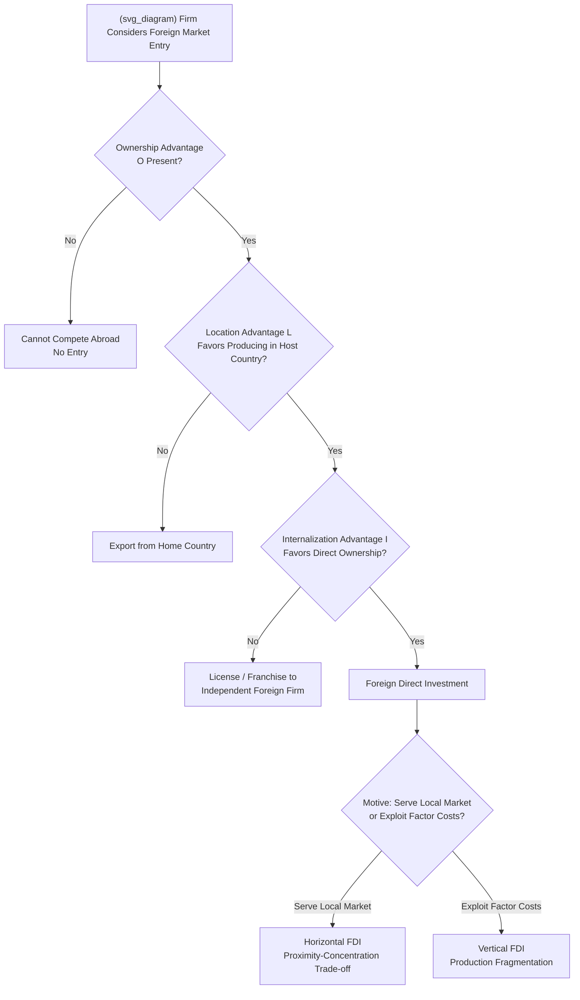

## Multinational Enterprises and Foreign Direct Investment

### Definition and Conceptual Overview

A **multinational enterprise (MNE)** is a firm that owns and controls value-adding activities (production, distribution, R&D) in more than one country, distinguishing it from a firm that serves foreign markets purely through arm's-length exports or licensing. **Foreign direct investment (FDI)** is the cross-border capital flow and ownership stake associated with establishing or acquiring controlling interest in a foreign affiliate — conventionally defined (e.g., by the IMF/OECD) as ownership of 10% or more of voting equity, distinguishing it from **portfolio investment**, which involves no control or managerial influence.

Within Industrial Organization, the central analytical question is: **why does a firm choose to own and operate production facilities abroad (FDI) rather than exporting from its home base or licensing its technology/know-how to an independent foreign firm?** This question — sometimes called the "make-or-buy" or "internalization" decision at the international level — sits at the intersection of trade theory, the theory of the firm, and industrial organization, and is addressed most comprehensively by **Dunning's eclectic (OLI) paradigm** and the **internalization theory** tradition (Buckley and Casson, 1976; Hymer, 1960/1976).

---

### Why Firms Become Multinational: The OLI (Eclectic) Paradigm

**Key Points**

Dunning's OLI framework identifies three necessary conditions that jointly determine whether a firm will engage in FDI as opposed to exporting or licensing:

- **Ownership advantages (O)**: The firm must possess a firm-specific asset — proprietary technology, a strong brand, managerial know-how, patents — that gives it a competitive advantage over local firms in the host country sufficient to overcome the inherent costs of operating in an unfamiliar foreign environment (the "**liability of foreignness**"). Without an ownership advantage, a foreign entrant could not compete with better-informed local incumbents.
- **Location advantages (L)**: The host country must offer location-specific benefits — lower factor costs, proximity to the target market (avoiding transport costs and trade barriers), access to natural resources, or favorable regulatory/tax treatment — that make producing *in* that country more attractive than producing at home and exporting.
- **Internalization advantages (I)**: The firm must find it more profitable to **exploit its ownership advantage internally** (via a wholly- or majority-owned foreign subsidiary) rather than transferring it to an independent foreign firm via licensing or a joint venture. This is the core IO/theory-of-the-firm question, addressed below.

FDI occurs only when **all three conditions hold simultaneously**: if O is absent, the firm cannot compete abroad at all; if L is absent, the firm exports rather than produces abroad; if I is absent, the firm licenses its technology rather than internalizing production.

---

### Internalization Theory: Why Not License Instead?

**Key Points**

The internalization question is the most directly IO-relevant component of the FDI decision, since it concerns why firms choose hierarchical ownership (the multinational firm) over market contracting (licensing, franchising, arm's-length technology transfer) — a direct application of Coasian transaction-cost-economics logic to the cross-border setting.

- **Market failures in technology and know-how transfer**: Licensing requires disclosing proprietary knowledge to a potential licensee for valuation purposes, creating an **information asymmetry / disclosure paradox** (Arrow's information paradox): the licensor cannot fully demonstrate the value of tacit or codified knowledge without partially revealing it, undermining the licensee's willingness to pay full value and creating expropriation risk if the licensee subsequently uses the disclosed knowledge to compete independently.
- **Contract incompleteness and hold-up risk**: Licensing contracts covering technology use, quality control, and territorial restrictions are difficult to write completely and costly to enforce across different legal jurisdictions, creating scope for **opportunistic renegotiation or quality shirking** by the licensee (a foreign-market instance of the classical hold-up problem in incomplete-contracts theory), which internalization via direct ownership can mitigate through unified managerial control.
- **Quality control and brand reputation externalities**: For firms whose ownership advantage is heavily brand- or reputation-based (e.g., hotel chains, fast-food franchises, luxury goods), a licensee's quality-control failures in one market can impose negative reputational externalities on the firm's brand value in *other* markets — an externality that a licensing contract cannot fully internalize but that direct ownership control can better manage (though notably, this specific concern is also addressed in practice via **franchising with strong monitoring/enforcement clauses** rather than full ownership, indicating internalization is a matter of degree rather than a binary choice).
- **Vertical FDI and internal transfer pricing**: When the ownership advantage concerns a vertically-linked intermediate input (proprietary components, specialized process technology) rather than a final consumer product, internalization avoids the double-marginalization and hold-up problems associated with arm's-length intermediate-goods contracting across an international vertical supply chain — directly connecting to the vertical integration/foreclosure theory covered elsewhere in IO.

---

### Horizontal vs. Vertical FDI: The Knowledge-Capital Model

**Key Points**

The modern theoretical workhorse integrating trade and FDI theory is the **knowledge-capital model** (Markusen, 1997, 2002), which unifies two previously separate strands:

- **Horizontal FDI**: A firm replicates the *same* production activity in multiple countries (**"proximity-concentration trade-off"**), primarily to serve local markets directly, avoiding trade costs (tariffs, transport costs) at the expense of forgoing scale economies from concentrating production in a single location. Horizontal FDI is predicted to be relatively more prevalent when countries are **similar in size and factor endowments** (since horizontal FDI does not exploit cross-country factor cost differences) and when trade costs are high relative to the fixed cost of establishing a second plant.
- **Vertical FDI**: A firm fragments its production process across countries, locating different stages of the value chain (e.g., R&D-intensive headquarters activity in the skilled-labor-abundant home country, labor-intensive assembly in the unskilled-labor-abundant host country) to exploit **factor price differences** across countries. Vertical FDI is predicted to be relatively more prevalent when countries differ substantially in relative factor endowments, and trade costs for shipping intermediate/final goods between the fragmented stages are relatively low.
- **Empirical prediction and mixed evidence**: The knowledge-capital model predicts that horizontal FDI should dominate flows between similar, high-income countries (consistent with the empirically dominant pattern of FDI occurring among developed economies, sometimes called the "FDI-similarity" stylized fact), while vertical FDI should be relatively more associated with flows between dissimilar countries seeking to exploit factor-cost arbitrage — though empirical testing finds substantial heterogeneity and elements of both patterns coexisting even within firm-level data, complicating clean model discrimination. [Inference: the relative empirical dominance of horizontal versus vertical FDI motives varies by industry, time period, and the specific empirical methodology used to classify FDI type; this remains an active area of applied international economics research rather than a fully settled matter.]

---

### Illustrative Diagram: The FDI Mode-of-Entry Decision

---

### Market Structure Implications of MNE Entry

**Key Points**

- **Competitive effects on host-country market structure**: FDI entry by a foreign MNE with a strong ownership advantage can significantly increase competitive intensity in a previously concentrated or protected host-country market — a mechanism related to the import-competition-as-competitive-discipline effect discussed in the broader trade-and-market-structure topic, but operating through direct local production rather than cross-border trade flows.
- **Crowding-out vs. crowding-in of domestic firms**: Empirical FDI literature distinguishes between **crowding-out effects** (foreign MNE entry displacing less efficient domestic competitors, potentially reducing domestic industry employment and firm count in the short run) and **crowding-in / spillover effects** (positive productivity spillovers to domestic firms through demonstration effects, labor mobility of trained workers from MNE affiliates to domestic firms, and vertical supply-chain linkages with local input suppliers). The net effect on domestic market structure and welfare is empirically ambiguous and highly context-dependent. [Inference: the relative magnitude of crowding-out versus crowding-in effects varies substantially across host countries, sectors, and the specific channel of FDI spillover studied (horizontal within-industry vs. vertical supply-chain spillovers), and is a continuing subject of empirical debate rather than a settled quantitative finding.]
- **Transfer pricing and tax-driven market structure distortion**: MNEs' ability to shift profits across jurisdictions via **internal transfer pricing** on intra-firm transactions (exploiting the internalization advantage discussed above) can distort the apparent competitive position of MNE affiliates relative to domestic single-country firms facing standard arm's-length tax treatment, an issue of growing regulatory attention (OECD BEPS — Base Erosion and Profit Shifting — framework) that intersects both international tax policy and competitive-neutrality concerns in domestic market structure analysis.

---

### FDI and Merger Control: Cross-Border Considerations

**Key Points**

- **Greenfield vs. brownfield (acquisition) FDI**: FDI can occur via **greenfield investment** (building new production facilities from scratch) or **brownfield/acquisition FDI** (acquiring an existing local firm). Only the latter directly raises standard horizontal merger-control concerns (concentration increase, potential unilateral or coordinated effects), since greenfield entry by definition adds new independent capacity and competitive rivalry rather than consolidating existing rivals.
- **National security and foreign investment screening**: Many jurisdictions maintain separate **foreign investment screening regimes** (e.g., the U.S. CFIUS — Committee on Foreign Investment in the United States, the EU's FDI Screening Regulation framework, and analogous mechanisms in other major economies) that review inbound FDI — particularly acquisition-based FDI in sensitive sectors (critical infrastructure, advanced technology, defense-adjacent industries) — on national security grounds, operating as a distinct regulatory layer alongside, and sometimes in tension with, standard competition-based merger review. [Inference: the specific scope, thresholds, and procedural requirements of these screening regimes are subject to ongoing legislative and regulatory change across jurisdictions; current details should be verified against up-to-date national sources given the active evolution of this policy area in recent years.]
- **Extraterritorial merger review reach**: Because MNE cross-border acquisitions frequently affect competitive conditions in multiple jurisdictions simultaneously, large multinational mergers are commonly subject to **parallel review by multiple competition authorities** (e.g., simultaneous U.S. FTC/DOJ and EU Commission review), raising well-documented coordination challenges, potential for divergent remedy requirements across jurisdictions, and procedural complexity distinct from purely domestic merger review.

---

### Empirical Evidence

**Key Points**

- **Gravity-model FDI determinants**: Empirical FDI flow studies, adapting the gravity-model framework from trade economics, consistently find that FDI flows are increasing in combined market size (home and host GDP), decreasing in geographic and cultural/institutional distance, and sensitive to host-country institutional quality (property rights protection, contract enforcement, political stability) — the latter being particularly relevant given internalization theory's emphasis on contract-enforcement costs as a driver of the ownership-versus-licensing decision.
- **Productivity premium of MNE affiliates**: A robust cross-country empirical finding is that foreign-owned affiliates typically exhibit higher productivity, wages, and capital intensity than comparable domestic firms in the same host-country industry, consistent with the theoretical requirement that MNEs possess a genuine ownership advantage sufficient to overcome the liability of foreignness. [Inference: the magnitude of this "foreign ownership premium" varies by host country income level, sector, and study methodology, and should not be treated as a fixed universal parameter.]
- **Spillover evidence heterogeneity**: The empirical literature on FDI productivity spillovers to domestic firms finds notably mixed results depending on the channel examined — vertical (backward-linkage, supplier-side) spillovers tend to show more consistently positive evidence than horizontal (within-industry, direct-competitor) spillovers, the latter sometimes showing negative or null effects consistent with a crowding-out interpretation in some studies. [Speculation: reconciling this heterogeneity across studies remains an active empirical research question, and the appropriate general conclusion likely depends substantially on host-country absorptive capacity and industry-specific characteristics rather than yielding to a single universal finding.]

---

### Policy Implications

**Key Points**

- **FDI attraction policy vs. domestic competition policy tension**: Many host-country governments actively compete to attract inbound FDI (via tax incentives, subsidies, streamlined regulatory approval), which can create tension with domestic competition policy objectives if such incentives disproportionately favor large MNEs over domestic competitors, or if attracted FDI subsequently exercises significant market power in the host-country market.
- **Technology transfer requirements**: Some countries (historically and currently, in varying forms) have conditioned market access for inbound FDI on technology-transfer or joint-venture requirements with local partners, directly intervening in the internalization decision described above — a policy tool that has generated significant international trade friction and WTO/bilateral dispute activity in some contexts. [Inference: the prevalence and legal status of such requirements varies significantly by country and has been the subject of evolving trade negotiations and disputes; current specifics should be verified against up-to-date country-specific sources.]
- **Coordinated merger review reform proposals**: Given the cross-border complexity of MNE merger activity, ongoing international policy discussion (e.g., through the International Competition Network) addresses procedural harmonization and cooperation mechanisms between national competition authorities reviewing the same multinational transaction, though full substantive harmonization of merger-review standards across jurisdictions remains limited.

---

### Critiques and Open Questions

**Key Points**

- **OLI paradigm's descriptive vs. predictive limitations**: Critics note that the OLI framework, while useful as an organizing taxonomy, is sometimes criticized as more **descriptive/classificatory** than genuinely predictive, since the "advantages" (O, L, I) can often be identified only *after* observing that a firm has chosen FDI, raising a degree of circularity in empirical testing.
- **Digital and knowledge-intensive MNE activity**: The classical OLI/internalization framework was developed primarily with manufacturing-sector MNEs in mind; its application to digital-platform and data-intensive multinational firms — where "location" may be less tied to physical production facilities and market power can arise from data and network effects rather than traditional ownership advantages — is an active area of ongoing theoretical extension rather than a fully settled application. [Speculation: whether the classical OLI/internalization framework requires substantial modification versus straightforward extension to adequately capture digital-economy multinational activity remains a live question in the current international IO literature.]
- **Distributional and bargaining-power concerns**: Beyond aggregate efficiency effects, host-country policy debates increasingly focus on the **bargaining power asymmetry** between large MNEs and host-country governments (particularly smaller or developing economies), affecting tax revenue capture, labor standards, and environmental regulation enforcement — a distributional dimension not fully captured by the efficiency-oriented OLI/internalization theoretical framework.

---

**Related Topics**

- Trade policy interactions with domestic market structure
- Vertical integration and internalization theory (Coase, Williamson)
- Knowledge-capital model of horizontal and vertical FDI (Markusen)
- Cross-border merger review coordination and international competition policy
- Foreign investment screening regimes (CFIUS, EU FDI Screening Regulation)
- Transfer pricing, profit shifting, and OECD BEPS framework
- FDI productivity spillovers and host-country absorptive capacity
- Killer acquisitions and nascent competitor theories of harm (cross-border dimension)