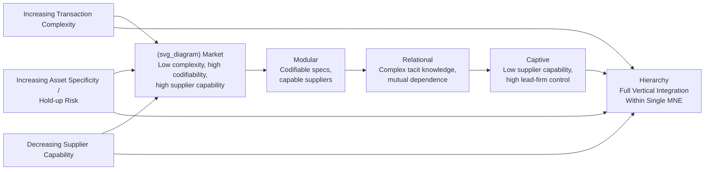

## Global Value Chains and Industrial Organization

### Definition and Conceptual Overview

A **global value chain (GVC)** describes the full range of activities — design, input production, component manufacturing, assembly, marketing, distribution — required to bring a product or service from conception to end use, where these stages are geographically fragmented across multiple countries and, typically, multiple legally independent firms. GVC analysis sits at the intersection of international trade, industrial organization, and organizational economics, because it requires explaining not just **where** production occurs (the traditional trade-theory question) but **who owns and controls each stage** — i.e., whether a given link in the chain is organized through vertical integration (within a single multinational firm) or arm's-length market contracting between independent firms across borders.

This directly extends the make-or-buy/internalization logic discussed in the multinational enterprise literature to a **chain-wide, multi-stage setting**: rather than a single ownership-versus-licensing decision, a lead firm coordinating a GVC must make a distinct governance choice at *each* stage of the value chain, generating a much richer taxonomy of possible organizational structures than the simple binary FDI-versus-licensing decision.

---

### The Gereffi-Humphrey-Sternberg Governance Typology

**Key Points**

The most widely used framework for classifying GVC governance structures, developed by Gereffi, Humphrey, and Sternberg (2005), identifies **five governance types** along a spectrum from pure market transactions to full vertical integration, determined by three key variables: (1) the **complexity of information/knowledge transfer** required between stages, (2) the **codifiability** of that information (can it be transmitted efficiently without loss of meaning, e.g., via a written specification), and (3) the **capability of suppliers** to meet the requirements without extensive lead-firm assistance.

- **Market**: Simple, codifiable transactions where suppliers have full capability to meet buyer specifications with minimal coordination — governance approximates the classical arm's-length spot-market transaction (e.g., commodity inputs).
- **Modular value chains**: Buyers specify requirements to suppliers who then take full responsibility for the production process using generic, codifiable technical specifications — suppliers make product-specific investments but retain the capability to serve multiple buyers (e.g., contract electronics manufacturing, where a firm like an EMS provider produces for multiple brand-owning lead firms using a common modular production architecture).
- **Relational value chains**: Complex, largely tacit (non-codifiable) information requires close, mutually dependent interaction and trust-building between lead firms and highly capable suppliers, often geographically clustered and characterized by significant relationship-specific investment on both sides (e.g., specialized component design in some automotive supply relationships).
- **Captive value chains**: Suppliers have relatively low capability and are highly dependent on a dominant lead firm that exercises substantial control and monitoring over supplier operations, often providing significant technical assistance — suppliers face high switching costs due to relationship-specific investment while the lead firm retains most of the bargaining power (e.g., many contract apparel manufacturing relationships in developing economies).
- **Hierarchy**: Full vertical integration within a single multinational firm, applied when the coordination and knowledge-transfer requirements are too complex, tacit, or proprietary to manage effectively even through the closest arm's-length relational arrangements — directly corresponding to the "internalization" outcome in the OLI/multinational enterprise framework.

---

### The IO Logic Underlying Governance Choice

**Key Points**

The governance typology maps directly onto transaction-cost-economics and incomplete-contracts theory from the theory-of-the-firm literature (Coase, Williamson, Grossman-Hart-Moore), applied specifically to the cross-border, multi-stage GVC context:

- **Asset specificity and hold-up risk**: Stages requiring highly relationship-specific investment (specialized tooling, customized components usable only for a single buyer's product) create hold-up vulnerability under arm's-length contracting, since the investing party's sunk investment gives the counterparty ex post bargaining leverage — pushing governance toward the captive or hierarchy end of the spectrum as asset specificity rises.
- **Contract incompleteness across jurisdictions**: Cross-border contracting compounds the standard incomplete-contracts problem, since contract enforcement quality, legal system reliability, and dispute-resolution costs vary substantially across the countries in a chain — weaker contract-enforcement environments in a host country push governance toward tighter forms of control (captive governance or full vertical integration) even when the underlying transaction's technical characteristics might otherwise support a more market-like relational or modular arrangement.
- **Supplier capability and the "power to codify"**: A critical insight distinguishing this framework from the standard domestic transaction-cost model is that **codifiability is partly endogenous to lead-firm and industry-level standard-setting investment** — industries that have invested in developing standardized technical interfaces, component specifications, and quality certification protocols (e.g., electronics industry standards enabling modular production) can shift transactions that would otherwise require relational or captive governance toward more efficient, more easily monitored **modular** governance, expanding the feasible set of arm's-length outsourcing.
- **Lead-firm market power and value capture ("smile curve")**: Even where production stages are technically outsourced to independent suppliers, **lead firms typically retain disproportionate bargaining power and value capture** relative to their share of physical production activity, an empirical pattern popularized as the "**smile curve**" — value added is relatively high at the upstream (R&D, design, branded input) and downstream (marketing, branding, retail/distribution) ends of the chain, and relatively low at the midstream (physical assembly/manufacturing) stage, reflecting the concentration of scarce, hard-to-imitate assets (intellectual property, brand equity, control over final-market distribution channels) at the chain's endpoints rather than in generic assembly capability.

---

### Illustrative Diagram: GVC Governance Spectrum and Determinants

---

### Market Power and Concentration Along the Chain

**Key Points**

- **Buyer-driven vs. producer-driven chains**: Gereffi's earlier (1994) distinction separates chains coordinated by powerful **buyers** (large retailers and branded marketers, typically in labor-intensive consumer goods like apparel and footwear, who outsource production but retain design, branding, and distribution control) from chains coordinated by powerful **producers** (typically in capital- and technology-intensive industries like automobiles and aerospace, where the lead manufacturer retains direct control over core production technology and manages a network of component suppliers). This distinction has direct implications for where market power and rent extraction concentrate within a given chain.
- **Monopsony power over suppliers**: In many buyer-driven and captive GVC structures, a small number of lead firms face a much larger and more fragmented population of upstream suppliers (especially prevalent in developing-country manufacturing contexts), creating conditions for **monopsony-like bargaining power** by lead firms over supplier pricing, terms, and margins — an application of standard monopsony/buyer-power IO theory in the specific context of international outsourcing relationships.
- **Chain-level barriers to entry**: A supplier's ability to move "up the smile curve" into higher-value-added activities (from pure assembly toward design or branded final-product marketing) is often constrained not by production capability alone but by lead firms' control over distribution channels, brand recognition, and standard-setting — a dynamic capability/entry-barrier question distinct from classical production-cost-based barriers to entry.
- **GVC lead-firm behavior and competition policy**: Because lead-firm market power in a GVC can manifest through **contractual control over formally independent firms** rather than through direct ownership or classical horizontal concentration, standard merger-control and market-definition tools calibrated to ownership-based concentration measures may understate the effective concentration of economic control within a chain — a growing area of interest for competition authorities examining platform-mediated and franchise-like GVC structures. [Speculation: the extent to which competition authorities have formally adapted merger-review or abuse-of-dominance analytical tools to capture this GVC-specific concentration-of-control dynamic, as opposed to relying on traditional ownership-based concentration measures, varies across jurisdictions and remains an evolving area of enforcement practice.]

---

### Trade Policy and Tariff Interactions with GVCs

**Key Points**

- **Tariff escalation and effective protection along the chain**: Because GVC production involves multiple cross-border movements of intermediate goods (a component may cross several borders before final assembly), the **effective rate of protection** on any given stage depends not just on the nominal tariff on the final product but on the cumulative tariff burden on all upstream intermediate inputs — a standard effective-protection-theory calculation that becomes substantially more complex and policy-relevant in fragmented, multi-border GVC production compared to traditional single-border trade.
- **Rules of origin as a GVC governance tool**: Preferential trade agreements' **rules of origin** requirements (specifying minimum domestic/regional value-added content for a good to qualify for tariff preferences) directly shape lead firms' sourcing and governance decisions within a GVC, potentially inducing suppliers to relocate or firms to restructure sourcing relationships purely to satisfy origin thresholds rather than for underlying cost-efficiency reasons — a trade-policy-induced distortion of otherwise efficient GVC governance choices.
- **GVC fragility and disruption**: The COVID-19 pandemic and subsequent geopolitical tensions (e.g., U.S.-China trade tensions, the war in Ukraine's effects on energy and commodity chains) generated substantial policy and academic interest in **GVC resilience** — the trade-off between the cost-efficiency gains of extended, specialized international fragmentation versus the concentration risk and disruption vulnerability such fragmentation creates, motivating renewed interest in "**reshoring**," "**nearshoring**," and "**friend-shoring**" strategies among lead firms and governments alike. [Inference: the actual empirical extent of reshoring/nearshoring realized in practice, as opposed to firms' stated intentions in surveys, is a matter of ongoing empirical assessment and has shown mixed results across different studies and industries as of the most recent available data; readers should consult current trade data sources for the latest assessment given this is an actively evolving area.]

---

### Empirical Evidence

**Key Points**

- **Trade-in-value-added (TiVA) measurement**: Because conventional gross trade statistics substantially overstate the domestic value-added content of exports in GVC-intensive industries (due to double-counting of intermediate inputs crossing borders multiple times), the OECD/WTO **Trade in Value Added (TiVA)** database and related input-output-based measurement frameworks have become standard empirical tools for accurately measuring each country's genuine value-added contribution to internationally fragmented production, correcting for this double-counting bias inherent in gross bilateral trade figures.
- **Smile curve empirical support**: Firm- and industry-level value-added decomposition studies in electronics and other GVC-intensive sectors generally find empirical support for the qualitative smile-curve pattern (higher value-added shares captured by upstream design/IP and downstream branding/distribution relative to midstream assembly), though the precise quantitative shape and steepness of the curve varies substantially by industry and specific product studied. [Inference: specific numerical value-added share estimates cited in various smile-curve studies are product- and time-period-specific and should not be generalized as a fixed universal distribution across all GVC-organized industries.]
- **Captive-governance evidence in labor-intensive manufacturing**: Case-study and firm-survey evidence from apparel, footwear, and similar labor-intensive GVC sectors documents patterns consistent with the captive-governance prediction — high supplier dependence on a small number of lead buyers, significant lead-firm technical assistance and monitoring, and asymmetric bargaining power reflected in supplier margins — broadly consistent with the Gereffi-Humphrey-Sternberg framework's predictions for this sector type.

---

### Policy Implications

**Key Points**

- **Industrial upgrading policy**: Given the smile-curve pattern, many developing-country industrial policy strategies explicitly target "**economic upgrading**" — helping domestic firms move from pure assembly (captive governance, low value capture) toward higher-value design, branding, or full-package (original brand manufacturing) roles within GVCs, representing a governance-structure-aware alternative to traditional infant-industry protection strategies.
- **Labor standards and GVC governance interaction**: Because captive and buyer-driven GVC governance concentrates substantial monitoring and control power in lead firms even absent direct ownership, labor-standards and corporate-social-responsibility policy increasingly targets lead-firm supply-chain due-diligence obligations (e.g., mandatory human-rights and environmental due-diligence legislation in the EU and elsewhere) rather than relying solely on host-country labor regulation enforcement, reflecting recognition that lead firms possess meaningful practical control despite lacking direct ownership.
- **Competition policy adaptation for platform-mediated chains**: As digital platforms increasingly mediate GVC coordination (e.g., e-commerce platforms coordinating fragmented supplier networks), competition authorities face growing pressure to adapt traditional market-power analysis to account for **contractual and algorithmic control mechanisms** that can replicate the economic effects of vertical integration without formal ownership consolidation.

---

### Critiques and Open Questions

**Key Points**

- **Governance typology as a continuum, not discrete categories**: Critics note that real-world GVC relationships frequently exhibit characteristics spanning multiple governance types simultaneously or shift between types over time as supplier capabilities evolve, suggesting the five-category typology is best understood as a stylized simplification of a genuinely continuous, dynamic spectrum rather than a set of discrete, stable classifications.
- **Measurement and data limitations**: Empirically classifying real firm relationships into the Gereffi-Humphrey-Sternberg categories, and precisely measuring value-added capture at each chain stage, requires detailed firm-level and transaction-level data that is often proprietary or unavailable at the granularity needed for rigorous large-sample empirical testing, meaning much of the supporting evidence for the framework remains case-study-based rather than large-sample econometric in nature. [Speculation: the extent to which more granular customs, trade, and firm-transaction data becoming increasingly available in recent years is closing this empirical gap is an evolving methodological development rather than a fully resolved matter.]
- **Distributional and power-asymmetry concerns beyond efficiency**: Some scholars argue the efficiency-oriented transaction-cost framing of GVC governance underemphasizes the raw **bargaining power asymmetries** between large multinational lead firms and typically much smaller, more numerous, and more geographically dispersed suppliers — asymmetries that may persist and even be reinforced by "efficient" governance arrangements (e.g., captive governance) regardless of their transaction-cost-minimizing properties, raising normative questions about surplus distribution that a pure efficiency lens does not directly address.

---

**Related Topics**

- Multinational enterprises and foreign direct investment
- Vertical integration and internalization theory (Coase, Williamson, Grossman-Hart-Moore)
- Trade policy interactions with domestic market structure
- Trade in Value Added (TiVA) measurement and effective protection theory
- Monopsony power and buyer-driven supply chain bargaining
- Rules of origin and preferential trade agreement design
- Economic upgrading and industrial policy in developing economies
- Reshoring, nearshoring, and global value chain resilience strategies