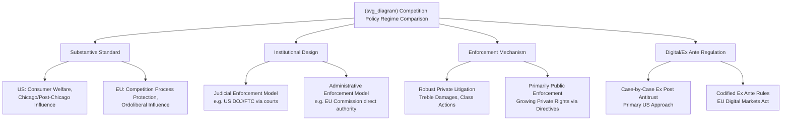

## Cross-Country Comparisons of Competition Policy Regimes

### Definition and Conceptual Overview

**Comparative competition policy** examines how different jurisdictions design, interpret, and enforce laws governing market power, mergers, anticompetitive agreements, and abuse of dominance — and analyzes the sources and consequences of substantive and procedural divergence across regimes. This is distinct from *international* competition policy questions (cross-border merger coordination, extraterritorial jurisdiction), though the two are closely related: comparative analysis explains *why* regimes differ, while international coordination addresses the practical *consequences* of firms and mergers being reviewed under multiple, non-identical standards simultaneously.

The central analytical questions in this field are: (1) why do jurisdictions with broadly similar economic theory training and academic literature nonetheless arrive at materially different legal standards and enforcement outcomes; (2) how much of this divergence reflects genuine differences in underlying economic/legal philosophy versus institutional, historical, or political-economy factors; and (3) what are the practical consequences of this divergence for globally operating firms and for international economic welfare.

---

### The Two Dominant Regime Archetypes: U.S. and EU

**Key Points**

- **U.S. antitrust tradition — Chicago/post-Chicago consumer welfare standard**: U.S. antitrust law (Sherman Act 1890, Clayton Act 1914, FTC Act 1914) has, since the 1970s–1980s "Chicago School" revolution associated with Robert Bork and Richard Posner, been dominated by a **consumer welfare standard** emphasizing price and output effects, generally skeptical of intervention absent clear evidence of consumer harm, and historically cautious about condemning unilateral conduct or vertical arrangements absent strong proof of anticompetitive effect (reflected in doctrines like the *Brooke Group* recoupment requirement for predatory pricing and generally permissive treatment of vertical restraints post-*Leegin* 2007).
- **EU competition law tradition — ordoliberalism and the protection of competition process**: EU competition law (Treaty on the Functioning of the European Union, Articles 101 and 102) traces significant intellectual heritage to **ordoliberalism**, a German postwar economic-legal tradition emphasizing that a well-functioning competitive *process* — not merely consumer welfare outcomes — is a value the state should actively protect, partly as a check on concentrated private economic power. This has historically translated into somewhat more interventionist doctrine regarding abuse of dominance (Article 102), a broader conception of potential harm (including harm to competitors' ability to compete, not solely to consumer prices), and generally stricter treatment of vertical restraints and loyalty rebates than the contemporary U.S. approach (illustrated by the EU's *Intel* loyalty-rebate case line, which imposed liability standards notably stricter than comparable U.S. doctrine).
- **Convergence and persistent divergence**: While both regimes have moved toward greater economic sophistication and effects-based analysis since the 1990s–2000s (the EU's "more economic approach" reforms), and both nominally endorse some version of a welfare-oriented standard, **meaningful doctrinal divergence persists** in specific areas — most visibly in unilateral conduct/monopolization standards, treatment of "abuse of dominance" without requiring proof of the exclusionary effect's consumer-price impact, and (more recently) the EU's willingness to adopt ex ante digital-market-specific regulation (the DMA) where the U.S. has generally continued relying on case-by-case ex post antitrust enforcement. [Inference: characterizing the precise current degree of convergence versus divergence between the two systems involves some interpretive judgment and is a subject of ongoing scholarly debate, particularly given both systems' continuing doctrinal evolution; readers interested in the most current state of specific doctrines should consult up-to-date primary sources.]

---

### Institutional Design Variation Across Jurisdictions

**Key Points**

- **Judicial vs. administrative enforcement models**: The U.S. system relies substantially on **judicial enforcement** — the DOJ and FTC must generally litigate before independent federal courts to obtain injunctions or divestiture orders (with the FTC also having internal administrative adjudication authority subject to judicial review), giving courts a central role in doctrinal development. Many other jurisdictions (including the EU Commission and numerous national competition authorities) operate primarily through **administrative enforcement models**, where the competition authority itself investigates, adjudicates, and imposes fines/remedies directly, subject to appellate review by specialized courts (e.g., the EU General Court and Court of Justice) — a structurally different balance of investigative, prosecutorial, and adjudicative power concentrated within a single agency versus separated between agency and judiciary.
- **Combined competition and consumer protection mandates**: Some agencies (the UK's CMA, Australia's ACCC, and others) hold combined jurisdiction over both classical competition law and consumer protection/unfair-practices law, facilitating integrated behavioral-economics-informed enforcement of the type discussed in the behavioral antitrust literature; other jurisdictions (the U.S., with antitrust split between DOJ/FTC and separate consumer-protection-focused FTC authority, and many EU member states with separate national consumer-protection regulators) maintain more institutionally separated mandates.
- **Private enforcement variation**: The U.S. features unusually robust **private antitrust litigation** — including treble damages, contingency-fee litigation, and class actions — generating a substantial share of total U.S. antitrust enforcement activity through private plaintiffs rather than government agencies alone. Most other jurisdictions historically relied much more heavily on public enforcement, though the EU has actively promoted greater private enforcement capacity through the 2014 **Antitrust Damages Directive**, illustrating a partial (though still incomplete) convergence toward the U.S. private-enforcement model. [Inference: the relative magnitude of private versus public enforcement activity varies considerably by jurisdiction and over time; current comparative statistics should be verified against up-to-date sources given ongoing legal reforms in several jurisdictions.]
- **Merger notification thresholds and mandatory vs. voluntary review**: Jurisdictions vary substantially in whether merger notification is **mandatory** (with suspensory effect pending clearance, as in the U.S. HSR regime and EU Merger Regulation) versus **voluntary** (as historically in the UK, though even mandatory-adjacent voluntary regimes typically create strong practical incentives to notify), and in the specific size-of-transaction or market-share thresholds triggering review — directly affecting which transactions receive scrutiny in each jurisdiction, a divergence particularly consequential for the killer-acquisition and nascent-competitor enforcement-gap concerns discussed elsewhere in this material.

---

### Illustrative Diagram: Comparative Dimensions of Competition Policy Divergence

---

### Developing and Emerging Economy Competition Regimes

**Key Points**

- **Newer institutional capacity constraints**: Many developing and emerging-market competition authorities (e.g., in parts of Latin America, Africa, and Asia) established formal competition law regimes more recently (often in the 1990s–2010s, frequently as part of broader market-liberalization and WTO-accession-related reforms), and continue to face resource, expertise, and institutional-independence constraints relative to the longer-established U.S. and EU regimes — affecting both enforcement intensity and the sophistication of economic analysis applied.
- **China's evolving competition law regime**: China's Anti-Monopoly Law (effective 2008, substantially amended 2022) represents a distinctive hybrid model, combining elements drawn from both U.S. and EU doctrinal traditions with distinctive features reflecting China's state-influenced economic structure, including specific provisions addressing state-owned enterprises and administrative monopoly that have no close analog in Western competition law frameworks, and increasingly active enforcement particularly in the digital/platform sector in recent years. [Inference: the practical enforcement intensity, doctrinal interpretation, and institutional independence of China's competition authority (SAMR) involves ongoing evolution and is best assessed against current, jurisdiction-specific sources given the pace of recent regulatory change.]
- **"Second-generation" competition law adoption patterns**: Comparative competition law scholarship has documented that many newly-adopting jurisdictions substantially **model their statutory language and doctrinal frameworks on either the EU or U.S. approach** (sometimes explicitly, as a condition of trade agreement accession or technical assistance programs), generating clusters of doctrinal similarity across otherwise economically and institutionally distinct countries — an interesting "legal transplant" phenomenon in comparative competition law distinct from organic domestic doctrinal development.

---

### Key Substantive Areas of Persistent Divergence

**Key Points**

- **Unilateral conduct / monopolization standards**: The U.S. requires proof of both substantial market power *and* specific exclusionary conduct with limited legitimate business justification (Sherman Act Section 2), generally applying a relatively demanding evidentiary standard for unilateral-conduct liability; the EU's Article 102 "abuse of dominance" framework has historically applied a somewhat lower threshold, particularly regarding loyalty rebates, tying, and refusal-to-deal doctrines, reflecting the ordoliberal emphasis on protecting rivals' ability to compete rather than requiring proof of direct consumer price harm.
- **Vertical restraints treatment**: Following *Leegin Creative Leather Products v. PSKS* (2007), U.S. law treats resale price maintenance under a **rule-of-reason** standard (requiring proof of likely anticompetitive effect); many other jurisdictions, including the EU, continue to treat RPM as a **hardcore restriction** presumptively or per se illegal under most circumstances, representing one of the most concrete, well-documented doctrinal divergences between the two major regimes.
- **Merger review substantive test**: The U.S. applies a "substantial lessening of competition" standard; the EU applies a "significant impediment to effective competition" (SIEC) test, adopted in 2004 partly to address a perceived gap in the prior "dominance" test's ability to capture certain non-dominance-creating but still competitively harmful mergers (particularly relevant to unilateral effects in differentiated-product oligopoly mergers) — while the two tests have converged substantially in practical application, some doctrinal and evidentiary differences persist in specific case types.
- **Digital-sector ex ante regulation**: The EU's Digital Markets Act represents a marked institutional divergence from the traditional case-by-case antitrust enforcement model still primarily used in the U.S. for digital-platform conduct, codifying specific *ex ante* behavioral obligations and prohibitions for designated "gatekeeper" platforms rather than relying solely on post hoc litigation — a structural policy-design divergence with significant implications for the pace, predictability, and scope of digital-market competition enforcement across the two jurisdictions.

---

### Convergence Forces and International Coordination Mechanisms

**Key Points**

- **International Competition Network (ICN)**: A voluntary, informal network of competition agencies (formed 2001) that develops non-binding "recommended practices" and facilitates cross-agency dialogue on procedural and, to a lesser extent, substantive convergence — illustrating a "soft law" convergence mechanism operating without formal treaty obligation or binding supranational authority.
- **OECD Competition Committee**: Provides a comparative peer-review and best-practices forum among OECD member competition authorities, contributing to gradual procedural and methodological convergence (e.g., in merger notification form design, economic evidence standards) without imposing binding substantive harmonization.
- **Bilateral and regional cooperation agreements**: Many major competition authorities maintain formal bilateral cooperation agreements (e.g., U.S.-EU antitrust cooperation agreements dating to 1991) facilitating information sharing and coordinated case timing for multinational merger reviews, though **substantive outcome divergence remains possible** even with strong procedural cooperation, since each authority retains full sovereign authority to apply its own substantive legal standard.
- **Limits to convergence**: Despite these mechanisms, genuine substantive harmonization remains limited by the absence of any binding supranational competition authority with global jurisdiction (unlike, for instance, the WTO's binding dispute-settlement mechanism for trade law), meaning multinational firms continue to face a genuinely multi-jurisdictional compliance landscape rather than a single harmonized global standard.

---

### Empirical Evidence on Divergence Consequences

**Key Points**

- **Divergent merger outcomes for the same transaction**: Documented instances exist of the same global merger receiving unconditional clearance in one major jurisdiction while facing significant remedy requirements or blocking in another (the EU's blocking of the *GE/Honeywell* merger in 2001 after the transaction had already received unconditional U.S. clearance being a frequently cited historical illustration), demonstrating that substantive divergence has genuine, observable practical consequences rather than being purely a theoretical/doctrinal matter. [Inference: such high-profile divergent-outcome cases, while illustrative, are not necessarily representative of the typical degree of convergence in the large majority of multinational merger reviews, most of which reach broadly consistent outcomes across jurisdictions; readers should avoid over-generalizing from prominent divergence cases alone.]
- **Compliance cost studies**: Firm-level surveys and legal-practitioner assessments generally document that multinational merger transactions subject to multiple, non-harmonized jurisdictional reviews incur meaningfully higher legal, procedural, and timing costs than would a hypothetical single-jurisdiction review, providing an empirical efficiency rationale for continued international cooperation efforts despite the practical difficulty of full substantive harmonization. [Speculation: precise quantitative estimates of these compliance cost differentials are study- and transaction-specific and should not be treated as a fixed universal parameter.]

---

### Critiques and Open Questions

**Key Points**

- **Race-to-the-bottom vs. race-to-the-top debate**: Comparative competition policy scholars debate whether jurisdictional competition for corporate investment creates pressure toward weaker, more permissive competition enforcement standards (a "race to the bottom" concern) or whether reputational and coordination mechanisms instead tend to promote convergence toward more rigorous standards over time (a "race to the top" or "Brussels effect" dynamic, referencing the EU's demonstrated ability to export its regulatory standards globally through market-access leverage) — with the empirical evidence on this question remaining genuinely contested and likely varying by policy area and time period. [Speculation: which dynamic dominates in any given period and policy domain is not conclusively settled in the current comparative literature and may itself evolve as global economic and political conditions change.]
- **Appropriate degree of harmonization**: A normative debate persists over whether substantive competition law harmonization across jurisdictions would be genuinely welfare-improving (reducing compliance costs and providing more predictable global rules) or whether **legitimate differences in national economic structure, political values, and institutional capacity** justify continued substantive divergence, meaning the "optimal" degree of international competition policy convergence is not a purely technical question but embeds contested value judgments about the goals competition policy should serve.
- **Measurement challenges in comparative enforcement intensity**: Comparing the practical "toughness" or effectiveness of enforcement across jurisdictions using simple metrics (case counts, fine totals) is methodologically fraught, since these metrics do not control for underlying differences in economic structure, market concentration levels, or investigative resources, complicating efforts to draw clean comparative conclusions about which regime is more or less permissive in actual practical effect versus in formal legal doctrine alone.

---

**Related Topics**

- Implications of behavioral biases for competition policy
- Killer acquisitions and nascent competitor theories of harm (cross-jurisdictional enforcement gaps)
- Digital Markets Act and ex ante gatekeeper regulation
- Loyalty rebates and exclusive dealing (EU *Intel* case line vs. US doctrine)
- Multinational enterprises and foreign direct investment (cross-border merger review)
- Global value chains and industrial organization
- Private antitrust enforcement and treble damages litigation
- International Competition Network and OECD comparative competition policy frameworks