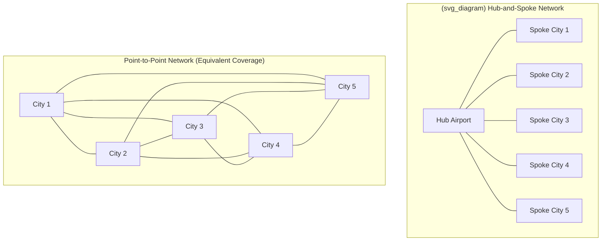

## Airline Industry Competition and Hub-and-Spoke Pricing

### Definition and Conceptual Overview

The airline industry is a canonical applied case study in Industrial Organization because it combines several distinct structural features in a single, well-documented market: **network economics** (hub-and-spoke route structure), **high fixed and sunk costs** with **low marginal costs** for an incremental passenger (generating strong incentives for aggressive marginal-cost-based price discrimination), **capacity constraints** (a fixed number of seats per flight, generating peak-load and revenue-management pricing dynamics), and **repeated, transparent, multimarket contact** among a small number of large carriers, making it one of the most heavily studied empirical settings for oligopoly theory, price discrimination, entry deterrence, and tacit coordination.

**Hub-and-spoke networks** — where a carrier routes passengers through a central hub airport rather than offering direct point-to-point service between all city pairs — became the dominant U.S. domestic network structure following the **Airline Deregulation Act of 1978**, which removed the CAB's (Civil Aeronautics Board) direct route and fare regulation and allowed carriers to freely choose network structure and pricing. This deregulation episode is one of the most extensively studied natural experiments in applied IO, generating a large empirical literature on the competitive effects of network structure choice.

---

### Economic Rationale for Hub-and-Spoke Networks

**Key Points**

- **Economies of traffic density (density economies)**: A hub-and-spoke structure allows a carrier to consolidate passengers from many origin-destination city pairs onto fewer, higher-frequency, higher-load-factor trunk routes into and out of the hub, exploiting **economies of density** (falling average cost per passenger-mile as traffic volume on a given route rises, for a fixed network) distinct from classical economies of scale (falling average cost as firm size rises). This distinction — formalized in the airline economics literature (e.g., Caves, Christensen, and Tretheway, 1984) — is central to understanding why hub networks can be cost-efficient even without an overall airline-size scale advantage.
- **Connectivity and reduced route count**: A hub structure connecting $n$ spoke cities to a single hub requires only $n$ routes, whereas a fully connected point-to-point network serving the same set of city pairs would require $\binom{n}{2} = \frac{n(n-1)}{2}$ routes — a combinatorial reduction that allows a carrier to offer service (with a connection) to a vastly larger number of city-pair markets than would be feasible with point-to-point service alone, particularly valuable for lower-demand-density city pairs that could not independently support direct service.
- **Trade-off: circuity cost vs. frequency/connectivity benefit**: Hub connections impose a **circuity cost** on passengers (a longer total travel distance and time than a hypothetical direct flight) and connection-related risk (missed connections, layover time), which must be weighed against the network benefit of substantially expanded market coverage and, often, higher flight frequency on the hub-spoke segments themselves (frequency being a valued service attribute for business travelers in particular).

---

### Hub Dominance and Fortress Hubs

**Key Points**

- **"Fortress hub" phenomenon**: In the U.S. post-deregulation experience, most major hub airports came to be dominated by a single carrier holding a very high share of gates, takeoff/landing slots, and originating passenger traffic — a pattern termed a **"fortress hub."** This concentration arises partly from genuine density-economy advantages accruing to the dominant carrier (more connecting traffic supports higher frequency, benefiting the dominant carrier's competitive position in a self-reinforcing way) and partly from institutional/contractual barriers to rival entry (long-term exclusive-use gate leases, historical slot allocation rules at capacity-constrained airports).
- **The "hub premium"**: A well-documented and extensively replicated empirical finding (originating with Borenstein, 1989, and Berry, 1990) is that fares for itineraries **originating or connecting at a carrier's dominant hub are systematically higher** than fares for otherwise comparable itineraries not involving a dominant hub, even controlling for distance and other route characteristics — interpreted as evidence of genuine market power exercised by the dominant hub carrier over origin-and-destination traffic specific to that hub, distinct from (and in addition to) any efficiency benefit the hub structure provides. [Inference: the precise magnitude of the hub premium varies across studies, time periods, and specific route samples; commonly cited historical estimates in the literature (typically in a range suggesting a meaningful double-digit percentage fare premium) should be treated as illustrative of a robust qualitative finding rather than as a single precise current figure, given that market conditions and competitive intensity have evolved since the original studies.]
- **Barriers to entry at fortress hubs**: Potential entrant carriers at a dominated hub face several structural barriers: limited gate and slot availability (especially at capacity-constrained airports), the incumbent's ability to match or undercut new entrant fares selectively on contested routes while maintaining higher fares on uncontested routes (a pattern connecting directly to limit-pricing and predatory-response theory), and the incumbent's frequent-flyer program and corporate travel-contract advantages (discussed below) that create demand-side switching frictions favoring the incumbent.

---

### Illustrative Diagram: Hub-and-Spoke Network Structure vs. Point-to-Point

---

### Price Discrimination and Revenue Management

**Key Points**

Airlines are one of the most extensively studied practical applications of **intertemporal and structural price discrimination** in the IO literature, given the industry's combination of fixed capacity (seats per flight), perishable inventory (an unsold seat has zero value after departure), and heterogeneous passenger demand elasticities.

- **Advance-purchase and Saturday-night-stay restrictions**: Classical airline fare structures used purchase-timing and itinerary restrictions (advance purchase requirements, minimum-stay requirements including Saturday-night stays) as a **screening device** to separate relatively price-inelastic business travelers (who typically book close to departure and prefer flexibility, unwilling to accept restrictive conditions) from relatively price-elastic leisure travelers (who can plan and book further in advance and accept restrictions), a textbook self-selection second-degree price discrimination mechanism.
- **Revenue management / yield management systems**: Airlines pioneered sophisticated **dynamic pricing algorithms** that allocate a fixed number of seats across multiple fare classes (nested booking classes) based on real-time demand forecasting, adjusting the number of seats available at each price point as the departure date approaches and actual bookings are observed relative to forecast — a foundational application of dynamic capacity-constrained pricing theory (drawing on the broader peak-load pricing and revenue management literature) that has since been widely adopted across hospitality, car rental, and other perishable-capacity industries.
- **Fare basis complexity and price dispersion**: The airline industry has historically exhibited exceptionally high **price dispersion** — substantially different fares for physically identical seats on the same flight, purchased by different passengers under different fare-class restrictions — a pattern extensively studied both as an efficient price-discrimination outcome and, in some studies, as partly reflecting market power and search-cost-related consumer confusion (connecting to the broader shrouded-attribute and framing-effects behavioral IO literature, given the historical complexity of fare rules and change/cancellation fee structures).
- **Ancillary fee unbundling**: Since the mid-2000s, most carriers have shifted toward unbundling previously included services (checked baggage, seat selection, priority boarding) into separate ancillary fees, allowing more granular price discrimination across passenger valuations for specific service attributes — directly connecting to the shrouded-attributes/drip-pricing literature discussed elsewhere, given that ancillary fees are frequently disclosed later in the booking process than the headline base fare.

---

### Competitive Dynamics: Entry, Exit, and Contestability

**Key Points**

- **Contestable markets theory and its airline-specific limitations**: The theory of **contestable markets** (Baumol, Panzar, and Willig, 1982) — which posits that even a highly concentrated market can produce competitive outcomes if entry and exit are sufficiently costless and rapid (the threat of "hit-and-run" entry disciplining incumbent pricing) — was initially applied optimistically to airline deregulation, since aircraft are physically mobile capital that can, in principle, be redeployed to a new route relatively quickly. However, subsequent empirical research found airline markets to be **considerably less contestable in practice** than the pure theory predicted, due to the fortress-hub barriers discussed above (gate/slot access, frequent-flyer switching costs, incumbent response capability), leading to substantial revision of the initially optimistic deregulation-era contestability predictions.
- **Low-cost carrier (LCC) entry and the "Southwest effect"**: Entry by low-cost carriers (historically Southwest Airlines in the U.S., and analogous LCCs internationally such as Ryanair in Europe) using predominantly point-to-point route structures, single aircraft-type fleets (reducing maintenance/training costs), and simplified fare structures has been extensively documented to produce substantial fare reductions on affected routes — the **"Southwest effect"** — both on routes the LCC directly enters and, to a lesser extent, on nearby competing routes, providing some of the clearest empirical evidence in the applied IO literature of genuine new entry generating measurable procompetitive price effects. [Inference: the specific magnitude of Southwest-effect fare reductions documented across various studies varies by time period, route sample, and methodology; commonly cited historical estimates in the literature should be understood as illustrative of a well-replicated qualitative finding rather than as a single precise universal figure applicable to current market conditions.]
- **Predatory response to entry**: A substantial empirical and legal literature examines whether incumbent hub carriers respond to LCC entry with selective, route-specific capacity increases and fare reductions calibrated to drive the entrant out (rather than reflecting a genuine, sustainable competitive response), directly implicating the predatory pricing doctrine discussed in the behavioral/competition-policy topics — the U.S. DOJ's *United States v. AMR Corp.* (2001, American Airlines) case being a prominent, though ultimately unsuccessful for the government, example of litigation alleging exactly this pattern of anticompetitive capacity response to LCC entry at a fortress hub.

---

### Airline Alliances, Codesharing, and Antitrust Immunity

**Key Points**

- **Global alliances (Star Alliance, oneworld, SkyTeam)**: Major carriers have organized into international alliances involving extensive codesharing (selling seats on partner airlines' flights under one's own flight number), reciprocal frequent-flyer benefits, and coordinated scheduling, allowing effective network extension beyond any single carrier's own route map without the full costs of independent international expansion.
- **Antitrust immunity for international alliances**: In several major markets (notably transatlantic and transpacific joint ventures), regulators have granted **antitrust immunity** allowing allied carriers to coordinate pricing and capacity decisions on specific route groups that would otherwise constitute per se illegal price-fixing, typically justified on the grounds that the resulting network integration and connectivity benefits (particularly for connecting itineraries requiring coordination across the alliance partners' separate networks) outweigh the competitive harm from reduced independent rivalry between the immunized partners on the specific immunized routes — a notable and relatively unusual instance of formal regulatory tolerance for explicit horizontal coordination, subject to ongoing periodic review and conditions (e.g., slot divestiture requirements at congested endpoint airports).
- **Merger wave and consolidation**: The U.S. airline industry underwent substantial consolidation via merger in the 2008–2015 period (Delta-Northwest, United-Continental, Southwest-AirTran, American-US Airways), reducing the number of major U.S. network carriers from roughly six to four, generating extensive antitrust merger-review scrutiny and subsequent empirical research examining post-merger fare and capacity effects — a rich applied case-study literature for merger-simulation methodology validation, given the relatively unusual availability of detailed post-merger route-level pricing data to test ex ante merger simulation predictions against realized ex post outcomes.

---

### Empirical Evidence Summary

**Key Points**

- **Hub premium persistence**: Multiple studies across different time periods since the original Borenstein (1989) finding have continued to document a measurable hub-carrier fare premium, though its magnitude has shown some variation over time correlated with LCC entry intensity and industry consolidation waves. [Inference: precise current hub-premium magnitude should be verified against recent studies given the industry's significant structural evolution since the original 1980s-1990s research.]
- **Merger effects on fares**: Post-merger empirical studies of the 2008–2015 U.S. airline consolidation wave generally find evidence of fare increases on routes where the merging carriers' networks overlapped, particularly on hub-to-hub routes directly affected by reduced network rivalry, consistent with standard unilateral-effects merger theory predictions, though findings vary by specific merger and route sample studied. [Inference: specific quantitative fare-effect estimates are merger- and study-specific; readers seeking precise figures for any specific merger should consult the relevant primary empirical studies or agency retrospective reviews.]
- **Frequent-flyer program lock-in evidence**: Studies of business-traveler route and carrier choice consistently find reduced price sensitivity and increased loyalty among travelers with substantial accumulated frequent-flyer status/miles at a given carrier's hub, empirically connecting the airline case study directly to the behavioral switching-cost mechanisms (loss aversion over accumulated miles, status-tier anchoring) discussed in the behavioral IO material.

---

### Policy and Regulatory Implications

**Key Points**

- **Slot allocation and access remedies**: Given the centrality of gate and slot access to fortress-hub market power, regulatory remedies in this industry have frequently focused on **slot divestiture requirements** (mandating incumbent carriers relinquish specific slots or gates to facilitate new entry) as a condition of merger approval, directly targeting the structural entry barrier rather than relying on behavioral pricing remedies alone.
- **DOT consumer protection authority**: In the U.S., the Department of Transportation holds separate consumer-protection authority over airline practices (distinct from DOJ/FTC antitrust jurisdiction), addressing issues like fare advertising transparency, tarmac delay rules, and (in recent rulemaking activity) ancillary fee disclosure requirements — directly paralleling the broader shrouded-attribute/drip-pricing regulatory responses discussed in the behavioral IO material, applied specifically to the airline sector. [Inference: specific current DOT rules and their implementation status are subject to ongoing rulemaking and potential legal challenge; readers should consult current DOT sources for the latest regulatory status.]
- **International comparative regulatory divergence**: Airline competition policy exhibits some of the clearest cross-jurisdictional divergence discussed in the comparative competition policy topic — the EU has historically applied stricter slot-allocation transparency rules (the EU Slot Regulation) and different state-aid rules affecting airline subsidies, while other jurisdictions maintain varying degrees of foreign-ownership restriction on domestic carriers, reflecting persistent national-champion and strategic-industry considerations discussed in the strategic trade policy material.

---

**Related Topics**

- Peak-load pricing and capacity-constrained revenue management
- Predatory pricing doctrine and the recoupment requirement
- Behavioral explanations for loyalty programs and switching frictions (frequent-flyer programs)
- Consumer biases and exploitation of shrouded attributes (ancillary fee unbundling)
- Contestable markets theory and entry deterrence
- Merger simulation methodology and ex post retrospective validation
- Strategic trade policy and national champion airline subsidies
- Cross-country comparisons of competition policy regimes (slot allocation, state aid rules)