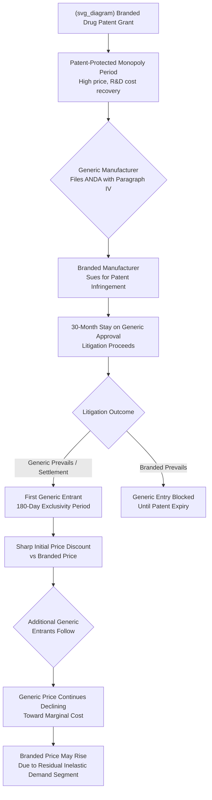

## Pharmaceutical Patents and Generic Entry

### Definition and Conceptual Overview

The pharmaceutical industry is one of the most extensively studied applied IO case studies because it combines **patent-protected temporary monopoly**, an unusually well-documented and predictable **post-patent-expiry entry event** (generic entry), and a distinctive regulatory framework governing both entry timing and market conduct — the U.S. **Hatch-Waxman Act** framework (formally the Drug Price Competition and Patent Term Restoration Act of 1984) being the paradigmatic regulatory structure, widely studied and partially emulated internationally. This combination allows economists to observe an unusually clean natural experiment: a near-monopoly market structure transitioning, often within months, to a market with multiple generic entrants selling a chemically identical (bioequivalent) product — providing rich data for testing oligopoly entry theory, price discrimination, and strategic patent/regulatory-gaming behavior.

The central economic tension in this market is the classic **dynamic efficiency vs. static efficiency trade-off**: patent protection creates temporary monopoly pricing (static inefficiency, since price exceeds the near-zero marginal cost of manufacturing an already-developed drug) in order to incentivize the substantial up-front R&D investment required to discover and clinically validate a new drug (dynamic efficiency, generating future innovation that would not otherwise occur). Understanding generic entry dynamics is central to calibrating how well this trade-off is actually being managed in practice.

---

### The Hatch-Waxman Regulatory Framework

**Key Points**

- **Abbreviated New Drug Application (ANDA) pathway**: Hatch-Waxman created a streamlined regulatory approval pathway allowing generic manufacturers to gain FDA approval by demonstrating **bioequivalence** to the already-approved branded reference drug, without needing to independently replicate the full clinical trial program the original branded manufacturer conducted — dramatically reducing the fixed cost and time required for generic market entry relative to what full independent approval would require.
- **Patent term restoration**: In exchange for facilitating generic entry, the Act also provided **patent term restoration** for branded manufacturers, extending patent protection to partially compensate for the substantial portion of the original patent term typically consumed by the lengthy clinical trial and regulatory review process before a drug can even be marketed.
- **Paragraph IV certification and the 180-day exclusivity incentive**: A generic applicant can file an ANDA with a **Paragraph IV certification**, asserting that the relevant branded patents are either invalid or will not be infringed by the generic product — triggering an automatic **30-month stay** on FDA generic approval if the branded manufacturer sues for patent infringement (allowing litigation to proceed before market entry), while the **first generic filer** to successfully challenge the patent is awarded **180 days of generic market exclusivity** (during which no *other* generic competitor can enter), creating a substantial first-mover incentive for generic manufacturers to challenge weak or narrow branded patents.
- **Orange Book patent listing**: Branded manufacturers must list relevant patents in the FDA's "Orange Book" (Approved Drug Products with Therapeutic Equivalence Evaluations), which generic applicants must address (via certification) when filing an ANDA — creating a formal, publicly documented patent-notice mechanism central to the litigation and exclusivity dynamics described above.

---

### The Generic Entry Price and Competition Dynamic

**Key Points**

- **Sharp price decline upon entry**: A robustly documented empirical pattern (Caves, Whinston, and Hurwitz, 1991, being a foundational early study, with extensive subsequent replication and FDA/FTC follow-up studies) is that generic prices typically enter at a **substantial discount** to the pre-expiry branded price, with the discount deepening further and branded-drug volume share collapsing sharply as the **number of generic competitors** entering a given molecule increases.
- **The "generic competition paradox"**: A well-known and counterintuitive empirical finding is that, following generic entry, the **branded drug's own price frequently does not fall** to match generic prices — and in some documented cases, the branded price actually **rises** post-generic-entry. This is explained by demand segmentation: a subset of prescribers/patients (partly due to brand loyalty, insurance formulary structure, or physician prescribing habits) remains relatively price-insensitive and willing to pay the branded price, while the price-sensitive segment shifts entirely to lower-priced generics; the branded manufacturer, facing a now more inelastic *residual* demand curve among the loyal segment, can find it profit-maximizing to raise price on that shrinking but low-elasticity remaining customer base rather than compete directly on price with generics for the large, price-sensitive segment it has effectively ceded. [Inference: while this segmentation-based explanation is the standard and well-supported interpretation in the literature, the precise degree of price divergence and its underlying causes can vary across specific drug classes and market/insurance contexts.]
- **Number of entrants and price convergence to marginal cost**: Multiple empirical studies find that generic prices continue to decline as additional generic competitors enter the same molecule, with price approaching a level much closer to the assumed low marginal cost of generic manufacturing typically only after several (commonly cited as roughly 4 or more, though this varies by study) competing generic manufacturers have entered — a finding relevant to broader oligopoly theory about how many competitors are needed to approximate competitive pricing outcomes. [Inference: the specific number of entrants associated with substantial price convergence varies across studies and drug classes and should be treated as an illustrative empirical regularity rather than a precise universal threshold.]

---

### Illustrative Diagram: Generic Entry Timeline and Price Dynamics

---

### Strategic Patent and Regulatory Behavior by Branded Manufacturers

**Key Points**

- **Patent thickets and "evergreening"**: Branded manufacturers frequently pursue strategies to extend effective market exclusivity beyond the original core patent's expiry — filing additional patents on secondary attributes of the drug (specific formulations, delivery mechanisms, dosing regimens, combination products) creating a **patent thicket** that generic entrants must separately clear, a practice critics term "**evergreening**" and that has drawn sustained antitrust and policy scrutiny regarding whether such secondary patents reflect genuine incremental innovation or primarily strategic delay of competition.
- **"Pay-for-delay" (reverse payment) settlements**: A particularly contentious practice involves branded manufacturers settling Paragraph IV patent litigation with generic challengers via a payment *from* the branded firm *to* the generic firm, in exchange for the generic firm agreeing to delay market entry — an arrangement that appears economically anomalous (the party being sued paying the plaintiff) but that can be jointly profitable for both firms at direct expense to consumers, since the branded firm's monopoly-profit preservation can exceed the generic firm's expected profit from immediate entry and litigation risk, allowing a mutually beneficial (to the two firms) delay agreement. This was addressed by the U.S. Supreme Court in **FTC v. Actavis (2013)**, which held that such reverse-payment settlements are **not automatically immune from antitrust scrutiny** and should instead be evaluated under a **rule-of-reason** analysis, rejecting both the position that such settlements are per se legal (as long as within the patent's nominal scope) and the position that they are per se illegal.
- **Product hopping / brand switching**: Branded manufacturers have also employed strategies of shifting marketing and physician-prescribing emphasis toward a reformulated, newly-patented version of a drug shortly before the original version's patent expiry (e.g., switching from a twice-daily to once-daily formulation), aiming to shift prescriber and patient habit toward the new, still-protected formulation before generic versions of the *original* formulation become available and automatically substitutable at the pharmacy level — a practice that has drawn antitrust scrutiny in specific cases (e.g., *New York v. Actavis*, 2015, involving the Alzheimer's drug Namenda) under monopolization theories concerning anticompetitive product redesign.
- **Authorized generics**: Branded manufacturers sometimes launch their own **"authorized generic"** — a generic version of their own drug, chemically identical, marketed (often through a subsidiary or licensing arrangement) at generic-level pricing — timed to compete directly with the first Paragraph IV filer's 180-day exclusivity period, since authorized generics are not blocked by the exclusivity provision (they are not a "generic applicant" under the relevant statutory definition), a strategy that reduces the value of first-filer exclusivity to independent generic challengers and has been the subject of ongoing debate about its net effect on overall generic-entry incentives.

---

### The Killer Acquisition Connection

This case study directly connects to the killer-acquisitions literature discussed elsewhere in this material: Cunningham, Ederer, and Ma's (2021) foundational empirical study of killer acquisitions was conducted specifically in the pharmaceutical context, examining whether **acquisitions of early-stage drug development projects** by incumbents holding overlapping therapeutic-category products are disproportionately followed by project discontinuation — a related but analytically distinct concern from the generic-entry-delay strategies discussed above, since killer acquisitions concern *pre-market* competitive elimination (preventing a potential future competing drug from ever reaching market) rather than *post-patent* entry-delay strategies (delaying generic competition to an *already-marketed* drug).

---

### Empirical Evidence Summary

**Key Points**

- **FTC generic drug entry and pricing studies**: The U.S. FTC has conducted extensive periodic studies (dating to the *Generic Drug Entry Prior to Patent Expiration* report series beginning in the 2000s) quantifying reverse-payment settlement prevalence and estimated consumer cost, generally finding that reverse-payment settlements delay generic entry by a measurable period relative to litigated or non-payment settlement outcomes, and that this delay imposes substantial estimated aggregate consumer cost. [Inference: specific quantitative estimates of aggregate consumer cost from these studies are time-period- and methodology-specific; current FTC publications should be consulted for the most recent figures given both the ongoing nature of this research area and legal/regulatory changes since *Actavis*.]
- **Generic price decline magnitude**: Multiple large-sample studies of FDA drug-approval and IMS Health/pricing-database data consistently confirm the qualitative pattern of substantial (frequently cited as reaching a large majority price discount relative to branded price) generic price decline as the number of competing generic manufacturers increases, though the precise discount magnitude at any given number of entrants varies by drug class, therapeutic area, and time period studied. [Inference: readers seeking a specific current numerical benchmark should consult recent FDA or academic generic-competition studies rather than relying on a single historical figure, given that market dynamics, PBM/insurance formulary structures, and generic manufacturing competitive intensity have evolved considerably since the earliest studies in this literature.]
- **Patent thicket and evergreening prevalence studies**: Academic and policy-research studies analyzing Orange Book patent-listing patterns document a general trend toward an increasing number of listed patents per branded drug over time, consistent with the evergreening concern, though distinguishing genuinely valuable incremental-innovation patents from purely strategic exclusivity-extension patents in aggregate statistical data remains a methodologically difficult empirical task. [Speculation: the extent to which recent policy and litigation developments (including heightened FTC scrutiny of Orange Book patent-listing practices in the 2020s) have measurably altered branded-manufacturer patent-filing behavior is an evolving empirical question rather than a settled finding, given the relatively recent nature of intensified enforcement attention in this specific area.]

---

### Policy and Regulatory Responses

**Key Points**

- **Post-*Actavis* rule-of-reason enforcement**: Following the Supreme Court's 2013 ruling, the FTC and private plaintiffs have continued to litigate reverse-payment settlement cases under the rule-of-reason framework, with case outcomes turning substantially on the size and structure of the payment and the strength of the underlying patent claim being settled — an evolving body of post-*Actavis* case law rather than a single bright-line rule.
- **Orange Book patent-listing scrutiny**: More recent FTC enforcement initiatives (particularly active in the 2020s) have directly challenged the propriety of specific branded-manufacturer Orange Book patent listings (e.g., for drug-device combination products such as inhalers and injector pens) as improperly listed and potentially anticompetitive, representing a more recent and actively evolving enforcement frontier distinct from the older reverse-payment settlement focus. [Inference: given the active and recent nature of this enforcement direction, its ultimate legal and practical impact should be assessed against current FTC and court records rather than treated as settled.]
- **Biosimilar pathway (BPCIA)**: For biologic drugs (large-molecule products not amenable to simple chemical bioequivalence demonstration), a parallel but structurally distinct regulatory pathway — the Biologics Price Competition and Innovation Act (BPCIA, 2010) — governs "biosimilar" entry, generally requiring more extensive (though still abbreviated relative to full original approval) clinical demonstration of similarity, and has generated a distinct, generally slower and less price-competitive entry dynamic than small-molecule generic entry, an active and evolving area of both regulatory policy and applied IO research. [Speculation: whether biosimilar competition dynamics will converge toward small-molecule-generic-like price competition intensity over time as the biosimilar market matures, or will remain structurally distinct due to inherent manufacturing complexity and prescriber substitution caution, remains an open empirical question given the biosimilar market's relative recency.]

---

### Critiques and Open Questions

**Key Points**

- **Innovation incentive trade-off measurement difficulty**: A persistent challenge in evaluating pharmaceutical patent and generic-entry policy is credibly estimating the **dynamic cost** of any given entry-delay-reducing reform — i.e., how much future drug innovation would be foregone if branded exclusivity periods or evergreening opportunities were more aggressively curtailed — since this requires estimating a counterfactual R&D investment response that is inherently difficult to identify empirically with precision, meaning policy debates in this area frequently involve genuine, not merely rhetorical, uncertainty about the correct static-dynamic efficiency balance.
- **Distinguishing genuine incremental innovation from strategic patenting**: As with evergreening more broadly, cleanly distinguishing secondary patents reflecting genuine clinically-valuable improvement (e.g., a reformulation that meaningfully improves patient adherence or reduces side effects) from primarily strategic exclusivity-extension patents requires clinical and legal judgment that resists simple categorical or purely statistical classification, complicating both private litigation and public enforcement in this area.
- **International comparative divergence**: Patent and generic-entry regulatory frameworks vary substantially across countries (with different patent-term, data-exclusivity, and generic-approval-pathway rules), generating international drug-pricing and access divergence that intersects with broader comparative competition-policy and international-trade (TRIPS/WTO intellectual-property) considerations beyond the scope of the purely domestic U.S. Hatch-Waxman framework detailed above.

---

**Related Topics**

- Killer acquisitions and nascent competitor theories of harm
- Predatory pricing doctrine and the recoupment requirement
- Consumer biases and exploitation of shrouded attributes (formulary and insurance-driven demand segmentation)
- Cross-country comparisons of competition policy regimes
- Patent law, innovation incentives, and dynamic efficiency trade-offs
- Reverse-payment ("pay-for-delay") settlements and *FTC v. Actavis*
- Biosimilar competition and the BPCIA regulatory pathway
- Second-degree price discrimination and market segmentation strategies