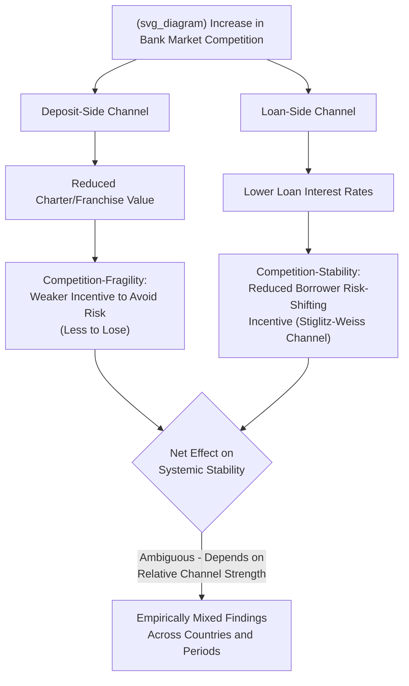

## Banking and Financial Services Market Structure

### Definition and Conceptual Overview

Banking and financial services constitute a distinctive applied IO case study because the industry combines standard oligopoly/market-structure questions with **pervasive prudential regulation** (capital requirements, deposit insurance, entry/branch licensing) whose *primary* rationale is systemic financial stability rather than competition policy — creating a persistent, well-documented tension between **competition objectives** (lower prices, more consumer choice, greater efficiency) and **stability objectives** (avoiding bank runs, contagion, and systemic crises). This "competition-stability trade-off" is the organizing theoretical tension running through most applied IO analysis of banking market structure, and it has no close analog in most other regulated industries studied in this material.

Banking also exhibits several IO features requiring specialized theoretical treatment: **two-sided/multi-product structure** (banks simultaneously price deposits, loans, and fee-based services, with cross-subsidization common across these products), **switching costs and relationship banking** (informationally opaque, relationship-specific lending), **network effects** (payment systems, ATM networks), and, increasingly, **platform competition dynamics** as fintech and digital-payment entrants challenge traditional bank market structure.

---

### The Competition-Stability Trade-Off

**Key Points**

- **"Charter value" hypothesis**: A foundational theoretical argument (associated with Keeley, 1990, and the subsequent franchise-value literature) holds that **greater bank market power supports financial stability** — a bank earning supra-competitive profits from market power possesses a valuable ongoing "charter value" (the present value of future rents), which it has a strong incentive to protect by avoiding excessively risky lending or investment behavior that could jeopardize its charter through insolvency. Conversely, intensified competition erodes charter value, potentially inducing **excessive risk-taking** ("competition-fragility" hypothesis) as banks with little franchise value left to protect have weaker incentives to avoid risky bets that could restore profitability (a moral-hazard mechanism closely related to the classical risk-shifting problem in corporate finance, amplified in banking by deposit insurance's removal of depositor market discipline).
- **"Competition-stability" counter-hypothesis**: An opposing theoretical strand (e.g., Boyd and De Nicolò, 2005) argues that market power in *lending* markets, even if it supports charter value on the deposit/franchise side, can simultaneously **increase borrower risk-taking** — a monopolistic or oligopolistic bank charges higher loan interest rates, which (via a standard adverse-selection and moral-hazard mechanism on the borrower side, following Stiglitz-Weiss-style credit-market theory) induces borrowers to undertake riskier projects to service the higher debt burden, potentially increasing rather than decreasing aggregate loan-portfolio risk and systemic fragility.
- **Reconciling the theoretical ambiguity**: Because these two mechanisms operate through different channels (deposit-side charter-value incentives vs. loan-side borrower risk-shifting) and can point in opposite directions, the net theoretical prediction for how bank market concentration affects financial stability is **genuinely ambiguous**, and the empirical literature testing this relationship has produced correspondingly mixed findings across different countries, time periods, and banking-system structures. [Inference: this genuine theoretical and empirical ambiguity is a well-established feature of the banking IO literature rather than a gap to be resolved by any single study; readers should not expect a settled consensus answer on the net direction of the competition-stability relationship.]

---

### Measuring Bank Market Power

**Key Points**

- **Structural approach (concentration measures)**: Traditional structure-conduct-performance (SCP) methodology applies standard concentration indices (HHI, $k$-firm concentration ratios) to local or national deposit/loan markets, historically a primary tool in U.S. bank merger review given the industry's historically localized, geographically-defined competitive markets (particularly prior to interstate branching deregulation).
- **Non-structural / conduct-based approaches**: Given well-documented concerns that simple concentration measures may not accurately capture actual competitive conduct in banking (contestability from geographically distant competitors, multi-market contact effects, product differentiation), the literature has developed several non-structural competition measures:
  - **Panzar-Rosse H-statistic**: Measures the sum of input-price elasticities of a bank's total revenue — under perfect competition, an increase in all input prices proportionally raises marginal cost and, in long-run equilibrium, revenue rises one-for-one ($H = 1$); under monopoly, revenue may fall or rise less than proportionally as marginal cost increases shift the profit-maximizing quantity down the demand curve ($H \leq 0$); intermediate values indicate monopolistic competition. This has become one of the most widely applied cross-country bank-competition measurement tools in the empirical banking IO literature.
  - **Lerner index**: The standard price-cost margin measure $(P - MC)/P$ applied at the individual bank level using estimated marginal cost from a translog cost function, allowing bank-level and time-varying competition measurement rather than the market-level snapshot the structural approach provides.
  - **Boone indicator**: Measures competition intensity via the elasticity of profits with respect to marginal cost — under more intense competition, less efficient (higher marginal cost) banks should be punished more severely with lower profits/market share, so a **more negative** Boone indicator coefficient indicates more intense competition, an approach designed to be more robust to certain conceptual criticisms of the H-statistic and Lerner index in specific applications.

---

### Illustrative Diagram: Competition-Stability Trade-Off Mechanisms

---

### Geographic Market Definition and Deregulation History

**Key Points**

- **Historical local market definition**: U.S. banking markets were, for much of the 20th century, legally constrained to be highly localized — restrictions on interstate and, in many states, even intrastate branching (McFadden Act 1927 and subsequent state-level unit-banking laws) meant that local deposit and small-business-loan markets were effectively defined at the Metropolitan Statistical Area (MSA) or even county level for merger-review purposes, a geographic market definition still substantially reflected in contemporary Federal Reserve/DOJ bank merger screening guidelines for retail deposit competition specifically.
- **Riegle-Neal Interstate Banking and Branching Efficiency Act (1994)**: Removed most remaining federal restrictions on interstate bank branching, triggering a substantial wave of interstate bank consolidation through the late 1990s and 2000s and generating a rich natural-experiment literature studying the competitive and efficiency effects of geographic deregulation, generally finding that interstate deregulation was associated with improved bank efficiency and, in many studies, positive effects on local economic growth, attributed to increased competitive discipline and improved capital allocation following deregulation. [Inference: specific quantitative effect-size estimates from this deregulation literature vary by study, time period, and outcome measure examined; readers should consult the specific primary studies for precise figures rather than a single generalized estimate.]
- **Persistent local-market relevance despite deregulation**: Despite interstate branching deregulation and the growth of internet/mobile banking, empirical studies continue to find that **retail deposit and small-business lending markets remain meaningfully local** in practice — households and small businesses continue to exhibit strong preferences for geographically proximate bank branches, meaning traditional local-market concentration analysis retains practical relevance for retail banking merger review even in the contemporary digital-banking era, though this local-market persistence is arguably weakening over time as digital banking adoption increases. [Speculation: the pace and ultimate extent to which continued fintech and digital-banking adoption will erode the traditional local-market-relevance finding is an evolving empirical question rather than a settled matter, given the relatively rapid recent pace of digital banking adoption.]

---

### Too-Big-to-Fail and Systemic Risk Considerations in Merger Review

**Key Points**

- **Distinctive systemic-risk merger criterion**: Beyond standard competitive-effects analysis (concentration, unilateral/coordinated effects), U.S. bank merger review under the Bank Merger Act and Bank Holding Company Act requires the reviewing banking regulators (Federal Reserve, OCC, FDIC) to separately assess the merger's effect on **financial stability and systemic risk** — a criterion with no direct analog in standard DOJ/FTC merger review of non-financial industries, reflecting the distinctive stability rationale underlying banking regulation discussed above.
- **"Too big to fail" (TBTF) subsidy debate**: A substantial empirical and policy literature examines whether the largest, most systemically important banks benefit from an implicit government-guarantee subsidy — lower funding costs reflecting creditor expectations that the government would intervene to prevent a systemically important bank's disorderly failure — which, if present, would represent a *cost-side* competitive advantage for large banks distinct from and potentially masking genuine market-power-driven pricing advantages, complicating standard IO market-power measurement in this specific context. [Inference: empirical estimates of the magnitude of any TBTF implicit subsidy vary substantially across studies, time periods (particularly pre- versus post-2008 financial crisis and subsequent regulatory reform), and methodology, and remain a genuinely debated empirical question rather than a single settled figure.]
- **Dodd-Frank and post-crisis regulatory reform**: The Dodd-Frank Wall Street Reform and Consumer Protection Act (2010) introduced enhanced prudential regulation, resolution-planning ("living will") requirements, and stress-testing specifically for systemically important financial institutions, partly aimed at reducing both the TBTF subsidy and the systemic-risk externality that very large, interconnected bank size can generate — representing a regulatory response operating alongside, rather than through, traditional competition-policy merger-review tools.

---

### Fintech Entry and Platform Competition Dynamics

**Key Points**

- **Unbundling of traditional bank services**: Fintech entrants have increasingly targeted specific, previously bundled banking services individually — payments (digital wallets, peer-to-peer payment apps), consumer lending (online/marketplace lenders using alternative underwriting data), and wealth management (robo-advisors) — generating a competitive dynamic of **product unbundling** that challenges the traditional full-service bank's cross-subsidization model (where, for instance, low-fee checking accounts have historically been cross-subsidized by more profitable lending or overdraft-fee revenue), connecting directly to the shrouded-attributes and behavioral-pricing literature discussed elsewhere in this material (e.g., overdraft fee exploitation of present-biased consumers).
- **Open banking and data portability regulation**: Regulatory initiatives (most prominently the EU's PSD2 — Payment Services Directive 2 — and analogous "open banking"/consumer-data-right frameworks emerging in other jurisdictions) mandate that banks provide secure, standardized data-sharing access (with customer consent) to third-party fintech providers, directly targeting a specific data-based switching-cost/lock-in barrier to entry that might otherwise favor incumbent banks holding proprietary transaction-history data — an explicit regulatory intervention designed to lower entry barriers and increase contestability in retail banking and payments markets. [Inference: the specific scope, implementation timeline, and practical competitive effect of open-banking regulations vary by jurisdiction and continue to evolve; current details should be verified against up-to-date regulatory sources given the active ongoing rollout of these frameworks in multiple jurisdictions.]
- **Big Tech entry into financial services**: Large technology platforms' expansion into payments and, in some cases, lending (leveraging existing large user bases, data assets, and network effects from their core platform businesses) raises novel market-structure questions bridging the digital-platform competition-policy literature (discussed in the digital markets chapter material) with traditional banking IO — including concerns about whether such entrants might eventually achieve gatekeeper-like positions in payment infrastructure specifically, an area of active and evolving regulatory attention in multiple jurisdictions. [Speculation: the long-run competitive structure of the intersection between Big Tech platforms and traditional financial services remains genuinely uncertain and is an active area of ongoing regulatory and academic assessment rather than a settled matter.]

---

### Empirical Evidence

**Key Points**

- **Cross-country H-statistic and Lerner index studies**: Large cross-country panel studies applying the Panzar-Rosse and Lerner-index methodologies generally find substantial variation in banking-sector competition intensity across countries and over time, with findings on the relationship between measured competition and various stability/efficiency outcomes remaining mixed and sensitive to the specific measure and country sample used, consistent with the theoretical ambiguity discussed above. [Inference: specific comparative competition rankings across countries are time-period- and methodology-specific and should be verified against current comparative banking-sector studies rather than assumed to be stable over time.]
- **Bank merger and small-business lending studies**: A substantial applied literature specifically examines the effect of bank mergers and consolidation on small-business lending availability, given small businesses' particular reliance on **relationship lending** (informationally intensive, difficult to fully substitute via arm's-length credit-scoring-based lending), with mixed findings on whether merger-driven consolidation reduces small-business credit access — some studies finding merging banks' small-business lending share initially declines but is subsequently offset by expanded lending from other local banks and new entrants, while other studies find more persistent negative local credit-access effects, particularly in less competitive local markets. [Inference: this remains an actively studied and somewhat unsettled empirical question, with findings sensitive to the specific market, time period, and merger characteristics examined.]

---

### Policy Implications and Regulatory Trade-offs

**Key Points**

- **Merger review calibration under dual objectives**: Given the competition-stability trade-off's theoretical ambiguity, bank merger regulators face a genuinely more complex calibration problem than standard antitrust merger review — a merger that increases concentration (raising standard competition-policy concern) might simultaneously be justified on stability grounds (e.g., resolving a failing bank via acquisition, a scenario explicitly addressed via specific "failing firm" and financial-stability exceptions in bank merger law) or might raise stability concerns of its own (increasing systemic interconnectedness) independent of its competitive effects.
- **Deposit insurance design and competitive distortion**: Deposit insurance (removing depositor incentive to monitor bank risk-taking, a classical moral-hazard concern) interacts with market structure in that **more competitive deposit markets** may exacerbate risk-shifting incentives if competition erodes charter value (per the competition-fragility channel above) without a correspondingly strong market-discipline offset, since insured depositors have little incentive to discipline risky behavior regardless of the market's competitive structure — creating a policy design interaction between deposit-insurance calibration and competition-policy tolerance for concentration that is somewhat unique to this sector.
- **International regulatory coordination challenges**: Because large banks operate across multiple jurisdictions and systemic risk can transmit internationally (as demonstrated extensively in the 2008 global financial crisis), international regulatory coordination bodies (the Basel Committee on Banking Supervision, the Financial Stability Board) play a role in banking-sector regulatory harmonization not closely paralleled in most other industries' competition policy, adding a further layer of cross-border regulatory complexity beyond the standard comparative-competition-policy divergence discussed elsewhere in this material.

---

### Critiques and Open Questions

**Key Points**

- **Unresolved competition-stability net effect**: As emphasized above, the net empirical relationship between bank competition and financial stability remains genuinely unsettled in the literature, meaning policy guidance in this area continues to rely on case-specific judgment and a mix of both competition-promoting and stability-promoting regulatory tools rather than a single, theoretically-derived optimal-concentration benchmark.
- **Measurement validity debates**: Each of the standard non-structural competition measures (H-statistic, Lerner index, Boone indicator) has been subject to methodological critique regarding whether it cleanly isolates competitive conduct from confounding factors (differences in risk-taking, product mix, regulatory environment across the banks or countries being compared), meaning cross-study comparability of banking-competition estimates should be treated with some caution. [Speculation: whether a clearly superior, broadly-agreed-upon competition-measurement methodology will emerge to supersede this multiplicity of partially-conflicting approaches is not evident from the current state of the literature.]
- **Digital transformation's structural implications remain unsettled**: Given the relatively recent and rapidly evolving nature of fintech entry, open banking regulation, and Big Tech financial-services expansion, the longer-run implications for banking market structure, concentration, and the traditional competition-stability trade-off framework are not yet fully established empirically, representing an active frontier of ongoing applied IO research rather than a mature, settled body of findings.

---

**Related Topics**

- Structure-conduct-performance paradigm and concentration measurement
- Consumer biases and exploitation of shrouded attributes (overdraft and banking fees)
- Cross-country comparisons of competition policy regimes
- Digital Markets Act and platform gatekeeper regulation (fintech/Big Tech intersection)
- Systemic risk, too-big-to-fail, and post-crisis prudential regulation (Dodd-Frank, Basel III)
- Relationship lending and information asymmetry in credit markets
- Killer acquisitions and nascent competitor theories of harm (fintech acquisition context)
- Open banking, data portability, and PSD2 regulatory frameworks