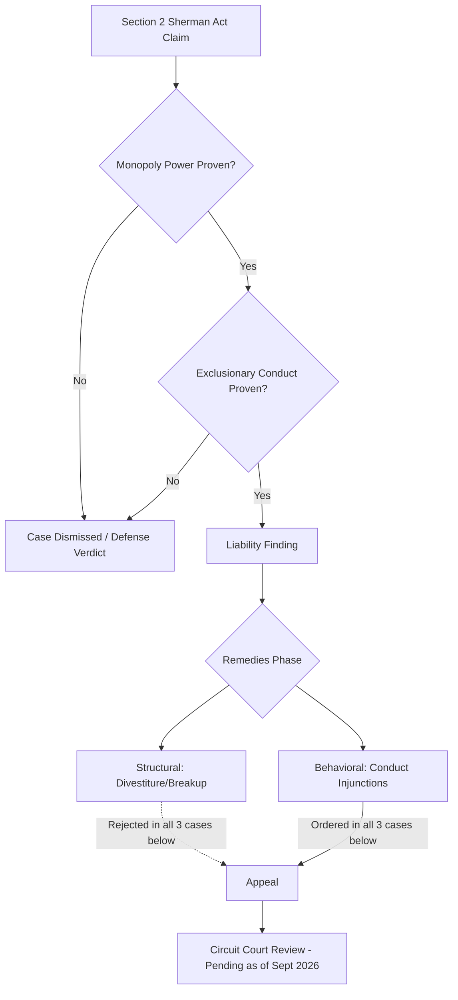

## Big Tech Monopolization Cases in Search, Mobile, and Social Platforms

### Overview and Analytical Framework

Industrial economics treats Big Tech antitrust litigation as an applied testing ground for monopolization theory under Section 2 of the Sherman Act (in the U.S.) and abuse-of-dominance doctrine (in the EU). These cases require courts to resolve three sequential economic questions: (1) market definition — what is the relevant product and geographic market, and does the defendant hold monopoly power in it; (2) conduct characterization — did the firm acquire or maintain that power through exclusionary conduct rather than "competition on the merits"; and (3) remedy design — what intervention restores competitive conditions without destroying legitimate efficiencies (the "consumer welfare" tension).

This chapter documents four landmark U.S. cases — Google Search, Google Ad Tech, Epic v. Google (Play Store), and FTC v. Meta — as a comparative case study in how courts operationalize monopolization theory differently across search, mobile app distribution, and social platform markets, and why remedy outcomes diverged sharply despite similar liability findings.

**Key Points**

- Three of the four cases (Google Search, Google Ad Tech, Epic v. Google) resulted in liability findings against the platform; the fourth (FTC v. Meta) resulted in a defense verdict.
- Even among the "losses," remedy severity varied enormously: structural breakup was ordered in none of the cases, despite the DOJ/FTC seeking divestiture in three of the four.
- All three losing cases are on appeal as of September 2026, meaning none of the remedies are final — a critical, often-overlooked feature of "monopolization" as a live economic-legal process rather than a settled precedent.

---

### The Theory of Monopolization: A Refresher

#### Section 2 Sherman Act Elements

Monopolization requires proof of two elements, established in *United States v. Grinnell Corp.* (1966):

1. **Possession of monopoly power** in the relevant market — typically evidenced by market share (courts generally treat 70%+ as strongly suggestive, though not dispositive) combined with barriers to entry.
2. **Willful acquisition or maintenance of that power** — as distinguished from growth or development "as a consequence of a superior product, business acumen, or historic accident."

The second element is where these cases diverge most sharply, because "exclusionary conduct" is inherently a line-drawing exercise between legitimate competitive strategy (winning distribution deals, building better products) and anticompetitive foreclosure (paying to lock out rivals, tying products to leverage dominance).

#### Structural vs. Behavioral Remedies

Once liability is found, courts choose along a spectrum:

- **Structural remedies**: forced divestiture (e.g., breaking off Chrome from Google, or AdX from Google's ad stack). These aim to permanently restructure market concentration.
- **Behavioral (conduct) remedies**: injunctions against specific practices — banning exclusive contracts, mandating data sharing, capping contract duration — while leaving corporate structure intact.

The pattern across all three losing cases below is the same: courts found liability but rejected structural remedies in favor of behavioral ones, a trend with significant implications for how "deterrence" functions in platform markets.

---

### Case Study 1: United States v. Google LLC (Search Monopolization)

#### Background and Market Definition

The DOJ and a coalition of state attorneys general sued Google in 2020, alleging illegal maintenance of monopoly power in two markets: general search services and general search text advertising. The core conduct at issue was Google's default placement agreements — most prominently the reported $20+ billion/year payment to Apple to be the default search engine in Safari, plus similar deals with Samsung and other Android OEMs and carriers.

#### Liability Finding

Judge Amit Mehta ruled in August 2024 that Google unlawfully maintained its search monopoly through default search agreements with Apple, Samsung, and other device makers, deals that cost Google more than $20 billion a year and blocked rivals from key distribution channels. The economic theory here is a **default-bias foreclosure** argument: because most users never change default settings, controlling the default is functionally equivalent to controlling the majority of query volume, and paying to lock up all major distribution channels prevents rivals from reaching minimum efficient scale — critical in a market with strong data-driven learning effects (more queries → better relevance ranking → more queries). [Search Engine Land](https://searchengineland.com/doj-states-appeal-google-search-antitrust-remedies-ruling-468230)

#### Remedies Phase

In its remedies decision, the court rejected the plaintiffs' proposals for structural relief but ruled that Google will be subject to several behavioral remedies. Specifically: [Congress.gov](https://www.congress.gov/crs-product/LSB11362)

- The remedies fall into three categories: first, prohibitory injunctions limiting the terms of Google's default contracts — shortening them to one year, preventing the tying of different Google services, and giving device makers more flexibility. [Tech Policy Press](https://www.techpolicy.press/search-remedies-in-google-antitrust-case-can-work-even-if-company-stays-on-top/)
- Second, Google must share its web search index and user-side data with Qualified Competitors (QCs). [Tech Policy Press](https://www.techpolicy.press/search-remedies-in-google-antitrust-case-can-work-even-if-company-stays-on-top/)
- Third, Google must offer syndication licenses so QCs can access Google's search results and text advertising feeds separately or as a bundle. [Tech Policy Press](https://www.techpolicy.press/search-remedies-in-google-antitrust-case-can-work-even-if-company-stays-on-top/)
- The court will bar Google from entering or maintaining any exclusive contract relating to distribution of Google Search, Chrome, Google Assistant, and the Gemini app. [Congress.gov](https://www.congress.gov/crs-product/LSB11362)

Notably, the judgment did not order Google to sell Chrome, break up Android, or stop all payments to Apple and other distribution partners. This rejection of structural relief is economically significant: critics argue that non-exclusive default payments will simply continue, since Google can continue to pay to be the default service on iPhones, carriers, OEMs, and browsers for both general search and AI services, and no other company will be able to outbid Google for this distribution. [Itechguides](https://www.itechguides.com/us-v-google-search-antitrust-trial-august-2026-updates/)[Tech Policy Press](https://www.techpolicy.press/search-remedies-in-google-antitrust-case-can-work-even-if-company-stays-on-top/)

**[Inference]** The persistence of default-payment economics even under a "no exclusivity" regime suggests the remedy addresses the *contractual form* of foreclosure (exclusivity) without addressing the *economic substance* (Google's willingness/ability to outbid any rival for scarce default-placement slots) — a distinction worth flagging as an unresolved theoretical gap in behavioral remedy design.

#### Current Status (as of September 2026)

The contractual restrictions took effect on February 3, 2026, but the data and syndication systems were still being built as of the latest public filings. The DOJ and a coalition of states filed notices of appeal, challenging Judge Mehta's remedies ruling as insufficient, while Google's own appeal argues the district court improperly treated ordinary competition for distribution as unlawful exclusion. Both appeals are headed to the D.C. Circuit Court of Appeals, with oral arguments potentially in late 2026 or early 2027. This is a live, unresolved case — no outcome should be treated as final. [Google Search Antitrust Case Update: Appeal and Remedies in 2026 +3](https://www.itechguides.com/us-v-google-search-antitrust-trial-august-2026-updates/)

**Example**

A simplified way to model the default-bias mechanism using a two-sided market intuition:

$$P(\text{query} \to \text{Google}) = \delta \cdot P(\text{default}) + (1-\delta) \cdot P(\text{active choice})$$

where $\delta$ represents the fraction of users who never override defaults (empirically estimated at well over 90% in mobile search contexts). If $\delta$ is high and Google secures the default slot on effectively all major distribution surfaces, then even a fully "non-exclusive" market for defaults still yields near-total query capture, because rivals cannot economically outbid Google's willingness to pay (which is itself inflated by its ad-monetization advantage) for the marginal default slot.

---

### Case Study 2: United States v. Google LLC (Ad Tech Monopolization)

#### Background and Market Definition

Filed by the DOJ and eight states in 2023, this case targeted a *different* layer of Google's stack: the ad-technology intermediation business — specifically the publisher ad server (DoubleClick for Publishers/DFP) and the ad exchange (AdX) that matches publisher inventory with advertiser demand programmatically.

#### Liability Finding

Federal judge Leonie M. Brinkema of the Eastern District of Virginia found in April 2025 that Google's conduct substantially harmed Google's publisher customers, the competitive process, and, ultimately, consumers of information on the open web. This finding held that Google unlawfully maintained monopolies in the publisher ad-server and ad-exchange markets and that it illegally tied its ad server and exchange together. [TechCrunch](https://techcrunch.com/2026/09/02/google-spared-from-ad-business-breakup-but-judge-orders-changes-to-how-it-operates/)[Computerworld](https://www.computerworld.com/article/4218844/judge-spares-googles-ad-tech-business-from-a-breakup.html)

The economic theory here is a **tying and vertical-integration foreclosure** claim: by requiring or heavily incentivizing publishers to use DFP (server) and AdX (exchange) together, Google could self-preference its own exchange in auctions run on its own server — a conflict-of-interest structure analogous to a stock exchange also running the largest brokerage on that exchange.

#### Remedies Phase

In September 2026, Judge Brinkema ruled that Google would be able to keep its advertising business rather than being forced to sell it. The DOJ had sought divestiture of AdX and open-sourcing (or divestiture) of the DFP auction logic; Brinkema rejected all three structural requests, instead accepting most of the parties' proposed behavioral remedies. [TechCrunch](https://techcrunch.com/2026/09/02/google-spared-from-ad-business-breakup-but-judge-orders-changes-to-how-it-operates/)[Computerworld](https://www.computerworld.com/article/4218844/judge-spares-googles-ad-tech-business-from-a-breakup.html)

Behavioral commitments reportedly include:

- Making real-time bid amounts for open-web display ads sold through AdX available to rival ad servers. [AdExchanger](https://www.adexchanger.com/antitrust/google-wont-have-to-break-up-its-ad-tech-business-judge-brinkema-rules/)
- Deprecating Unified Pricing Rules and allowing publishers to set different price floors for individual bidders in Google Ad Manager. [AdExchanger](https://www.adexchanger.com/antitrust/google-wont-have-to-break-up-its-ad-tech-business-judge-brinkema-rules/)
- Committing not to use "first look" and "last look" bidding privileges to adjust bids for open-web display ads. [AdExchanger](https://www.adexchanger.com/antitrust/google-wont-have-to-break-up-its-ad-tech-business-judge-brinkema-rules/)

Industry reaction was mixed: the News/Media Alliance called the ruling a positive step toward dismantling Google's dominance, while cautioning that without a forced sale of the ad exchange, more will be needed to undo over a decade of market concentration. Conversely, competing SSP operator PubMatic expressed cautious optimism that the behavioral remedies could establish a level playing field more quickly than protracted breakup litigation would have. [News/Media Alliance](https://www.newsmediaalliance.org/google-ad-tech-remedies-ruling/)[AdExchanger](https://www.adexchanger.com/antitrust/google-wont-have-to-break-up-its-ad-tech-business-judge-brinkema-rules/)

#### Current Status

Brinkema indicated during final arguments that Google would likely appeal, and the full memorandum opinion remains under seal pending redactions. As with the search case, this remains a pending, non-final outcome. [Courthouse News Service](https://www.courthousenews.com/google-dodges-antitrust-breakup-of-ad-tech-business/)

**Related note on parallel EU action:** Separately, the European Commission fined Google €2.95 billion in September 2025, concluding its own long-running probe into abusive self-preferencing practices in ad tech — illustrating that the same conduct can trigger independent, non-mutually-exclusive enforcement actions across jurisdictions (a recurring feature of Big Tech antitrust generally, since EU competition law's "abuse of dominance" standard under Article 102 TFEU does not require proof of anticompetitive intent in the same way U.S. Section 2 doctrine often does in practice). [jdsupra](https://www.jdsupra.com/topics/google/antitrust-violations/advertising)

---

### Case Study 3: Epic Games v. Google (Play Store / Mobile App Distribution)

#### Background and Market Definition

Unlike the DOJ actions above, this was a **private antitrust suit** brought by Epic Games (maker of Fortnite) in 2020, alleging that Google's control over Android app distribution and in-app billing constituted illegal monopolization. The relevant markets alleged were (a) Android app distribution and (b) Android in-app billing services — narrower than "smartphone OS" but broader than any single app category.

#### Liability Finding

A nine-person federal jury reached a unanimous verdict in December 2023 finding that Google's Android app store had been protected by anti-competitive barriers that damaged smartphone consumers and software developers. The jury found Google liable on all counts related to monopoly power in Android app distribution and in-app billing services — notably a jury verdict (this case, unlike the two Google DOJ cases, was tried before a jury rather than decided by a judge in a bench trial). [cbc](https://www.cbc.ca/lite/story/1.7056246)[Lawfold](https://lawfold.com/epic-lawsuit/)

The conduct found unlawful centered on structural barriers that discouraged competing app stores and sideloading, plus mandatory use of Google's own billing system (extracting a 15–30% commission on in-app transactions) — an economic story of **platform gatekeeping and tying** similar in structure to the ad-tech case but applied to the mobile distribution layer instead of the ad-exchange layer.

#### Appellate Confirmation

The Ninth Circuit Court of Appeals decided the case on July 31, 2025 (147 F.4th 917), later folded into In re Google Play Store Antitrust Litigation. The appellate panel affirmed the jury verdict that Google had violated federal and state antitrust laws in the markets for Android app distribution and Android in-app billing services. This was a unanimous Ninth Circuit ruling upholding the injunction and clearing the way for enforcement of a disruptive structural shakeup of Google's Play Store practices. [Epic Games v. Google +2](https://en.wikipedia.org/wiki/Epic_Games_v._Google)

#### Remedy and Implementation

Judge James Donato translated the jury verdict into a permanent injunction, which the Ninth Circuit upheld; a subsequent ruling on September 12, 2025 confirmed the changes to Android and Google Play would proceed. Commentators characterized the outcome as ending the flat 30% Play Store commission structure. The parties ultimately reached an agreement on redesigned app-store practices in March 2026 — a negotiated implementation of the injunction rather than continued adversarial remedy litigation, which is a notably different resolution path than the two DOJ/Google cases above. [Epic v. Google: Play Store Opens, 30% Cut Dead [2026] +2](https://tech-insider.org/epic-google-play-store-changes-2026/)

**[Unverified]** The precise final terms of the March 2026 negotiated agreement (exact commission rates, sideloading mechanics, third-party billing integration requirements) were not fully detailed in available reporting as of this writing; readers should consult primary court filings or Google's official developer policy updates for authoritative current terms.

#### Comparative Note: Epic v. Apple

This case is frequently studied alongside the earlier *Epic Games v. Apple* litigation, which produced a meaningfully different result: Judge Yvonne Gonzalez Rogers ruled in September 2021 that Apple was not a monopolist under federal antitrust law, though Apple did violate California's Unfair Competition Law by preventing developers from telling users about cheaper payment options outside the App Store, and the Supreme Court declined further appeals in 2023, making the anti-steering injunction permanent. Apple then imposed a 27% commission on purchases made through those external payment links, which developers and regulators have characterized as a workaround that defeats the injunction's purpose. [Lawfold](https://lawfold.com/epic-lawsuit/)[Lawfold](https://lawfold.com/epic-lawsuit/)

**[Inference]** The divergent outcomes between Epic v. Google (jury trial, monopoly found, structural change) and Epic v. Apple (bench trial, no monopoly found, narrower state-law remedy) is frequently attributed by commentators to two factors: (1) trial format (jury vs. judge) and (2) market definition — Android's open-sideloading architecture made it easier to argue Google's *practical* foreclosure of alternative stores was inconsistent with its own "open platform" positioning, whereas iOS's architecturally closed design was treated by the court as a legitimate product design choice rather than an antitrust violation. This is an interpretive framing found in industry commentary, not a holding stated by either court.

---

### Case Study 4: FTC v. Meta Platforms (Instagram and WhatsApp Acquisitions)

#### Background and Market Definition

The FTC alleged that Meta's 2012 acquisition of Instagram and 2014 acquisition of WhatsApp were undertaken to neutralize emerging competitive threats rather than for legitimate business reasons, alleging this preserved Meta's dominance in a "personal social networking" (PSN) market. This is the paradigm case of **"kill zone" / nascent-competitor acquisition theory** — the claim that a dominant incumbent can entrench monopoly power not through exclusionary conduct against existing rivals, but by acquiring potential future rivals before they mature into competitive threats. [harvard](https://tagteam.harvard.edu/hub_feeds/3624/feed_items/12684876)

#### Procedural History

The FTC's original 2020 complaint was dismissed by Judge James Boasberg in June 2021 for failing to adequately plead that Facebook held monopoly power in the personal social networking market and for failing to offer supporting metrics. The FTC amended its complaint, survived a subsequent motion to dismiss, and the case proceeded to a six-week bench trial in 2025. [Substack](https://pacificnorthwestedge.substack.com/p/meta-antitrust-trial)

#### Liability Finding: Defense Verdict

On November 18, 2025, following the bench trial, Judge Boasberg found that the FTC had failed to prove Meta currently holds a monopoly in personal social networking, regardless of whether Meta may have held monopoly power at the time of the 2012 and 2014 acquisitions. This is the critical economic and legal distinction from the three cases above: **this was not a finding that the conduct was lawful at the time it occurred — it was a finding that market conditions had since changed such that no *current* monopoly exists to remedy.** [Sullivan & Cromwell](https://www.sullcrom.com/insights/memo/2025/December/Meta-Prevails-FTC-Monopolization-Case)

The reasoning centered on market definition and dynamic competition:

The court found ample evidence that Meta now competes with TikTok and YouTube, partly due to the evolution of Meta's own platforms toward algorithm-suggested video content rather than friend-based posts, and concluded that the FTC's proposed market definition — limited to Facebook, Instagram, Snapchat, and the minor platform MeWe — was unduly narrow. [Sullivan & Cromwell](https://www.sullcrom.com/insights/memo/2025/December/Meta-Prevails-FTC-Monopolization-Case)

Judge Boasberg wrote that "with apps surging and receding, chasing one craze and moving on from others, and adding new features with each passing year, the FTC has understandably struggled to fix the boundaries of Meta's product market." He held that even if Meta enjoyed monopoly power in the past, the agency must show it continues to hold such power now, and concluded the FTC had not done so. [Axios](https://www.axios.com/2025/11/18/meta-instagram-whatsapp-antitrust-ftc)[Axios](https://www.axios.com/2025/11/18/meta-instagram-whatsapp-antitrust-ftc)

#### Economic Significance

This outcome illustrates a structural limitation of the "current monopoly power" requirement when applied retrospectively to acquisitions made 10–13 years prior. Bill Kovacic, a George Washington University law professor and former FTC chairman, characterized the outcome as a decisive victory for Meta, noting it followed closely on the heels of the softer-than-expected remedy in the Google search case. [NPR](https://www.npr.org/2025/11/18/nx-s1-5495626/meta-ftc-instagram-whatsapp-antitrust-ruling)

**[Inference]** The Meta outcome creates an important asymmetry for merger-control policy: it suggests that even a successful *ex ante* theory of harm (acquiring a nascent competitor to eliminate future competition) may become functionally unenforceable *ex post* if market structure evolves — including as a *consequence of the very platform behaviors under scrutiny* (Meta's own competitive repositioning toward video) — by the time litigation concludes. This has informed subsequent policy arguments (from agencies including the FTC itself in merger guidelines commentary) for faster review timelines and lower intervention thresholds at the time of acquisition rather than relying on lengthy after-the-fact monopolization suits.

The FTC sought Meta's breakup of Facebook, Instagram, and WhatsApp into separate companies as its primary requested remedy; because liability was not established, no remedies phase occurred. [NPR](https://www.npr.org/2025/11/18/nx-s1-5495626/meta-ftc-instagram-whatsapp-antitrust-ruling)

---

### Comparative Synthesis Table

| Case | Market | Trial Type | Liability Outcome | Structural Remedy Ordered? | Behavioral Remedy Ordered? | Appeal Status (Sept 2026) |
| --- | --- | --- | --- | --- | --- | --- |
| US v. Google (Search) | General search / search ads | Bench (Judge Mehta) | Liable (Aug 2024) | No | Yes (contract limits, data-sharing, syndication) | Pending, D.C. Circuit |
| US v. Google (Ad Tech) | Publisher ad server / exchange | Bench (Judge Brinkema) | Liable (Apr 2025) | No | Yes (bid transparency, pricing rule changes) | Google appeal expected |
| Epic v. Google (Play Store) | Android app distribution / billing | Jury, affirmed on appeal | Liable (Dec 2023; affirmed Jul 2025) | Yes (de facto, via injunction + negotiated settlement) | Yes | Resolved via March 2026 settlement |
| FTC v. Meta | Personal social networking | Bench (Judge Boasberg) | Not liable (Nov 2025) | N/A | N/A | Case concluded at district level |

**Key Points**

- The mobile distribution case (Epic v. Google) is the *only* one of the four to produce a genuinely structural change to market architecture, and notably, it is also the only one litigated as a private jury trial rather than a government bench trial.
- Both DOJ cases against Google (search and ad tech) produced liability findings but remedies that critics on the enforcement side view as insufficient to restore competitive conditions, given that key economic levers (default-payment capacity, vertical integration incentives) remain largely intact.
- The Meta case demonstrates that "kill zone" acquisition theories face a demanding evidentiary bar when litigated years after the fact, because market definition is assessed at the time of trial, not the time of acquisition.

---

### Theoretical and Policy Implications for Industrial Economics

#### 1. The Behavioral-Remedy Credibility Problem

A recurring theme is that courts, having found monopoly power lawfully or unlawfully entrenched, are reluctant to impose structural remedies given uncertainty about downstream effects on innovation, consumer prices, and unintended market disruption. This reflects a broader institutional tendency in U.S. antitrust jurisprudence post-*Trinko* (2004) and *linkLine* (2009) to treat forced restructuring as an extreme remedy of last resort. The economic critique is that behavioral remedies require ongoing monitoring (e.g., the "Technical Committee" structure in the Google search case) and are vulnerable to gradual erosion or gaming — a concern raised explicitly by the DOJ regarding Google's compliance incentives.

#### 2. Market Definition as the Decisive Battleground

Across all four cases, the outcome hinged less on whether the underlying conduct was aggressive (all four defendants engaged in comparably aggressive competitive tactics) and more on how the relevant market was defined and whether monopoly power was proven *within that market, at the relevant time*. This is a core industrial-economics lesson: monopolization doctrine is not primarily a test of "is this company powerful and did it act aggressively" but a structured, market-boundary-dependent inquiry that can produce sharply different results based on seemingly technical definitional choices (e.g., "personal social networking" vs. "all attention-competing platforms including TikTok and YouTube").

#### 3. Two-Sided Market and Platform Economics

Three of the four cases (search, ad tech, app stores) involve genuinely two-sided or multi-sided platforms, where standard single-market monopoly analysis must be adapted to account for cross-side network effects (more searchers → more valuable to advertisers → more revenue to fund better search → more searchers) and the possibility that dominance on one side subsidizes competitive behavior on another. This is a well-established extension of monopolization analysis following *Ohio v. American Express* (2018), which required plaintiffs challenging two-sided platforms to demonstrate net anticompetitive effects across both sides of the market, not merely on the side where harm is most visible.

#### 4. Global Regulatory Fragmentation

The parallel EU ad-tech fine and various EU Digital Markets Act (DMA) obligations run concurrently with U.S. litigation, meaning global platforms face divergent, sometimes conflicting regulatory regimes for the same underlying conduct. This is a distinguishing feature of Big Tech antitrust relative to historical monopolization cases (e.g., *Standard Oil*, *AT&T*), which were single-jurisdiction matters.

---

### Diagram: Comparative Remedy Architecture (svg_diagram)

<svg xmlns="http://www.w3.org/2000/svg" viewBox="0 0 900 460" font-family="Arial, sans-serif">
<text x="450" y="30" text-anchor="middle" font-size="18" font-weight="bold" fill="#1a1a1a">Remedy Architecture Comparison (svg_diagram)</text>

<line x1="100" y1="400" x2="820" y2="400" stroke="#333" stroke-width="2" />
<line x1="100" y1="400" x2="100" y2="70" stroke="#333" stroke-width="2" />
<text x="460" y="440" text-anchor="middle" font-size="13" fill="#333">Remedy Intensity (Behavioral → Structural)</text>
<text x="40" y="235" text-anchor="middle" font-size="13" fill="#333" transform="rotate(-90 40 235)">Liability Confirmed?</text>

<text x="100" y="415" text-anchor="middle" font-size="11" fill="#555">Low</text>

<text x="820" y="415" text-anchor="middle" font-size="11" fill="#555">High</text>

<text x="90" y="90" text-anchor="end" font-size="11" fill="#555">Yes</text>

<text x="90" y="395" text-anchor="end" font-size="11" fill="#555">No</text>

<circle cx="280" cy="150" r="14" fill="#4a7fc9" />
<text x="280" y="130" text-anchor="middle" font-size="12" fill="#1a1a1a">Google Search</text>
<text x="280" y="180" text-anchor="middle" font-size="10" fill="#555">(behavioral only)</text>

<circle cx="330" cy="200" r="14" fill="#4a7fc9" />
<text x="380" y="200" text-anchor="middle" font-size="12" fill="#1a1a1a">Google Ad Tech</text>
<text x="380" y="220" text-anchor="middle" font-size="10" fill="#555">(behavioral only)</text>

<circle cx="680" cy="150" r="14" fill="#4a7fc9" />
<text x="680" y="130" text-anchor="middle" font-size="12" fill="#1a1a1a">Epic v. Google</text>
<text x="680" y="180" text-anchor="middle" font-size="10" fill="#555">(injunction + settlement)</text>

<circle cx="180" cy="370" r="14" fill="#c94a4a" />
<text x="180" y="350" text-anchor="middle" font-size="12" fill="#1a1a1a">FTC v. Meta</text>
<text x="180" y="395" text-anchor="middle" font-size="10" fill="#555">(no remedy — defense verdict)</text>

<circle cx="650" cy="380" r="8" fill="#4a7fc9" />
<text x="665" y="385" font-size="11" fill="#333">Liability found</text>
<circle cx="780" cy="380" r="8" fill="#c94a4a" />
<text x="795" y="385" font-size="11" fill="#333">No liability</text>
</svg>

---

### Extended Example: Estimating Deadweight Loss from Default-Placement Foreclosure

To connect this case law to standard industrial-economics tooling, consider a simplified partial-equilibrium illustration of the search-default foreclosure mechanism from Case Study 1.

Assume:

- Rival search engine's marginal cost of serving a query: $c_r$
- Incumbent's marginal cost: $c_i$, where $c_i < c_r$ due to superior data-driven relevance (a legitimate scale-based cost advantage)
- Distribution access price the incumbent is willing to pay for a default slot: $w_i$
- Distribution access price the rival is willing to pay: $w_r$

If $w_i > w_r$ purely because the incumbent internalizes greater downstream advertising revenue per query (not because of a genuine efficiency advantage in serving the query itself), then the resulting allocation is:

$$\text{Default awarded to incumbent} \iff w_i > w_r, \text{ regardless of } c_i \text{ vs. } c_r$$

This formalizes the core economic worry in the case: **distribution is allocated by monetization capacity rather than service quality**, which is precisely the foreclosure theory Judge Mehta's contract-duration and non-exclusivity remedies attempt to weaken (by making the default slot contestable more frequently) but do not eliminate (because $w_i > w_r$ can still hold at each renewal).

**[Speculation]** Whether shortening contracts to one-year terms meaningfully increases contestability, versus simply requiring rivals to out-bid Google annually rather than for multi-year terms, is an empirical question that will only be answerable once the remedy has been in force for several renewal cycles — a data point not yet available as of this writing.

---

### Related Topics / Next Steps

- **Merger control reform proposals**: Post-*FTC v. Meta*, examine current legislative and FTC/DOJ merger guideline proposals aimed at addressing "kill zone" acquisitions before they mature into unenforceable historical fact patterns.
- **EU Digital Markets Act (DMA) "gatekeeper" obligations**: Compare the EU's ex ante regulatory model (predetermined obligations for designated gatekeepers) against the U.S. ex post litigation model illustrated in this chapter.
- **Two-sided market theory and *Ohio v. American Express***: Deepen the analytical toolkit for evaluating platform conduct where harm on one side of the market may be offset by benefits on another.
- **Network effects and switching costs in default-driven markets**: Model how default bias interacts with data-driven quality improvement to entrench incumbents even absent formal exclusivity.
- **Case tracking**: Monitor D.C. Circuit oral arguments (expected late 2026/early 2027) on the Google Search remedies appeal, and any Ninth Circuit or Fourth Circuit developments on the Ad Tech case, as outcomes will materially revise the "current status" sections of this chapter.
- **Comparative case**: State of Texas, et al. v. Google (adtech, state AG parallel track) and its relationship to the DOJ ad-tech case discussed here.
- **Apple App Store enforcement trajectory**: Track ongoing compliance disputes over Apple's 27% external-link commission as a case study in remedy circumvention.