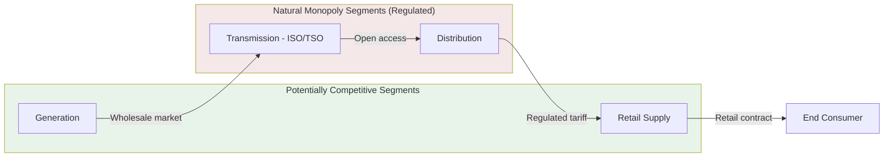
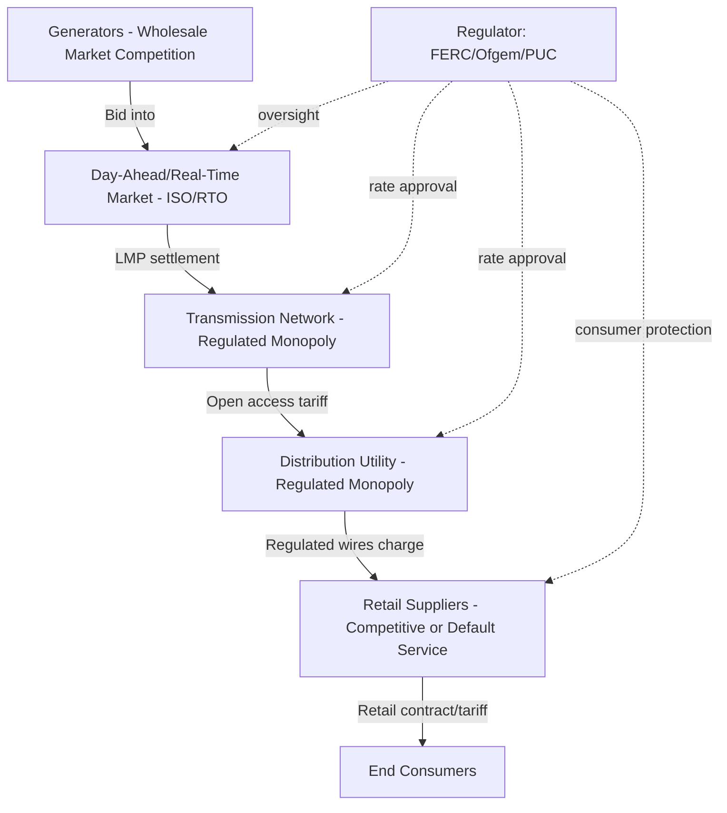

## Energy and Utilities Market Restructuring

### Overview and Scope

Energy and utilities market restructuring refers to the deliberate policy process of transforming vertically integrated, typically state-owned or regulated monopoly utilities into unbundled market structures where generation, transmission, distribution, and retail supply are separated and, where feasible, exposed to competition. This is a canonical application domain in industrial economics because electricity and natural gas exhibit natural monopoly characteristics in some segments (transmission and distribution wires/pipes) while other segments (generation, retail) can, under the right conditions, support workable competition.

The core industrial-organization problem is structural: how do you introduce competitive discipline into segments that can be competitive without losing the scale and coordination benefits — or reintroducing market power — in the segments that remain natural monopolies?

### Historical and Theoretical Motivation

**Key Points**

- Traditional utilities were organized as vertically integrated monopolies justified by natural monopoly theory: subadditive cost functions meant a single firm could serve a market at lower cost than multiple competing firms, particularly in transmission/distribution networks with high fixed costs and low marginal costs.
- Rate-of-return regulation (cost-of-service regulation) was the standard institutional response, guaranteeing utilities a regulated return on prudently invested capital in exchange for accepting price and entry controls.
- Restructuring emerged from three converging pressures beginning in the 1980s–1990s: (1) technological change (combined-cycle gas turbines lowered efficient generation scale, undermining the natural monopoly rationale for generation specifically), (2) theoretical critiques of rate-of-return regulation (the Averch-Johnson effect predicting overcapitalization, and broader public-choice concerns about regulatory capture), and (3) successful precedents in other network industries (airlines, telecoms, natural gas in the U.S. following FERC Order 436).

[Inference] The generation-specific erosion of scale economies via smaller efficient turbine sizes is the single most cited technical enabler of electricity restructuring in the literature, though restructuring outcomes also depended heavily on jurisdiction-specific political economy.

### The Unbundling Framework

Restructuring separates the vertically integrated utility into four functional segments:

1. **Generation (production)** — potentially competitive; multiple firms can generate electricity and compete to sell it.
2. **Transmission (high-voltage, long-distance)** — natural monopoly; typically remains regulated, often assigned to an Independent System Operator (ISO) or Transmission System Operator (TSO) for open, non-discriminatory access.
3. **Distribution (local delivery to end users)** — natural monopoly at the local level; remains a regulated franchise.
4. **Retail supply (billing, customer acquisition, risk management)** — potentially competitive in retail-choice jurisdictions; remains bundled with distribution in others.

The economic logic is that transmission and distribution are the "essential facilities" — bottleneck assets that any competitor must access to reach customers — while generation and retail are contestable if entry barriers are low and information is adequate.

### Market Design Elements

**Wholesale Electricity Markets**

Restructured electricity systems require substitute market institutions to replace centralized utility dispatch decisions:

- **Day-ahead and real-time markets**: Generators submit supply bids (price-quantity pairs); an ISO clears the market using security-constrained economic dispatch, typically producing a single system marginal price or **locational marginal prices (LMPs)** that reflect transmission congestion and losses.
- **Locational Marginal Pricing**: LMP at node $n$ decomposes as:

$$LMP_n = \lambda_{energy} + \lambda_{congestion,n} + \lambda_{losses,n}$$

where $\lambda_{energy}$ is the system-wide marginal energy cost, and the congestion and loss components are node-specific adjustments reflecting binding transmission constraints and marginal losses at that location.

- **Capacity markets**: Separate from energy markets, these compensate generators for being available (not just for energy produced), addressing the "missing money" problem — energy-only markets may not generate sufficient revenue to support efficient long-run investment because prices are capped below the true value of lost load during scarcity.
- **Ancillary services markets**: Frequency regulation, spinning reserve, and voltage support are procured separately since they are distinct products from energy.

**Key Points**

- The **missing money problem** [term of art in the literature] arises because price caps intended to mitigate market power during scarcity events also suppress the scarcity rents that would otherwise signal efficient entry.
- Resource adequacy mechanisms (capacity markets, capacity payments, strategic reserves) are the standard policy responses.

### Regulatory Instruments for the Natural Monopoly Segments

Since transmission and distribution remain regulated, restructuring did not eliminate rate regulation — it shifted its form:

| Instrument | Mechanism | Typical Use |
| --- | --- | --- |
| Rate-of-return regulation | Utility earns regulated return on rate base | Legacy/vertically integrated systems |
| Price cap regulation (RPI-X) | Allowed price grows with inflation minus efficiency factor $X$ | UK, many restructured distribution networks |
| Revenue cap regulation | Total allowed revenue fixed independent of volume sold | Common where demand-side management is a policy goal |
| Yardstick competition | Utility's allowed revenue benchmarked against peer utilities' costs | Used to mitigate information asymmetry when direct competition is infeasible |

Price cap regulation under RPI-X sets the allowed price path as:

$$P_{t+1} = P_t \times (1 + RPI_t - X)$$

where $X$ is an efficiency offset set by the regulator to pass productivity gains through to consumers, and this creates a powerful (Loeb-Magat/Vogelsang-Finsinger style) incentive for the utility to cut costs since it retains the gap between actual costs and the capped price during the regulatory period.

[Inference] The specific choice between price caps and revenue caps in a given jurisdiction is often driven by policy priorities around decoupling utility profit from sales volume (revenue caps better accommodate energy-efficiency goals) rather than by a general theoretical dominance of one instrument.

### Market Power and Mitigation

Restructured generation markets remain vulnerable to the exercise of market power, especially given inelastic short-run demand (retail prices are rarely real-time) and transmission constraints that can create localized market power even with many total generators.

- **The California electricity crisis (2000–2001)** is the canonical case study: poorly designed market rules (a wholesale spot market combined with retail price caps), inadequate long-term contracting, transmission constraints, and (as later established) strategic withholding and other exercises of market power by generators combined to produce extreme price spikes, rolling blackouts, and the insolvency of major utilities.
- **Market power indices**: The **Herfindahl-Hirschman Index (HHI)** is applied to generation ownership, but electricity markets require supplementary, market-specific indices because of transmission constraints and non-storability:
  - **Residual Supply Index (RSI)**: measures whether a given firm's capacity is "pivotal" — i.e., necessary to meet demand even after all other firms bid their full capacity.

$$RSI_i = \frac{\text{Total Supply} - \text{Capacity of Firm } i}{\text{Demand}}$$

An RSI below 1 for firm $i$ indicates that firm is pivotal (demand cannot be met without it), signaling structural market power regardless of the firm's overall market share.

- **Mitigation measures**: offer caps/bid caps, must-offer obligations, virtual bidding (financial-only participants that arbitrage day-ahead and real-time price divergence, improving convergence), and structural remedies (divestiture requirements imposed as a condition of merger approval or market entry).

### Retail Competition and Consumer Outcomes

**Key Points**

- Retail restructuring introduces competitive retail suppliers who purchase wholesale power and sell to end users, competing on price, green energy products, or service bundling, while the wires remain a regulated monopoly (distribution utility).
- Empirical results on retail choice are mixed and jurisdiction-dependent: switching rates are often low due to search costs and low salience of electricity as a differentiated product; some studies document adverse outcomes for residential switchers in variable-rate retail markets relative to the incumbent default (utility) rate. [Unverified] — findings vary substantially by state/country and time period, and outcomes are sensitive to specific consumer-protection rules in place.
- Default service/provider-of-last-resort mechanisms are standard complements to retail choice, protecting consumers who do not or cannot actively choose a supplier.

**Example**

Texas (ERCOT) operates one of the most fully retail-competitive markets in the U.S., with no default utility supplier for most residential customers outside municipal/cooperative territories; the February 2021 winter storm (Uri) exposed how wholesale scarcity pricing (prices rising to the $9,000/MWh offer cap) could pass through to consumers on wholesale-indexed retail plans, producing extreme, sometimes catastrophic individual bills — illustrating the risk-allocation design choices embedded in retail market structure.

### International Variation in Restructuring Models

Restructuring approaches diverge across jurisdictions based on political economy, resource endowments, and starting institutional structure:

- **United Kingdom**: An early and comprehensive restructuring (Electricity Act 1989) privatized and fully unbundled generation, transmission (National Grid), distribution, and supply, with an independent regulator (originally OFFER, now Ofgem) and full retail competition.
- **United States**: A federalist patchwork — restructuring is a state-level decision (FERC has jurisdiction over wholesale/interstate transmission but not retail retail structure), producing a mix of fully restructured states (Texas, much of the Northeast) and states retaining vertically integrated utilities (much of the Southeast).
- **European Union**: A sequence of Electricity Directives (starting 1996) mandated progressive market opening, unbundling (legal, then in some cases ownership unbundling of transmission operators), and cross-border market coupling to build an integrated internal energy market.
- **Developing economies**: Restructuring is often paired with privatization and is complicated by underinvestment in metering/infrastructure, subsidized tariffs with weak cost recovery, and capacity constraints — the World Bank's "standard model" of restructuring (unbundling, IPP entry, independent regulation) has had heterogeneous success. [Inference] Implementation gaps in developing-economy restructuring are frequently attributed less to flawed market design theory and more to weak regulatory institutional capacity and fiscal constraints on tariff reform.

### Renewable Integration and Restructuring Tensions

The rise of variable renewable energy (VRE — wind and solar) creates new tensions with restructured market designs built around dispatchable thermal generation:

- **Merit-order effect**: Since VRE has near-zero marginal cost, its addition to the supply stack shifts the market-clearing intersection leftward/downward along the demand curve, suppressing wholesale energy prices — this is well-documented empirically but simultaneously erodes the energy-market revenue available to all generators, intensifying the missing-money problem discussed above.
- **Cannibalization effect**: As VRE penetration rises, the correlation between a given renewable generator's output and periods of already-low prices increases (solar generators all produce simultaneously, pushing midday prices down precisely when solar output is highest), reducing the captured price relative to the average wholesale price. [Inference] This is a robust and increasingly emphasized finding in energy economics, though the magnitude is highly sensitive to penetration level and storage/flexibility availability.
- **Contracts for Difference (CfDs) and Feed-in Tariffs**: Many jurisdictions layer administratively-set, long-term contracts on top of the wholesale market specifically to provide bankable revenue certainty for capital-intensive renewable investment, effectively reintroducing a form of price regulation into ostensibly liberalized markets — a design tension actively debated in current energy-economics literature.

### Illustrative Diagram: Restructured Market Value Chain with Regulatory Touchpoints

### Assessing Restructuring Outcomes

**Key Points**

- Efficiency gains from restructuring are generally best documented in generation: increased utilization of efficient plants, more competitive entry, and productivity improvements in restructured wholesale markets relative to pre-restructuring baselines.
- Price outcomes for consumers are more ambiguous and highly sensitive to fuel price movements (particularly natural gas prices, which are the marginal fuel in many markets) and market design quality — attributing price changes to restructuring itself requires careful counterfactual analysis, and much of the empirical literature disagrees on magnitude.
- Reliability outcomes depend critically on resource adequacy mechanism design; jurisdictions with energy-only markets and inadequate scarcity pricing have faced documented reliability stress events (Texas 2021, parts of the Australian NEM during heatwave events).

**Conclusion**

Energy and utilities market restructuring is a paradigmatic industrial-organization case study in how theory-informed policy interventions — vertical unbundling, market design for previously-administered coordination functions, and reformed regulatory instruments for residual natural monopolies — interact with real-world constraints: political economy, sunk-cost stranded-asset transitions, market power in constrained networks, and, more recently, the physical characteristics of renewable generation. No single restructuring model has proven uniformly superior; outcomes are highly sensitive to implementation quality, starting market structure, and complementary policy design (particularly resource adequacy and consumer protection mechanisms).

**Related Topics**

- Natural monopoly theory and subadditive cost functions
- Rate-of-return regulation and the Averch-Johnson effect
- Locational marginal pricing and transmission congestion management
- Capacity markets and the missing money problem
- Market power measurement: HHI, RSI, and pivotal supplier analysis
- The California electricity crisis as a market design case study
- Renewable integration: merit-order and cannibalization effects
- Regulatory institutional design and independence (Ofgem, FERC, state PUCs)
- Contracts for Difference and hybrid market-regulation models
- Stranded cost recovery in transition from vertical integration to restructured markets