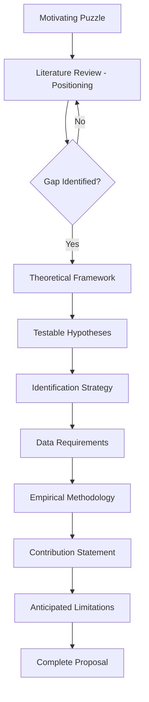
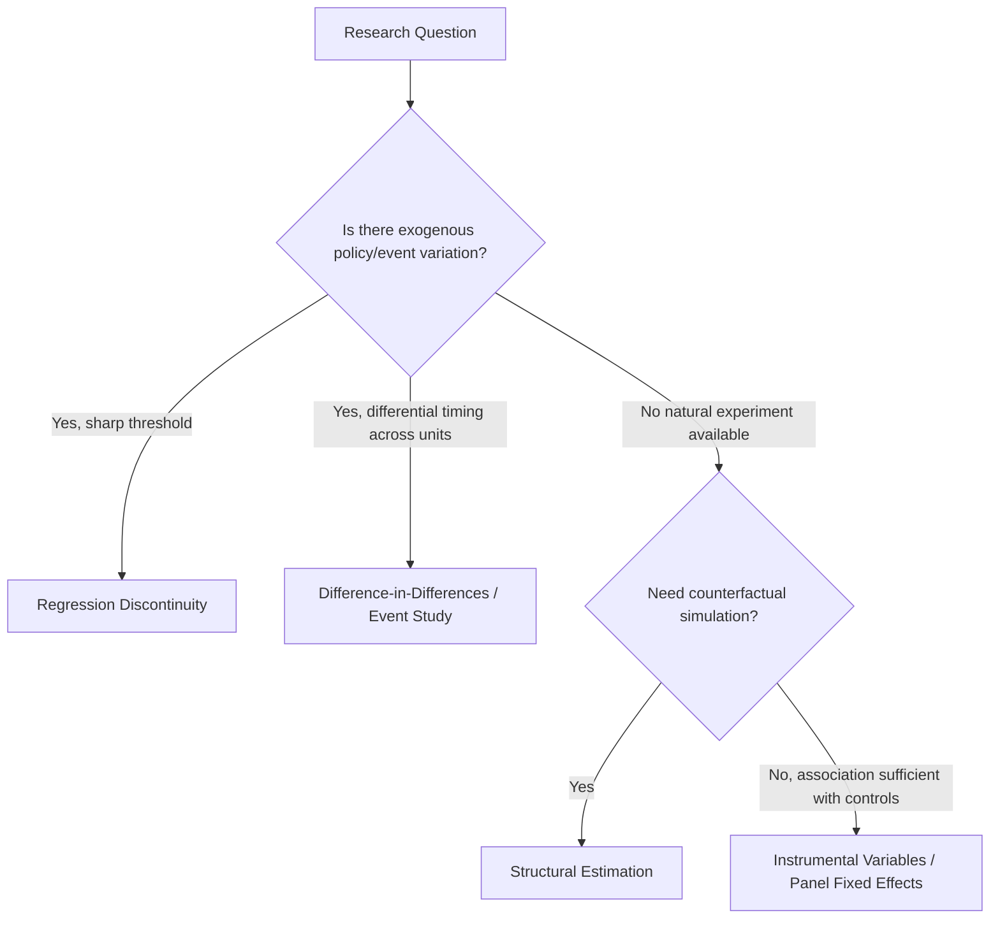

## Synthesizing Theory and Evidence into an Original Research Proposal

### Purpose and Positioning

This capstone topic addresses the methodological synthesis problem: how to move from consuming industrial-organization theory and empirical literature to producing an original, defensible research proposal. Unlike topic-specific chapters (market structure, regulation, restructuring case studies), this is a **meta-skill** — a structured procedure for identifying a researchable question, situating it in existing theory and evidence, and designing a study capable of generating new knowledge.

### The Structure of a Research Proposal

A rigorous industrial-economics research proposal typically contains the following components, in a logically (not necessarily narratively) dependent order:

| Component | Function |
| --- | --- |
| Motivating puzzle/question | Establishes why the question matters and is unresolved |
| Literature positioning | Shows what is known, what is contested, what is missing |
| Theoretical framework | Specifies the mechanism(s) under study and generates testable predictions |
| Hypotheses | Precise, falsifiable statements derived from the framework |
| Data and identification strategy | Specifies what evidence would support or refute the hypotheses, and how confounds are addressed |
| Empirical/analytical methodology | The concrete estimation or modeling approach |
| Contribution statement | What is new relative to existing work |
| Anticipated limitations | Pre-empts the most likely critiques |

### Step 1: Identifying a Researchable Puzzle

**Key Points**

- A researchable puzzle is not simply "an interesting topic" — it is a specific, unresolved tension between theoretical prediction and observed evidence, or between competing theoretical predictions, or an underexplored empirical setting where existing theory has not been tested.
- Sources of puzzles in industrial economics typically fall into three categories: **anomalies** (empirical patterns existing theory struggles to explain), **theoretical ambiguity** (models yield opposite-signed predictions depending on parameter assumptions, so the question is empirical), and **institutional/technological change** (a new market structure, regulation, or technology creates conditions not covered by existing studies).

**Example**

An anomaly-based puzzle: standard oligopoly theory predicts that market concentration should be associated with higher price-cost margins (structure-conduct-performance), yet several restructured electricity markets exhibit falling markups despite rising concentration following merger waves — this tension motivates investigation into whether market design features (transparency, contract markets, virtual bidding) are substituting for structural competition as the discipline mechanism.

### Step 2: Literature Positioning

The literature review in a proposal is not a summary — it is an **argument** that establishes a gap. This requires:

1. **Vertical positioning**: Situating the question within a specific theoretical tradition (e.g., new empirical industrial organization, contract theory, mechanism design) and citing its canonical results.
2. **Horizontal positioning**: Comparing the proposed setting/method against the closest existing studies to establish what is genuinely novel (different market, different time period, different identification strategy, or a previously untested implication of an existing model).
3. **Gap articulation**: Explicitly stating, in one or two sentences, what question the existing literature cannot yet answer and why the proposed study is positioned to answer it.

[Inference] A common weakness in proposal drafts is conflating "no one has studied this exact market" with a genuine theoretical gap; reviewers in industrial economics typically expect the gap to be conceptual or methodological, not merely a new dataset applied to an already-settled question — though a new dataset can be a sufficient contribution if it resolves an empirical ambiguity that theory alone cannot.

### Step 3: Theoretical Framework and Hypothesis Generation

The theoretical framework should be the minimal model necessary to generate the hypotheses under test — not a full literature-scale model. Two standard approaches:

**Approach A: Adapt an existing canonical model.**

Take an established framework (e.g., Cournot, Bertrand with differentiated products, a two-sided market model, a principal-agent regulatory model) and modify one assumption to match the institutional setting under study, then derive how the comparative statics change.

**Approach B: Reduced-form theoretical logic.**

Where a fully specified game-theoretic model is not feasible or necessary, articulate the causal mechanism verbally/graphically with explicit assumptions, and derive directional predictions.

**Example**

Suppose the puzzle concerns whether capacity markets reduce price volatility relative to energy-only markets. A minimal theoretical framework: a generator's investment decision under uncertainty, comparing expected profit under an energy-only regime (profit realized only through scarcity pricing, $\pi_{EO} = E[\max(P - c, 0)]$ integrated over a fat-tailed price distribution) versus a capacity-payment regime (profit includes a certain capacity payment component, $\pi_{CM} = \phi \cdot K + E[\max(P-c,0)]$, where $\phi$ is the capacity price and $K$ is capacity offered). This yields the testable hypothesis: investment timing and volatility of realized returns should differ systematically between the two regimes, holding underlying fundamentals (fuel costs, demand growth) constant.

### Step 4: Identification Strategy

This is the component most likely to determine whether a proposal is credible in applied industrial economics. The task is to specify **how the study will distinguish the causal mechanism proposed from confounding explanations.**

Standard identification strategies applicable to IO topics:

- **Natural experiments / policy discontinuities**: Exploiting a regulatory change, market restructuring event, or merger approval/denial as a source of exogenous variation, using difference-in-differences or event-study designs.
- **Instrumental variables**: Identifying a variable that shifts the endogenous regressor (e.g., market structure, price) without directly affecting the outcome except through that channel — a classically difficult standard to meet in IO given the endogeneity of market structure itself.
- **Regression discontinuity**: Where treatment assignment is a deterministic function of a running variable crossing a threshold (e.g., firm-size regulatory thresholds, merger review thresholds).
- **Structural estimation**: Explicitly specifying and estimating a model of firm/consumer behavior (e.g., demand estimation via BLP-style discrete choice, followed by recovering marginal costs via a supply-side pricing equation) to simulate counterfactuals that reduced-form methods cannot address (e.g., the price effect of a proposed but not-yet-realized merger).

**Key Points**

- Reduced-form (natural experiment/IV/RD) methods have an internal-validity advantage but a generalizability limitation — the estimated effect is local to the specific policy variation exploited.
- Structural methods have an external-validity/counterfactual advantage (they can simulate scenarios never observed in the data) but rest on stronger, less directly testable behavioral assumptions.
- A strong proposal justifies its identification choice explicitly against this tradeoff rather than defaulting to one approach.

### Step 5: Data Requirements

The proposal should specify, concretely:

- The unit of observation and required panel structure (firm-year, plant-month, transaction-level).
- Whether the required data exists in accessible form (regulatory filings, FERC Form 1, EIA data, proprietary market operator data, merger case records) or requires new collection.
- Anticipated sample size and statistical power considerations, particularly for natural experiment designs where the number of treated units may be small.

[Unverified] Specific data-access constraints (embargo periods, confidentiality restrictions on transaction-level data) vary by regulator and jurisdiction and should be verified against the current data-provider's access policy rather than assumed from prior studies.

### Step 6: Contribution Statement

The contribution statement should be stated in terms of **what becomes known that was not previously known**, categorized typically as:

1. **Empirical contribution**: A new estimate of a previously unmeasured or poorly measured parameter (e.g., a demand elasticity in a specific market).
2. **Methodological contribution**: A new identification strategy or estimation technique applicable beyond the immediate setting.
3. **Theoretical contribution**: A model extension that generates a new testable prediction not implied by existing frameworks.

A proposal is strongest when it can articulate contributions in more than one category, but should not overstate — claiming all three when the primary contribution is empirical is a common and avoidable weakness.

### Step 7: Anticipated Limitations

**Key Points**

- Proactively addressing the most likely methodological critique (e.g., a plausible violation of the parallel-trends assumption in a difference-in-differences design, or an unobserved confound correlated with the instrument) substantially strengthens a proposal's credibility relative to remaining silent and letting a reviewer raise it first.
- Distinguish between limitations that threaten the core identification (which may require a robustness strategy, such as a placebo test or alternative specification) and limitations that merely bound the scope of generalizability (which can be acknowledged without necessarily requiring a fix).

### Worked Synthesis Example (End-to-End Sketch)

**Example**

- *Puzzle*: Retail electricity competition was introduced to lower prices via competitive pressure, but multiple studies find average variable-rate retail customers pay more than default-service customers over multi-year horizons.
- *Literature gap*: Existing studies document the pattern but disagree on whether it reflects genuine market failure (search frictions, teaser-rate exploitation) or compensating differentiation (variable-rate plans bundling valued attributes like green energy or no-cancellation-fee flexibility).
- *Framework*: A search-and-switching-cost model where consumers face heterogeneous search costs and suppliers price-discriminate via back-loaded rate increases after an initial teaser period.
- *Hypothesis*: The price gap should be concentrated among consumers with observably higher switching costs (e.g., longer tenure, no prior switching history) rather than uniform across the customer base — a prediction the "compensating differentiation" explanation does not generate.
- *Identification*: Difference-in-differences exploiting a state-level "switch-back" disclosure rule that reduced search costs for a subset of customers at a known date, comparing price-gap trends for affected versus unaffected utility territories.
- *Data*: Utility-level billing microdata (rate plan enrollment history, monthly usage and bills) matched to the disclosure-rule rollout schedule.
- *Contribution*: Empirical (first micro-level test distinguishing the search-cost mechanism from compensating differentiation in this setting) and methodological (novel use of the disclosure-rule discontinuity as a search-cost shock).
- *Limitation*: The disclosure rule may have been endogenously timed with unobserved market conditions in early-adopting states, addressed via a staggered-adoption event-study specification and pre-trend tests.

### Illustration: Identification Strategy Selection Logic

### Common Pitfalls in Synthesis

**Key Points**

- **Theory-evidence mismatch**: Proposing hypotheses that the specified identification strategy cannot actually distinguish from alternative explanations.
- **Overclaiming novelty**: Failing to conduct a thorough horizontal literature positioning, resulting in a proposal that duplicates existing published work.
- **Underspecified data plan**: Proposing an identification strategy that requires data not realistically obtainable within the study's resource constraints.
- **Hypothesis-free empiricism**: Proposing to "explore" a dataset without ex ante theoretically derived hypotheses, which weakens falsifiability and invites data-mining concerns.

### Conclusion

**Conclusion**

Synthesizing theory and evidence into an original research proposal is the integrative capstone exercise of applied industrial economics: it requires demonstrating not just knowledge of existing theory and empirical findings, but the judgment to identify a genuine gap, construct a minimal sufficient theoretical framework, and — most critically — design an identification strategy capable of adjudicating between competing explanations using feasible data. The quality of a proposal is determined less by the sophistication of its theory in isolation and more by the tightness of fit between the hypothesis, the identification strategy, and the contribution claimed.

**Related Topics**

- Structure-Conduct-Performance paradigm and its critiques
- New Empirical Industrial Organization (NEIO) methods
- BLP-style demand estimation and structural counterfactual simulation
- Difference-in-differences design and parallel-trends diagnostics
- Instrumental variable validity in industrial organization settings
- Merger retrospective studies as a research design template
- Search costs and switching costs in consumer markets
- Writing literature reviews as argumentative gap-identification
- Pre-registration and robustness testing in applied microeconomics