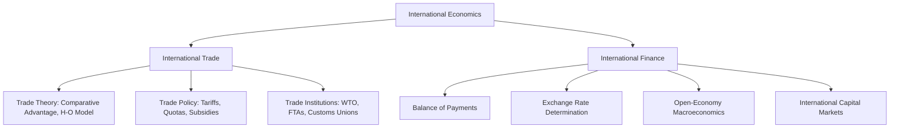

## Definition and Scope of International Economics

### Definition

International economics is the branch of economics that studies the economic interdependence among countries, analyzing the causes, patterns, and consequences of transactions and interactions between residents of different nations. It examines how the movement of goods, services, capital, labor, and technology across national borders affects the allocation of resources, income distribution, and economic welfare, both within individual countries and across the global economy.

Unlike domestic economics, which typically assumes a single currency, uniform legal jurisdiction, and free internal mobility of factors of production, international economics deals explicitly with the frictions and distinctive features that arise when economic actors operate across sovereign political boundaries: multiple currencies, differing national policies, trade barriers, capital controls, and the general immobility of labor relative to goods and capital.

**Key Points**

- International economics applies core microeconomic and macroeconomic tools (supply and demand, general equilibrium, aggregate accounting) to problems that specifically involve cross-border transactions.
- The presence of national borders introduces distinct phenomena absent in closed-economy analysis: exchange rates, balance of payments, tariffs, trade agreements, and international factor mobility.
- It is both a positive science (explaining what trade and financial patterns exist and why) and a normative one (evaluating policy choices such as protectionism versus free trade).

### Scope

The scope of international economics is conventionally divided into two major, interrelated subfields:

#### 1. International Trade Theory and Policy

This subfield addresses the *real* (non-monetary) side of international transactions — the exchange of goods and services.

- **Trade theory**: explains the basis for trade and the pattern of specialization among countries, including classical models (absolute advantage, comparative advantage), neoclassical models (Heckscher-Ohlin factor proportions theory), and modern models (new trade theory involving economies of scale and imperfect competition, gravity models).
- **Trade policy**: examines the instruments governments use to influence trade flows — tariffs, quotas, subsidies, non-tariff barriers — and their welfare effects on producers, consumers, and national income.
- **Gains from trade**: analyzes how trade affects aggregate welfare, income distribution among factors of production, and economic growth.
- **Trade institutions and agreements**: covers multilateral and regional frameworks such as the World Trade Organization (WTO), free trade areas, customs unions, and preferential trade agreements.

#### 2. International Monetary Economics (International Finance)

This subfield addresses the *monetary* side of international transactions — the financial flows that accompany or substitute for the exchange of goods and services.

- **Balance of payments**: the systematic accounting record of a country's economic transactions with the rest of the world.
- **Exchange rate determination**: theories explaining how currency values are set under different regimes (purchasing power parity, interest rate parity, asset-market approaches).
- **Exchange rate regimes**: analysis of fixed, floating, and intermediate systems, and the policy trade-offs each entails.
- **Open-economy macroeconomics**: the study of how monetary policy, fiscal policy, output, and inflation interact in economies open to trade and capital flows (e.g., the Mundell-Fleming framework).
- **International capital markets**: foreign direct investment, portfolio investment, sovereign debt, and the role of international financial institutions (IMF, World Bank).

**Example**

A single real-world event, such as a country imposing tariffs on imported steel, illustrates both subfields simultaneously: the *trade* subfield analyzes the effect on the domestic steel industry, consumer prices, and resource allocation; the *international finance* subfield analyzes the effect on the country's trade balance, its currency's exchange rate, and possible retaliatory capital flow responses.

### Distinguishing Features from Domestic Economics

| Feature | Domestic Economics | International Economics |
| --- | --- | --- |
| Currency | Single currency | Multiple currencies, exchange rate risk |
| Factor mobility | High mobility of labor and capital | Labor largely immobile; capital more mobile but subject to controls |
| Policy jurisdiction | Single legal/regulatory authority | Multiple sovereign authorities, no supranational enforcer |
| Trade barriers | Minimal to none | Tariffs, quotas, and non-tariff barriers common |
| Statistical accounting | National income accounts | Balance of payments, in addition to national accounts |

### Diagrammatic Overview

### Methodological Approach

International economics relies on:

- **General equilibrium analysis**, since trade and financial flows affect multiple markets (goods, factors, currencies) simultaneously rather than in isolation.
- **Comparative statics**, comparing pre- and post-policy equilibria (e.g., before and after a tariff) to isolate welfare effects.
- **Empirical and econometric methods**, including gravity models for trade flow prediction and time-series methods for exchange rate analysis.

[Inference] The relative weight given to trade theory versus international finance in a given course or textbook often depends on whether the emphasis is on microeconomic resource allocation questions or macroeconomic stabilization questions, since the two subfields draw on largely distinct theoretical toolkits (microeconomic general equilibrium versus macroeconomic aggregate demand analysis).

### Relevance and Applications

- **Policy formulation**: informs decisions on trade agreements, tariff schedules, and exchange rate management.
- **Business strategy**: underlies decisions on export markets, foreign direct investment location, and currency hedging.
- **Development economics**: trade and capital flows are central to growth strategies in developing economies (export-led growth, import substitution).
- **Global governance**: provides the analytical basis for the operations of the WTO, IMF, and World Bank.

**Related Topics**

- History and evolution of international trade theory (Mercantilism to modern trade models)
- Absolute advantage vs. comparative advantage
- The Heckscher-Ohlin model and factor proportions theory
- Balance of payments accounting structure
- Exchange rate regimes: fixed vs. floating systems
- Gains from trade and income distribution effects
- Role of international institutions (WTO, IMF, World Bank)
- Open-economy macroeconomic models (Mundell-Fleming)