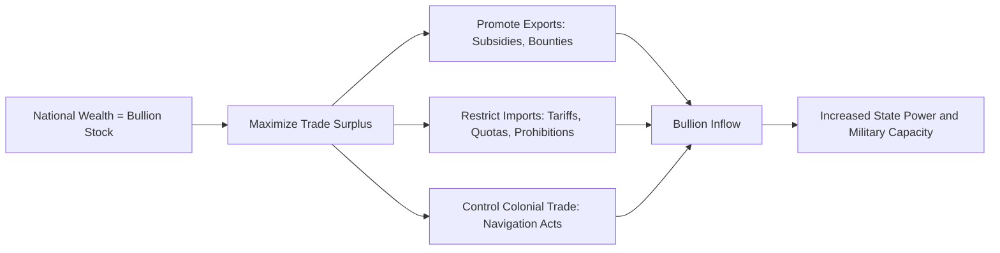

## Mercantilism and Pre-Classical Trade Thought

### Overview

Mercantilism refers to the body of economic thought and policy practice that dominated European economic thinking from approximately the 16th through the mid-18th century, prior to the emergence of classical economics with Adam Smith's *The Wealth of Nations* (1776). It was not a unified, formally articulated theory but rather a loosely connected set of writings, pamphlets, and state policies produced primarily by merchants, statesmen, and government advisors seeking to justify or shape trade and economic policy in the interest of national power.

**Key Points**

- Mercantilism coincided with the rise of the modern nation-state and the age of European colonial expansion.
- It treated economic activity as subordinate to, and instrumental for, the political and military strength of the sovereign state.
- It was the dominant, though internally inconsistent, framework that classical trade theory (Smith, Ricardo) was formulated to critique and supersede.

### Core Doctrines

#### 1. Bullionism and the Equation of Wealth with Precious Metals

Mercantilist writers generally held that national wealth was measured by the stock of gold and silver (bullion) a country possessed. Since a country without domestic gold or silver mines could only accumulate bullion through trade, this created a strong policy bias toward running trade surpluses.

#### 2. The Trade Balance Doctrine

The central mercantilist policy objective was to maximize exports and minimize imports, thereby generating a favorable (positive) balance of trade, which would be settled through net inflows of bullion. This is frequently summarized in the maxim: sell more, buy less.

$$\text{Balance of Trade} = X - M > 0$$

where $X$ denotes exports and $M$ denotes imports.

#### 3. Zero-Sum View of International Trade

Mercantilists generally viewed global trade as a zero-sum game: one nation's gain in bullion was necessarily another nation's loss. This stood in direct contrast to the later classical insight that trade could be mutually beneficial (positive-sum) for all participating countries.

#### 4. State Intervention and Regulation

Because national economic strength was treated as a direct extension of state power, mercantilist policy prescriptions relied heavily on active government intervention:

- **Export promotion**: subsidies (bounties) for domestic manufacturers producing goods for export.
- **Import restriction**: tariffs, quotas, and outright prohibitions on imported manufactured goods, particularly those competing with domestic industry.
- **Colonial exploitation**: colonies were regarded as captive sources of raw materials and captive markets for the mother country's finished goods, with colonial trade often legally restricted to the parent nation (e.g., the English Navigation Acts of the 1650s).
- **Domestic industry promotion**: encouragement of manufacturing over raw material export, since finished goods were believed to generate more employment and value-added than raw commodities.

#### 5. Association of Population and Employment with National Power

A large, employed population was viewed as a source of military manpower and productive capacity; mercantilist writers therefore often favored policies that kept wages low (to keep domestic goods competitively priced) while maximizing employment.

### Key Mercantilist Thinkers and Texts

| Thinker | Nationality | Contribution |
| --- | --- | --- |
| Thomas Mun | English | *England's Treasure by Foreign Trade* (written c. 1620s, published 1664); articulated the balance-of-trade doctrine |
| Jean-Baptiste Colbert | French | Finance minister under Louis XIV; architect of French mercantilist policy ("Colbertism") emphasizing state-directed industry and protectionism |
| Antonio Serra | Italian | Early writer (1613) on the causes of wealth and scarcity of money, often cited as an early systematic mercantilist text |
| Josiah Child | English | Advocated low interest rates and regulated trade via the East India Company |

[Unverified] The precise dating of "mercantilism" as a coherent school is a matter of some historiographical debate; the term itself was popularized retroactively, most notably by Adam Smith, who used it critically rather than as a label the writers applied to themselves.

### Pre-Classical Trade Thought More Broadly

Before and alongside mercantilism, several other strands of pre-classical thought engaged with cross-border economic questions:

- **Scholastic thought** (medieval, pre-16th century): concerned with the "just price" and moral limits on commerce, usury, and profit, rooted in Aristotelian and Thomistic philosophy rather than systematic trade analysis.
- **Bullionism** (a narrower, earlier strand often distinguished from full mercantilism): focused almost exclusively on prohibiting the export of precious metals, without the broader trade-balance and industrial-policy apparatus later mercantilists developed.
- **Physiocracy** (mid-18th century France, led by François Quesnay): a reaction against mercantilism that held agricultural land as the sole true source of net wealth ("produit net"), and which importantly introduced early advocacy for laissez-faire ("laissez-faire, laissez-passer") — a precursor to the later classical liberal position on trade, though grounded in a different (agriculture-centric) value theory.

**Example**

Under a mercantilist policy regime, a country producing raw wool might prohibit its export while imposing high tariffs on imported finished woolen cloth, forcing domestic weavers to process the wool locally. This preserves both the raw material and the value-added manufacturing employment within the country, and any wool cloth subsequently exported abroad is expected to bring in bullion, reinforcing the trade surplus objective.

### Diagrammatic Overview of Mercantilist Policy Logic

### Critique and Historical Significance

Mercantilism was subjected to sustained and increasingly systematic criticism through the 18th century, culminating in the classical school:

- **David Hume's price-specie-flow mechanism** (1752) demonstrated that a sustained trade surplus was self-correcting rather than permanently sustainable: bullion inflows would raise the domestic price level, making exports less competitive and imports more attractive, automatically eroding the surplus over time. This was among the most influential technical refutations of the bullionist logic.
- **Adam Smith's critique** (1776) attacked the conflation of money with wealth, arguing that a nation's true wealth consisted in its productive capacity (the annual produce of land and labor) rather than its bullion holdings, and that the zero-sum framing of trade was fundamentally mistaken given the possibility of mutually beneficial exchange based on absolute advantage.
- **David Ricardo** later formalized the case for mutually beneficial trade even without absolute advantage, through the principle of comparative advantage (1817), further dismantling the mercantilist zero-sum premise.

[Inference] Despite being theoretically superseded by classical trade theory, mercantilist-style policy reasoning — equating a trade surplus with national economic success and treating imports as a policy problem to be minimized — recurs periodically in modern trade policy debates, which is why the doctrine remains a standard reference point in introductory international economics courses even though the school itself is over two centuries old.

**Related Topics**

- David Hume's price-specie-flow mechanism
- Adam Smith and the theory of absolute advantage
- Physiocracy and laissez-faire economics
- The Navigation Acts and colonial trade policy
- David Ricardo and comparative advantage
- Modern "neo-mercantilist" policy debates