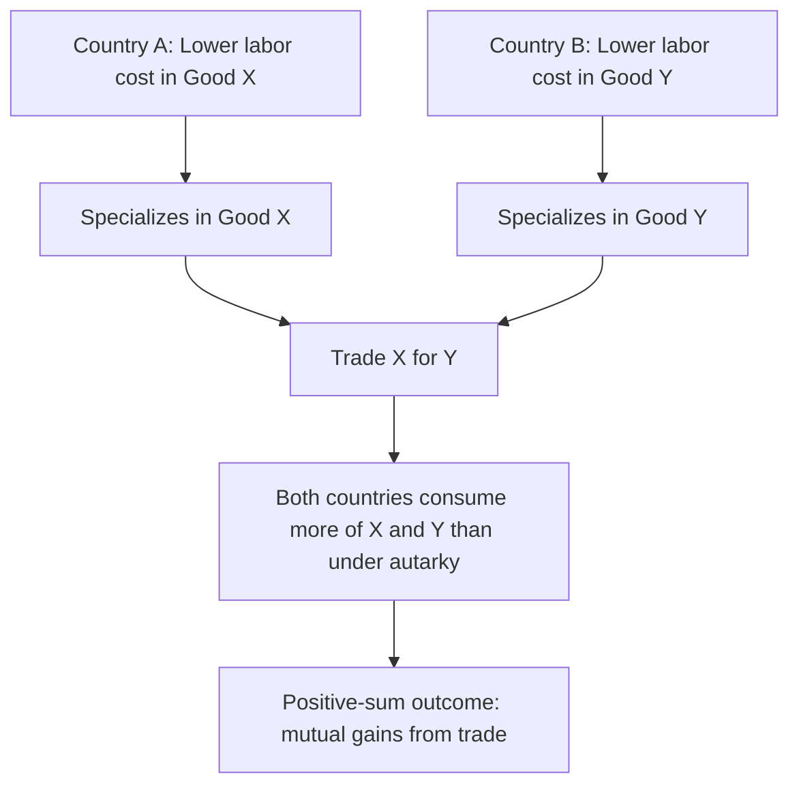

## Absolute Advantage and Adam Smith's Contribution

### Definition

Absolute advantage is the ability of an individual, firm, or country to produce a given good or service using fewer resources (or, equivalently, at a lower absolute cost in terms of inputs such as labor hours) than another producer. In the context of international trade theory, a country is said to have an absolute advantage in the production of a good if it can produce that good using less labor per unit of output than its trading partner.

This concept was formally introduced by Adam Smith in *An Inquiry into the Nature and Causes of the Wealth of Nations* (1776), and constitutes the first systematic, logically coherent argument in the history of economic thought for the mutual benefit of international trade — directly opposing the zero-sum trade doctrine of mercantilism.

**Key Points**

- Absolute advantage is measured in terms of physical productivity: output per unit of input, or equivalently, input required per unit of output.
- It differs fundamentally from comparative advantage (developed later by Ricardo), which is based on relative, not absolute, cost differences.
- Smith's contribution was as much methodological and philosophical as technical: it reframed wealth as productive capacity rather than bullion accumulation, and reframed trade as a positive-sum activity.

### Adam Smith's Contribution in Context

#### 1. Critique of Mercantilism

Smith's theory of absolute advantage must be understood as a direct rebuttal of mercantilist doctrine. Where mercantilists held that:

- National wealth consists of accumulated gold and silver, and
- Trade is a zero-sum contest in which one nation's export surplus is another's loss,

Smith argued instead that:

- National wealth consists of a country's *productive capacity* — the annual flow of goods and services (the "annual produce of the land and labor of the society") — not its stock of precious metals.
- Trade allows each nation to specialize in what it produces most efficiently and exchange for what others produce more efficiently, so that **both** trading parties can simultaneously gain. Trade is therefore positive-sum, not zero-sum.

#### 2. The Division of Labor as Foundation

Smith's absolute advantage argument for international trade is a direct extension of his broader theory of the division of labor (developed earlier in Book I of *The Wealth of Nations*, e.g., the pin factory example). Just as specialization and division of labor increase productivity within a single firm or economy, Smith argued the same logic applies between nations: if each country specializes in producing the goods it is most efficient at producing, and trades for the rest, total world output rises.

#### 3. Natural vs. Acquired Advantage

Smith attributed absolute advantage to two broad sources:

- **Natural advantages**: climate, soil quality, natural resource endowments, geographic factors (e.g., a country's climate being suited to growing a particular crop).
- **Acquired advantages**: skills, technology, accumulated capital, and specialized expertise developed by a country's workforce and industry over time.

### Formal Illustration

Consider a simplified two-country, two-good model (Country A and Country B, producing Good X and Good Y), where productivity is measured in labor hours required to produce one unit of each good.

|  | Good X (hours/unit) | Good Y (hours/unit) |
| --- | --- | --- |
| Country A | 4 | 8 |
| Country B | 6 | 3 |

Here:

- Country A requires fewer labor hours to produce Good X (4 < 6), so **Country A has an absolute advantage in Good X**.
- Country B requires fewer labor hours to produce Good Y (3 < 8), so **Country B has an absolute advantage in Good Y**.

Under Smith's logic, both countries gain by:

1. Country A specializing fully in producing Good X,
2. Country B specializing fully in producing Good Y,
3. The two countries trading X for Y at some mutually agreeable exchange ratio.

**Example**

If Country A shifts 8 labor hours from Good Y production into Good X production, it gains $8 / 4 = 2$ additional units of Good X while forgoing 1 unit of Good Y it would have produced. If Country B shifts 6 labor hours from Good X into Good Y production, it gains $6 / 3 = 2$ additional units of Good Y while forgoing 1 unit of Good X it would have produced. If the two countries then trade, for instance, 1 unit of X for 1 unit of Y, each country ends up better off than under autarky (self-sufficiency), since each has effectively obtained the good it does not produce efficiently at a lower resource cost than producing it domestically.

### Gains from Specialization and Trade

$$\text{World Output Gain} = \left(\text{Output under specialization}\right) - \left(\text{Output under autarky}\right) > 0$$

The central theoretical claim is that when each country specializes according to absolute advantage, **total world output of both goods increases** relative to a situation in which each country tries to produce both goods domestically (autarky). This increase in the total output "pie" is what creates the potential for both trading countries to consume more of both goods than they could in isolation.

### Diagrammatic Overview

### Key Assumptions of the Absolute Advantage Model

- Labor is the only factor of production considered (a labor theory of value framework).
- Labor is perfectly mobile within a country but immobile between countries.
- Constant returns to scale in production (labor input per unit of output does not change with output level).
- No transportation costs or trade barriers.
- Two countries, two goods (for tractability; the logic generalizes but becomes more complex with more goods/countries).
- Perfect competition in both goods and labor markets.

### Limitation: The Case of No Absolute Advantage

A critical limitation of Smith's framework, later addressed by Ricardo, is that it does not explain what happens when one country is more efficient than another in the production of **every** good (i.e., holds an absolute advantage in all goods, with no offsetting absolute advantage for the other country in anything). Under a strict reading of absolute advantage alone, this would seem to suggest no basis for mutually beneficial trade exists in such a case. This gap in Smith's theory was resolved by David Ricardo's principle of **comparative advantage** (1817), which demonstrated that mutually beneficial trade can still occur based on *relative* efficiency differences (opportunity costs), even in the absence of any absolute advantage.

[Inference] Because this limitation is well known and directly motivates the subsequent development of comparative advantage theory, absolute advantage is typically taught as a conceptual stepping stone rather than as the operative theory used to explain most observed real-world trade patterns.

### Historical and Doctrinal Significance

- Absolute advantage marks the transition point between pre-classical (mercantilist) and classical economic thought.
- It established specialization according to productive efficiency, rather than accumulation of bullion, as the source of national wealth and gains from trade.
- It laid the conceptual groundwork — positive-sum trade, specialization, and exchange — upon which Ricardo, and later the Heckscher-Ohlin and modern trade models, were built.

**Related Topics**

- David Ricardo and the theory of comparative advantage
- Opportunity cost and the Production Possibility Frontier (PPF) in trade models
- The labor theory of value in classical economics
- Gains from trade and terms of trade determination
- Division of labor (Smith, Book I of *The Wealth of Nations*)
- Transition from classical to neoclassical trade theory (Heckscher-Ohlin model)