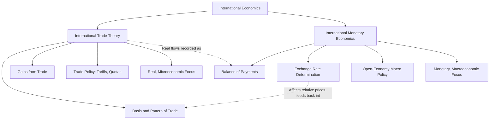

## Trade Theory Versus International Monetary Economics

### Overview

International economics is conventionally divided into two major branches: **international trade theory** and **international monetary economics** (also called international finance or open-economy macroeconomics). While both branches study cross-border economic interaction, they differ fundamentally in the questions they ask, the variables they treat as central, the time horizon of analysis, and the theoretical toolkit they employ. Understanding this division is foundational to organizing the rest of the field.

**Key Points**

- Trade theory is primarily **microeconomic** and **real** (concerned with physical quantities of goods, services, and factors of production).
- International monetary economics is primarily **macroeconomic** and **monetary/financial** (concerned with exchange rates, prices, aggregate flows of money and capital).
- The two branches are complementary, not competing: real trade flows in goods and services are typically accompanied by, and settled through, monetary and financial flows.

### Defining Characteristics of Trade Theory

International trade theory addresses the **real side** of international economic interaction: the exchange of goods, services, and factors of production between countries, independent of the monetary mechanism used to facilitate that exchange.

**Core Questions:**

- Why do countries trade? (Basis for trade)
- What determines the pattern of trade — which countries export which goods? (Pattern of specialization)
- What are the effects of trade on national welfare and income distribution? (Gains from trade)
- What are the effects of trade policy instruments (tariffs, quotas, subsidies) on prices, output, and welfare?

**Core Theoretical Tools:**

- Production Possibility Frontiers (PPF) and opportunity cost
- Comparative and absolute advantage
- General equilibrium analysis of goods and factor markets
- Partial equilibrium analysis of tariffs and trade policy (consumer/producer surplus)
- Factor endowment models (Heckscher-Ohlin)

**Time Horizon:** Trade theory is typically oriented toward the **medium-to-long run**, where prices adjust and resources reallocate across sectors in response to trade opening or policy changes. It largely abstracts from short-run macroeconomic fluctuations, business cycles, and monetary phenomena.

### Defining Characteristics of International Monetary Economics

International monetary economics (international finance) addresses the **monetary and financial side** of international economic interaction: the exchange rates, balance-of-payments flows, and macroeconomic policy interdependence that arise because countries use different currencies and are integrated through financial markets.

**Core Questions:**

- What determines the value of one currency relative to another? (Exchange rate determination)
- How should a country's transactions with the rest of the world be recorded and interpreted? (Balance of payments accounting)
- What are the effects of monetary and fiscal policy in an economy open to trade and capital flows? (Open-economy macroeconomic policy)
- What exchange rate regime (fixed, floating, managed) should a country adopt, and what are the trade-offs?
- How are financial crises (currency crises, sovereign debt crises) generated and transmitted internationally?

**Core Theoretical Tools:**

- Balance of payments accounting (current account, capital/financial account)
- Purchasing power parity (PPP) and interest rate parity (IRP)
- Open-economy IS-LM analysis (the Mundell-Fleming model)
- Asset-market and monetary approaches to exchange rate determination
- Aggregate demand/aggregate supply analysis in an open-economy setting

**Time Horizon:** International monetary economics operates across both the **short run** (exchange rate volatility, business cycle policy, speculative attacks) and the **long run** (long-run PPP, sustainable current account balances), and is more explicitly dynamic and forward-looking (asset markets price in expectations about the future).

### Comparative Summary

| Dimension | Trade Theory | International Monetary Economics |
| --- | --- | --- |
| Primary focus | Real flows: goods, services, factors | Monetary/financial flows: currencies, capital, credit |
| Branch of economics | Primarily microeconomic | Primarily macroeconomic |
| Central variables | Relative prices, opportunity costs, factor endowments | Exchange rates, interest rates, price levels, balance of payments |
| Key questions | Why trade? What pattern? Who gains/loses? | What sets currency values? How does policy transmit internationally? |
| Typical models | Ricardian model, Heckscher-Ohlin, tariff analysis | Mundell-Fleming, PPP, monetary approach to exchange rates |
| Time horizon | Medium-to-long run | Short run and long run |
| Policy instruments studied | Tariffs, quotas, subsidies, trade agreements | Monetary policy, fiscal policy, exchange rate regime choice, capital controls |
| Market equilibrium concept | Goods and factor market equilibrium | Money market, foreign exchange market, and asset market equilibrium |

### Interdependence Between the Two Branches

Although analytically separated for pedagogical clarity, trade theory and international monetary economics are deeply interconnected in practice:

- Every real transaction recorded in trade theory (an export or import) generates a corresponding **financial transaction** recorded in the balance of payments — the current account of the balance of payments is, in fact, largely a monetary record of real trade flows.
- Exchange rate movements (a monetary phenomenon) directly affect the relative prices of traded goods, thereby influencing trade patterns and competitiveness — a real-side outcome.
- Trade policy (tariffs, quotas) can affect a country's trade balance, which in turn affects exchange rate pressure and capital flows.
- Macroeconomic policy (a monetary phenomenon) affects aggregate demand for both domestic and imported goods, feeding back into trade flows.

**Example**

A tariff imposed on imported automobiles (a trade-theory policy instrument) reduces import volume, which — holding other factors constant — improves the trade balance component of the current account (a balance-of-payments/monetary outcome). This can place upward pressure on the domestic currency's value under a floating exchange rate regime, which then makes the country's other exports relatively more expensive abroad, partially offsetting the initial trade balance improvement. This illustrates why the two branches, though separable in theory, must often be jointly considered in applied policy analysis.

### Diagrammatic Overview

### Pedagogical Rationale for the Division

[Inference] This branch division is maintained across most standard international economics curricula and textbooks primarily because the two areas require substantially different prerequisite tools — trade theory builds on microeconomic price theory and general equilibrium, while international finance builds on macroeconomic aggregate demand/supply and asset pricing — making joint treatment in a single unified model analytically cumbersome for introductory purposes, even though real-world policy problems frequently require insights from both.

- Trade theory is often taught first, as it requires fewer macroeconomic prerequisites and builds directly on standard microeconomic tools.
- International monetary economics is typically taught after a foundation in macroeconomics has been established (national income accounting, money markets, aggregate demand).
- Advanced and applied international economics (e.g., analysis of trade wars, currency crises, or globalization's effects on inequality) frequently requires integrating insights from both branches simultaneously.

**Related Topics**

- Balance of payments accounting: current account and financial account
- Purchasing power parity (PPP) and the law of one price
- The Mundell-Fleming model of open-economy macroeconomic policy
- Fixed versus floating exchange rate regimes
- Comparative advantage and the Ricardian trade model
- Heckscher-Ohlin factor proportions theory
- Trade policy instruments: tariffs, quotas, and subsidies