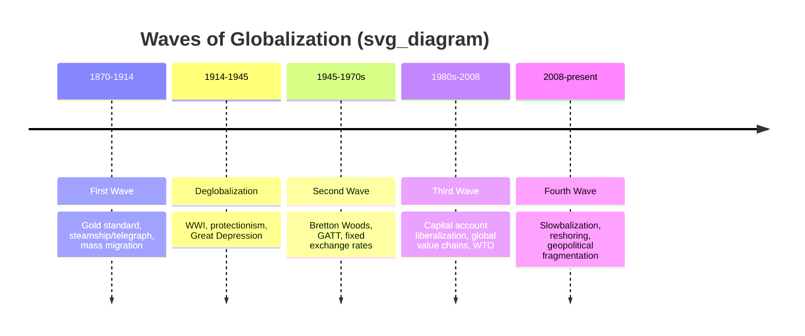

## Globalization: Historical Waves and Measurement

### Definition

Globalization, in the context of international economics, refers to the growing integration of national economies through increased cross-border flows of goods, services, capital, labor, technology, and information. It is a multidimensional process encompassing economic, technological, political, and cultural integration, though international economics is chiefly concerned with its economic dimensions: trade integration, financial integration, and factor mobility.

**Key Points**

- Globalization is not a single continuous, linear process; economic historians commonly describe it as occurring in distinct **waves**, separated by periods of stagnation or reversal (deglobalization).
- It is measured using a range of quantitative indicators capturing trade openness, capital flows, and factor mobility relative to the size of the global or national economy.
- The degree and pace of globalization are shaped by transportation and communication technology, trade policy, and geopolitical stability.

### Historical Waves of Globalization

Economic historians generally identify several distinct waves of globalization, each with characteristic drivers and each interrupted by periods of retrenchment.

#### First Wave (c. 1870–1914): The "First Era of Globalization"

- Driven primarily by technological innovation: the steamship, railroad expansion, and the transatlantic telegraph, which drastically reduced transportation and communication costs.
- Characterized by relatively free trade (many major economies maintained low tariffs), large-scale international capital flows (especially British investment abroad), and, notably, **large-scale international labor migration** (tens of millions of Europeans migrated to the Americas and elsewhere).
- Underpinned by the **gold standard**, which provided a stable international monetary anchor.
- **Terminated** abruptly by the outbreak of World War I (1914), followed by the interwar period's retreat into protectionism, competitive currency devaluations, and the collapse of international capital markets during the Great Depression (1930s), particularly following the Smoot-Hawley Tariff Act (1930) and widespread retaliatory tariffs.

#### Interwar Deglobalization (1914–1945)

- A period of substantial reversal: collapse of the gold standard, imposition of high tariffs and capital controls, and severe contraction in international trade and financial flows.
- Often cited as a cautionary historical case illustrating that global economic integration is not an irreversible, one-directional trend.

#### Second Wave (c. 1945–1970s): Post-War Reconstruction and Institution-Building

- Driven by the creation of a new international economic architecture at the **Bretton Woods Conference (1944)**, establishing the IMF and World Bank, and the **General Agreement on Tariffs and Trade (GATT, 1947)**, which initiated successive rounds of multilateral tariff reduction.
- Marked by fixed exchange rates (the Bretton Woods system, pegged to the US dollar, itself convertible to gold) and comparatively restricted international capital mobility.
- Trade in goods, particularly among industrialized economies, expanded substantially; labor mobility, by contrast, remained far more restricted than in the first wave.

#### Third Wave (c. 1980s–2008): Accelerated Globalization

- Driven by the breakdown of the Bretton Woods fixed exchange rate system (early 1970s), subsequent liberalization of capital accounts across many economies, containerization revolutionizing shipping logistics, and the information technology revolution (internet, digital communications) dramatically lowering coordination and transaction costs.
- Characterized by the rise of **global value chains** (production processes fragmented across multiple countries), a surge in foreign direct investment (FDI), the entry of China and other emerging economies into global trade (notably China's WTO accession in 2001), and rapid growth in cross-border financial flows.
- The World Trade Organization (WTO) was established in 1995, succeeding GATT with an expanded mandate and stronger dispute-resolution mechanisms.
- **Interrupted** by the 2008 Global Financial Crisis, which triggered a sharp, temporary contraction in trade and capital flows (sometimes termed the "Great Trade Collapse").

#### Fourth Wave / Contemporary Period (post-2008 to present): Slowbalization and Reconfiguration

- Characterized by a marked slowdown in the growth rate of world trade relative to world GDP (a phenomenon termed **"slowbalization"**), even as absolute trade volumes remain historically high.
- Marked by rising geopolitical tensions affecting trade policy (notably US-China trade tensions from 2018 onward), increased use of tariffs and export controls, supply chain reconfiguration ("reshoring," "friend-shoring," "nearshoring"), and disruptions from events such as the COVID-19 pandemic (2020) and regional conflicts affecting energy and commodity trade.

[Inference] Whether the post-2008 period constitutes a genuine structural reversal of globalization or merely a deceleration in its growth rate remains a live and unresolved question among international economists, since aggregate trade and capital flow indicators have not shown the sharp, sustained collapse characteristic of the interwar deglobalization episode.

### Diagrammatic Overview of Historical Waves

*(Note: rendering environments without timeline support will display this as a structured outline; the sequence above is the substantive content regardless of rendering.)*

### Measurement of Globalization

Because globalization is multidimensional, no single indicator fully captures it. Economists and international organizations rely on a combination of quantitative measures:

#### 1. Trade Openness Indicators

$$\text{Trade Openness Ratio} = \frac{X + M}{\text{GDP}}$$

where $X$ is exports and $M$ is imports. This ratio (sometimes called the trade-to-GDP ratio) measures the importance of international trade relative to the size of the domestic economy. A rising ratio over time is a standard indicator of increasing trade integration.

#### 2. Financial/Capital Account Openness

- **Gross capital flows to GDP ratio**: total inflows plus outflows of foreign investment relative to GDP.
- **Foreign Direct Investment (FDI) stock and flows**: measures the accumulated and annual cross-border ownership of productive assets.
- **Chinn-Ito Index**: a widely used index measuring the degree of a country's capital account openness based on reported restrictions on cross-border financial transactions.

#### 3. Labor Mobility Indicators

- **International migrant stock as a share of world population**: measures the extent of cross-border labor movement.
- **Remittance flows relative to GDP**: an indirect financial proxy for labor mobility's economic significance, particularly for migrant-sending countries.

#### 4. Composite Globalization Indices

- **KOF Globalisation Index** (Swiss Economic Institute): a widely cited composite index combining economic, social, and political dimensions of globalization into sub-indices and an overall score, allowing cross-country and over-time comparison.
- **DHL Global Connectedness Index**: measures international flows of trade, capital, information, and people relative to domestic activity.

#### 5. Price Convergence Measures

- **Price dispersion across countries** for comparable goods (relating to the law of one price): narrowing price gaps for identical goods across markets are sometimes used as indirect evidence of deepening market integration.

**Example**

World trade-to-GDP ratio rose from roughly the low double digits in the early 1970s to a peak of approximately 60% around 2008, reflecting the cumulative effect of the second and third waves of globalization; it then plateaued and has shown comparatively flat-to-modest growth in the subsequent "slowbalization" period, illustrating how the trade openness ratio can be used empirically to distinguish between waves of accelerating and stagnating integration. [Unverified] Exact figures vary by data source and methodology (e.g., World Bank versus WTO trade statistics), so the specific percentage should be treated as an illustrative order of magnitude rather than a precise benchmark.

### Measurement Challenges and Limitations

- **Aggregation bias**: national-level indicators (e.g., trade-to-GDP) can mask substantial heterogeneity in globalization's effects across regions, sectors, and income groups within a country.
- **Double-counting in global value chains**: as production is increasingly fragmented across borders, gross trade statistics can substantially overstate genuine value-added trade, since intermediate inputs may cross multiple borders before final assembly. This motivated the development of **trade-in-value-added (TiVA)** measures by the OECD and WTO as a more accurate alternative to gross trade flow statistics.
- **Data comparability**: composite indices (e.g., KOF) rely on component data of varying quality and availability across countries, particularly for developing economies.
- **Distinguishing correlation from causation**: rising globalization indicators coincide with, but are not automatically evidence of causing, associated outcomes like economic growth or inequality changes; careful econometric analysis, not raw indicator trends alone, is needed to establish causal claims.

**Related Topics**

- Gains from trade and the welfare effects of globalization
- Global value chains and trade-in-value-added (TiVA) measurement
- The Bretton Woods system and its collapse
- GATT to WTO: the evolution of the multilateral trading system
- Deglobalization, reshoring, and friend-shoring in contemporary trade policy
- Foreign direct investment (FDI) theory and measurement
- International labor migration and remittance economics