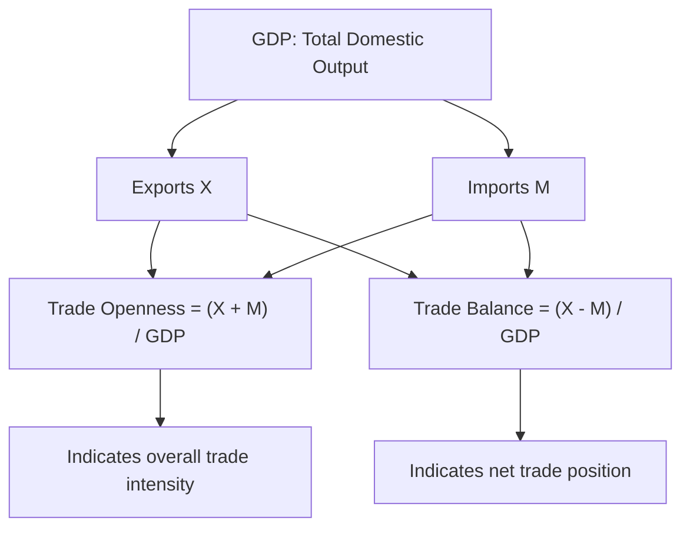

## Openness Indicators and Trade-to-GDP Ratios

### Definition

Openness indicators are quantitative measures used to assess the degree to which a national economy is integrated with the rest of the world through cross-border flows of goods, services, capital, and factors of production. The most widely used and foundational of these is the **trade-to-GDP ratio** (also called the trade openness ratio or trade intensity ratio), which expresses the sum of a country's exports and imports as a proportion of its Gross Domestic Product.

**Key Points**

- Trade-to-GDP ratio is the single most commonly cited proxy for a country's degree of trade openness in applied international economics.
- Openness indicators are used both descriptively (characterizing an economy) and analytically (as explanatory or control variables in empirical trade and growth research).
- No single ratio fully captures "openness"; different indicators emphasize different dimensions (goods trade, services trade, financial openness).

### The Standard Trade-to-GDP Ratio

$$\text{Trade Openness Ratio} = \frac{X + M}{\text{GDP}} \times 100$$

where:

- $X$ = total value of exports of goods and services
- $M$ = total value of imports of goods and services
- GDP = Gross Domestic Product, measured over the same period (typically annual)

This is sometimes referred to as the **trade intensity ratio** or simply "trade openness," and is expressed as a percentage.

#### Variant: Net Exports Ratio

A related but distinct measure is the net exports (or trade balance) ratio:

$$\text{Trade Balance Ratio} = \frac{X - M}{\text{GDP}} \times 100$$

This measure captures the *direction and magnitude of net trade imbalance* relative to GDP, rather than the *overall volume* of trade activity. A country can have a high trade-to-GDP ratio (heavily engaged in trade) while having a trade balance ratio near zero (roughly balanced exports and imports), or vice versa.

**Example**

Consider a hypothetical country with GDP of $500 billion, exports of $150 billion, and imports of $130 billion.

$$\text{Trade Openness Ratio} = \frac{150 + 130}{500} \times 100 = 56\%$$

$$\text{Trade Balance Ratio} = \frac{150 - 130}{500} \times 100 = 4\%$$

This country would be characterized as highly open to trade (56% of GDP), while running a modest trade surplus (4% of GDP).

### Interpretation Considerations

- **Small economies tend to exhibit higher trade-to-GDP ratios** than large economies, almost mechanically, because small domestic markets cannot efficiently produce the full range of goods and services demanded, making international trade proportionally more important. City-states and small open economies (e.g., Singapore, Luxembourg, Hong Kong) often report trade-to-GDP ratios well above 100%, sometimes exceeding 200%, largely reflecting re-export and entrepôt trade activity.
- **Large, diversified economies** (e.g., the United States, historically) tend to exhibit comparatively lower trade-to-GDP ratios, since a larger share of economic activity can be conducted domestically without crossing borders.
- The ratio can **exceed 100%** for economies heavily involved in re-exporting or that serve as regional trade/logistics hubs, since gross exports and imports are summed without netting out re-exported goods.
- **Global value chain (GVC) participation** tends to inflate gross trade-to-GDP ratios relative to genuine value-added trade, since intermediate components may cross the same or multiple borders several times before final assembly, each crossing being counted in gross trade statistics.

[Inference] Because of this GVC-driven inflation effect, cross-country comparisons of trade-to-GDP ratios can overstate genuine differences in economic integration between economies with different degrees of participation in fragmented, multi-stage production networks, which is part of the motivation for supplementary trade-in-value-added (TiVA) measures.

### Related and Supplementary Openness Indicators

| Indicator | Formula / Basis | What It Captures |
| --- | --- | --- |
| Trade-to-GDP ratio | $(X+M)/\text{GDP}$ | Overall goods and services trade intensity |
| Export-to-GDP ratio | $X/\text{GDP}$ | Export orientation of the economy |
| Import-to-GDP ratio | $M/\text{GDP}$ | Import dependence of the economy |
| Trade balance ratio | $(X-M)/\text{GDP}$ | Net trade position relative to economic size |
| FDI stock/flow to GDP | Foreign direct investment / GDP | Degree of financial/investment integration |
| Chinn-Ito Index | Composite index of capital account restrictions | Financial account openness (de jure) |
| Trade-in-value-added (TiVA) share | Value-added exports / gross exports | Genuine value-added contribution, net of GVC double-counting |
| KOF Globalisation Index (economic sub-index) | Composite weighted index | Broader economic globalization, combining trade and financial flows |

### Diagrammatic Overview

### Uses in Applied International Economics

- **Cross-country comparison**: allows ranking economies by their relative degree of trade integration, controlling for absolute economic size.
- **Time-series analysis**: tracking a single country's trade-to-GDP ratio over time to assess trends in trade liberalization, globalization, or protectionist reversals.
- **Empirical research variable**: frequently used as an explanatory or control variable in growth regressions, studies of trade's effect on income inequality, and gravity model estimation.
- **Policy benchmarking**: used by international institutions (World Bank, IMF, WTO) to assess a country's degree of integration into the global trading system, often alongside tariff-level data and non-tariff barrier indices.

### Limitations of the Trade-to-GDP Ratio

- **Does not measure trade policy restrictiveness directly**: a country could have a high trade-to-GDP ratio due to geographic necessity (e.g., a small island economy) rather than genuinely liberal trade policy, and conversely, a large economy with liberal trade policy might still show a modest ratio simply due to its size.
- **Gross flow measure, not welfare measure**: a rising trade-to-GDP ratio does not by itself indicate whether trade is generating positive welfare gains; it measures volume/intensity, not the distribution or magnitude of gains from trade.
- **Currency and price-level sensitivity**: since both trade flows and GDP are typically measured in current local currency or converted to a common currency (e.g., USD), the ratio can be affected by exchange rate movements and price-level differences independent of genuine changes in trade volume.
- **Services trade measurement difficulty**: cross-border services trade (increasingly significant with digital services) can be harder to measure accurately than goods trade, introducing potential understatement in the ratio for service-oriented economies.

[Unverified] The precise threshold at which a trade-to-GDP ratio is considered "high" or "low" is not governed by a universally agreed-upon standard and varies considerably by the comparison group (e.g., benchmarking against economies of similar population size or income level is generally considered more informative than an absolute global threshold).

**Related Topics**

- Trade-in-value-added (TiVA) accounting and global value chains
- The Chinn-Ito Index and measures of financial account openness
- Gravity models of international trade
- Terms of trade and its distinction from trade volume measures
- Balance of payments accounting: current account and trade balance
- KOF Globalisation Index and composite globalization measurement