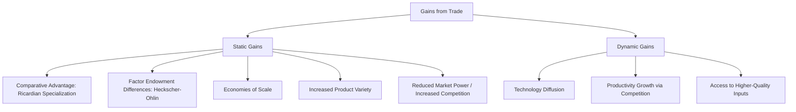

## The Gains from Trade: An Overview

### Definition

Gains from trade refers to the net increase in economic welfare that accrues to countries (and, in aggregate, to the world economy) as a result of engaging in international trade rather than remaining in autarky (economic self-sufficiency). It is one of the central and most robust theoretical results in international economics: under standard assumptions, voluntary trade between countries expands the total consumption possibilities available to all trading parties, allowing for higher aggregate welfare than would be achievable without trade.

**Key Points**

- Gains from trade arise even when the sources of comparative advantage differ across theoretical models (technology differences, factor endowments, economies of scale, product variety).
- Aggregate gains from trade do not imply that every individual or group within a country benefits; trade typically also generates internal redistribution of income.
- Gains from trade are conventionally decomposed into distinct channels, each traceable to a different underlying trade model.

### Sources and Channels of Gains from Trade

#### 1. Gains from Specialization According to Comparative Advantage

The most foundational channel, formalized by David Ricardo (1817): even when one country is less efficient than another at producing *every* good (lacks absolute advantage in anything), mutually beneficial trade is still possible as long as *relative* efficiencies (opportunity costs) differ between countries. Each country specializes in producing the good(s) in which its opportunity cost is lowest, and trades for the rest, expanding total world output and consumption possibilities beyond what either country could achieve under autarky.

$$\text{Opportunity Cost of Good X (in terms of Good Y)} = \frac{\text{Labor required per unit of X}}{\text{Labor required per unit of Y}}$$

A country should specialize in the good for which this ratio is lower relative to its trading partner.

#### 2. Gains from Differences in Factor Endowments

Formalized in the Heckscher-Ohlin model: countries differ not necessarily in technology but in their relative endowments of factors of production (labor, capital, land). A country specializes in, and exports, the good that intensively uses its relatively abundant factor, importing the good that intensively uses its relatively scarce factor. This generates gains from trade through more efficient allocation of each country's given factor endowments.

#### 3. Gains from Economies of Scale

Formalized in "new trade theory" (Paul Krugman and others, from the late 1970s/1980s): even between countries with identical technologies and factor endowments, trade allows firms to access larger combined markets, enabling production at larger scale and lower average cost (internal economies of scale) than would be possible serving only the smaller domestic market alone.

#### 4. Gains from Increased Product Variety

Also associated with new trade theory and monopolistic competition models: trade allows consumers in each country to access a greater variety of differentiated products (e.g., different brands or varieties of automobiles, rather than a single domestically produced variety), directly increasing consumer welfare independent of any price change, since consumers generally value variety.

#### 5. Gains from Increased Competition and Reduced Market Power

Opening to trade increases the number of competing firms in a domestic market, reducing the market power (and associated markups) of domestic monopolists or oligopolists, pushing prices closer to marginal cost and reducing deadweight loss from imperfect competition.

#### 6. Dynamic Gains: Technology Transfer, Innovation, and Productivity Growth

Beyond the static, one-time gains captured in the channels above, trade is often argued to generate **dynamic gains** over time:

- Exposure to foreign competition can pressure domestic firms toward greater productive efficiency and innovation.
- Trade facilitates the diffusion of technology and best practices across borders.
- Access to a wider range and higher quality of imported intermediate inputs can raise domestic firms' productivity.

[Inference] Dynamic gains are generally considered more difficult to isolate and quantify empirically than static gains, since they involve longer time horizons and are more susceptible to confounding by other simultaneous determinants of productivity growth, which is why much of the traditional theoretical apparatus for "gains from trade" is built primarily around the static channels above.

### Diagrammatic Overview

### Graphical Illustration: Gains via the Production Possibility Frontier

In the standard two-good, Ricardian trade diagram, gains from trade are illustrated by comparing:

- The **autarky consumption point**, which must lie on or inside the domestic Production Possibility Frontier (PPF), and
- The **post-trade consumption point**, which can lie **outside** the domestic PPF (though still on or inside the domestic *production* possibilities, since the country specializes in production but consumes a different, trade-augmented bundle).

$$\text{Post-Trade Consumption Possibilities} \supset \text{Autarky Consumption Possibilities}$$

The vertical or horizontal distance between the autarky consumption point and the post-trade consumption point (measured along the relevant trade-augmented consumption possibility line, sometimes called the "trade triangle") represents the magnitude of the gains from trade for that country.

**Example**

Suppose a country's autarky consumption bundle, given its PPF, is 50 units of Good X and 30 units of Good Y. After specializing according to comparative advantage and trading at world relative prices, the country can consume, for instance, 55 units of Good X and 35 units of Good Y — a bundle infeasible under autarky given the same resource base. The country has therefore realized unambiguous gains from trade, having moved to a strictly preferred consumption bundle.

### Distributional Considerations: Aggregate Gains vs. Individual Winners and Losers

A crucial qualification to the "gains from trade" result is that **aggregate** national gains do not imply that trade is Pareto-improving at the individual or factor level.

- The **Stolper-Samuelson theorem** (within the Heckscher-Ohlin framework) demonstrates that trade tends to raise the real return to a country's abundant factor of production and lower the real return to its scarce factor, meaning owners of the scarce factor can be made *worse off* in absolute terms by trade opening, even as the country as a whole gains.
- The distinction between **short-run (specific factors) and long-run (fully mobile factors)** models matters: in the short run, factors tied to import-competing sectors (the specific-factors model) bear concentrated losses from trade liberalization, even if factors are eventually able to reallocate to expanding export sectors over the long run.
- This is the theoretical basis for the standard argument that aggregate gains from trade are generally large enough that **winners could, in principle, compensate losers** and still remain better off (a Kaldor-Hicks efficiency criterion) — though such compensation is not automatic and depends on deliberate domestic policy (e.g., trade adjustment assistance programs).

[Inference] The gap between the theoretical possibility of compensating losers and the practical, incomplete implementation of such compensation in most economies is frequently cited as a significant source of political resistance to trade liberalization, despite the robust theoretical prediction of positive aggregate gains.

### Empirical Estimation of Gains from Trade

Modern quantitative trade models (e.g., Armington-based general equilibrium models, and more recent "new quantitative trade theory" following Arkolakis, Costinot, and Rodríguez-Clare, 2012) provide formulas for estimating the welfare gains from trade using observable, aggregate data — most notably the domestic expenditure share and the trade elasticity — without requiring full structural estimation of the underlying trade model:

$$\hat{W} = \left(\hat{\lambda}_{ii}\right)^{-1/\varepsilon}$$

where $\hat{W}$ is the proportional change in real income, $\hat{\lambda}_{ii}$ is the change in the share of domestic expenditure on domestically produced goods, and $\varepsilon$ is the trade elasticity. [Inference] This "sufficient statistics" approach has become influential in applied trade research precisely because it allows welfare gains to be estimated without taking a strong stand on which specific theoretical channel (Ricardian, Heckscher-Ohlin, or new trade theory) is the true source of comparative advantage, though this generality is also a common point of critique regarding the approach's ability to distinguish between competing theoretical mechanisms.

### Summary Table of Gains from Trade Channels

| Channel | Underlying Model | Mechanism |
| --- | --- | --- |
| Comparative advantage | Ricardian model | Specialization by relative opportunity cost |
| Factor abundance | Heckscher-Ohlin model | Specialization by relative factor endowments |
| Economies of scale | New trade theory | Larger combined market enables lower-cost production |
| Product variety | Monopolistic competition (Krugman) | Access to a wider range of differentiated goods |
| Pro-competitive effect | Imperfect competition models | Reduced markups, prices closer to marginal cost |
| Dynamic/technology gains | Endogenous growth, trade-and-growth literature | Technology diffusion, productivity spillovers |

**Related Topics**

- The Ricardian model and comparative advantage
- Heckscher-Ohlin model and the Stolper-Samuelson theorem
- New trade theory: economies of scale and monopolistic competition
- Trade adjustment assistance and compensating losers from trade
- The specific-factors model (short-run trade effects)
- Quantitative trade models and welfare gain estimation (ACR formula)