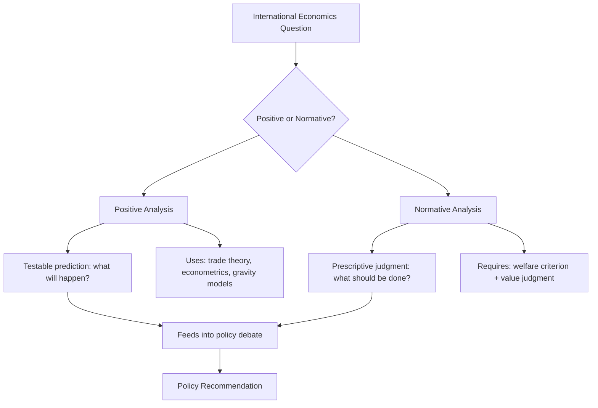

## Positive Versus Normative Analysis

### Definition

Positive analysis and normative analysis represent two fundamentally distinct modes of economic reasoning that apply directly to international economics, as they do throughout economics generally. The distinction is methodological and philosophical, concerning the *type of claim* being made rather than the *subject matter* being studied.

- **Positive analysis** is concerned with description, explanation, and prediction of economic phenomena as they *are* or *would be* under specified conditions — statements that are, in principle, testable against observable evidence and can be judged true or false independent of value judgments.
- **Normative analysis** is concerned with prescription and evaluation of economic outcomes or policies according to what *ought to be* — statements that necessarily incorporate value judgments, ethical criteria, or welfare standards, and cannot be resolved by empirical evidence alone.

**Key Points**

- The positive/normative distinction does not map onto a "hard science vs. opinion" divide; both are legitimate and necessary components of rigorous economic analysis.
- International economics is unusually normatively charged relative to other subfields, because its policy conclusions (free trade vs. protectionism, exchange rate regime choice) directly and visibly affect national sovereignty, income distribution, and political constituencies.
- Much confusion and disagreement in public trade policy debate stems from conflating positive claims (what trade does) with normative claims (what trade policy should be).

### Positive Analysis in International Economics

Positive statements in international economics take the general form: "If X occurs, then Y will result," or "The data show that Z is the case." They are, at least conceptually, verifiable or falsifiable through logical derivation from theory or empirical testing against data.

**Characteristic examples of positive analysis:**

- Deriving, from the Ricardian model, that a country will export the good in which it has a comparative advantage.
- Estimating, using a gravity model, the elasticity of bilateral trade flows with respect to distance and trade agreements.
- Predicting, using the Stolper-Samuelson theorem, that trade liberalization will raise the real return to a country's abundant factor and lower the return to its scarce factor.
- Measuring the empirical pass-through of a tariff increase into domestic consumer prices.
- Documenting historical trends in the trade-to-GDP ratio across countries and time periods.

**Methodological Tools:**

- Formal theoretical models (Ricardian, Heckscher-Ohlin, new trade theory) generating testable predictions.
- Econometric estimation (gravity models, difference-in-differences studies of trade agreements, computable general equilibrium simulations).
- Historical and descriptive data analysis (balance of payments statistics, tariff schedules, exchange rate time series).

### Normative Analysis in International Economics

Normative statements in international economics take the general form: "Policy X should be adopted because it produces outcome Y, which is judged to be desirable according to criterion Z." They require an explicit or implicit **welfare criterion** or ethical standard against which outcomes are evaluated.

**Characteristic examples of normative analysis:**

- "A country should pursue free trade because it maximizes aggregate national welfare."
- "Tariff protection for an infant industry is justified because the long-run dynamic gains outweigh short-run consumer losses."
- "A fixed exchange rate regime is preferable to a floating regime for small open economies because it reduces exchange rate uncertainty for trade and investment."
- "Governments should provide trade adjustment assistance to workers displaced by import competition, because the resulting income redistribution is more equitable."

**Common Normative Criteria Used in International Economics:**

- **Aggregate welfare maximization** (often operationalized via aggregate real income or a social welfare function): the dominant criterion underlying most "free trade is beneficial" policy conclusions.
- **Pareto efficiency**: an allocation is normatively preferred if it is impossible to make anyone better off without making someone else worse off; often invoked in the "potential Pareto improvement" or Kaldor-Hicks sense, since actual trade liberalization rarely benefits literally everyone.
- **Distributional/equity criteria**: normative judgments concerning how the gains and losses from trade are distributed across income groups, sectors, or generations, independent of the aggregate efficiency gain.
- **National sovereignty and security criteria**: normative arguments (e.g., for strategic trade policy or export controls) grounded in objectives other than aggregate economic welfare, such as national security or strategic autonomy.

### The Positive-Normative Relationship: Theory Informing Policy Judgment

Positive and normative analysis are not independent in practice; positive analysis typically serves as the essential input to normative policy conclusions, though the final normative judgment additionally requires a value premise that positive analysis alone cannot supply.

$$\text{Normative Conclusion} = \text{Positive Prediction} + \text{Value Judgment/Welfare Criterion}$$

**Example**

Consider the policy question: "Should Country A impose a tariff on imported steel?"

- **Positive component**: Trade theory (e.g., partial equilibrium tariff analysis) predicts that a tariff will raise the domestic price of steel, increase domestic steel production and producer surplus, decrease consumer surplus, generate tariff revenue for the government, and produce a net deadweight loss to the importing country (absent monopsony/terms-of-trade effects) — this is a testable, positive prediction derivable from standard trade theory and verifiable using empirical price and quantity data.
- **Normative component**: Whether this predicted outcome is judged *desirable* depends on the value weight assigned to domestic steel producers and their employees relative to steel-consuming industries and general consumers, and on whether national security considerations (e.g., maintaining domestic steel production capacity) are given weight independent of the aggregate efficiency calculation.

Two economists could agree completely on the positive prediction (the tariff's quantitative effects on prices, output, and welfare) while reaching opposite normative policy conclusions, if they weight the distributional and non-economic considerations differently.

### Diagrammatic Overview

### Why This Distinction Is Especially Salient in International Economics

- **High visibility and political stakes**: trade policy affects clearly identifiable domestic constituencies (import-competing industries and their workers versus exporting industries and consumers), making normative disagreement over distributional outcomes especially prominent and politically charged compared to many other economic policy areas.
- **National sovereignty dimension**: international economics uniquely involves questions of how one nation's welfare should be weighed against another's (e.g., in evaluating the effects of a country's tariff on its trading partners), introducing an additional normative dimension — whose welfare counts, and how much — that does not arise in purely domestic economic analysis.
- **Near-consensus positive result, persistent normative disagreement**: the positive theoretical case that trade generates net aggregate gains is one of the most robust and widely shared conclusions in economics, yet normative disagreement over trade policy remains substantial and persistent, precisely because the normative conclusion additionally depends on distributional value judgments not resolved by the positive theory itself.

[Inference] This gap between strong positive consensus and persistent normative/political disagreement is frequently cited as a central explanation for why economists' broad professional agreement on the aggregate benefits of trade coexists with sustained public and political skepticism toward specific trade liberalization policies, since public debate often implicitly weighs distributional and non-economic normative considerations that the core positive theory does not, by design, resolve.

### Common Pitfalls in Conflating Positive and Normative Claims

- **Smuggling in unstated value judgments**: presenting a normative policy recommendation (e.g., "free trade is good policy") as though it followed directly and exclusively from positive theory, without acknowledging the welfare criterion or distributional assumption embedded in the recommendation.
- **Dismissing normative disagreement as factual error**: treating disagreement over trade policy as though it reflects a failure to understand the positive economics, when it may instead reflect a legitimate difference in normative weighting (e.g., how much weight to place on displaced workers' losses relative to aggregate consumer gains).
- **Treating positive predictions as automatically settled**: positive claims in international economics, particularly quantitative magnitude estimates (e.g., the precise welfare gain from a given trade agreement), often carry genuine empirical uncertainty and should not be treated as unconditionally certain simply because they are "positive" rather than "normative" in character.

**Related Topics**

- Welfare economics and the Pareto efficiency criterion
- The Stolper-Samuelson theorem and distributional effects of trade
- Kaldor-Hicks efficiency and compensation principles
- Strategic trade policy and non-economic (security) rationales for protection
- Trade adjustment assistance as a policy response to distributional concerns
- Gravity models and empirical (positive) trade analysis