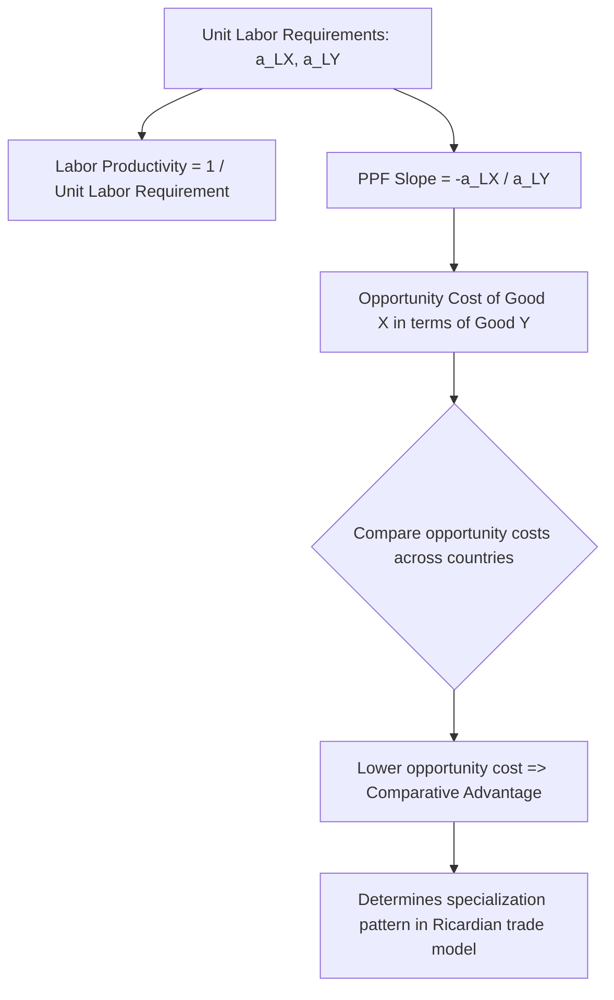

## Labor Productivity and Unit Labor Requirements

### Definition

Unit labor requirement is the amount of labor input needed to produce one unit of output of a given good. It is the foundational building block of the Ricardian model of international trade, serving as the technological parameter that determines each country's relative efficiency across goods and, ultimately, the pattern of comparative advantage and trade.

Labor productivity is the inverse concept: the amount of output produced per unit of labor input. The two concepts are reciprocals of one another and are used interchangeably, depending on analytical convenience, to characterize a country's production technology in the simplified one-factor (labor-only) Ricardian framework.

**Key Points**

- The Ricardian model assumes labor is the **only** factor of production, so unit labor requirements fully characterize each country's production technology.
- Unit labor requirements are assumed to be **constant** regardless of output level, implying constant returns to scale and a linear Production Possibility Frontier (PPF).
- Differences in unit labor requirements *between countries* for the *same good* reflect differences in technology (productivity), not differences in resource endowments (which is the distinguishing feature of the Ricardian model relative to the later Heckscher-Ohlin model).

### Formal Notation

The standard notational convention, following Paul Krugman's textbook treatment of the Ricardian model, denotes the unit labor requirement as $a$, subscripted by good and country.

$$a_{LX} = \text{labor hours required to produce one unit of Good X}$$

$$a_{LY} = \text{labor hours required to produce one unit of Good Y}$$

For two countries (Home and Foreign, or Country 1 and Country 2), this yields four parameters:

|  | Good X | Good Y |
| --- | --- | --- |
| Home | $a_{LX}$ | $a_{LY}$ |
| Foreign | $a^{*}_{LX}$ | $a^{*}_{LY}$ |

(The asterisk denotes the Foreign country's parameters, a standard notational convention in trade theory.)

### Relationship to Labor Productivity

$$\text{Labor Productivity in Good X} = \frac{1}{a_{LX}}$$

If $a_{LX} = 4$ (4 labor hours required per unit of Good X), then labor productivity in Good X is $1/4 = 0.25$ units of Good X produced per labor hour.

**Example**

Suppose Home requires 2 labor hours to produce one unit of wine ($a_{LW} = 2$) and 4 labor hours to produce one unit of cloth ($a_{LC} = 4$). Home's labor productivity is therefore 0.5 units of wine per hour and 0.25 units of cloth per hour. If Foreign requires 6 labor hours per unit of wine ($a^{*}_{LW} = 6$) and 3 labor hours per unit of cloth ($a^{*}_{LC} = 3$), Foreign's labor productivity is approximately 0.167 units of wine per hour and 0.333 units of cloth per hour.

### Unit Labor Requirements and the Production Possibility Frontier

Given a fixed total labor endowment $L$ in a country, and constant unit labor requirements, the country's Production Possibility Frontier (PPF) is a **straight line**, reflecting a constant opportunity cost (constant marginal rate of transformation) between the two goods.

The full-employment labor constraint is:

$$a_{LX} \cdot Q_X + a_{LY} \cdot Q_Y \leq L$$

where $Q_X$ and $Q_Y$ are quantities produced of Good X and Good Y respectively. At full employment, this holds with equality, and the PPF is the line:

$$Q_Y = \frac{L}{a_{LY}} - \frac{a_{LX}}{a_{LY}} Q_X$$

The slope of this PPF, $-\dfrac{a_{LX}}{a_{LY}}$, represents the opportunity cost of Good X in terms of Good Y: how many units of Good Y must be forgone to produce one additional unit of Good X, given fixed unit labor requirements and full employment of the labor force.

### Deriving Comparative Advantage from Unit Labor Requirements

Unit labor requirements are the direct inputs into determining a country's **comparative advantage**, which depends on *relative*, not absolute, unit labor requirements.

A country has a comparative advantage in Good X if its opportunity cost of producing Good X (in terms of Good Y forgone) is lower than that of its trading partner:

$$\frac{a_{LX}}{a_{LY}} < \frac{a^{*}_{LX}}{a^{*}_{LY}}$$

**Example (continued from above)**

Using the wine/cloth figures: Home's opportunity cost of cloth (in terms of wine) is $a_{LC}/a_{LW} = 4/2 = 2$ — Home must forgo 2 units of wine to produce 1 additional unit of cloth. Foreign's opportunity cost of cloth is $a^{*}_{LC}/a^{*}_{LW} = 3/6 = 0.5$ — Foreign must forgo only 0.5 units of wine to produce 1 additional unit of cloth. Since Foreign's opportunity cost of cloth (0.5) is lower than Home's (2), **Foreign has a comparative advantage in cloth**, and by implication, **Home has a comparative advantage in wine** (Home's opportunity cost of wine, $a_{LW}/a_{LC} = 2/4 = 0.5$, is lower than Foreign's, $a^{*}_{LW}/a^{*}_{LC} = 6/3 = 2$).

This example is notable because Home requires fewer labor hours than Foreign to produce *both* wine (2 vs. 6) and cloth (4 vs. 3 — actually Foreign is more efficient at cloth here), illustrating that comparative advantage is determined by the *ratio* of unit labor requirements across goods within each country, not by which country has the lower absolute unit labor requirement for a given good.

### Distinguishing Absolute Advantage from Comparative Advantage via Unit Labor Requirements

| Concept | Comparison | Determines |
| --- | --- | --- |
| Absolute advantage | Compare $a_{LX}$ vs. $a^{*}_{LX}$ directly (same good, across countries) | Which country is more efficient in absolute terms at producing a specific good |
| Comparative advantage | Compare $a_{LX}/a_{LY}$ vs. $a^{*}_{LX}/a^{*}_{LY}$ (ratio of unit labor requirements, across goods, within each country, then compared across countries) | Which good each country should specialize in for mutually beneficial trade |

### Diagrammatic Overview

### Assumptions Underlying the Unit Labor Requirement Framework

- **Single factor of production**: labor is the only input considered; capital, land, and other factors are abstracted away.
- **Homogeneous labor**: all labor within a country is assumed identical in productivity (no skill differentiation).
- **Constant unit labor requirements**: technology exhibits constant returns to scale, independent of the scale of production — unit labor requirements do not change whether producing 10 units or 10,000 units of a good.
- **Perfect labor mobility within, but not between, countries**: labor can costlessly shift between sectors domestically (e.g., from cloth production to wine production) in response to relative price changes, but cannot migrate internationally.
- **Given technology as exogenous**: unit labor requirements are treated as fixed technological parameters, determined outside the model (though extensions of the Ricardian model do analyze technological change and its effects on unit labor requirements over time).

[Inference] Because unit labor requirements are the sole technological determinant of comparative advantage in this framework, the Ricardian model is often characterized as attributing the pattern of trade entirely to cross-country technology differences, which distinguishes it methodologically from the Heckscher-Ohlin model's emphasis on factor endowment differences under a shared technology assumption — this distinction is a standard organizing point in the sequencing of trade theory curricula.

### Empirical Relevance and Limitations

- Unit labor requirements provide a clean, tractable technological foundation for demonstrating the logical possibility and mechanics of comparative-advantage-based trade, but the single-factor assumption limits the model's ability to explain within-country distributional effects of trade (since, with only one factor, all labor is affected identically by trade, precluding analysis of winners and losers across different factors — a limitation addressed by the Heckscher-Ohlin and specific-factors models).
- Empirical testing of the Ricardian model (e.g., the classic study by MacDougall, 1951, comparing US and UK export patterns against relative labor productivity) has found that countries do tend to export goods in which their *relative* labor productivity is higher, lending broad empirical support to the comparative-advantage-via-unit-labor-requirements mechanism, though [Unverified] the precise quantitative fit and continued relevance of such early empirical tests in the context of modern, capital- and skill-intensive production processes remains an area of ongoing applied trade research rather than a fully settled matter.

**Related Topics**

- The Ricardian model: full formal setup and equilibrium
- Opportunity cost and the Production Possibility Frontier (PPF)
- Comparative advantage vs. absolute advantage
- Relative wages and the range of equilibrium trade prices in the Ricardian model
- Extensions of the Ricardian model: multiple goods and the Dornbusch-Fischer-Samuelson framework
- Empirical tests of the Ricardian model (MacDougall study)