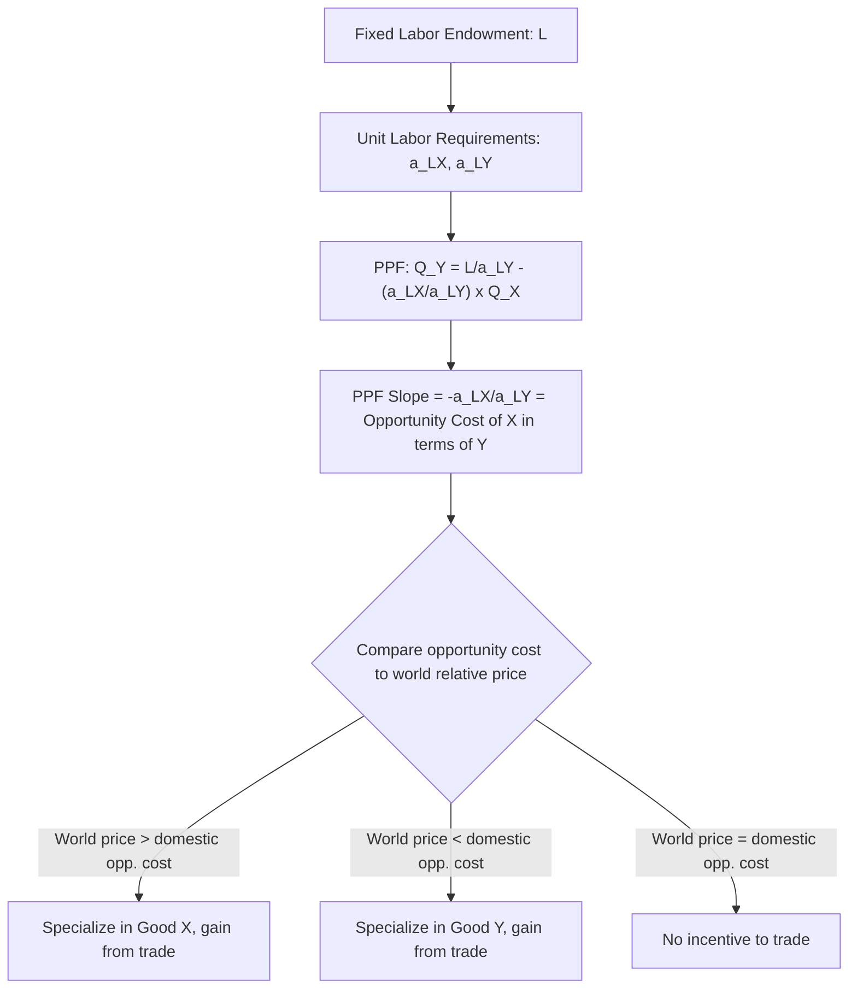

## Opportunity Cost and the Production Possibility Frontier

### Definition

**Opportunity cost** is the value of the next-best alternative forgone when a choice is made — in the context of the Ricardian trade model, it specifically refers to the amount of one good that must be sacrificed in order to produce one additional unit of another good, given a fixed resource base (labor).

The **Production Possibility Frontier (PPF)**, also called the Production Possibility Curve, is a graphical and mathematical representation of the maximum combinations of two goods an economy can produce given its fixed factor endowment (in the Ricardian model, its labor force) and its production technology (unit labor requirements), assuming full and efficient utilization of resources.

**Key Points**

- In the Ricardian model, opportunity cost is **constant** along the entire PPF, because unit labor requirements are assumed constant regardless of output level — this produces a **linear (straight-line) PPF**, in contrast to the bowed-out (concave) PPF typical of models with increasing opportunity costs.
- The slope of the PPF *is* the opportunity cost, expressed as a marginal rate of transformation between the two goods.
- Differences in the slope of the PPF between countries (i.e., differences in opportunity cost) are the fundamental source of comparative advantage and the basis for mutually beneficial trade.

### Deriving the Production Possibility Frontier

Given a fixed labor endowment $L$, and unit labor requirements $a_{LX}$ and $a_{LY}$ for goods X and Y respectively, the full-employment constraint is:

$$a_{LX} \cdot Q_X + a_{LY} \cdot Q_Y = L$$

Solving for $Q_Y$ in terms of $Q_X$ gives the equation of the PPF:

$$Q_Y = \frac{L}{a_{LY}} - \frac{a_{LX}}{a_{LY}} Q_X$$

This is a straight line with:

- **Y-intercept**: $L / a_{LY}$ — the maximum quantity of Good Y producible if all labor is devoted to Good Y (i.e., $Q_X = 0$).
- **X-intercept**: $L / a_{LX}$ — the maximum quantity of Good X producible if all labor is devoted to Good X (i.e., $Q_Y = 0$).
- **Slope**: $-\dfrac{a_{LX}}{a_{LY}}$ — the negative of the opportunity cost of Good X in terms of Good Y.

**Example**

Suppose a country has a total labor endowment of $L = 1{,}200$ hours, with unit labor requirements $a_{LX} = 4$ hours per unit of Good X and $a_{LY} = 6$ hours per unit of Good Y.

- Maximum Good X (if all labor devoted to X): $1200 / 4 = 300$ units.
- Maximum Good Y (if all labor devoted to Y): $1200 / 6 = 200$ units.
- PPF equation: $Q_Y = 200 - \dfrac{4}{6} Q_X = 200 - 0.667\,Q_X$
- Opportunity cost of 1 unit of Good X: $4/6 \approx 0.67$ units of Good Y forgone.

If the country wishes to produce 150 units of Good X, it must produce $Q_Y = 200 - 0.667(150) = 100$ units of Good Y, consistent with full employment of its 1,200 labor hours: $4(150) + 6(100) = 600 + 600 = 1200$. ✓

### Interpreting the Slope as Opportunity Cost

The absolute value of the PPF's slope, $\dfrac{a_{LX}}{a_{LY}}$, represents the number of units of Good Y that must be forgone to produce one additional unit of Good X. This can be understood intuitively through the labor reallocation mechanism:

- Producing 1 more unit of Good X requires $a_{LX}$ additional labor hours.
- Those $a_{LX}$ hours must be withdrawn from Good Y production.
- Since each unit of Good Y requires $a_{LY}$ hours, withdrawing $a_{LX}$ hours from Good Y reduces Good Y output by $a_{LX}/a_{LY}$ units.

This is why the opportunity cost of Good X in terms of Good Y is exactly $a_{LX}/a_{LY}$, and why, under the constant-unit-labor-requirement assumption, this opportunity cost does **not change** regardless of how much of Good X is already being produced — the PPF is linear rather than curved.

### Diagrammatic Representation

Below is an SVG illustration of a linear Ricardian PPF, showing the constant slope (constant opportunity cost) characteristic of the one-factor model.

<svg xmlns="http://www.w3.org/2000/svg" viewBox="0 0 500 400">
<text x="250" y="25" text-anchor="middle" font-size="16" font-weight="bold" fill="#1a1a1a">Linear Production Possibility Frontier (svg_diagram)</text>

<line x1="70" y1="340" x2="70" y2="50" stroke="#333" stroke-width="2" />
<line x1="70" y1="340" x2="440" y2="340" stroke="#333" stroke-width="2" />

<polygon points="70,45 65,55 75,55" fill="#333" />
<polygon points="445,340 435,335 435,345" fill="#333" />

<text x="250" y="375" text-anchor="middle" font-size="14" fill="`#1a1a1a`">Good X (Q_X)</text>

<text x="30" y="190" text-anchor="middle" font-size="14" fill="`#1a1a1a`" transform="rotate(-90 30 190)">Good Y (Q_Y)</text>

<line x1="70" y1="80" x2="400" y2="340" stroke="#2563eb" stroke-width="3" />

<circle cx="70" cy="80" r="4" fill="#2563eb" />
<text x="45" y="75" text-anchor="end" font-size="12" fill="#2563eb">L / a_LY</text>
<circle cx="400" cy="340" r="4" fill="#2563eb" />
<text x="400" y="358" text-anchor="middle" font-size="12" fill="#2563eb">L / a_LX</text>

<circle cx="235" cy="210" r="5" fill="#dc2626" />
<text x="245" y="205" font-size="12" fill="#dc2626">Point on PPF (full employment)</text>

<circle cx="180" cy="270" r="5" fill="#16a34a" />
<text x="190" y="285" font-size="12" fill="#16a34a">Point inside PPF (underemployment)</text>

<circle cx="330" cy="150" r="5" fill="#9333ea" />
<text x="270" y="140" font-size="12" fill="#9333ea">Point outside PPF (infeasible)</text>

<text x="250" y="230" font-size="13" fill="`#1a1a1a`" font-style="italic">Slope = -a_LX / a_LY</text>

<text x="250" y="248" font-size="13" fill="`#1a1a1a`" font-style="italic">= constant opportunity cost</text>

</svg>

### Points On, Inside, and Outside the PPF

| Location Relative to PPF | Interpretation |
| --- | --- |
| On the PPF | Full and efficient employment of the labor force; maximum feasible output combination |
| Inside the PPF | Feasible but inefficient — some labor is unemployed or underutilized |
| Outside the PPF | Infeasible given current labor endowment and technology — unattainable without additional resources, improved technology, or (crucially, per the trade model) international trade |

### The PPF and the Case for Trade

A central result of the Ricardian model is that international trade allows a country to **consume** at points *outside* its own PPF, even though it cannot *produce* outside its PPF. This is achieved by:

1. Specializing production at (or near) one corner of the PPF (the good in which the country has comparative advantage), and
2. Trading a portion of that specialized output for the other good at the international relative price (terms of trade), which — as long as it differs from the country's autarky opportunity cost (its own PPF slope) — allows the country to reach a consumption bundle unattainable under autarky production alone.

$$\text{If World Relative Price} \neq \text{Domestic Opportunity Cost (PPF slope)} \implies \text{Gains from Trade Exist}$$

**Example (continued)**

Using the earlier numerical example (PPF: $Q_Y = 200 - 0.667\,Q_X$), suppose the world relative price of Good X (in terms of Good Y) is more favorable than the country's domestic opportunity cost of $0.667$ — say, 1 unit of Good Y per unit of Good X on world markets. The country would then specialize fully in producing Good X (300 units, using all 1,200 labor hours), and could trade along a steeper "trade line" through the specialization point, reaching consumption combinations of X and Y that lie outside the original domestic PPF, which was impossible under autarky.

### Diagrammatic Overview of the Opportunity Cost–PPF Relationship

### Linear vs. Bowed-Out (Concave) PPFs: A Key Model Distinction

It is important to distinguish the Ricardian model's linear PPF from the more commonly encountered **bowed-out (concave to the origin)** PPF found in introductory microeconomics and in models with multiple factors of production (such as Heckscher-Ohlin).

| PPF Shape | Underlying Assumption | Model |
| --- | --- | --- |
| Linear (straight line) | Constant opportunity cost; single factor (labor), constant unit labor requirements | Ricardian model |
| Concave (bowed outward) | Increasing opportunity cost as more of a good is produced, typically due to factors of production being imperfect substitutes across sectors (e.g., some land better suited to one crop, some labor better suited to one industry) | Heckscher-Ohlin model, general multi-factor models |

[Inference] The Ricardian model's linear PPF is a deliberate simplification rather than a claim about real-world production technology; it is adopted specifically because it isolates the effect of *comparative advantage based on technology differences* on trade patterns and gains from trade, without the additional complication of within-country factor reallocation costs that a concave PPF would introduce — a complication taken up explicitly in the specific-factors and Heckscher-Ohlin models covered later.

**Related Topics**

- Unit labor requirements and labor productivity
- Comparative advantage in the Ricardian model
- Relative prices and the determination of the terms of trade
- The specific-factors model and concave PPFs
- Heckscher-Ohlin model and factor-based opportunity cost
- Gains from trade: consumption beyond the PPF