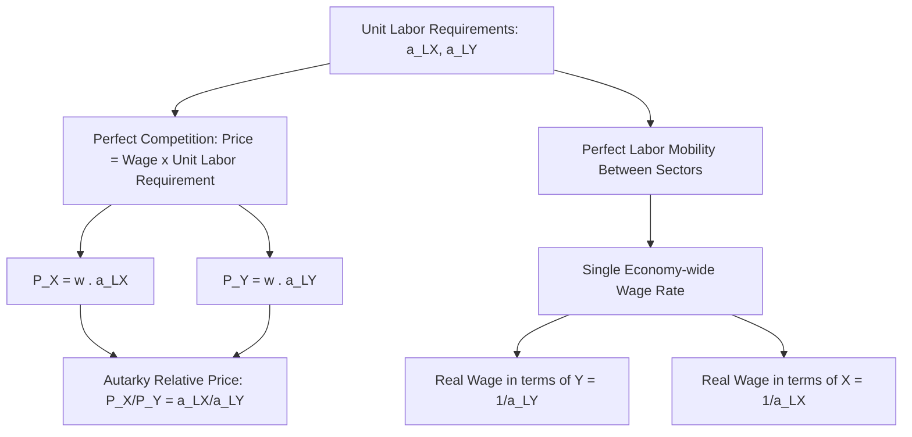

## Relative Prices and Wages Under Autarky

### Definition

Autarky refers to a state of economic self-sufficiency in which a country produces and consumes goods entirely domestically, with no international trade. Under autarky in the Ricardian model, relative prices and wages are determined entirely by domestic production technology (unit labor requirements) and the competitive behavior of firms and workers within the closed economy, establishing the theoretical benchmark against which the effects of opening to trade are subsequently evaluated.

**Key Points**

- Under autarky, the relative price of two goods is pinned down exactly by their relative unit labor requirements (equivalently, by the domestic opportunity cost, the slope of the PPF).
- Under perfect competition and labor mobility, a **single, economy-wide wage rate** prevails, since labor can freely move between sectors to arbitrage away any wage differential.
- Autarky relative prices and wages serve as the reference point for identifying whether, and in which direction, a country will trade once international trade becomes possible.

### Determination of Autarky Relative Price

In the Ricardian model, under perfect competition, the price of each good must equal its unit cost of production. Since labor is the only factor of production, the price of each good equals the wage rate multiplied by the unit labor requirement:

$$P_X = w \cdot a_{LX}$$

$$P_Y = w \cdot a_{LY}$$

where $w$ is the (single, economy-wide) wage rate, and $a_{LX}$, $a_{LY}$ are the unit labor requirements for Goods X and Y respectively.

Dividing these two equations, the wage rate $w$ **cancels out**, yielding the autarky relative price:

$$\frac{P_X}{P_Y} = \frac{a_{LX}}{a_{LY}}$$

This is a central and important result: **the autarky relative price of two goods equals the ratio of their unit labor requirements**, which is also, as shown in the treatment of the PPF, exactly equal to the (absolute value of the) slope of the country's Production Possibility Frontier — the domestic opportunity cost of Good X in terms of Good Y.

$$\frac{P_X}{P_Y} = \frac{a_{LX}}{a_{LY}} = \text{Opportunity Cost of Good X (in terms of Good Y)} = |\text{Slope of PPF}|$$

**Example**

If $a_{LX} = 4$ labor hours per unit and $a_{LY} = 6$ labor hours per unit, the autarky relative price is:

$$\frac{P_X}{P_Y} = \frac{4}{6} = 0.667$$

This means, under autarky, 1 unit of Good X trades domestically for 0.667 units of Good Y — precisely reflecting the fact that producing 1 unit of X requires two-thirds the labor of producing 1 unit of Y, and so must command two-thirds the price of Y in a competitive market where price equals unit labor cost.

### Determination of the Autarky Wage Rate

While relative prices are pinned down exactly by relative unit labor requirements (independent of wage level), the **absolute (nominal) wage rate** itself depends additionally on the price level and the specific good used as the numeraire (unit of account).

If Good Y is chosen as the numeraire (i.e., $P_Y = 1$), then from $P_Y = w \cdot a_{LY}$:

$$w = \frac{P_Y}{a_{LY}} = \frac{1}{a_{LY}}$$

The wage rate, expressed in terms of Good Y, equals the **labor productivity in Good Y** — the inverse of the unit labor requirement for the numeraire good. This reflects a broader principle: under perfect competition and full employment, the real wage in terms of any given good equals labor productivity in that good.

$$\text{Real Wage (in terms of Good Y)} = \frac{1}{a_{LY}}$$

$$\text{Real Wage (in terms of Good X)} = \frac{1}{a_{LX}}$$

**Example (continued)**

With $a_{LY} = 6$, the real wage in terms of Good Y is $1/6 \approx 0.167$ units of Good Y per labor hour. With $a_{LX} = 4$, the real wage in terms of Good X is $1/4 = 0.25$ units of Good X per labor hour. A worker earning this wage could, under autarky, purchase 0.167 units of Y or 0.25 units of X per hour worked — consistent, by construction, with the relative price $P_X/P_Y = 0.667$ derived above (since $0.25 \times 0.667 = 0.167$).

### Single Wage Rate Across Sectors: The Role of Labor Mobility

A foundational assumption of the Ricardian model is that labor is **perfectly mobile between sectors within a country** (though immobile between countries). This assumption is what forces a **single, uniform wage rate** to prevail economy-wide under autarky, regardless of which sector a worker is employed in.

The equalization mechanism works as follows: if the wage implied by production in Good X ever differed from the wage implied by production in Good Y, workers would have an incentive to move to the higher-paying sector, shifting labor supply and production until the wage equalizes across sectors. In equilibrium, both sectors must offer the same wage:

$$w = \frac{P_X}{a_{LX}} = \frac{P_Y}{a_{LY}}$$

This equality holds automatically as a consequence of the price = unit labor cost condition derived above, and is what pins down the specific relative price ratio $P_X/P_Y = a_{LX}/a_{LY}$ as the *unique* autarky equilibrium relative price — no other relative price would be consistent with a single equilibrium wage and full employment across both sectors.

### Diagrammatic Overview

### Autarky Equilibrium and the Consumption Point

Under autarky, since no international trade occurs, the equilibrium consumption bundle for the economy must coincide exactly with the equilibrium **production** bundle, and this bundle must lie **on** the PPF (assuming full employment). The specific point on the PPF at which the economy settles is determined by the interaction of the autarky relative price (which reflects the supply-side opportunity cost) with domestic demand (consumer preferences), following standard general-equilibrium logic: the tangency of a representative community indifference curve with the PPF, at a slope equal to the autarky relative price.

$$\text{Autarky Equilibrium: } \frac{P_X}{P_Y}\bigg|_{\text{demand}} = \frac{P_X}{P_Y}\bigg|_{\text{supply}} = \frac{a_{LX}}{a_{LY}}$$

[Inference] Because the Ricardian model's linear PPF implies a single, fixed relative price for any level of output (rather than a relative price that varies with the output mix, as under increasing opportunity costs), the specific autarky consumption point along the PPF is, strictly within the pure Ricardian framework, effectively determined by demand-side preferences alone, given that supply-side relative price is invariant to the output mix — a simplification that is relaxed in richer models incorporating diminishing returns or multiple factors.

### Significance as a Pre-Trade Benchmark

The autarky relative price serves as the essential reference point for Ricardian trade analysis:

- If the **world relative price** (the price ratio prevailing in international markets once trade opens) differs from a country's **autarky relative price**, the country has an incentive to trade, specializing in and exporting the good whose relative price is higher internationally than domestically.
- The **direction of comparative advantage** is determined precisely by comparing each country's autarky relative price (equivalently, its PPF slope, equivalently, its ratio of unit labor requirements) to that of its trading partner — the country with the *lower* autarky relative price for a given good is said to have comparative advantage in that good.
- Post-trade, wages in terms of the exported good tend to **rise** relative to autarky levels (workers can now purchase more of the imported good per hour worked than they could under autarky, since the effective relative price they face changes to the more favorable world price) — this is the formal wage-based expression of the gains from trade in the Ricardian framework.

**Example**

If a country's autarky relative price of Good X is $P_X/P_Y = 0.667$, but the world relative price is $P_X/P_Y = 1.0$ (Good X commands relatively more Good Y internationally than domestically), the country will find it advantageous to specialize in and export Good X, since it can now obtain more Good Y per unit of Good X exported (1.0 units of Y) than it could produce domestically by reallocating labor from X to Y (0.667 units of Y) — this price gap is precisely what generates gains from trade.

**Related Topics**

- Unit labor requirements and labor productivity
- Opportunity cost and the Production Possibility Frontier
- Determination of the range of mutually beneficial international prices
- Relative wages after trade: the Ricardian model's wage prediction
- Terms of trade and the gains from specialization
- General equilibrium in the Ricardian trade model