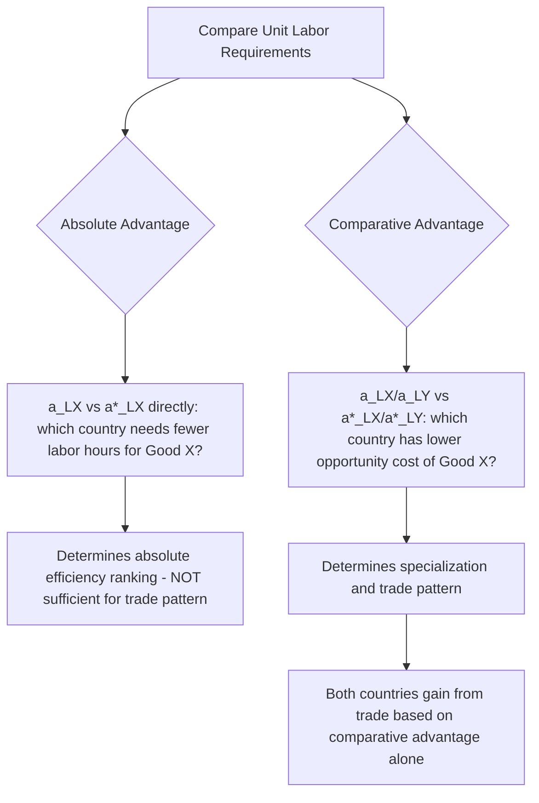

## Comparative Advantage Versus Absolute Advantage

### Definition

**Absolute advantage** is the ability of a country (or individual, firm) to produce a good using fewer resources (lower unit labor requirement) than another producer. **Comparative advantage** is the ability of a country to produce a good at a lower *opportunity cost* — relative to its own production of other goods — than another country. The distinction between these two concepts, and the demonstration that comparative advantage, not absolute advantage, is the correct basis for determining mutually beneficial trade, is David Ricardo's central and most enduring theoretical contribution to international economics (1817).

**Key Points**

- Absolute advantage compares **absolute** unit labor requirements for a *single good* across countries.
- Comparative advantage compares **relative** unit labor requirements (opportunity costs) *across goods, within each country*, and then compares those ratios *between countries*.
- Mutually beneficial trade is possible whenever comparative advantage differs between countries — **even if one country holds an absolute advantage in every good, or an absolute disadvantage in every good.**

### Formal Definitions

Given unit labor requirements $a_{LX}$, $a_{LY}$ for Home and $a^{*}_{LX}$, $a^{*}_{LY}$ for Foreign:

**Absolute advantage** in Good X: Home has an absolute advantage in X if

$$a_{LX} < a^{*}_{LX}$$

(Home requires fewer labor hours per unit of X than Foreign.)

**Comparative advantage** in Good X: Home has a comparative advantage in X if

$$\frac{a_{LX}}{a_{LY}} < \frac{a^{*}_{LX}}{a^{*}_{LY}}$$

(Home's opportunity cost of producing X, in terms of Y forgone, is lower than Foreign's.)

An algebraically equivalent way to state the comparative advantage condition, obtained by cross-multiplying, is:

$$\frac{a_{LX}}{a^{*}_{LX}} < \frac{a_{LY}}{a^{*}_{LY}}$$

This form directly compares each country's *relative efficiency* (its unit labor requirement relative to the other country's) across the two goods, and is often more intuitive: Home has a comparative advantage in X if its efficiency disadvantage (or advantage) in X, relative to Foreign, is smaller (or larger) than its relative efficiency in Y.

### The Key Ricardian Insight: Absolute Advantage Is Not Necessary for Trade

Ricardo's decisive contribution was demonstrating that **absolute advantage is neither necessary nor sufficient for determining the pattern of mutually beneficial trade** — only comparative advantage matters. This can be shown most starkly in the case where one country holds an absolute advantage in *both* goods.

**Example: Absolute Advantage in Both Goods, Yet Comparative Advantage Diverges**

|  | Good X (hours/unit) | Good Y (hours/unit) |
| --- | --- | --- |
| Home | 2 | 3 |
| Foreign | 6 | 12 |

Here, Home has an **absolute advantage in both goods** — it requires fewer labor hours than Foreign to produce either X (2 < 6) or Y (3 < 12). Under a naive absolute-advantage framework, it might appear there is no basis for Foreign to gain from trade, since Foreign is less efficient at producing everything.

However, examining **opportunity costs**:

- Home's opportunity cost of X (in terms of Y): $2/3 \approx 0.667$
- Foreign's opportunity cost of X (in terms of Y): $6/12 = 0.5$

Since Foreign's opportunity cost of producing X (0.5) is *lower* than Home's (0.667), **Foreign has a comparative advantage in Good X**, despite having an absolute disadvantage in it. Correspondingly:

- Home's opportunity cost of Y: $3/2 = 1.5$
- Foreign's opportunity cost of Y: $12/6 = 2.0$

Home's opportunity cost of Y (1.5) is lower than Foreign's (2.0), so **Home has a comparative advantage in Good Y**.

Despite Home's absolute advantage in everything, **both countries still gain from specializing according to comparative advantage**: Home should specialize in Y, Foreign should specialize in X, and both should trade — precisely the same qualitative conclusion as in cases without any absolute advantage asymmetry.

### Why This Result Holds: The Intuition

The key insight is that opportunity cost is inherently a *relative*, not absolute, concept. Even though Foreign is less efficient than Home at producing *both* goods in absolute terms, Foreign is *relatively less inefficient* at producing X than at producing Y (Foreign needs 3x the labor Home needs for X, but 4x the labor Home needs for Y). This relative efficiency difference — not the absolute efficiency level — is what determines the pattern of comparative advantage and the gains from specialization.

[Inference] This result is frequently characterized as one of the most counter-intuitive but robust findings in economics, precisely because it runs against the common-sense intuition (closely related to the mercantilist and pre-Ricardian view) that a country "worse at everything" cannot benefit from trade — the Ricardian model shows this intuition to be mistaken as long as relative efficiencies (opportunity costs) differ, which they generically will unless technology ratios are identical across countries.

### Diagrammatic Overview

### Comparison Table

| Aspect | Absolute Advantage | Comparative Advantage |
| --- | --- | --- |
| Originator | Adam Smith (1776) | David Ricardo (1817) |
| Basis of comparison | Absolute unit labor requirement for one good | Relative unit labor requirements (opportunity cost) across goods |
| Comparison type | Cross-country, single good | Cross-good (within country), then cross-country |
| Necessary for gains from trade? | No | Yes — the correct and sufficient basis |
| Can a country lack it entirely? | Yes (in one, several, or all goods) | No — every country necessarily has a comparative advantage in *something*, as long as opportunity cost ratios differ across countries |
| Explains trade when one country is more efficient at everything? | No — appears to preclude gains from trade for the less efficient country | Yes — explains why trade remains mutually beneficial even in this case |

### The "Every Country Has a Comparative Advantage in Something" Result

A further important corollary is that, as long as the two countries' opportunity cost ratios are not *identical* (i.e., $a_{LX}/a_{LY} \neq a^{*}_{LX}/a^{*}_{LY}$), **each country will necessarily have a comparative advantage in exactly one of the two goods** — comparative advantage cannot fail to exist for at least one good in each country, because opportunity costs for the two goods are reciprocals of one another within each country, and a country cannot simultaneously have the higher opportunity cost for both goods relative to its trading partner.

$$\text{If } \frac{a_{LX}}{a_{LY}} \neq \frac{a^{*}_{LX}}{a^{*}_{LY}} \implies \text{Comparative advantage in some good exists for each country}$$

Only in the special (and empirically improbable) case where relative unit labor requirements are exactly identical across countries — i.e., $a_{LX}/a_{LY} = a^{*}_{LX}/a^{*}_{LY}$ — does no basis for comparative-advantage-driven trade exist, since both countries would face identical opportunity costs and thus identical autarky relative prices.

### Historical and Pedagogical Significance

- Smith's absolute advantage (1776) provided the first rigorous refutation of mercantilist zero-sum trade doctrine, but left unexplained the case of a country with no absolute advantage in anything.
- Ricardo's comparative advantage (1817) closed this gap, providing a **complete and general** theoretical basis for mutually beneficial trade that holds regardless of the pattern of absolute efficiency between countries.
- Comparative advantage remains, in modern trade theory, considered one of the most theoretically robust and widely accepted propositions in all of economics — frequently cited (originally attributed to Paul Samuelson) as an example of a true economic proposition that is simultaneously non-trivial and non-obvious to non-economists.

**Related Topics**

- Absolute advantage and Adam Smith's contribution
- Unit labor requirements and the Ricardian model
- Opportunity cost and the Production Possibility Frontier
- The range of mutually beneficial international relative prices
- Multi-good extensions of the Ricardian model
- Empirical tests of comparative advantage (MacDougall study)