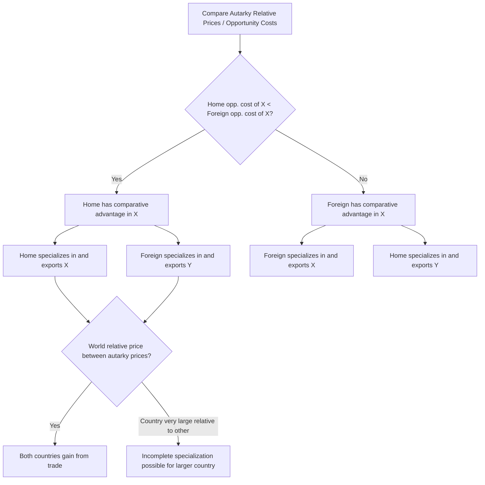

## Pattern of Trade in the Ricardian Model

### Definition

The pattern of trade refers to the determination of **which good each country exports and which it imports** once trade is opened between two countries in the Ricardian model. The Ricardian model provides an unambiguous and complete prediction: each country exports the good in which it holds a **comparative advantage** and imports the good in which its trading partner holds a comparative advantage — full specialization occurs (in the simplest two-country, two-good version) as long as country sizes and demand conditions permit it.

**Key Points**

- The pattern of trade is determined **solely by comparative advantage** (relative unit labor requirements), independent of demand-side considerations, in the basic two-good Ricardian model.
- Under free trade, each country tends toward **complete specialization** in producing only the good in which it has comparative advantage, ceasing production of the other good entirely (subject to a caveat regarding relative country size, addressed below).
- The direction of trade is determined by comparing autarky relative prices; the country with the lower autarky relative price for a good holds comparative advantage in it and becomes its exporter.

### Deriving the Pattern of Trade

Given unit labor requirements for Home ($a_{LX}, a_{LY}$) and Foreign ($a^{*}_{LX}, a^{*}_{LY}$), the pattern of trade follows directly from comparing autarky relative prices (equivalently, opportunity costs):

$$\text{If } \frac{a_{LX}}{a_{LY}} < \frac{a^{*}_{LX}}{a^{*}_{LY}} \implies \text{Home exports X, imports Y}$$

$$\text{If } \frac{a_{LX}}{a_{LY}} > \frac{a^{*}_{LX}}{a^{*}_{LY}} \implies \text{Home exports Y, imports X}$$

Home's lower autarky relative price of X (its lower opportunity cost of producing X) means Home can produce X "more cheaply," in opportunity-cost terms, than Foreign — making it advantageous for Home to specialize in and export X, while importing Y from Foreign, which specializes in and exports Y.

**Example**

Using representative unit labor requirements:

|  | Wine (hrs/unit) | Cloth (hrs/unit) |
| --- | --- | --- |
| Home | 2 | 4 |
| Foreign | 6 | 3 |

- Home's opportunity cost of wine: $2/4 = 0.5$ units of cloth
- Foreign's opportunity cost of wine: $6/3 = 2.0$ units of cloth

Since Home's opportunity cost of wine (0.5) is lower than Foreign's (2.0), **Home has comparative advantage in wine** and will export wine. Correspondingly, Foreign has comparative advantage in cloth (opportunity cost of cloth: Home $4/2=2.0$ vs. Foreign $3/6=0.5$) and will export cloth. The predicted pattern of trade is: **Home exports wine, imports cloth; Foreign exports cloth, imports wine.**

### Complete Specialization and Its Qualification

In the simplest version of the Ricardian model (two countries, two goods, one factor), free trade drives each country toward **complete specialization**: Home devotes all its labor to wine, Foreign devotes all its labor to cloth, and neither country produces any of the good in which it lacks comparative advantage.

However, complete specialization by **both** countries is not guaranteed in every case — it depends on relative country size (total labor endowment) and world demand patterns:

- If one country is very large relative to the other (e.g., Foreign's labor force vastly exceeds Home's), it is possible that even after Foreign fully specializes in cloth, world demand for wine may still exceed what Home alone can supply through complete specialization, requiring **Foreign to also produce some wine** despite lacking comparative advantage in it — resulting in **incomplete specialization** for the larger country while the smaller country remains completely specialized.
- This "large country" case leads to an important sub-result: when incomplete specialization occurs for one country, the **world relative price settles exactly at that country's autarky opportunity cost** for the good it partially produces, since that country must be indifferent (in terms of relative production costs) between producing the two goods it still makes.

[Inference] This qualification is typically introduced after the basic two-good, two-country case specifically to demonstrate that the "complete specialization" result, while a clean pedagogical benchmark, is not a strict theoretical necessity of the Ricardian model — it depends on the interaction between relative country size and relative world demand, a nuance often emphasized when extending the model toward more realistic multi-country or multi-good settings.

### The Role of the World Relative Price

Once trade opens, a single **world relative price** emerges (assuming no transport costs or trade barriers), replacing the two distinct (and initially divergent) autarky relative prices. This world price must lie **between** the two countries' autarky relative prices for trade to be mutually beneficial:

$$\frac{a_{LX}}{a_{LY}} < \left(\frac{P_X}{P_Y}\right)_{\text{world}} < \frac{a^{*}_{LX}}{a^{*}_{LY}}$$

- If the world price equals Home's autarky price exactly, Home gains nothing from trade (though Foreign still gains fully).
- If the world price equals Foreign's autarky price exactly, Foreign gains nothing from trade (though Home still gains fully).
- For **both** countries to gain from trade, the world price must lie strictly between the two autarky prices — this is the formal condition establishing the **range of mutually beneficial international prices**.

### Diagrammatic Overview

### Determinants Summarized: What the Pattern of Trade Depends On (and Does Not)

| Determines the Pattern of Trade | Does NOT Determine the Pattern of Trade (in the basic model) |
| --- | --- |
| Relative unit labor requirements (technology) across countries | Absolute unit labor requirements alone |
| Relative opportunity costs (comparative advantage) | Consumer preferences / demand conditions (in the basic 2x2 case, demand affects the *world price within the mutually beneficial range* and specialization completeness, but not the *direction* of comparative advantage itself) |
| — | Which country is "richer" or has higher absolute productivity overall |

### Empirical Considerations

Early empirical testing of the Ricardian pattern-of-trade prediction — most notably G.D.A. MacDougall's 1951 study comparing US and UK export patterns against relative labor productivity across many industries — found a positive relationship consistent with the model's prediction: industries where a country's relative labor productivity was higher tended to be the industries in which that country held a larger share of combined export markets, lending empirical support to the comparative-advantage-driven pattern-of-trade mechanism.

[Unverified] Subsequent empirical trade literature has generally found that while the basic comparative-advantage mechanism has real explanatory power, actual observed trade patterns — particularly extensive intra-industry trade among similar, developed economies — require additional explanatory mechanisms beyond the single-factor Ricardian framework (such as the economies-of-scale and product-differentiation mechanisms of new trade theory), meaning the Ricardian pattern-of-trade prediction is best understood as one important explanatory factor among several relevant to real-world trade patterns rather than a complete, standalone account.

**Related Topics**

- Comparative advantage versus absolute advantage
- The range of mutually beneficial international prices
- Complete versus incomplete specialization and country size effects
- Relative wages under autarky and after trade
- Empirical tests of the Ricardian model (MacDougall study)
- Intra-industry trade and new trade theory (as an extension beyond the Ricardian prediction)