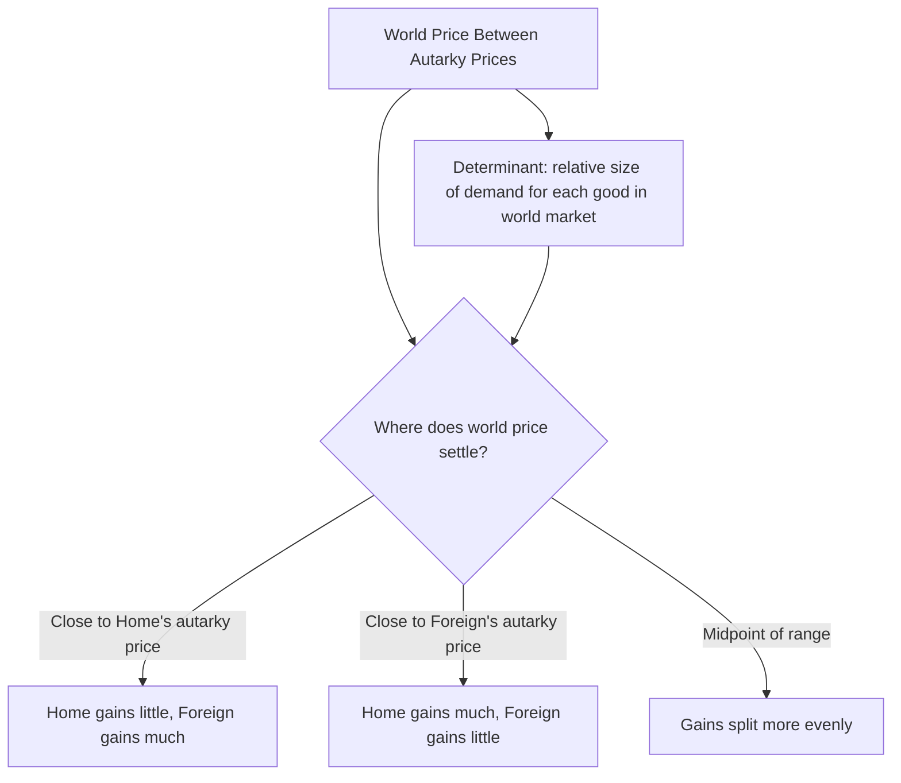

## Gains from Trade and the Distribution of Gains

### Definition

Within the Ricardian model, gains from trade refers to the increase in consumption possibilities and welfare that each trading country achieves once trade is opened, relative to autarky. The distribution of gains refers to how this total surplus from trade is divided between the two trading countries, which in the Ricardian framework depends specifically on **where the world relative price settles** within the range of mutually beneficial prices.

**Key Points**

- In the two-country, two-good Ricardian model, **both** countries gain from trade whenever the world relative price differs from either country's autarky relative price and lies between the two autarky prices.
- The distribution of the total gains from trade between the two countries is determined by **where within that range** the world price settles — a country gains more the further the world price moves from its own autarky price toward its trading partner's autarky price.
- Because the single-factor Ricardian model has only one factor (labor), it cannot generate *within-country* distributional conflict between different factors of production — all domestic labor gains uniformly, unlike in the Heckscher-Ohlin or specific-factors models.

### Formal Condition for Gains from Trade

Two gains from trade must hold for both countries to benefit:

$$\frac{a_{LX}}{a_{LY}} < \left(\frac{P_X}{P_Y}\right)_{\text{world}} < \frac{a^{*}_{LX}}{a^{*}_{LY}}$$

(assuming Home has comparative advantage in X, so its autarky price of X is lower than Foreign's).

- **Home gains** because it can now trade 1 unit of X for more units of Y on the world market than the $a_{LX}/a_{LY}$ units of Y it could obtain domestically by reallocating labor.
- **Foreign gains** because it can now obtain 1 unit of X by trading fewer units of Y than the $a^{*}_{LX}/a^{*}_{LY}$ units of Y it would need domestically to produce that unit of X itself.

### Illustrating the Gains via Real Wages

The gains from trade in the Ricardian model can be expressed concretely through their effect on real wages — the quantity of goods a worker's wage can purchase.

Under autarky, the real wage in terms of the imported good equals the domestic labor productivity in that good: $w_{\text{autarky, Y}} = 1/a_{LY}$ (for Home, using Y as the imported good in this setup would actually reverse; let's use the standard convention where Home imports Y).

Under free trade, Home fully specializes in X, and workers earn wages in terms of X: $w_{\text{trade, X}} = 1/a_{LX}$. To determine how much Y this wage can now purchase, multiply by the **world relative price**:

$$\text{Post-Trade Real Wage in Y} = \frac{1}{a_{LX}} \times \left(\frac{P_X}{P_Y}\right)_{\text{world}}$$

Since the world price of X (in terms of Y) exceeds Home's autarky price of X ($a_{LX}/a_{LY}$) by the gains-from-trade condition, this post-trade real wage in terms of Y **exceeds** the autarky real wage in terms of Y ($1/a_{LY}$), formally confirming that Home workers can consume more of the imported good after trade than before, for the same hours worked.

**Example**

Using $a_{LX} = 2$ (Home's unit labor requirement for wine) and $a_{LY} = 4$ (Home's unit labor requirement for cloth), Home's autarky real wage in terms of cloth is $1/4 = 0.25$ units of cloth per hour. If Home specializes in wine and the world relative price of wine (in terms of cloth) is 0.75 (compared to Home's autarky price of $2/4 = 0.5$), Home's post-trade real wage in terms of cloth becomes:

$$\frac{1}{2} \times 0.75 = 0.375 \text{ units of cloth per hour}$$

This exceeds the autarky real wage of 0.25 units of cloth per hour — Home workers can now purchase 50% more cloth per hour worked than under autarky, a direct and quantifiable expression of the gains from trade.

### Distribution of Gains Between Countries: The Role of the World Price

The **location of the world relative price within the mutually-beneficial range** determines how the total gains from trade are split between Home and Foreign:

- If the world price settles **close to Home's autarky price**, Home captures relatively **fewer** gains (its terms of trade improve only modestly relative to autarky), while Foreign captures relatively **more** gains (Foreign's terms of trade improve substantially).
- If the world price settles **close to Foreign's autarky price**, the reverse holds: Home captures relatively **more** gains, Foreign captures relatively **fewer**.
- If the world price coincides exactly with one country's autarky price, that country experiences **zero** gains from trade (though it still specializes and trades, its welfare is identical to autarky), while the other country captures the **entire** surplus from trade.

$$\text{Home's Share of Gains} \propto \left| \left(\frac{P_X}{P_Y}\right)_{\text{world}} - \frac{a_{LX}}{a_{LY}} \right|$$

**Example**

Continuing the wine/cloth example (Home autarky price = 0.5, Foreign autarky price = 2.0, illustrative), if the world price settles at 0.6 (close to Home's autarky price of 0.5), Home's gains are relatively small while Foreign's are relatively large. If instead the world price settles at 1.5 (closer to Foreign's autarky price of 2.0), Home captures the larger share of total gains from trade.

### Diagrammatic Overview

### What Determines Where the World Price Settles

The precise location of the world price within the mutually-beneficial range is determined by the interaction of **relative world supply and relative world demand** for the two goods — specifically, by the relative size of the two countries (their labor endowments, which determine relative supply capacity) and the relative strength of world demand for each good. A country whose export good is in especially high relative world demand will tend to see the world price settle more favorably (closer to its trading partner's autarky price), increasing its share of the gains from trade.

[Inference] This dependence on relative demand strength is one reason introductory treatments of the Ricardian model typically leave the exact split of gains from trade qualitative rather than fully quantified without additional demand-side assumptions (such as specifying community indifference curves or offer curves), since the supply side (unit labor requirements) alone determines only the *range* of possible mutually beneficial prices, not the specific point within that range at which trade settles.

### Within-Country Distribution: A Key Simplification of the Ricardian Model

A crucial feature — and limitation — of the Ricardian model is that because **labor is the only factor of production**, gains from trade accrue **uniformly to all domestic workers** as a single class; there is no mechanism within the model for trade to create winners and losers *within* a country, since all labor is homogeneous and perfectly mobile between sectors.

This stands in sharp contrast to richer trade models:

- The **specific-factors model** (factors immobile between sectors in the short run) predicts that factors specific to the *import-competing* sector lose from trade opening, even as the country gains in aggregate.
- The **Heckscher-Ohlin model**, via the **Stolper-Samuelson theorem**, predicts that the country's scarce factor of production loses in real terms from trade, even as the country gains in aggregate.

$$\text{Ricardian Model: } \Delta w > 0 \text{ for all workers} \quad \text{(no internal distributional conflict)}$$

[Inference] This absence of within-country distributional conflict is a direct artifact of the single-factor assumption rather than a general prediction about real-world trade; it is one of the most commonly cited reasons the Ricardian model, despite its central role in establishing the logic of comparative advantage, is considered an incomplete guide to the real-world political economy of trade policy, where distributional conflict among different factors and sectors is empirically prominent — a gap addressed by the specific-factors and Heckscher-Ohlin models introduced in later chapters.

### Summary of Key Results

| Result | Implication |
| --- | --- |
| World price strictly between autarky prices | Both countries gain from trade |
| World price equals one country's autarky price | That country gains nothing; the other captures all gains |
| World price closer to a country's own autarky price | That country's share of total gains is smaller |
| Single factor (labor) assumption | No within-country winners/losers; gains from trade are uniform across all domestic workers |

**Related Topics**

- The range of mutually beneficial international relative prices
- Pattern of trade in the Ricardian model
- Terms of trade and welfare
- The specific-factors model: within-country distributional effects
- Heckscher-Ohlin model and the Stolper-Samuelson theorem
- Offer curves and the determination of the world equilibrium price