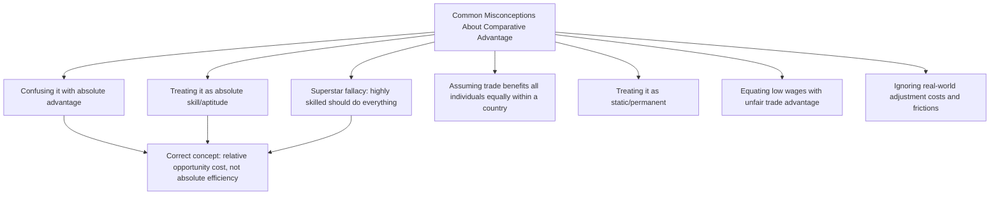

## Common Misconceptions About Comparative Advantage

### Overview

Comparative advantage is widely regarded as one of the most theoretically robust yet frequently misunderstood propositions in economics. Despite being logically straightforward once its formal structure is understood, the concept is routinely misapplied in public discourse, introductory learning, and even some professional policy discussion. This entry catalogs the most common misconceptions and clarifies the correct interpretation of each.

**Key Points**

- Most misconceptions about comparative advantage arise from conflating it with **absolute advantage**, or from implicitly assuming a single-factor, static world with no adjustment costs.
- The theoretical result itself (gains from trade based on relative opportunity cost) is robust; most misconceptions concern what the theorem does and does not imply for real-world policy.
- Recognizing these misconceptions is essential both for correctly applying the Ricardian model and for engaging critically with public trade policy debate.

### Misconception 1: "A country must have an absolute advantage to benefit from trade"

**The misconception**: If a country is less efficient than its trading partner at producing *every* good, it cannot gain from trade.

**The correction**: As demonstrated formally in the Ricardian model, comparative advantage — not absolute advantage — determines mutually beneficial trade. A country with an absolute disadvantage in every good will still have a comparative advantage in the good for which its relative (opportunity-cost) disadvantage is smallest, and specializing in that good still generates gains from trade for both countries.

$$\text{Absolute advantage in nothing} \neq \text{Comparative advantage in nothing}$$

As long as opportunity cost ratios differ between countries, each country necessarily has a comparative advantage in something, regardless of its absolute productivity level.

### Misconception 2: "Comparative advantage means being 'better' at something"

**The misconception**: Comparative advantage is a statement about aptitude, skill, or being "good" at a particular activity in an absolute sense.

**The correction**: Comparative advantage is a strictly **relative** concept — it concerns the *ratio* of opportunity costs across goods within a country, compared to the same ratio in another country. It says nothing about absolute skill or productivity level. A country (or individual) can have a comparative advantage in an activity at which it is, in absolute terms, worse than everyone else — the concept only requires that the *relative* inefficiency in that particular activity be smaller than the relative inefficiency in alternative activities.

[Inference] This misconception is especially common because "advantage" colloquially connotes superiority in an absolute sense, whereas the formal economic term is defined purely in relative, opportunity-cost terms — a terminological tension that likely contributes to persistent confusion even among students who have correctly derived the formal condition.

### Misconception 3: The "Superstar" Fallacy — "A highly skilled person should do everything themselves"

**The misconception**: If a highly skilled individual (e.g., a surgeon who also happens to type faster than any available assistant) is better than everyone else at *every* task, they should perform all tasks themselves rather than delegating.

**The correction**: This is a direct individual-level analogue of Misconception 1. Even if the surgeon can type faster than their assistant in absolute terms, the surgeon's *opportunity cost* of typing (measured in forgone surgery time, which is highly valuable) is almost certainly far higher than the assistant's opportunity cost of typing. The surgeon has a comparative advantage in surgery, the assistant has a comparative advantage in typing (despite an absolute disadvantage in both), and both benefit from specialization — the surgeon should perform surgery and delegate typing, even while being objectively faster at typing than the assistant.

**Example**

Suppose a surgeon can perform 1 surgery in 4 hours or type a report in 0.5 hours, while an assistant would need 8 hours to perform the same surgery (implausible, but illustrative) or 1 hour to type the same report. The surgeon has an absolute advantage in *both* tasks. But the surgeon's opportunity cost of typing (0.5 hours of typing = 1/8 of a surgery in forgone time, an extremely high opportunity cost given the surgeon's high-value alternative use of time) vastly exceeds the assistant's opportunity cost of typing. The surgeon should specialize in surgery; the assistant should specialize in typing.

### Misconception 4: "Comparative advantage implies trade benefits everyone within a country equally"

**The misconception**: Because a country as a whole gains from trade according to comparative advantage, every individual, worker, or industry within that country must also benefit.

**The correction**: This conflates **aggregate national gains** with **individual or sectoral distributional outcomes**. The basic Ricardian model (with its single-factor, perfectly-mobile-labor assumption) does predict uniform gains across all domestic workers, but this is a simplifying artifact of the model's single-factor structure, not a general economic truth. Richer models — the specific-factors model and the Heckscher-Ohlin model (via the Stolper-Samuelson theorem) — explicitly predict that trade can make specific factors or sectors *worse off* even while the country gains in aggregate. Comparative advantage establishes that **aggregate** gains exist and, in principle, could be redistributed to compensate losers (a Kaldor-Hicks efficiency argument) — it does not establish that such compensation actually occurs.

### Misconception 5: "Comparative advantage is a static, permanent characteristic of a country"

**The misconception**: A country's comparative advantage is fixed and unchanging — e.g., "Country X will always have a comparative advantage in agriculture."

**The correction**: Comparative advantage is determined by relative unit labor requirements (or, in richer models, relative factor endowments and productivity), which are **not** fixed over time. Technological change, capital accumulation, human capital investment, and shifts in factor endowments can all alter — and historically have altered — countries' patterns of comparative advantage over time (e.g., South Korea's transition from primarily agricultural and light-manufacturing exports in the mid-20th century to advanced electronics and shipbuilding exports by the late 20th and 21st centuries).

[Inference] This dynamic character of comparative advantage is part of the theoretical basis for infant-industry protection arguments, which hold that temporary protection may allow a country to develop comparative advantage in a sector it does not currently possess — though the practical efficacy and appropriate scope of such policies remains a genuinely contested question in applied trade policy, distinct from the underlying positive theory of comparative advantage itself.

### Misconception 6: "If wages are lower abroad, that country has an unfair trade advantage"

**The misconception**: A country with lower absolute wages than its trading partner has an inherently "unfair" cost advantage that should be offset through protectionist measures.

**The correction**: Under the Ricardian model, **relative** wage differences across countries are precisely what should be expected to emerge, and are consistent with, rather than a threat to, mutually beneficial trade based on comparative advantage — wages in the Ricardian model reflect relative labor productivity levels ($w = P/a_L$), and lower absolute wages in a lower-productivity country do not by themselves indicate unfair advantage, since the relevant comparison for trade benefit is relative opportunity cost, not absolute wage levels. [Inference] This does not mean labor standards, exchange rate manipulation, or other genuinely distinct policy concerns sometimes bundled into "low-wage competition" arguments are economically irrelevant — but the pure "low wages = unfair trade advantage" argument, taken as a direct implication of comparative advantage theory, reflects a conflation of absolute cost levels with the theoretically relevant relative opportunity cost concept.

### Misconception 7: "Comparative advantage requires no adjustment costs or frictions"

**The misconception**: Because the theoretical gains from specializing according to comparative advantage are unambiguous in the model, real-world trade liberalization should produce smooth, costless transitions to the new specialization pattern.

**The correction**: The basic Ricardian model assumes **instantaneous and costless labor reallocation** between sectors. In reality, labor market frictions — retraining costs, geographic immobility, industry-specific skills, and time lags — mean that the transition to a new pattern of specialization can impose substantial short-run adjustment costs on displaced workers and communities, even though the long-run equilibrium gains predicted by the model may still materialize. This gap between frictionless theoretical transition and costly real-world adjustment is a central practical consideration in trade policy design (e.g., the rationale for trade adjustment assistance programs).

### Diagrammatic Overview of Misconceptions

### Summary Table

| Misconception | Correct Understanding |
| --- | --- |
| Need absolute advantage to gain from trade | Only comparative (relative) advantage is required |
| Comparative advantage = being objectively good at something | It is a purely relative, opportunity-cost-based concept |
| Highly skilled individuals/countries should do everything themselves | High opportunity cost of their time makes specialization still optimal |
| Aggregate gains imply gains for everyone within the country | Aggregate gains coexist with possible within-country losers absent compensation |
| Comparative advantage is fixed over time | It shifts with technology, capital accumulation, and factor endowment changes |
| Lower foreign wages indicate unfair trade advantage | Wages reflect relative productivity; relevant comparison is opportunity cost, not absolute wage level |
| Trade transitions are costless | Real-world adjustment involves frictions absent from the frictionless theoretical model |

**Related Topics**

- Comparative advantage versus absolute advantage
- Gains from trade and the distribution of gains
- The specific-factors model and short-run adjustment costs
- Stolper-Samuelson theorem and within-country distributional effects
- Infant industry argument for protection
- Trade adjustment assistance policy