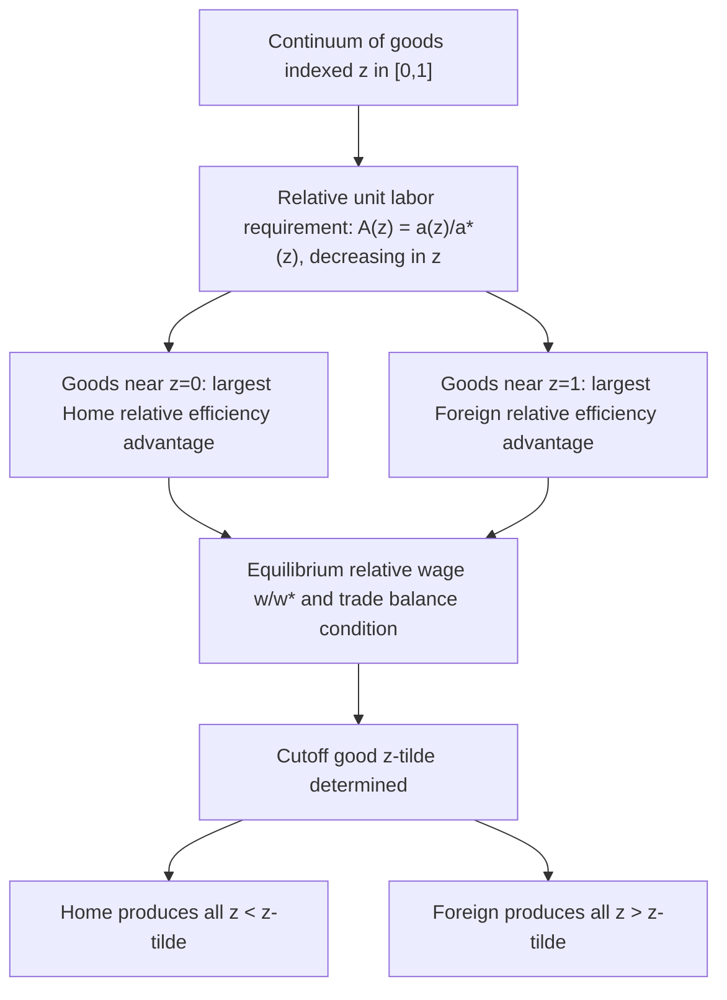

## The Dornbusch-Fischer-Samuelson Continuum of Goods Model

### Overview

The Dornbusch-Fischer-Samuelson (DFS) model, introduced by Rudiger Dornbusch, Stanley Fischer, and Paul Samuelson in their 1977 paper "Comparative Advantage, Trade, and Payments in a Ricardian Model with a Continuum of Goods" (*American Economic Review*), is a significant extension of the basic two-good Ricardian model to a setting with a **continuum (infinite range) of goods**. It generalizes the simple two-country, two-good Ricardian framework into a tractable model capable of analyzing the full pattern of specialization across an unlimited number of goods, while preserving the core comparative-advantage logic of the original Ricardian model.

**Key Points**

- The DFS model retains all the core assumptions of the basic Ricardian model (single factor of production, constant unit labor requirements, perfect competition) but generalizes from two goods to a continuum of goods indexed along the unit interval $[0, 1]$.
- The central analytical device is a **relative unit labor requirement function**, ordered so that goods can be ranked from "most Home-advantaged" to "most Foreign-advantaged."
- The model produces a clean, intuitive characterization of the pattern of trade: a single **cutoff good** divides the continuum into a range of goods produced by Home and a range produced by Foreign.

### Motivation for the Extension

The two-good Ricardian model, while pedagogically clean, has a significant limitation: with only two goods, the model can only illustrate the *logic* of comparative advantage but cannot meaningfully address questions involving:

- The **relative wage** between countries as an equilibrium outcome jointly determined with the pattern of trade (rather than treated as a separate calculation).
- How a **continuous range** of goods gets allocated between countries in equilibrium — which goods are produced domestically and which are imported.
- More realistic modeling of trade patterns in economies producing many differentiated goods or industries.

The DFS model addresses these limitations by introducing a continuum of goods, allowing for a richer and more general characterization of the equilibrium pattern of specialization and the equilibrium relative wage, while preserving analytical tractability.

### Formal Setup

Goods are indexed by $z \in [0, 1]$, a continuous variable. For each good $z$, unit labor requirements are specified for both Home, $a(z)$, and Foreign, $a^{*}(z)$.

The central object of analysis is the **relative unit labor requirement function**:

$$A(z) = \frac{a(z)}{a^{*}(z)}$$

This function is assumed to be **decreasing** in $z$ — goods are ordered (by convention) so that Home's relative efficiency advantage over Foreign is **largest** for goods with low $z$ (near $z = 0$) and **smallest** (or a relative disadvantage) for goods with high $z$ (near $z = 1$).

$$A'(z) < 0 \quad \text{(the relative unit labor requirement function is monotonically decreasing)}$$

This ordering assumption is what makes the model tractable — it guarantees a clean, single-cutoff pattern of specialization rather than an arbitrarily scattered allocation of goods between countries.

### Equilibrium Determination: The Relative Wage and the Cutoff Good

The DFS model determines equilibrium via the interaction of the relative unit labor requirement schedule with the **relative wage**, $\omega = w/w^{*}$ (Home's wage relative to Foreign's wage), which serves as the key equilibrating variable across the entire continuum.

**The specialization rule**: Home produces good $z$ if and only if it is relatively cheaper for Home to produce, i.e.:

$$w \cdot a(z) < w^{*} \cdot a^{*}(z) \quad \iff \quad \frac{a(z)}{a^{*}(z)} < \frac{w^{*}}{w} \quad \iff \quad A(z) < \frac{1}{\omega}$$

Because $A(z)$ is monotonically decreasing, this condition defines a unique **cutoff good** $\tilde{z}$ such that:

- For all $z < \tilde{z}$: $A(z) > 1/\omega$ — Home is relatively cheaper — **Home produces these goods**.
- For all $z > \tilde{z}$: $A(z) < 1/\omega$ — Foreign is relatively cheaper — **Foreign produces these goods**.

The equilibrium relative wage $\omega$ and the cutoff good $\tilde{z}$ are jointly determined, together with the requirement that **trade be balanced** (the value of Home's exports must equal the value of Home's imports, given each country's demand pattern across the continuum of goods).

### Diagrammatic Overview

### The Trade Balance Condition

Because the DFS model determines both the relative wage and the pattern of specialization simultaneously, it requires an explicit **balanced trade condition** — unlike the simple two-good model, where relative demand strength affects only where the world price settles within a known range, here relative demand affects the position of the cutoff good itself and the equilibrium relative wage jointly.

The balanced trade condition requires that the value of Home's income spent on Foreign-produced goods (Home's imports) equal the value of Foreign's income spent on Home-produced goods (Home's exports):

$$w \cdot L \cdot \theta(\tilde{z}) = w^{*} \cdot L^{*} \cdot [1 - \theta^{*}(\tilde{z})]$$

where $L$, $L^{*}$ are the labor endowments (country sizes) of Home and Foreign, and $\theta(\cdot)$, $\theta^{*}(\cdot)$ represent the share of income each country's residents spend on goods produced in the range $[0, \tilde{z}]$, reflecting demand-side (expenditure share) parameters across the continuum. [Inference] This condition is typically presented in textbook treatments using a simplified constant-expenditure-share (Cobb-Douglas-style) assumption across the continuum of goods, since a fully general demand specification would substantially complicate the closed-form characterization of equilibrium without adding materially to the qualitative insights the model is designed to illustrate.

### Key Insights and Extensions Enabled by the DFS Model

#### 1. Relative Wages as an Equilibrium Outcome

Unlike the basic two-good model (where relative wages, while derivable, are somewhat secondary to the direct comparison of opportunity costs), the DFS model places the **relative wage** at the center of the equilibrium determination, since it is precisely the variable that, combined with each good's technology ratio, sorts goods into the Home-produced and Foreign-produced ranges.

#### 2. Effects of Changes in Country Size or Technology

The continuum structure allows for clean comparative statics on how changes in underlying parameters shift the cutoff good and relative wage:

- An **increase in Home's labor force** ($L$ rises), holding technology fixed, tends to require a **wider range of goods produced by Home** (the cutoff $\tilde{z}$ shifts rightward) and, other things equal, may be associated with a change in the equilibrium relative wage — the specific direction depends on the balanced-trade condition and demand parameters.
- **Uniform technological improvement in Home** (a proportional reduction in $a(z)$ across all $z$) shifts the entire $A(z)$ schedule, expanding the range of goods for which Home is relatively cheaper, shifting the cutoff good rightward, and raising Home's equilibrium relative wage.

#### 3. Transportation Costs and Non-Traded Goods

The continuum-of-goods framework has also been extended (in DFS's original paper and subsequent literature) to incorporate **transportation costs**, which can generate an intermediate range of goods that are **non-traded** — goods for which the relative unit labor requirement gap between countries is too small to overcome the added cost of shipping, resulting in each country producing a local version of these goods domestically despite lacking a decisive comparative advantage.

$$\text{With transport costs: goods sorted into Home-traded, non-traded, and Foreign-traded ranges}$$

[Inference] This transportation-cost extension is often highlighted as one of the DFS model's most valuable practical contributions, since it provides a tractable, comparative-advantage-consistent framework for analyzing why not all goods are traded internationally in practice — a phenomenon the basic two-good Ricardian model, by construction, cannot address.

### Comparison to the Basic Two-Good Ricardian Model

| Feature | Basic Two-Good Ricardian Model | DFS Continuum Model |
| --- | --- | --- |
| Number of goods | 2 | Continuum, $z \in [0,1]$ |
| Pattern of trade | Direct comparison of two opportunity cost ratios | Cutoff good determined by relative wage and relative unit labor requirement schedule |
| Relative wage | Can be derived but is somewhat secondary | Central equilibrating variable |
| Trade balance | Implicit / simplified | Explicit balanced-trade condition required |
| Non-traded goods | Not addressed | Can be incorporated via transportation costs |
| Comparative statics | Limited (few parameters) | Rich (effects of country size, technology change, transport costs) |
| Tractability | Very high (introductory) | High, but requires more advanced mathematical treatment (continuum, monotonic function) |

### Significance and Legacy

The DFS model is widely regarded as the canonical generalization of the Ricardian trade model, providing the theoretical foundation for later work extending Ricardian-style comparative advantage analysis to settings with many goods, multiple countries, and richer demand structures. It has influenced subsequent quantitative trade models, including modern "new quantitative trade theory" frameworks (e.g., Eaton and Kortum, 2002) that build on the continuum-of-goods logic combined with probabilistic technology draws to generate tractable, empirically estimable multi-country Ricardian trade models.

**Related Topics**

- The basic two-good Ricardian model and comparative advantage
- Relative wages and equilibrium determination in trade models
- Non-traded goods and transportation costs in trade theory
- The Eaton-Kortum model and modern quantitative Ricardian trade theory
- Balanced trade conditions and general equilibrium in open economies
- Comparative statics: effects of technology and country size on trade patterns