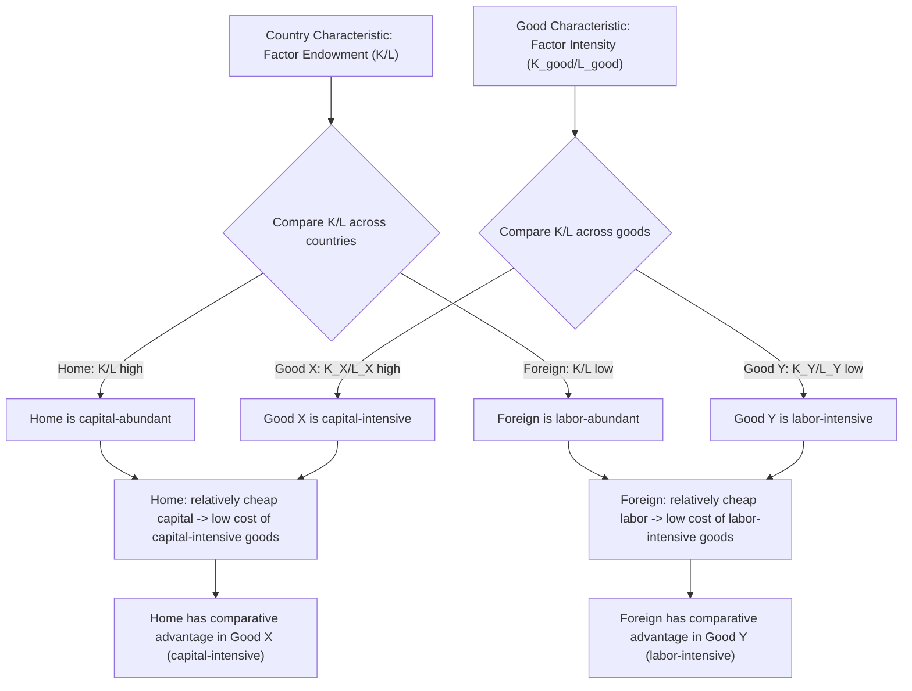

## Factor Endowments and Factor Intensity

### Definition

**Factor endowment** refers to the total quantity of a given factor of production (typically capital and labor in the standard two-factor model) that a country possesses and has available for production. **Factor intensity** refers to the relative proportion in which two factors are used in the production of a given good — a good is said to be capital-intensive if it uses relatively more capital per unit of labor than another good, and labor-intensive if it uses relatively more labor per unit of capital. These two concepts together form the foundational building blocks of the Heckscher-Ohlin model, which explains the pattern of comparative advantage and trade based on cross-country differences in factor endowments, in contrast to the Ricardian model's reliance on cross-country technology differences.

**Key Points**

- Factor endowments are a property of **countries**: how much capital and labor each country possesses in total.
- Factor intensity is a property of **goods** (or production processes): the ratio in which capital and labor are combined to produce a given good.
- The interaction between cross-country differences in factor endowments and cross-good differences in factor intensity is what generates the Heckscher-Ohlin theorem's prediction about the pattern of trade.

### Factor Endowments

In the standard two-factor Heckscher-Ohlin model, each country is characterized by its total endowment of capital ($K$) and labor ($L$). The **relative factor endowment** of a country is typically expressed as the capital-labor ratio:

$$\text{Home's capital-labor ratio} = \frac{K}{L}$$

$$\text{Foreign's capital-labor ratio} = \frac{K^{*}}{L^{*}}$$

A country is said to be **capital-abundant** relative to its trading partner if its capital-labor ratio exceeds that of the other country:

$$\text{Home is capital-abundant if: } \frac{K}{L} > \frac{K^{*}}{L^{*}}$$

Correspondingly, Foreign is **labor-abundant** relative to Home under the same condition. Factor abundance is thus, like comparative advantage in the Ricardian model, fundamentally a **relative**, not absolute, concept — it depends on the ratio of factor supplies, not the absolute quantity of either factor alone.

**Example**

Suppose Home has 800 units of capital and 200 units of labor ($K/L = 4$), while Foreign has 300 units of capital and 300 units of labor ($K^{*}/L^{*} = 1$). Even though Foreign might have less capital in absolute terms, the relevant comparison is the *ratio*: Home's capital-labor ratio (4) exceeds Foreign's (1), so **Home is capital-abundant** and **Foreign is labor-abundant**, regardless of the absolute quantities involved.

#### Alternative Definitions of Factor Abundance

Two distinct definitions of factor abundance are used in the trade literature:

| Definition | Basis | Formula |
| --- | --- | --- |
| **Physical definition** | Ratio of physical factor quantities | $K/L$ vs. $K^{*}/L^{*}$ |
| **Price definition** | Ratio of relative factor prices (rental rate to wage) | Home is capital-abundant if $(r/w) < (r^{*}/w^{*})$ — capital is relatively *cheap* in Home |

[Inference] The price-based definition is generally considered the more theoretically fundamental of the two in modern trade theory, since it directly reflects relative factor scarcity as revealed through market prices, whereas the physical definition can, in principle, diverge from the price definition if demand conditions differ substantially across countries — though under the standard Heckscher-Ohlin assumption of identical homothetic preferences across countries, the two definitions coincide, which is why introductory treatments frequently use them interchangeably.

### Factor Intensity

Factor intensity characterizes the **technology** used to produce a given good, specifically the ratio of capital to labor employed in its production. For two goods, X and Y, using capital-labor ratios $(K_X/L_X)$ and $(K_Y/L_Y)$ respectively:

$$\text{Good X is capital-intensive relative to Good Y if: } \frac{K_X}{L_X} > \frac{K_Y}{L_Y}$$

This condition is assumed to hold **regardless of the specific factor prices prevailing** — i.e., factor intensity rankings between two goods are assumed not to reverse at different relative factor prices (an assumption formally known as the "no factor-intensity reversal" condition, discussed further below).

**Example**

Consider semiconductor manufacturing (highly capital-intensive, requiring substantial fixed capital investment in fabrication equipment relative to the labor directly employed) versus garment assembly (comparatively labor-intensive, requiring substantial direct labor input relative to capital equipment). If $K_{\text{semi}}/L_{\text{semi}} = 20$ and $K_{\text{garment}}/L_{\text{garment}} = 2$, semiconductor manufacturing is capital-intensive relative to garment assembly, and this ranking is assumed to hold across the relevant range of relative factor prices both countries might face.

### The Interaction: Basis for the Heckscher-Ohlin Theorem

The core insight of the Heckscher-Ohlin model emerges from combining factor endowments (a country characteristic) with factor intensity (a good characteristic):

$$\text{Capital-abundant country} \implies \text{comparative advantage in capital-intensive good}$$

$$\text{Labor-abundant country} \implies \text{comparative advantage in labor-intensive good}$$

The underlying logic: a capital-abundant country will tend to have a relatively low rental price of capital and a relatively high wage (since capital is relatively plentiful and labor relatively scarce). This makes capital-intensive goods relatively cheap to produce domestically, giving the capital-abundant country a comparative advantage in capital-intensive goods — and by the same logic, a labor-abundant country will find labor-intensive goods relatively cheap to produce, giving it comparative advantage there.

### Diagrammatic Overview

### Factor Intensity Reversal

A specific technical qualification relevant to factor intensity is the possibility of **factor intensity reversal**: a situation in which the ranking of which good is more capital-intensive changes depending on the relative factor price ratio being considered. For example, Good X might be capital-intensive relative to Good Y at one relative wage-rental ratio, but labor-intensive relative to Good Y at a different relative wage-rental ratio, if the two goods' production technologies (elasticities of substitution between capital and labor) differ sufficiently.

The standard Heckscher-Ohlin model **assumes away** factor intensity reversal — it assumes each good's factor intensity ranking relative to other goods is stable across the full relevant range of factor prices. [Inference] This assumption is a standard simplifying restriction rather than a claim asserted to hold universally in real production technologies; its role is to guarantee the clean, unambiguous mapping from factor abundance to comparative advantage that constitutes the core Heckscher-Ohlin theorem, since without it the predicted pattern of trade could, in principle, become ambiguous or reverse depending on which country's factor price ratio is used as the reference point.

### Measuring Factor Endowments and Intensity in Practice

| Concept | Common Empirical Proxies |
| --- | --- |
| Capital endowment | Aggregate physical capital stock, gross fixed capital formation data, sometimes proxied by GDP per capita |
| Labor endowment | Labor force size, often adjusted for human capital/education (effective labor units) |
| Land endowment (in three-factor extensions) | Arable land area, natural resource reserves |
| Factor intensity of a good/industry | Capital expenditure per worker, industry-level capital-labor ratios from national input-output tables |

[Unverified] Empirical measurement of factor endowments and intensities is subject to significant data and methodological challenges — particularly regarding how to appropriately adjust "labor" for differences in human capital/skill across countries, and how to value heterogeneous capital stocks in a comparable way across countries — challenges that have motivated extensions of the basic two-factor Heckscher-Ohlin framework (e.g., incorporating skilled and unskilled labor as distinct factors) in applied and empirical trade research.

### Extensions Beyond the Two-Factor Case

While the canonical Heckscher-Ohlin model uses two factors (capital and labor) for tractability, factor endowment and factor intensity concepts generalize to models with additional factors:

- **Three-factor models**: commonly add land (or natural resources) as a third factor, relevant for analyzing trade patterns involving agricultural or resource-based goods.
- **Skilled vs. unskilled labor models**: split labor into two distinct factors (skilled and unskilled), used extensively in empirical analysis of trade's effects on wage inequality between skill groups.
- **Specific-factors model**: a related but distinct framework (typically covered separately) in which one factor is treated as sector-specific (immobile between sectors) in the short run, rather than freely mobile as in the standard Heckscher-Ohlin setup.

**Related Topics**

- The Heckscher-Ohlin theorem: formal statement and derivation
- Factor price equalization theorem
- The Stolper-Samuelson theorem
- The Rybczynski theorem
- The Leontief paradox and empirical tests of Heckscher-Ohlin
- The specific-factors model