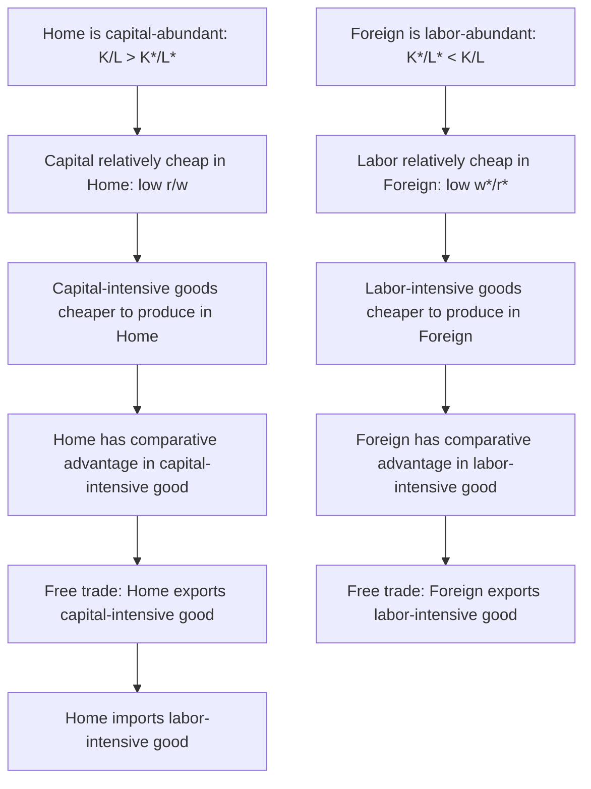

## The Heckscher-Ohlin Theorem

### Definition

The Heckscher-Ohlin theorem is the central proposition of the Heckscher-Ohlin model of international trade, stating that **a country will export the good that intensively uses its relatively abundant factor of production, and import the good that intensively uses its relatively scarce factor**. It was developed by Swedish economists Eli Heckscher (in a 1919 essay) and further formalized by his student Bertil Ohlin (in his 1933 doctoral dissertation, *Interregional and International Trade*), and later given rigorous mathematical formulation by Paul Samuelson, among others.

**Key Points**

- Unlike the Ricardian model, which attributes comparative advantage to cross-country **technology** differences, the Heckscher-Ohlin model attributes comparative advantage to cross-country **factor endowment** differences, holding technology identical across countries.
- The theorem provides a theoretically grounded prediction linking a country's resource base directly to its pattern of specialization and trade.
- The theorem is one of four major, closely related results collectively known as the "core" or "canonical" results of the Heckscher-Ohlin framework (alongside the Factor Price Equalization theorem, the Stolper-Samuelson theorem, and the Rybczynski theorem).

### Formal Statement

$$\text{Capital-abundant country} \implies \text{exports capital-intensive good}$$

$$\text{Labor-abundant country} \implies \text{exports labor-intensive good}$$

Formally, if Home is capital-abundant relative to Foreign ($K/L > K^{*}/L^{*}$), and Good X is capital-intensive relative to Good Y ($K_X/L_X > K_Y/L_Y$ at any common relative factor price), then under free trade, Home exports Good X and imports Good Y, while Foreign exports Good Y and imports Good X.

### Core Assumptions of the Heckscher-Ohlin Model

The theorem holds under a specific and demanding set of standard assumptions, often referred to as the "2x2x2" Heckscher-Ohlin model (2 countries, 2 goods, 2 factors):

1. **Two countries, two goods, two factors** (capital and labor) — the canonical simplification, though extensions relax this.
2. **Identical technology** across countries — both countries have access to the same production functions for each good (this is the key point of departure from the Ricardian model).
3. **Identical and homothetic preferences** across countries — consumers in both countries have the same relative demand pattern for the two goods at any given relative price, and demand shares do not vary systematically with income level.
4. **No factor-intensity reversal** — the ranking of which good is capital-intensive versus labor-intensive holds at all relevant relative factor prices.
5. **Perfect competition** in both goods and factor markets in both countries.
6. **Perfect factor mobility within, but not between, countries** — capital and labor can move freely between sectors domestically, but neither factor can migrate internationally.
7. **No transportation costs or trade barriers** — free and costless trade in goods (though not in factors).
8. **Incomplete specialization** — both countries continue producing both goods after trade opens (a diversification assumption, in contrast to the Ricardian model's typical prediction of complete specialization).

[Inference] This assumption set is considerably more restrictive than the Ricardian model's, which is generally understood as a deliberate trade-off: the Heckscher-Ohlin framework sacrifices some of the Ricardian model's simplicity in exchange for the ability to generate richer predictions about factor prices, income distribution, and the effects of factor endowment changes — predictions the single-factor Ricardian model cannot address at all.

### Intuition Behind the Theorem

The logic connecting factor abundance to the pattern of trade proceeds through relative factor prices:

1. A capital-abundant country will, in general equilibrium, have a **relatively low price of capital** (low rental rate $r$ relative to wage $w$) compared to a labor-abundant country, since capital is relatively plentiful.
2. Because capital-intensive goods use relatively more of the (relatively cheap) capital, they can be produced at a **relatively lower cost** in the capital-abundant country compared to the labor-abundant country.
3. This relative cost advantage translates into a **comparative advantage** in the capital-intensive good for the capital-abundant country, following the standard trade-theoretic link between relative production cost and comparative advantage.
4. Under free trade, this comparative advantage is realized as an actual **pattern of trade**: the capital-abundant country exports the capital-intensive good.

### Diagrammatic Overview

### Graphical Illustration: The Edgeworth Box and Relative Factor Prices

The Heckscher-Ohlin model is often illustrated using an **Edgeworth production box**, showing the allocation of a country's fixed total capital and labor endowments between two goods' production, with the contract curve (efficient allocations) generally bowing toward the corner corresponding to the good using relatively more of the country's abundant factor.

**Example**

Consider two countries, Home (capital-abundant, $K/L = 4$) and Foreign (labor-abundant, $K^{*}/L^{*} = 1$), producing two goods: automobiles (capital-intensive, requiring $K_A/L_A = 3$ in equilibrium) and textiles (labor-intensive, requiring $K_T/L_T = 0.5$ in equilibrium). Under the Heckscher-Ohlin theorem, **Home should export automobiles and import textiles**, while **Foreign should export textiles and import automobiles** — the pattern of trade follows directly from matching each country's relatively abundant factor to the good that uses it intensively.

### The Heckscher-Ohlin Theorem as Part of a Broader Set of Results

The Heckscher-Ohlin theorem is the first and most foundational of a family of four related theorems derived from the same underlying 2x2x2 model structure:

| Theorem | What It Predicts |
| --- | --- |
| **Heckscher-Ohlin theorem** | Pattern of trade: capital-abundant country exports capital-intensive good |
| **Factor Price Equalization theorem** | Free trade in goods equalizes relative (and, under further assumptions, absolute) factor prices across trading countries, even without factor mobility |
| **Stolper-Samuelson theorem** | An increase in the relative price of a good raises the real return to the factor used intensively in producing it, and lowers the real return to the other factor |
| **Rybczynski theorem** | At constant relative goods prices, an increase in the endowment of one factor leads to a more-than-proportional increase in output of the good that uses that factor intensively, and an absolute decline in output of the other good |

These four theorems are typically presented together as the "core theorems" of the Heckscher-Ohlin framework, since they share the same underlying assumptions and mathematical structure, and are often derived using the same general equilibrium apparatus.

### Empirical Testing: The Leontief Paradox

The most famous — and historically influential — empirical test of the Heckscher-Ohlin theorem is economist Wassily Leontief's 1953 study, which examined US trade patterns using input-output data. Leontief found that US exports were, counter to the theorem's prediction (given the US's presumed capital abundance relative to trading partners at the time), **more labor-intensive** and **less capital-intensive** than US imports — a finding that came to be known as the **Leontief Paradox**.

[Unverified] The precise resolution of the Leontief Paradox remains a subject of ongoing discussion in the trade literature; commonly proposed explanations include failing to adjust for differences in labor quality/human capital across countries (treating skilled and unskilled labor as a single homogeneous factor), the omission of land/natural resources as a distinct third factor, and the limitations of using a single country's input-output data to test a fundamentally multi-country theoretical prediction — but no single explanation has achieved universal consensus as the definitive resolution.

### Contemporary Status and Relevance

Despite the empirical challenges illustrated by the Leontief Paradox and subsequent studies, the Heckscher-Ohlin theorem remains a **foundational theoretical framework** in international economics, valued primarily for:

- Providing a rigorous, general-equilibrium account of how factor endowments — rather than technology alone — can generate comparative advantage and shape trade patterns.
- Serving as the theoretical basis for the Stolper-Samuelson theorem's widely cited predictions about the distributional effects of trade on factor returns (central to debates about trade and wage inequality).
- Providing the conceptual foundation for extended and modified versions (multi-factor, multi-country generalizations) that continue to inform applied and empirical trade research.

[Inference] The gap between the theorem's clean theoretical prediction and its more mixed empirical performance (as in the Leontief Paradox) is generally treated in the field not as a wholesale rejection of factor-endowment-based trade theory, but as motivation for refining and extending the model's assumptions (e.g., incorporating multiple factors, differentiated labor skill levels, and cross-country technology differences alongside factor endowment differences) rather than abandoning the factor-proportions approach to explaining trade patterns.

**Related Topics**

- Factor endowments and factor intensity
- The Factor Price Equalization theorem
- The Stolper-Samuelson theorem
- The Rybczynski theorem
- The Leontief Paradox and its proposed resolutions
- Multi-factor extensions of the Heckscher-Ohlin model