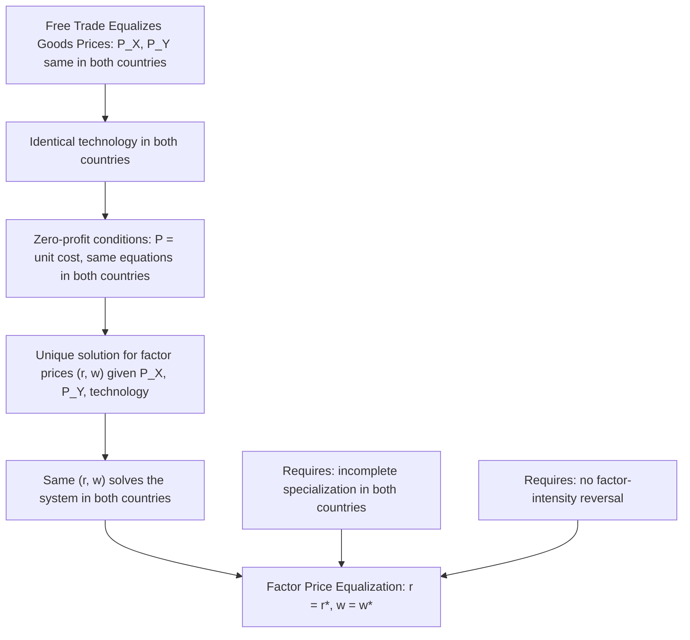

## Factor Price Equalization Theorem

### Definition

The Factor Price Equalization (FPE) theorem is one of the four core results of the Heckscher-Ohlin model, stating that **free trade in goods, under the standard Heckscher-Ohlin assumptions, will equalize the relative and absolute prices of factors of production (wages and rental rates) across trading countries — even in the complete absence of any international factor mobility**. This is a striking and somewhat counter-intuitive result: trade in goods alone can substitute perfectly for trade in factors themselves, achieving the same factor-price outcome that would occur if capital and labor could freely migrate across borders.

**Key Points**

- FPE predicts that free trade eliminates cross-country differences in wages and rental rates on capital, as long as both countries continue producing both goods (incomplete specialization) and share identical technology.
- The mechanism operates entirely through the price of traded *goods* equalizing across countries, which in turn forces factor prices to equalize via the underlying zero-profit (price = unit cost) conditions.
- The theorem is frequently cited both for its theoretical elegance and for the sharp divergence between its clean prediction and observed real-world persistent international wage differences — a gap central to ongoing debate about the theorem's practical relevance.

### The Logic of Factor Price Equalization

The FPE theorem's mechanism rests on a chain of general-equilibrium relationships connecting goods prices, technology, and factor prices, under the assumption of perfect competition (price equals unit cost of production) in both countries.

$$P_X = a_{KX} \cdot r + a_{LX} \cdot w$$

$$P_Y = a_{KY} \cdot r + a_{LY} \cdot w$$

where $a_{KX}$, $a_{LX}$, $a_{KY}$, $a_{LY}$ are the capital and labor requirements per unit of Goods X and Y (which, importantly, can themselves vary with relative factor prices, unlike in the fixed-coefficient Ricardian model), $r$ is the rental rate on capital, and $w$ is the wage rate.

**The key insight**: because both countries share **identical technology** (a core Heckscher-Ohlin assumption), and because free trade equalizes the **prices of goods** $P_X$ and $P_Y$ across countries (assuming no transport costs or trade barriers), these two equations — applied identically in both countries with the same $P_X$, $P_Y$, and the same production functions — admit only **one** consistent solution for the factor prices $(r, w)$, as long as both countries continue producing both goods. This unique solution must therefore be the **same** in both countries: $r = r^{*}$ and $w = w^{*}$.

### Diagrammatic Overview

### Formal Statement of the Theorem

**Factor Price Equalization Theorem**: Under the standard Heckscher-Ohlin assumptions (identical technology, no factor-intensity reversal, incomplete specialization in both countries, perfect competition, and free and costless trade in goods), free trade equalizes the wage rate and the rental rate on capital across the two trading countries, regardless of the countries' differing relative factor endowments:

$$w = w^{*} \quad \text{and} \quad r = r^{*}$$

This is a stronger result than mere **relative** factor price equalization ($r/w = r^{*}/w^{*}$) — under the full set of standard assumptions, FPE establishes equalization of **absolute** factor prices as well, not merely their ratio.

### Illustration via the Zero-Profit Condition Diagram

The equalization mechanism is commonly illustrated using a diagram plotting the two zero-profit conditions (for Goods X and Y) in $(w, r)$ space. Each good's zero-profit condition traces a downward-sloping curve in $(w, r)$ space (higher wages must be offset by lower rental rates, and vice versa, to keep unit costs equal to the fixed goods price). Given the equalized goods prices $P_X$ and $P_Y$ under free trade, and identical technology, the **two curves intersect at a single point** $(w, r)$ — and since both countries face the same two curves (same prices, same technology), both countries' factor prices are pinned to that same intersection point, **provided** both countries produce both goods (so that both zero-profit conditions are simultaneously binding).

### Critical Qualifications: When FPE Fails to Hold

The FPE result is a precise theoretical prediction that depends critically on several qualifying conditions, violations of which cause the equalization result to break down:

#### 1. Incomplete Specialization Requirement

FPE requires that **both** countries continue to produce **both** goods after trade opens. If factor endowments between countries are sufficiently different, one or both countries may **completely specialize** in producing only one good — in which case only one of the two zero-profit conditions binds in the specializing country, and the system no longer pins down a unique factor price vector matching the other country's. In this case, factor prices generally **will not** equalize, and the country with more extreme relative factor abundance retains a factor price advantage in its abundant factor.

$$\text{Factor endowments "too different"} \implies \text{complete specialization} \implies \text{FPE breaks down}$$

#### 2. Identical Technology Requirement

If countries have **different technology** (production functions) rather than identical technology — a Ricardian-style difference — the zero-profit condition equations differ across countries even at equalized goods prices, and there is no reason for the resulting factor price solutions to coincide.

#### 3. No Factor-Intensity Reversal

If factor-intensity rankings between goods reverse at different relative factor prices, the clean, unambiguous mapping from goods prices to a unique factor price vector can break down, undermining the equalization result.

#### 4. No Trade Barriers or Transportation Costs

Any wedge between the goods prices actually faced by the two countries (tariffs, transport costs, non-tariff barriers) directly undermines the premise that $P_X$ and $P_Y$ are literally identical across countries, which is the foundational trigger for the equalization mechanism.

### The "Factor Price Insensitivity" Corollary

A related and important corollary of the FPE logic is sometimes called **factor price insensitivity**: within the range where both goods continue to be produced, changes in a country's relative factor endowment (e.g., an increase in the labor force through population growth or immigration) do **not** change domestic factor prices at all — instead, they are absorbed entirely through a **change in the output mix** (more of the good using the newly abundant factor intensively), a result formalized separately as the Rybczynski theorem. Factor prices remain determined solely by goods prices and technology, as long as diversified (incomplete-specialization) production continues.

[Inference] This factor price insensitivity result is often presented as a striking implication of the Heckscher-Ohlin model's general-equilibrium structure — it implies that, within the diversification cone, purely domestic factor supply changes (e.g., labor force growth) have no effect on domestic wages, with all the adjustment instead occurring through reallocation of production across sectors — a prediction that stands in notable contrast to simple partial-equilibrium supply-and-demand intuition about factor markets.

### Empirical Relevance and Critique

The FPE theorem is widely regarded, even within the field, as one of the clearest examples in trade theory of a theoretically elegant result whose real-world empirical validity is limited:

- **Persistent international wage differences**: observed wages differ substantially and persistently across countries, in clear tension with the theorem's strong prediction of exact equalization.
- **Commonly cited explanations for the empirical gap**: differences in technology across countries (violating the identical-technology assumption), trade barriers and transportation costs (violating the free-trade assumption), extensive complete specialization by many countries in practice (violating the incomplete-specialization requirement), and differences in human capital/labor quality not captured by a simple homogeneous-labor factor.

[Unverified] Some scholars have argued that FPE may hold approximately, or as a tendency, among certain groups of similarly-endowed, closely trade-integrated economies (a "conditional" or "local" factor price convergence), even though it manifestly does not hold in a strict, global sense across all trading nations — but the appropriate scope and empirical support for even this weaker, conditional version of the claim remains a matter of ongoing debate rather than settled consensus in the literature.

### Theoretical Significance Despite Empirical Limitations

Despite its limited direct empirical validity, the FPE theorem remains highly significant in international economics for several reasons:

- It formally establishes that trade in goods can serve as a **substitute** for trade in factors, a foundational insight connecting the theory of goods trade to broader questions about international factor mobility and migration.
- It provides essential theoretical scaffolding for the Stolper-Samuelson theorem, since both rely on the same zero-profit, general-equilibrium apparatus linking goods prices to factor prices.
- It clarifies the **specific conditions** (incomplete specialization, identical technology, free trade) under which factor price convergence would theoretically be expected, providing a rigorous benchmark against which real-world deviations can be interpreted and explained.

**Related Topics**

- The Heckscher-Ohlin theorem
- The Stolper-Samuelson theorem
- The Rybczynski theorem
- Factor-intensity reversal
- The Leontief Paradox
- International labor migration as an alternative to trade-based factor price convergence