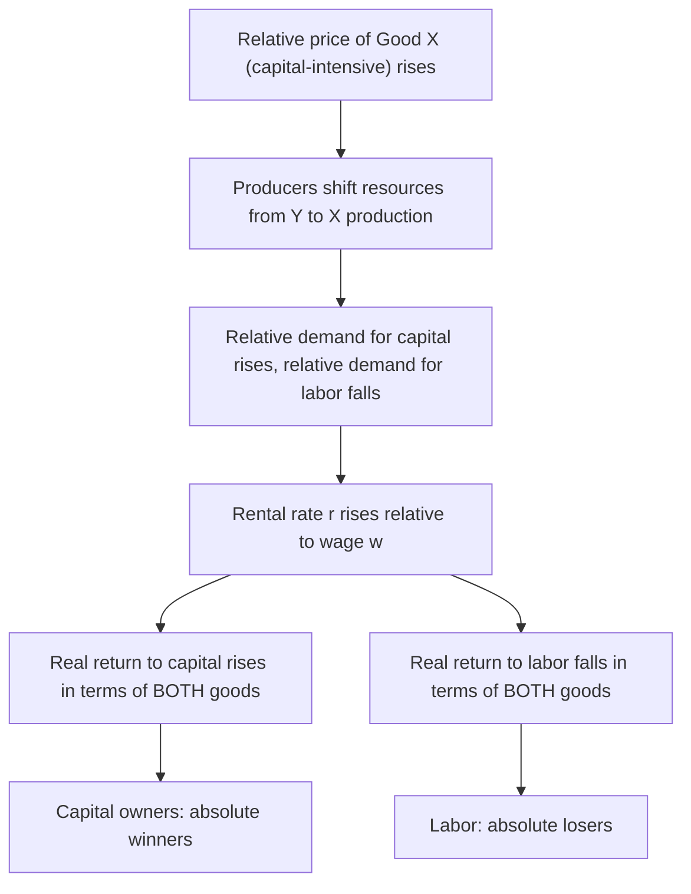

## The Stolper-Samuelson Theorem

### Definition

The Stolper-Samuelson theorem, developed by Wolfgang Stolper and Paul Samuelson in their 1941 paper "Protection and Real Wages," is one of the four core results of the Heckscher-Ohlin model. It states that **an increase in the relative price of a good raises the real return to the factor of production used intensively in producing that good, and lowers the real return to the other factor** — in both cases, by more than proportionally relative to the price change (the "magnification effect"). Applied to trade policy, the theorem implies that opening a country to trade (or, in reverse, imposing protection) generates predictable **winners and losers among factors of production**, not merely among industries or sectors.

**Key Points**

- The theorem provides the theoretical basis for one of the most consequential and politically salient results in international trade theory: that trade can make a country's **scarce factor of production absolutely worse off**, even while the country as a whole gains in aggregate.
- It applies within the same 2x2x2 Heckscher-Ohlin framework (two goods, two factors, identical technology, perfect competition, incomplete specialization) used for the Heckscher-Ohlin and Factor Price Equalization theorems.
- The theorem's "magnification effect" is a particularly striking and non-obvious component: the *percentage* change in factor returns exceeds the percentage change in the goods price that triggered it.

### Formal Statement

Consider two goods, X (capital-intensive) and Y (labor-intensive), and two factors, capital ($K$, return $r$) and labor ($L$, return $w$). If the relative price of Good X rises ($P_X$ increases relative to $P_Y$):

$$\hat{P}_X > 0 \implies \hat{r} > \hat{P}_X > 0 > \hat{P}_Y > \hat{w}$$

where $\hat{x}$ denotes the percentage change in variable $x$. In words: the **real return to capital** (the factor used intensively in the now-more-expensive good X) rises by a *greater* percentage than the price of X itself, while the **real return to labor** *falls* — the wage rate falls not just relative to the price of X, but in absolute real terms relative to both goods' prices.

### The Magnification Effect

The Stolper-Samuelson theorem's "magnification effect" is the specific quantitative claim that changes in factor prices exceed, in percentage terms, the change in the goods price that caused them:

$$\hat{r} > \hat{P}_X > \hat{P}_Y > \hat{w} \quad \text{(when } \hat{P}_X > \hat{P}_Y \text{, i.e., relative price of X rises)}$$

This magnification arises because, in a two-good, two-factor, constant-returns-to-scale setting, a change in a good's price must be fully absorbed by changes in the (weighted-average) returns to the factors used to produce it. Since Good X uses capital intensively, and capital's return must rise by *more* than the price of X to compensate for labor's return falling (labor also being used, just less intensively, in Good X's production), the arithmetic of the zero-profit condition forces $\hat{r}$ to exceed $\hat{P}_X$.

### Intuition: The General Equilibrium Mechanism

The theorem's result can be understood through a step-by-step general equilibrium chain of reasoning:

1. The relative price of Good X (capital-intensive) rises.
2. Producers of Good X find it profitable to expand output; producers of Good Y (labor-intensive) contract.
3. As resources shift from Y-production to X-production, **relative demand for capital rises** (since X is capital-intensive) and **relative demand for labor falls** (since Y, which uses labor intensively, is contracting).
4. With **fixed total factor endowments** (in the short-to-medium run, before endowments themselves change), this shift in relative factor demand raises the **rental rate on capital** relative to the **wage rate**: $r/w$ rises.
5. Because the rise in $r/w$ is large enough, it is not merely that capital gains relative to labor — capital's return rises in terms of **both** goods (an absolute, not just relative, gain), while labor's return falls in terms of **both** goods (an absolute loss).

### Diagrammatic Overview

### Application to Trade Policy: Trade Liberalization and Protection

The Stolper-Samuelson theorem's most direct and widely cited application is to the **distributional effects of trade liberalization or protection**:

- **Trade liberalization** (reducing tariffs) causes the domestic relative price of the import-competing good to fall (since it can now be purchased more cheaply from abroad) and the domestic relative price of the export good, in relative terms, to rise. By the theorem, this **raises the real return to the factor used intensively in the export good** (typically the country's abundant factor, per the Heckscher-Ohlin theorem) and **lowers the real return to the factor used intensively in the import-competing good** (typically the country's scarce factor).
- **Protection (tariffs)** produces the reverse effect: raising the domestic relative price of the import-competing good, thereby *raising* the real return to the factor used intensively in the protected, import-competing sector — this is the formal theoretical basis for the classic "protection raises the real wage of the scarce factor" argument, which is precisely the titular claim of Stolper and Samuelson's original 1941 paper (analyzing how tariffs could raise real wages if labor is the scarce factor in a capital-abundant country).

**Example**

Consider a capital-abundant country (by the Heckscher-Ohlin theorem, exporting the capital-intensive good and importing the labor-intensive good). Trade liberalization lowers the domestic price of the imported labor-intensive good. By Stolper-Samuelson, this **raises the real return to capital** (the abundant factor, used intensively in the export good whose relative price effectively rises) and **lowers the real wage** (since labor, the scarce factor, is used intensively in the now-cheaper import-competing good). Labor in this capital-abundant country is predicted to be an absolute loser from trade liberalization, even though the country as a whole gains in aggregate (per the general gains-from-trade result) — this is a formal illustration of how aggregate national gains can coexist with a losing factor of production.

### Relationship to the Heckscher-Ohlin Theorem

The Stolper-Samuelson theorem is a direct corollary of the same zero-profit conditions used to derive the Heckscher-Ohlin and Factor Price Equalization theorems, but it shifts the analytical focus from **the pattern of trade** (Heckscher-Ohlin theorem) to **the distributional consequences of trade** for factor owners. Combined, the two theorems yield the striking joint prediction:

$$\text{Trade liberalization} \implies \text{country's abundant factor gains, scarce factor loses (in real terms)}$$

This linkage — connecting a country's factor abundance (Heckscher-Ohlin) to which factor benefits and which factor loses from trade (Stolper-Samuelson) — is what makes the combined framework so influential in analyzing the political economy of trade policy: it predicts, in a theoretically disciplined way, which domestic constituencies will support and which will oppose trade liberalization, based purely on their ownership of the scarce versus abundant factor.

### Distinguishing Aggregate Gains from Distributional Effects

A crucial conceptual point tied to the Stolper-Samuelson theorem is the distinction between:

| Level of Analysis | Result |
| --- | --- |
| **National/aggregate** | Trade generates net positive gains for the country as a whole (standard gains-from-trade result) |
| **Factor-level (Stolper-Samuelson)** | Trade generates a *redistribution* of income between factors — one factor gains, the other loses in real terms — even as the aggregate gain is positive |

This means aggregate gains from trade are, in principle, large enough that winners (the abundant factor) **could** fully compensate losers (the scarce factor) and still remain better off than under autarky — a Kaldor-Hicks efficiency argument — but Stolper-Samuelson establishes that, absent such compensation, trade liberalization genuinely does make the scarce factor **worse off in absolute terms**, not merely "less well-off than it could have been."

[Inference] This distinction is frequently cited as the central theoretical justification for trade adjustment assistance and other compensatory policy mechanisms accompanying trade liberalization, since the Stolper-Samuelson result implies that, absent deliberate redistribution, some factor owners bear a genuine welfare loss from trade opening rather than merely missing out on a potential additional gain.

### Short-Run vs. Long-Run Considerations

The Stolper-Samuelson theorem, as derived in the standard Heckscher-Ohlin model, assumes **full factor mobility between sectors** — capital and labor can costlessly reallocate from the contracting sector to the expanding sector. This is a **long-run** assumption. In the **short run**, before such reallocation is complete, the distributional effects of trade are better captured by the **specific-factors model**, in which factors tied to a particular sector (rather than a particular broad factor category like "capital" or "labor" generally) bear the concentrated costs of adjustment — a related but analytically distinct framework typically presented alongside Stolper-Samuelson to capture the full time-horizon picture of trade's distributional effects.

### Empirical Relevance

[Unverified] The Stolper-Samuelson theorem has been extensively invoked in empirical research on the relationship between trade and wage inequality — particularly in analyzing rising skill-based wage inequality in developed economies since the 1980s — though the empirical literature has produced mixed and debated conclusions regarding how much of observed wage inequality trends can be attributed specifically to trade-driven Stolper-Samuelson-type mechanisms versus other candidate explanations such as skill-biased technological change, making the precise empirical magnitude of Stolper-Samuelson effects a genuinely contested rather than settled quantitative question.

**Related Topics**

- The Heckscher-Ohlin theorem
- The Factor Price Equalization theorem
- The Rybczynski theorem
- The specific-factors model and short-run distributional effects
- Trade adjustment assistance and compensation for trade's losers
- Trade and wage inequality: empirical debates