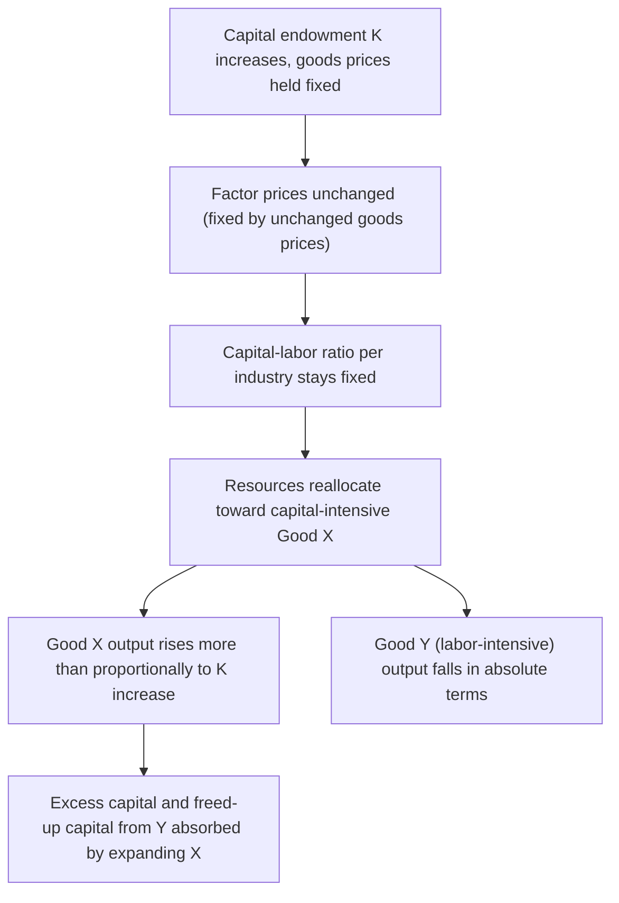

## The Rybczynski Theorem

### Definition

The Rybczynski theorem, developed by Polish-British economist Tadeusz Rybczynski in 1955, is one of the four core results of the Heckscher-Ohlin model. It states that, **at constant relative goods prices, an increase in the endowment of one factor of production leads to a more-than-proportional increase in the output of the good that uses that factor intensively, and an absolute decline in the output of the other good**. It provides the key theoretical link between changes in a country's factor endowments and the resulting changes in its production structure, holding goods prices fixed.

**Key Points**

- The theorem isolates the pure **supply-side** effect of a factor endowment change, holding relative goods prices constant — a deliberate analytical device that separates endowment effects from price effects.
- It predicts not merely a proportional output response but a **magnified** one: the output of the good using the growing factor intensively rises by a larger percentage than the factor endowment itself, while the output of the other good falls in **absolute** terms.
- The theorem underlies analyses of economic growth's effect on trade patterns, immigration's effect on production structure, and the so-called "Dutch disease" phenomenon in resource economics.

### Formal Statement

Consider two goods, X (capital-intensive) and Y (labor-intensive), and two factors, capital ($K$) and labor ($L$), with fixed relative goods prices $P_X/P_Y$. If the capital endowment $K$ increases (holding $L$, $P_X$, and $P_Y$ fixed):

$$\hat{K} > 0 \implies \hat{Q}_X > \hat{K} > 0 > \hat{Q}_Y$$

where $\hat{x}$ denotes the percentage change in variable $x$. In words: the output of the capital-intensive good X rises by a **greater percentage** than the capital endowment itself increased, while the output of the labor-intensive good Y **falls in absolute terms** — not merely relative to X, but in absolute physical quantity.

### The Magnification Effect

Analogous to the Stolper-Samuelson theorem's magnification of factor price changes, the Rybczynski theorem exhibits its own magnification effect on **output**, rather than on prices:

$$\hat{Q}_X > \hat{K} > 0 > \hat{Q}_Y$$

This magnification arises from the full-employment constraints operating jointly on both factors. Since the newly expanded capital endowment must be fully absorbed into production, and Good X uses capital intensively, output of X must expand by more than the percentage growth in capital alone in order to also absorb the labor released from the contracting Good Y sector — Good X's expansion must accommodate both the additional capital *and* the labor being freed up from Y's contraction, producing the more-than-proportional output response.

### Intuition: The Full-Employment Mechanism

The theorem's logic proceeds through the interaction of both factors' full-employment constraints, holding relative goods prices (and, by the Factor Price Equalization logic within the diversification cone, relative factor prices) fixed:

1. The capital endowment increases (e.g., through investment, capital accumulation, or capital inflows), while labor endowment and relative goods prices remain unchanged.
2. Because relative goods prices are held fixed, and (within the range of incomplete specialization) factor prices are pinned down by goods prices via the same zero-profit logic underlying Factor Price Equalization, the **capital-labor ratios used in each industry remain unchanged** — firms do not alter their production technique in response to the aggregate endowment change, since the relative factor price they face has not changed.
3. Given fixed capital-labor ratios per industry, the **only way** to absorb the additional capital while keeping both factors fully employed is to **shift resources toward the capital-intensive sector (Good X)** and away from the labor-intensive sector (Good Y).
4. As resources flow out of Good Y's production, this releases both labor **and** some capital from Y (since Y still requires both factors, just in a labor-intensive ratio), which flows into Good X — reinforcing the more-than-proportional expansion of X, since it absorbs both the newly available capital endowment and the capital released from the contracting Y sector.
5. Good Y's output must fall in **absolute** terms, since it is losing resources on net to the expanding X sector.

### Diagrammatic Overview

### Graphical Illustration: The Rybczynski Line

The theorem is often illustrated in an Edgeworth-box-style diagram or via a diagram plotting the economy's output combinations of X and Y. An increase in the capital endowment shifts the country's overall factor-endowment point, and — holding the capital-labor ratios used in each industry fixed (as pinned down by unchanged goods and factor prices) — the resulting new production point (found via the "Rybczynski line," connecting output combinations consistent with the unchanged factor-intensity ratios) lies at a point with **more** of Good X and **less** of Good Y than the original production point, even though total resources available to the economy have unambiguously increased.

**Example**

Suppose an economy initially produces 100 units of Good X (capital-intensive) and 80 units of Good Y (labor-intensive), fully employing its capital and labor endowments. If the capital endowment increases by 20% (e.g., through sustained investment or foreign capital inflows), while the labor endowment and relative goods prices remain unchanged, the Rybczynski theorem predicts that Good X's output will rise by **more than 20%** (say, to 130 units, a 30% increase) while Good Y's output **falls** in absolute terms (say, to 65 units), even though no resources have been destroyed — the released labor and capital from the contracting Y sector, combined with the new capital, are all being absorbed into the expanding, capital-intensive X sector.

### Applications of the Rybczynski Theorem

#### 1. Economic Growth and Changing Trade Patterns

The Rybczynski theorem provides a formal basis for analyzing how **factor accumulation** (capital deepening through investment, or labor force growth through demographic change or immigration) shifts a country's production structure and, by extension, its pattern of comparative advantage and trade over time — connecting to the broader observation (discussed in the context of globalization's historical waves) that comparative advantage is not static but evolves with changing factor endowments.

#### 2. Immigration and Production Structure

Applied to labor migration: an inflow of immigrant labor (an increase in the labor endowment, holding capital and goods prices fixed) is predicted, via Rybczynski logic, to expand output of the **labor-intensive** sector more than proportionally to the labor increase, while causing an **absolute decline** in output of the capital-intensive sector — a result frequently invoked (with appropriate caveats about real-world deviations from the strict model assumptions) in debates about immigration's effects on domestic industrial structure.

#### 3. "Dutch Disease" and Resource Booms

The Rybczynski theorem provides the standard theoretical starting point for analyzing "Dutch disease" — the phenomenon whereby a natural resource boom (an increase in the endowment of a resource-specific factor) causes a **contraction** of other tradable sectors (particularly manufacturing), as resources are drawn toward the booming resource sector, mirroring the theorem's prediction of an absolute output decline in the sector not intensive in the newly abundant factor. [Inference] Applied Dutch disease analysis typically extends the basic two-factor Rybczynski framework to a three-sector setting (resources, manufacturing, and non-traded services/goods) to more fully capture the empirically observed mechanisms (including real exchange rate appreciation), since the pure two-good Rybczynski framework alone does not incorporate a distinct non-traded sector.

### Relationship to Other Heckscher-Ohlin Core Theorems

| Theorem | Question Addressed | Held Constant |
| --- | --- | --- |
| Heckscher-Ohlin theorem | What is the pattern of trade given factor endowment differences? | — |
| Factor Price Equalization | Does free trade equalize factor prices across countries? | Goods prices equalized via trade |
| Stolper-Samuelson theorem | How do factor returns respond to a change in goods prices? | Factor endowments fixed |
| **Rybczynski theorem** | How does output respond to a change in factor endowments? | **Goods prices fixed** |

The Rybczynski theorem and the Stolper-Samuelson theorem are often presented as complementary "mirror image" results within the same underlying 2x2x2 model: Stolper-Samuelson analyzes the effect of a **price** change on **factor returns** (holding endowments fixed), while Rybczynski analyzes the effect of an **endowment** change on **output** (holding prices fixed) — both derived from the same underlying general-equilibrium zero-profit and full-employment conditions.

### Assumptions and Limitations

The theorem inherits the full set of standard Heckscher-Ohlin assumptions (two goods, two factors, identical technology, no factor-intensity reversal, incomplete specialization, perfect competition), with the added requirement that **relative goods prices remain fixed** — a condition that holds naturally for a **small open economy** facing given world prices, but which would not hold in a **closed economy** or in a large economy whose endowment change is significant enough to move world relative prices (in which case the resulting price change would itself trigger Stolper-Samuelson effects, compounding the pure Rybczynski output effect).

[Inference] This small-open-economy qualification is an important scope condition frequently emphasized in more careful treatments of the theorem, since the clean, unambiguous output prediction of the Rybczynski theorem specifically requires that the endowment change not be large enough to feed back into world relative prices — a condition more plausible for smaller economies than for large ones whose factor accumulation could plausibly shift global relative scarcities.

**Related Topics**

- The Heckscher-Ohlin theorem
- The Stolper-Samuelson theorem
- Factor Price Equalization theorem
- Immigration and international labor economics
- Dutch disease and resource-based economies
- Economic growth and the evolution of comparative advantage over time