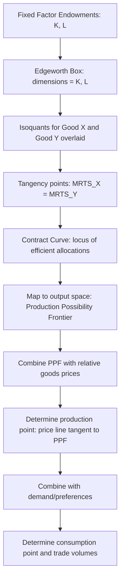

## General Equilibrium Trade and the Edgeworth Box

### Definition

General equilibrium analysis, in the context of the Heckscher-Ohlin model, refers to the simultaneous determination of production, consumption, prices, and factor allocations across all markets in the economy — goods markets and factor markets jointly — rather than analyzing any single market in isolation. The **Edgeworth box** is the standard graphical device used to represent this general equilibrium in the two-factor, two-good production setting, showing how a country's fixed total endowments of capital and labor are efficiently allocated between the production of two goods.

**Key Points**

- The Edgeworth box (in the production context) visualizes the full range of technically efficient allocations of two factors between two goods, given fixed total factor endowments.
- The **contract curve** within the box traces all Pareto-efficient (technically efficient) factor allocations, forming the foundation for deriving the economy's Production Possibility Frontier (PPF).
- General equilibrium trade analysis links this production-side efficiency apparatus to consumption-side preferences and goods-market prices, generating the complete Heckscher-Ohlin equilibrium.

### The Edgeworth Box: Construction

The production Edgeworth box is constructed as a rectangle whose dimensions represent the country's **total endowments** of the two factors of production:

- **Width** of the box = total labor endowment, $L$
- **Height** of the box = total capital endowment, $K$

Two origins are defined at opposite corners of the box:

- The origin for Good X ($O_X$) is placed at the bottom-left corner.
- The origin for Good Y ($O_Y$) is placed at the top-right corner (rotated 180 degrees relative to $O_X$).

Any point within the box represents a complete allocation of the economy's total capital and labor between the two goods: the coordinates measured from $O_X$ give the capital and labor used in producing Good X, while the coordinates measured from $O_Y$ (in the rotated frame) give the capital and labor used in producing Good Y. Since the box's total dimensions equal the total factor endowments, **every point in the box automatically satisfies full employment** of both factors — whatever capital and labor are not allocated to X are, by construction, allocated to Y.

### Isoquants Within the Box

Overlaid within the Edgeworth box are two families of **isoquants** — curves representing combinations of capital and labor that produce a given level of output:

- Isoquants for Good X, convex toward the $O_X$ origin, representing increasing output levels of X as one moves away from $O_X$.
- Isoquants for Good Y, convex toward the $O_Y$ origin, representing increasing output levels of Y as one moves away from $O_Y$.

### The Contract Curve: Deriving Production Efficiency

A factor allocation within the box is **technically (Pareto) efficient** if it is impossible to reallocate factors between the two goods to increase output of one good without decreasing output of the other. Graphically, this occurs precisely where an X-isoquant is **tangent** to a Y-isoquant — at any such tangency, the marginal rate of technical substitution (MRTS) between capital and labor is **equalized** across the two goods' production processes:

$$\text{MRTS}^X_{LK} = \text{MRTS}^Y_{LK}$$

The locus of all such tangency points, traced from $O_X$ to $O_Y$ across the box, is called the **contract curve**. Every point on the contract curve represents a technically efficient allocation of the economy's factors; every point off the contract curve represents an inefficient allocation, from which both goods' outputs could, in principle, be simultaneously increased through reallocation.

### Diagrammatic Illustration

<svg xmlns="http://www.w3.org/2000/svg" viewBox="0 0 550 450">
<text x="275" y="25" text-anchor="middle" font-size="16" font-weight="bold" fill="#1a1a1a">Production Edgeworth Box and Contract Curve (svg_diagram)</text>

<rect x="80" y="60" width="380" height="330" fill="none" stroke="#333" stroke-width="2" />

<text x="65" y="405" font-size="13" fill="`#1a1a1a`" font-weight="bold">O_X</text>

<circle cx="80" cy="390" r="3" fill="`#1a1a1a`" />

<text x="465" y="55" font-size="13" fill="`#1a1a1a`" font-weight="bold">O_Y</text>

<circle cx="460" cy="60" r="3" fill="`#1a1a1a`" />

<text x="270" y="420" text-anchor="middle" font-size="13" fill="`#1a1a1a`">Labor (L) - total endowment</text>

<text x="40" y="230" text-anchor="middle" font-size="13" fill="`#1a1a1a`" transform="rotate(-90 40 230)">Capital (K) - total endowment</text>

<path d="M 110 350 Q 200 320 320 260" fill="none" stroke="#2563eb" stroke-width="1.5" opacity="0.7" />
<path d="M 150 370 Q 260 340 380 280" fill="none" stroke="#2563eb" stroke-width="1.5" opacity="0.7" />
<text x="330" y="255" font-size="11" fill="#2563eb">Good X isoquants</text>

<path d="M 430 100 Q 340 130 220 190" fill="none" stroke="#dc2626" stroke-width="1.5" opacity="0.7" />
<path d="M 390 80 Q 280 110 160 170" fill="none" stroke="#dc2626" stroke-width="1.5" opacity="0.7" />
<text x="150" y="165" font-size="11" fill="#dc2626">Good Y isoquants</text>

<path d="M 80 390 Q 200 250 460 60" fill="none" stroke="#16a34a" stroke-width="3" stroke-dasharray="6,3" />
<text x="230" y="200" font-size="12" fill="#16a34a" font-weight="bold">Contract Curve</text>

<circle cx="240" cy="220" r="5" fill="#9333ea" />
<text x="250" y="215" font-size="11" fill="#9333ea">Tangency: MRTS equalized</text>
</svg>

### From the Contract Curve to the Production Possibility Frontier

Each point along the contract curve corresponds to a **specific, unique combination of output levels** of Good X and Good Y — the output level of X given by the isoquant passing through that point (measured from $O_X$), and the output level of Y given by the isoquant passing through the same point (measured from $O_Y$). By systematically mapping every point along the contract curve into its corresponding $(Q_X, Q_Y)$ output pair, one derives the economy's **Production Possibility Frontier (PPF)** in output space.

$$\text{Contract Curve (factor space)} \implies \text{Production Possibility Frontier (output space)}$$

Because the two goods are assumed to differ in **factor intensity** (Good X capital-intensive, Good Y labor-intensive), the contract curve bows characteristically toward one corner of the box (toward $O_Y$ if X is capital-intensive, reflecting that efficient allocations favor using relatively more capital in X production even at low levels of X output) — and this asymmetric curvature is precisely what generates the **concave (bowed-out) shape** of the Heckscher-Ohlin PPF, in contrast to the **linear** PPF of the single-factor Ricardian model.

### Diagrammatic Overview: From Endowments to Trade Equilibrium

### Why the PPF Is Concave (Bowed Outward) in the Heckscher-Ohlin Model

The bowed-out shape of the PPF reflects **increasing opportunity cost** as more of a good is produced — a direct consequence of the two-factor structure and differing factor intensities across goods. As the economy shifts resources toward producing more of Good X (capital-intensive), it must draw in units of both capital and labor from Good Y's production, but the factors released from Y are in the "wrong" proportion for efficient use in X (Y being labor-intensive releases relatively more labor than capital, while X's technology wants relatively more capital) — this factor-intensity mismatch is what generates diminishing returns to reallocation and hence increasing (rather than constant) opportunity cost, distinguishing the Heckscher-Ohlin PPF from the Ricardian model's linear PPF.

[Inference] This distinction — increasing opportunity cost arising from multiple factors with differing intensities, versus the Ricardian model's constant opportunity cost arising from a single factor — is one of the most commonly emphasized structural contrasts between the two core trade models in standard curricula, since it directly explains why the two models predict different PPF shapes despite both ultimately producing a comparative-advantage-based prediction about the pattern of trade.

### Completing General Equilibrium: Adding Prices and Demand

The Edgeworth box and resulting PPF characterize the **supply side** of general equilibrium. Full general equilibrium determination requires combining this with:

1. **Relative goods prices** $(P_X/P_Y)$: the economy produces at the point on its PPF where the slope (marginal rate of transformation) equals the relative price ratio — the standard tangency condition between the price line and the PPF.
2. **Consumer preferences**: represented by community indifference curves, determining the **consumption** point given the relative price ratio and the income generated by the chosen production point.
3. **Trade balance**: under autarky, the production point and consumption point coincide (both must lie on the PPF); under free trade, the production point (determined by world relative prices) and the consumption point (determined by preferences and trade-augmented income) can diverge, with the gap between them representing the volume and composition of trade (exports and imports).

**Example**

If the world relative price of Good X exceeds the country's autarky relative price (reflecting comparative advantage in X, per the Heckscher-Ohlin theorem), the economy shifts its production point along the PPF toward greater X output and less Y output (following the price-line tangency condition), while consumption — driven by preferences and the country's now-higher trade-augmented real income — may involve a different mix of X and Y than what is domestically produced, with the difference constituting the country's exports of X and imports of Y.

### Significance of the Edgeworth Box Approach

The Edgeworth box apparatus is significant in Heckscher-Ohlin trade theory because it provides the rigorous **microeconomic foundation** for the model's supply side — deriving the shape of the PPF from underlying, well-specified production functions and factor endowments, rather than simply assuming a particular PPF shape. This foundation is what allows the model to generate its richer, four-theorem structure (Heckscher-Ohlin, Factor Price Equalization, Stolper-Samuelson, and Rybczynski theorems), each of which can be formally derived by examining how changes in prices or endowments shift equilibrium positions within this same general-equilibrium apparatus.

**Related Topics**

- Factor endowments and factor intensity
- The Heckscher-Ohlin theorem
- The Rybczynski theorem: shifting the Edgeworth box endowment point
- The Stolper-Samuelson theorem: price-line tangency and factor returns
- Opportunity cost and the Production Possibility Frontier (comparison with Ricardian model)
- Community indifference curves and consumption equilibrium in trade models