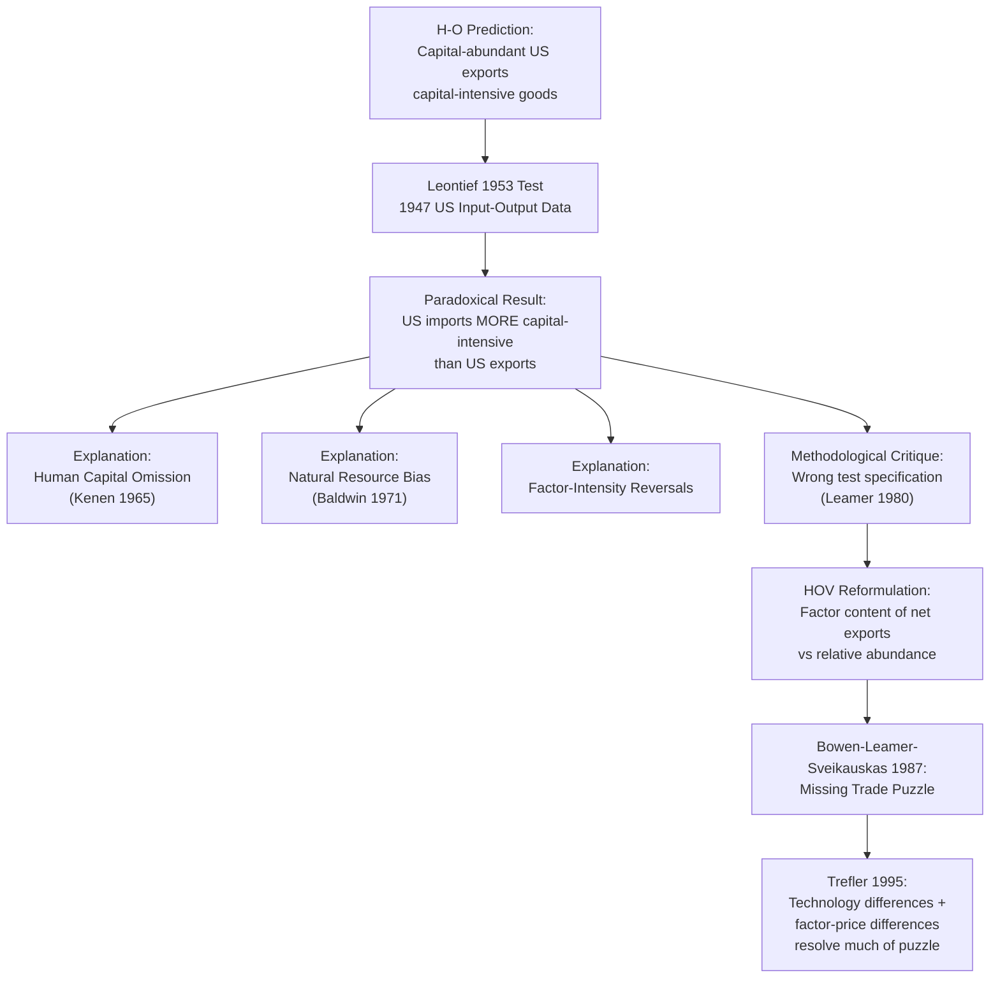

## The Leontief Paradox and Empirical Tests

### Overview

The Leontief paradox refers to Wassily Leontief's 1953 empirical finding that contradicted the central prediction of the Heckscher-Ohlin (H-O) model when applied to United States trade data. The H-O model predicts that a capital-abundant country like the United States should export capital-intensive goods and import labor-intensive goods. Leontief, using input-output analysis on 1947 U.S. trade data, found the opposite: U.S. exports were *less* capital-intensive (relative to labor) than U.S. imports. This result became one of the most scrutinized anomalies in international trade theory and spawned decades of empirical refinement and theoretical extension.

### Theoretical Background: What H-O Predicts

The Heckscher-Ohlin theorem states that a country will export the good that uses its relatively abundant factor intensively. For the U.S. in the postwar period:

- The U.S. was widely regarded as the most capital-abundant country in the world
- H-O therefore predicts: $\frac{K}{L}$ ratio embodied in exports $>$ $\frac{K}{L}$ ratio embodied in imports

Leontief tested this using a 1947 U.S. input-output table, computing the capital and labor requirements needed to produce $1 million worth of representative export bundles versus import-competing bundles.

### Leontief's Method

**Key Points**

- Leontief did not have direct data on foreign production techniques, so he made a critical assumption: import-competing goods are produced domestically using the *same* U.S. technology matrix, and their capital/labor requirements are computed as if the U.S. had produced them.
- He constructed an input-output table capturing direct and indirect factor requirements (i.e., capital and labor used not just in final assembly but in producing intermediate inputs).
- He computed the capital-labor ratio for a representative bundle of exports and for the import-competing bundle.

**The Leontief Ratio**

$$\text{Leontief Ratio} = \frac{(K/L)_{\text{imports}}}{(K/L)_{\text{exports}}}$$

A ratio greater than 1 indicates that imports are more capital-intensive than exports — consistent with H-O for a capital-abundant U.S. A ratio less than 1 is the paradoxical result.

### The Paradoxical Finding

Leontief's 1947 data produced a ratio of approximately 1.30, meaning U.S. import-competing goods were about 30% *more* capital-intensive per worker than U.S. export goods. Since the U.S. was capital-abundant, H-O predicted the reverse. This became known as the **Leontief Paradox**.

**Example**

Using illustrative (simplified) figures modeled on Leontief's original study:

- Capital per worker-year embodied in $1M of U.S. exports: ≈ $14,000
- Capital per worker-year embodied in $1M of U.S. import substitutes: ≈ $18,000

This yields a ratio of $18{,}000 / 14{,}000 \approx 1.29$, broadly matching Leontief's reported finding — imports more capital-intensive than exports, the opposite of H-O's prediction.

### Subsequent Empirical Tests

The paradox triggered a large literature attempting to replicate, refute, or explain the finding.

**Key Points**

- **Leontief (1956)**: Re-examined the result with 1951 data; the paradox persisted, though somewhat attenuated.
- **Baldwin (1971)**: Used more comprehensive 1962 U.S. data controlling for tariffs and natural resource industries; the paradox remained robust, ruling out the idea that it was a fluke of the 1947 postwar transition year.
- **Stern and Maskus (1981)**: Extended tests into the 1970s, finding the paradox weakened or reversed in some years, suggesting it may be partly time- and dataset-specific.
- **Leamer (1980)**: Argued Leontief's original test was econometrically flawed — comparing capital/labor ratios of exports vs. import-*competing* production is not the correct test when a country is a net capital exporter (via trade imbalances). Leamer proposed comparing the factor content of *net* exports against domestic factor endowments directly, which is a methodologically distinct (and more defensible) test. [Inference: the precise reinterpretation and its full implications are a matter of ongoing pedagogical debate, though the core critique — that Leontief's comparison technique was not equivalent to the theoretically correct factor-content test — is well established in the literature.]

### Proposed Explanations for the Paradox

**Key Points**

1. **Factor-intensity reversals**: If the ranking of capital-intensity between two goods differs across countries (due to different relative factor prices), the entire logic of comparing U.S. technology-based capital intensities to infer foreign trade patterns breaks down.
2. **Human capital omission**: Leontief's measure of "labor" was undifferentiated — it did not distinguish skilled from unskilled labor. If U.S. exports are intensive in human capital (skilled labor, embodying implicit "capital" in the form of education and training) rather than physical capital, then broadening the definition of capital to include human capital reverses or mitigates the paradox. This is the most widely cited resolution.
3. **Natural resources**: The U.S. imported many resource-intensive goods (e.g., minerals, certain agricultural products) that are capital-intensive to extract but do not reflect a comparative advantage story driven by capital-labor endowments per se. Excluding natural-resource-intensive industries reduces the paradox in some studies (Baldwin 1971 attempted this and still found a residual paradox).
4. **Tariff structure and trade policy**: Postwar U.S. tariffs were structured to protect labor-intensive industries more heavily, distorting the pattern of trade away from what factor endowments alone would predict.
5. **Demand-reversal (Linder-type effects)**: If capital-abundant countries have strong domestic demand biased toward capital-intensive goods (Linder's overlapping-demand hypothesis), this could offset the supply-side H-O prediction, though this explanation is less central to resolving Leontief's specific finding.
6. **Aggregation bias**: Aggregating heterogeneous goods into broad categories can mask true factor-content patterns, since intra-category variation in factor intensity is averaged away.

**Human Capital-Augmented Resolution**

Kenen (1965) and others reworked the Leontief test by imputing a capital value to labor skill differentials (treating education/training as a stock of human capital, discounted like physical capital investment). When human capital is added to physical capital in computing the $K/L$ ratio, U.S. exports appear substantially more "capital" (broadly defined) intensive than imports, which is far more consistent with H-O.

$$K^*_{\text{total}} = K_{\text{physical}} + K_{\text{human}}$$

where $K_{\text{human}}$ is typically proxied via the present discounted value of the wage premium attributable to education and skill.

### Leamer's Reformulation: The Correct Factor-Content Test

**Key Points**

- Leamer showed that with more than two goods/factors, or with an imbalance of trade, comparing the K/L ratio of exports to imports is not a valid test of H-O.
- The theoretically correct test compares the **factor content of net exports** to the country's **relative factor abundance**, using the Heckscher-Ohlin-Vanek (HOV) framework (see next section).

### The Heckscher-Ohlin-Vanek (HOV) Extension

The HOV model generalizes H-O to many countries, goods, and factors, and gives a formal, testable prediction about the *factor content of trade*:

$$F_i^c = \sum_j a_{ij} T_j^c$$

where $F_i^c$ is the net factor content of factor $i$ embodied in country $c$'s trade, $a_{ij}$ is the input-output coefficient (units of factor $i$ per unit of good $j$), and $T_j^c$ is net exports of good $j$ by country $c$.

The HOV prediction is:

$$F_i^c = E_i^c - s^c \sum_c E_i^c$$

where $E_i^c$ is country $c$'s endowment of factor $i$, and $s^c$ is country $c$'s share of world GDP (or world consumption, under balanced trade and identical homothetic preferences). Intuitively: a country's *net factor exports* should equal its endowment surplus relative to its share of world consumption.

**Bowen, Leamer, and Sveikauskas (1987)** conducted a large multi-country, multi-factor test of HOV and found it performed poorly — the "sign test" (does the sign of net factor trade match the sign of relative abundance) was correct barely better than a coin flip for many factors across many countries. This became known as the "mystery of the missing trade" — actual factor-content flows are far smaller than HOV predicts, largely because trade volumes are far lower than the model implies given cross-country factor-price differences (later linked to the assumption of identical technologies across countries, which does not hold — see Trefler 1995).

**Trefler's Contributions (1993, 1995)**

- Trefler (1993) allowed for factor-price differences across countries (relaxing factor price equalization) and found this substantially improved HOV's empirical fit.
- Trefler (1995), in "The Case of the Missing Trade and Other Mysteries," incorporated cross-country technology differences (via country-specific technology/productivity parameters) and neutral/factor-biased productivity adjustments, which further reconciled predicted and actual factor-content flows. This is widely regarded as a major resolution of both the Leontief paradox and the broader HOV missing-trade puzzle.

### Diagrammatic Summary of the Empirical Debate

### Empirical Test Design Pattern (Generalized)

For any HOV-style empirical test, the standard workflow is:

1. Obtain an input-output table giving direct and indirect factor requirements per unit output ($a_{ij}$ matrix)
2. Obtain bilateral or net trade flow data ($T_j^c$) by good and country
3. Compute predicted factor content of trade: $F_i^c = \sum_j a_{ij} T_j^c$
4. Obtain factor endowment data ($E_i^c$) and world totals
5. Compute the HOV-predicted factor content: $E_i^c - s^c \sum_c E_i^c$
6. Compare sign and magnitude of predicted vs. actual factor content (sign test, rank test, or regression-based "Trefler-style" test)
7. Introduce corrections: human capital adjustment, technology/productivity differences, non-traded goods, trade imbalances, or factor-price differences as needed

### Critiques and Limitations of the Original Leontief Test

**Key Points**

- Single-country test (only used U.S. data), whereas H-O is fundamentally a comparative statement about relative factor abundance across trading partners
- Assumed identical production technology between the U.S. and its trading partners, which is empirically false and later shown (Trefler) to be a major source of bias
- Ignored non-traded goods and their factor content
- 1947 was an atypical year — Europe and Japan were still recovering from WWII, potentially distorting global trade patterns and making the U.S. an outlier trading partner in ways unrelated to factor abundance
- Aggregated capital and labor into single homogeneous categories, ignoring within-category heterogeneity (skill levels, capital vintage/type)

### Modern Standing

[Inference: characterizing the current consensus among trade economists] The Leontief paradox is generally regarded today not as a decisive refutation of Heckscher-Ohlin, but as a demonstration that (a) simple two-factor, single-country empirical tests of H-O were mis-specified, and (b) once human capital, natural resources, cross-country technology differences, and proper HOV factor-content methodology are incorporated, the data are considerably more consistent with factor-proportions theory. The episode significantly shaped the methodology of empirical trade research and directly motivated the development of the HOV model and subsequent technology-augmented tests (Trefler, Davis and Weinstein).

### Related Topics

- Heckscher-Ohlin-Vanek (HOV) model and the factor content of trade
- Trefler's "missing trade" resolution (1995)
- Human capital and skill-augmented factor endowment models
- Factor price equalization theorem and its empirical violations
- Rybczynski theorem
- Stolper-Samuelson theorem and its distributional implications
- Vanek's multi-factor, multi-country generalization of H-O
- Davis and Weinstein's specialization-based HOV tests
- Gravity model of trade (as an alternative empirical trade framework)
- Factor-intensity reversal and its implications for trade theory