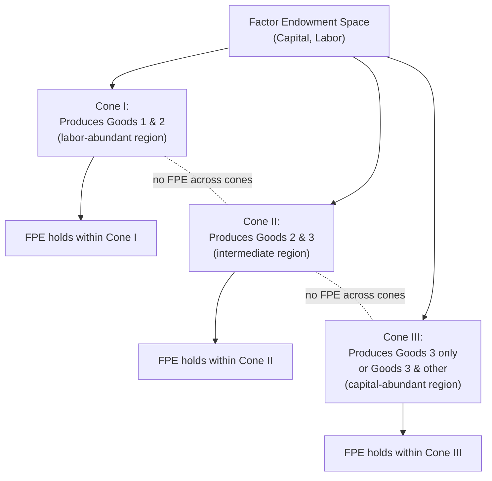

## Extensions to Many Goods and Many Factors

### Overview

The basic Heckscher-Ohlin (H-O) model is built on a 2×2×2 framework: two countries, two goods, two factors of production. This simplification yields clean, unambiguous theorems (H-O theorem, Stolper-Samuelson, Rybczynski, factor price equalization), but real economies feature many goods, many factors, and many countries. Extending the model reveals that most of the classical 2×2×2 results do not generalize cleanly — they survive only in weakened, "on average" or correlation-based forms, or require additional restrictive assumptions. This chapter of trade theory is essential for understanding both the theoretical limits of H-O and the motivation behind the Heckscher-Ohlin-Vanek (HOV) empirical framework.

### Why the 2×2×2 Case Is Special

**Key Points**

- With 2 goods and 2 factors, there is a unique, monotonic mapping between goods prices and factor prices (the "magnification effect" underlying Stolper-Samuelson) and between factor endowments and output levels (Rybczynski).
- The factor-intensity ranking of the two goods is unambiguous: one good is unambiguously more capital-intensive than the other at all relevant factor price ratios (absent reversals).
- Diagrammatic tools (the Lerner-Pearce diagram, the Edgeworth box) rely on there being only two goods and two factors to be drawn in two dimensions.
- These convenient properties break down once you have $n$ goods and $m$ factors with $n \neq m$ or $n, m > 2$.

### The Core Problem: Dimensionality

When the number of goods $n$ differs from the number of factors $m$, the mapping between goods prices and factor prices, or between factor endowments and outputs, generally becomes **indeterminate** or **non-unique**.

**Case 1: More goods than factors ($n > m$)**

If there are more traded goods than factors, the zero-profit conditions:

$$p_j = \sum_i a_{ij} w_i \quad \text{for each good } j$$

form an overdetermined system relative to the $m$ factor prices $w_i$. Generically, a country will specialize in producing only $m$ of the $n$ goods (the "active" goods), since producing all $n$ goods simultaneously at the given factor prices would require the zero-profit condition to hold for every good, which is non-generic when there are more equations than unknowns. Which subset of goods a country produces depends on its factor endowments — this is the basis of the **Lerner Diversification Cone**: countries with similar endowment ratios (falling within the same cone in factor-endowment space) will produce the same subset of goods and thus share the same factor prices (factor price equalization holds *within* a cone, but not necessarily across cones).

**Case 2: More factors than goods ($m > n$)**

If there are more factors than goods, the zero-profit conditions are *underdetermined* — there are not enough price equations to pin down all factor prices uniquely. Factor prices become indeterminate from goods prices alone; specific factor returns depend on relative factor supplies (this is essentially the logic of the **specific factors model**, which can be seen as a special case of $m > n$, e.g., 2 goods, 3 factors — labor mobile, capital and land specific).

### The Diversification Cone

**Key Points**

- A diversification cone is a region in factor-endowment space (e.g., a capital-labor-land simplex) within which all countries produce the same set of goods and face the same factor prices under free trade (assuming identical technology and no factor-intensity reversals).
- Countries whose endowments fall in different cones will specialize differently and face different relative factor prices — factor price equalization fails *across* cones even under free trade.
- The number of distinct cones is generically related to combinations of $m$ factors taken $n$ at a time (roughly, $\binom{m}{n}$ possible active-good subsets), though the actual geometry depends on technology.

**Illustration (conceptual, 2 factors 3 goods case)**

### Generalized Stolper-Samuelson: The "Friends and Enemies" Result

In the many-good, many-factor case, the sharp Stolper-Samuelson result (a rise in a good's price *unambiguously* raises the real return of the factor used intensively in it, and *unambiguously* lowers the return of the other factor) no longer holds in general. Instead, **Jones and Scheinkman (1977)** and related work established a weaker "correlation" version:

**Key Points**

- On average across factors, a factor tends to gain from a price increase in the good that uses it intensively, and tends to lose from goods that use it less intensively — but this need not hold for every individual factor-good pair.
- There must exist at least one factor whose real return rises with any goods-price increase, and at least one whose real return falls, but the mapping is no longer as clean as the 2×2 "magnification effect."
- The **"friends and enemies"** terminology (Jones and Scheinkman) refers to the property that each good has at least one factor that is its "friend" (gains when the good's price rises) and at least one that is its "enemy" (loses when the good's price rises), but a given factor may be a "friend" to one good and "enemy" to another in complex, non-monotonic ways once $n, m > 2$.

### Generalized Rybczynski Theorem

The 2×2 Rybczynski theorem states that at constant goods prices, an increase in one factor's endowment increases the output of the good that uses that factor intensively (more than proportionally) and *decreases* the output of the other good in absolute terms. In the many-good, many-factor case:

- The strict "magnification" and sign-determinacy of output changes generally breaks down outside a given diversification cone.
- Within a cone (i.e., while the same subset of goods remains produced), a generalized version holds: the $m \times n$ system of output responses to endowment changes is governed by the inverse of the factor-requirements matrix, and while some comparative-statics results survive (e.g., correlation-based versions), goods outputs need not move in the simple "one up, one down" pattern of the 2×2 case.

### The Heckscher-Ohlin-Vanek (HOV) Model as the Natural Many-Factor Generalization

Because the classical H-O and Stolper-Samuelson/Rybczynski theorems lose their sharpness with many goods and factors, **Vanek (1968)** proposed reformulating the H-O theorem directly in terms of the **factor content of trade**, which remains well-defined and testable regardless of the number of goods, factors, or countries.

**The HOV equation:**

$$F^c = A \, T^c$$

where $F^c$ is the $m$-vector of net factor content embodied in country $c$'s trade, $A$ is the $m \times n$ matrix of factor input coefficients (assumed common across countries under identical technology), and $T^c$ is the $n$-vector of country $c$'s net exports by good.

**The HOV prediction**, under identical homothetic preferences and balanced trade:

$$F^c = E^c - s^c E^w$$

where $E^c$ is country $c$'s factor endowment vector, $E^w$ is the world endowment vector, and $s^c$ is country $c$'s share of world income/consumption. This says: a country's *net factor exports* should equal the gap between its own endowment and its "fair share" (by income) of the world endowment — a statement that generalizes H-O's 2×2×2 intuition to arbitrary $n$ and $m$ without needing a one-to-one goods-to-factors mapping.

**Example**

Suppose the world has 3 factors (capital, skilled labor, unskilled labor) and 50 traded goods. Even though no clean "which good is capital-intensive" ranking may hold across all 50 goods simultaneously in every country, HOV still delivers a testable prediction: a capital-abundant country's *net trade*, when multiplied through the input-output matrix $A$, should reveal that the country is a net exporter of capital services and a net importer of unskilled-labor services, relative to its share of world consumption.

### Sign Test and Rank Test (Empirical Methodology)

With many factors, HOV testing typically uses:

1. **Sign test**: For each factor $i$ and country $c$, check whether $\text{sign}(F_i^c) = \text{sign}(E_i^c - s^c E_i^w)$. Bowen, Leamer, and Sveikauskas (1987) found this test performed only marginally better than chance for many factor-country pairs — the origin of the "missing trade" puzzle.
2. **Rank test**: Check whether countries are correctly ranked by predicted net factor exports for a given factor.
3. **Slope/regression test** (Trefler-style): Regress actual factor content on endowment-based predictions, allowing for technology and factor-price adjustments, rather than requiring an exact sign match.

### Role of Factor-Intensity Reversals

**Key Points**

- With many goods, the chance that at least one pair of goods exhibits a factor-intensity reversal (where the ranking of relative factor intensity flips at different factor-price ratios) rises substantially.
- Factor-intensity reversals undermine the cleanest form of the H-O theorem even in aggregate/correlation form, since the theoretical link between endowments and the direction of trade depends on a consistent intensity ranking.
- Empirically, testing for reversals involves checking whether the capital-labor ratio ranking of industries is stable across countries with different capital-labor endowment ratios; substantial reversals were found in some early studies (Minhas 1962), though later work (Leontief 1964) argued reversals were less pervasive than initially claimed once measurement issues were addressed.

### Multi-Cone Empirical Implications

**Key Points**

- Countries in different diversification cones will show different, cone-specific relationships between factor abundance and trade patterns — pooling all countries into a single global regression can mask true structural relationships.
- **Debaere and Demiroglu (2003)** and related work explicitly account for multiple cones when testing HOV, improving empirical fit relative to single-cone (or "world is one cone") assumptions.
- Cone structure also explains why factor price equalization is observed regionally (e.g., within the EU or within groups of similarly-endowed countries) but not globally.

### Technology Differences in the Many-Factor Setting

The many-goods-many-factors HOV framework assumes a common technology matrix $A$ across countries — an assumption known to be empirically false. **Trefler (1993, 1995)** relaxed this by allowing:

$$A^c = A \cdot \Pi^c$$

where $\Pi^c$ is a country-specific productivity/technology adjustment (potentially factor-augmenting and country-specific), which substantially improves the fit of the many-factor HOV model to trade data and resolves much of the "missing trade" puzzle identified by Bowen-Leamer-Sveikauskas.

### Summary Table of Key Generalized Results

| 2×2×2 Model | Many-Goods/Many-Factors Generalization |
| --- | --- |
| H-O theorem (goods trade direction) | HOV theorem (factor-content of trade) |
| Stolper-Samuelson (sharp, unambiguous) | "Friends and enemies" (correlation-based, weaker) |
| Rybczynski (sharp, unambiguous) | Generalized comparative statics within a cone only |
| Single factor-price-equalization set | Multiple diversification cones, FPE within cone only |
| Unique goods-to-factors mapping | Specialization determined by cone membership |

### Related Topics

- Heckscher-Ohlin-Vanek theorem and empirical factor-content tests
- Diversification cones and multi-cone equilibrium
- Trefler's technology-augmented HOV tests
- Factor-intensity reversals: theory and measurement
- Specific factors model as a many-factor, few-goods special case
- Jones and Scheinkman's "friends and enemies" theorem
- Lerner-Pearce diagram limitations beyond 2×2
- Gravity models as an alternative to factor-proportions-based trade prediction
- Assignment models and continuum-of-goods trade frameworks (Dornbusch-Fischer-Samuelson)