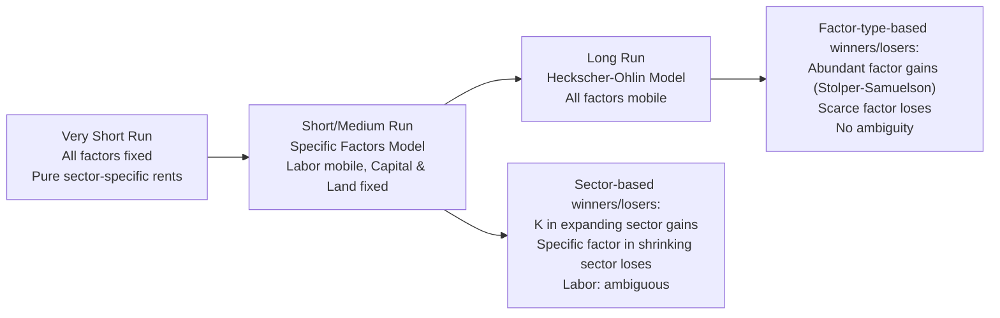

## Short Run versus Long Run Factor Mobility

### Overview

The distinction between short-run and long-run factor mobility is the organizing principle that links the specific factors model to the Heckscher-Ohlin model, and it explains why the same trade shock can produce very different distributional predictions depending on the time horizon considered. In the short run, some factors are "locked in" to their current sector (specific factors), generating asymmetric, sector-based winners and losers. In the long run, all factors become mobile across sectors, and the analysis converges to the Heckscher-Ohlin/Stolper-Samuelson logic, where winners and losers are determined by factor *type* (capital vs. labor) rather than by sector of current employment.

### The Time-Horizon Spectrum

**Key Points**

- **Very short run**: All factors, including labor, may be effectively fixed in place (e.g., immediately after a shock, before any reallocation is possible). Price changes translate directly into sector-specific rents/losses with no reallocation at all.
- **Short/medium run (specific factors model)**: Labor is mobile across sectors; capital and land (or sector-specific capital) are immobile. This is the canonical Ricardo-Viner setup.
- **Long run (Heckscher-Ohlin model)**: All factors, including capital, become mobile across sectors as capital depreciates and is reinvested, workers retrain, and land/structures are repurposed. Sector-specific rents are competed away, and factor returns depend only on factor type, not sector of use.

### Mechanism: Why Capital Is "Specific" Only Temporarily

**Key Points**

- Physical capital (machines, factory-specific equipment) cannot be costlessly and instantly relocated to another sector — retooling, retraining, and reinvestment take time.
- Over a longer horizon, capital depreciates and is not replaced in the shrinking sector, while new investment flows into the expanding sector — this is the mechanism by which capital "becomes mobile" in the long run, even though no individual physical machine moves.
- Labor is typically assumed mobile even in the short run because workers can switch employers/sectors relatively quickly, though search frictions, licensing requirements, and skill specificity can slow this too — in more advanced treatments, labor itself can be modeled as imperfectly mobile or sector-specific in a "very short run" variant.

### Comparative Statics: Same Price Shock, Different Time Horizons

Consider a rise in $p_X$ (price of the good produced with sector-specific capital $K$ and mobile labor).

**Short run (specific factors model) — Key Points**

- The wage $w$ rises, but by *less* than the proportional rise in $p_X$ (labor's nominal wage gain is diluted because labor also flows into sector $X$, pushing down $MPL_X$ along the demand curve, while $p_Y$ is unchanged).
- Real return to capital in sector $X$ ($r_K$) rises **unambiguously** in terms of both goods — capital owners in the expanding sector gain by more than in proportion to the price increase (the "magnification effect" applies to specific factors).
- Real return to land/specific factor in sector $Y$ ($r_T$) falls **unambiguously** in terms of both goods — landowners in the now relatively worse-off sector lose.
- Labor's real wage change is **ambiguous**: it rises in terms of good $Y$ (since $w$ rises in nominal terms while $p_Y$ is constant) but falls in terms of good $X$ (since $w$ rises less than proportionally to $p_X$). Labor's overall welfare change depends on its consumption basket.

**Long run (Heckscher-Ohlin/Stolper-Samuelson) — Key Points**

- Capital becomes mobile and flows into sector $X$ until its return is equalized across sectors.
- The Stolper-Samuelson theorem now applies cleanly: if $X$ is capital-intensive, a rise in $p_X$ raises the real return to capital **unambiguously** (in terms of both goods) and lowers the real return to labor **unambiguously** (in terms of both goods) — this is a *sharper*, more polarized prediction than the short-run case.
- The distributional conflict shifts from being **sector-based** (capital in $X$ vs. capital in $Y$) to being **factor-based** (capital owners everywhere vs. labor owners everywhere), since in the long run there is only one economy-wide return to capital and one economy-wide wage.

### Diagram: Convergence from Specific Factors to Heckscher-Ohlin

### The Magnification Effect Across Time Horizons

**Short run** (specific factors, for a rise in $p_X$):

$$\hat{r}_K > \hat{p}_X > \hat{w} > \hat{p}_Y = 0 > \hat{r}_T$$

where hats denote percentage changes. This ordering shows capital's return rising by *more* than the price of the good it produces, while the wage rises by *less* than that price change (and land's return falls).

**Long run** (Heckscher-Ohlin, Stolper-Samuelson, assuming $X$ capital-intensive):

$$\hat{r}_K > \hat{p}_X > \hat{p}_Y > \hat{w}$$

with $\hat{w}$ potentially becoming negative in absolute terms if $\hat{p}_Y = 0$ — a stronger, cleaner magnification than the short-run case, and crucially, this ranking is now **factor-based** rather than tied to a fixed sector.

### Why This Matters for Trade Policy Analysis

**Key Points**

1. **Political economy timing**: Sector-specific lobbying (e.g., an industry demanding protection) is best explained by short-run specific-factors logic, since capital owners in a given industry have an immediate, concentrated stake in that sector's price, regardless of their "factor type" classification.
2. **Adjustment costs and compensation**: The short-run model highlights *why* trade liberalization generates concentrated, visible losers (specific-factor owners in import-competing industries) even when the long-run, economy-wide effect might be diffused differently across capital vs. labor as classes.
3. **Policy timing arguments**: Trade Adjustment Assistance and phased tariff reductions are often justified using short-run specific-factors reasoning — the argument being that given time (the long run), factors reallocate and the sharper sector-specific losses dissipate, replaced by the more diffuse (and often more politically tractable) factor-type redistribution predicted by Stolper-Samuelson.
4. **Empirical identification**: Economists studying the effects of trade shocks (e.g., the "China shock" literature, Autor-Dorn-Hanson) explicitly use the specific-factors logic to justify examining *local labor market* effects (treating capital and, in the medium run, even labor as imperfectly mobile across regions/industries) rather than assuming instantaneous long-run H-O adjustment.

### Formal Link: Specific Factors as a Nested Case

**Key Points**

- The Heckscher-Ohlin model can be seen as the limiting case of the specific factors model as the sector-specific factors ($K$ in $X$, $T$ in $Y$) become the *same type of factor*, freely reallocable between sectors.
- Formally, if we relabel $K$ and $T$ as two different "vintages" or "locations" of the same underlying capital stock, and allow the reallocation cost to fall to zero over time, the specific factors equilibrium conditions converge to the H-O equilibrium conditions.
- This nesting is why some treatments describe H-O as the "long-run specific factors model" — the two models are not fundamentally different frameworks but rather the same economy observed at different adjustment horizons.

### Empirical and Applied Considerations

**Key Points**

- Real-world "long run" convergence to full factor mobility is an idealization; frictions such as industry-specific human capital, geographic immobility, pension/benefit lock-in, and regulatory barriers can make some factors persistently "specific" even over long horizons — this motivates richer models with partial, gradual mobility (e.g., putty-clay capital models, dynamic adjustment-cost models).
- [Inference: the precise empirical threshold at which an economy "becomes" long-run in this sense is not sharply defined in the literature and depends on the industry, factor type, and institutional context] — the short-run/long-run distinction is best understood as a modeling device capturing a continuum of adjustment speeds rather than a literal calendar-time boundary.

### Related Topics

- Stolper-Samuelson theorem and the magnification effect
- Comparative statics of the specific factors model (price and endowment shocks)
- Rybczynski theorem as the long-run endowment-change analogue
- Trade Adjustment Assistance and the political economy of compensation
- Regional/local labor market effects of trade shocks (Autor-Dorn-Hanson "China shock" literature)
- Putty-clay capital and dynamic factor-reallocation models
- Factor price equalization and its short-run failure