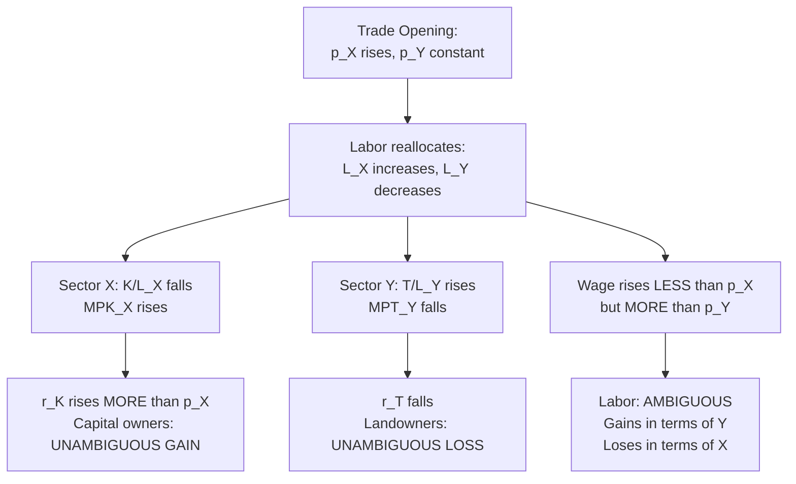

## Effects of Trade on Returns to Specific and Mobile Factors

### Overview

This topic works out the full comparative-statics logic of the specific factors model: given an opening to trade (or any relative-price change induced by trade), how do real returns to the mobile factor (labor) and the two specific factors (sector-specific capital and land) change? Unlike Heckscher-Ohlin, where trade produces unambiguous factor-type winners and losers, the specific factors model produces a **three-way split**: one specific factor gains unambiguously, the other loses unambiguously, and the mobile factor's welfare change is **ambiguous**, depending on consumption patterns. This makes the model especially useful for analyzing short-run distributional conflict from trade opening.

### Setup Recap

Two goods $X$ and $Y$; labor $L$ mobile between sectors; capital $K$ specific to $X$; land $T$ specific to $Y$. Equilibrium wage $w$ equalizes value marginal product of labor across sectors:

$$p_X \cdot MPL_X(K, L_X) = w = p_Y \cdot MPL_Y(T, L_Y)$$

Trade opening is modeled as a change in the relative price $p_X/p_Y$ — say, the country has comparative advantage in $X$, so opening to trade raises $p_X$ relative to $p_Y$ (normalize $p_Y$ fixed, so $\hat{p}_X > 0 = \hat{p}_Y$).

### Step 1: Effect on the Wage

**Key Points**

- As $p_X$ rises, the VMPL$_X$ curve shifts up proportionally (since $VMPL_X = p_X \cdot MPL_X$), inducing labor to move from sector $Y$ into sector $X$.
- $L_X$ rises, $L_Y$ falls; because of diminishing marginal returns to labor, $MPL_X$ falls (as $L_X$ rises) and $MPL_Y$ rises (as $L_Y$ falls) until a new equal-wage equilibrium is reached.
- The new equilibrium wage $w'$ satisfies $w < w' < p_X \cdot MPL_X(\text{old } L_X)$ — the wage rises, but by **less than the full proportional increase in $p_X$**, because part of the price increase is absorbed by the fall in $MPL_X$ as labor floods into sector $X$.

Formally, in percentage-change ("hat") notation:

$$0 < \hat{w} < \hat{p}_X$$

### Step 2: Effect on the Specific Factor in the Expanding Sector (Capital, sector X)

**Key Points**

- Sector $X$'s employment of labor rises ($L_X \uparrow$), and since capital $K$ is fixed, the capital-labor ratio in sector $X$ **falls** ($K/L_X \downarrow$).
- A falling $K/L_X$ ratio, under diminishing returns, raises the marginal product of capital: $MPK_X \uparrow$.
- Combined with the direct price increase $p_X \uparrow$, the nominal return to capital rises by *more* than the proportional increase in $p_X$:

$$\hat{r}_K > \hat{p}_X > \hat{w} > 0 = \hat{p}_Y$$

- Since $\hat{r}_K > \hat{p}_X$ and $\hat{r}_K > \hat{p}_Y (=0)$, capital's return rises in terms of **both** goods — capital owners in the expanding sector are **unambiguously better off** in real terms, regardless of their consumption basket.

### Step 3: Effect on the Specific Factor in the Contracting Sector (Land, sector Y)

**Key Points**

- Sector $Y$ loses labor ($L_Y \downarrow$), so the land-labor ratio **rises** ($T/L_Y \uparrow$).
- A rising $T/L_Y$ ratio, under diminishing returns, **lowers** the marginal product of land: $MPT_Y \downarrow$.
- Since $p_Y$ is unchanged, the nominal return to land falls:

$$\hat{r}_T < 0 = \hat{p}_Y < \hat{w} < \hat{p}_X$$

- Since $\hat{r}_T < \hat{p}_Y$ and $\hat{r}_T < \hat{p}_X$, land's return falls in terms of **both** goods — landowners in the contracting sector are **unambiguously worse off** in real terms.

### Step 4: Effect on the Mobile Factor (Labor) — the Ambiguous Case

**Key Points**

- Labor's nominal wage rises, but the ranking established above is:

$$\hat{p}_Y (=0) < \hat{w} < \hat{p}_X$$

- This means:
  - In terms of good $Y$ (the good whose price didn't change): $w/p_Y$ **rises** — labor's real wage measured in units of $Y$ increases, so labor is *better off* if it consumes only $Y$.
  - In terms of good $X$ (whose price rose faster than the wage): $w/p_X$ **falls** — labor's real wage measured in units of $X$ decreases, so labor is *worse off* if it consumes only $X$.
- Labor's overall welfare change is therefore **ambiguous** and depends on the composition of its consumption basket between $X$ and $Y$. A worker who consumes mostly $Y$ gains; a worker who consumes mostly $X$ loses; a worker with a mixed basket has an outcome that depends on the precise basket weights and price changes.

### Summary Table: Real Return Changes from a Rise in $p_X$ (Trade Opening Favoring Sector X)

| Factor | Nominal Return Change | Real Return in Terms of X | Real Return in Terms of Y | Unambiguous Welfare Direction? |
| --- | --- | --- | --- | --- |
| Capital ($K$, specific to X) | $\hat{r}_K > \hat{p}_X$ | Rises | Rises | **Yes — unambiguous gain** |
| Land ($T$, specific to Y) | $\hat{r}_T < \hat{p}_Y = 0$ | Falls | Falls | **Yes — unambiguous loss** |
| Labor ($L$, mobile) | $0 < \hat{w} < \hat{p}_X$ | Falls | Rises | **No — ambiguous, depends on consumption basket** |

### Diagram: The Distributional Cascade

### Intuition Behind the Magnification Effect

The core mechanical reason capital's return rises by more than the price of the good it produces, while land's falls by more than the price stays flat, is that **specific factors bear the full brunt of sectoral output adjustment** since they cannot escape their sector. The mobile factor, by contrast, buffers the shock by reallocating — this is precisely why its return change is "in between" the two goods' price changes rather than at either extreme.

**Example**

Suppose $\hat{p}_X = 10\%$ and $\hat{p}_Y = 0\%$. A representative numerical outcome consistent with the theory might be:

- $\hat{r}_K = +16\%$ (capital's return outpaces the price rise)
- $\hat{w} = +6\%$ (wage rises, but less than $p_X$'s 10%, more than $p_Y$'s 0%)
- $\hat{r}_T = -7\%$ (land's return falls in nominal terms, since $p_Y$ didn't rise to compensate for the falling $MPT_Y$)

These particular magnitudes are illustrative; exact values depend on production function curvature (elasticities of substitution and diminishing-returns parameters), but the *qualitative ranking* $\hat{r}_K > \hat{p}_X > \hat{w} > \hat{p}_Y > \hat{r}_T$ is a general, robust prediction of the model. [Inference: exact numerical pass-through depends on the specific functional forms assumed for $F$ and $G$, which are not pinned down by the qualitative model alone.]

### Contrast with the Long-Run (H-O) Outcome

**Key Points**

- In the long run, once capital becomes mobile, the "specific factor in the expanding sector gains / specific factor in contracting sector loses" pattern is replaced by a cleaner factor-type prediction (Stolper-Samuelson): capital owners economy-wide gain, labor economy-wide loses (assuming $X$ is capital-intensive), with **no ambiguity** for either factor.
- The specific factors model's central contribution is precisely this **short-run ambiguity for the mobile factor** and the **sector-based (not factor-type-based) certainty for the immobile factors** — a result with no analogue in the long-run H-O framework.

### Policy and Empirical Relevance

**Key Points**

- This result explains why trade liberalization often generates concentrated political opposition from **industry-specific capital owners** in import-competing sectors (unambiguous losers) even when economy-wide labor effects are ambiguous or even mildly positive.
- It underlies arguments for transitional trade adjustment assistance targeted at specific industries (and their specific-factor owners) rather than broad factor-type-based compensation schemes.
- Empirical work on trade shocks at the regional/industry level (e.g., NAFTA or China-shock studies) often implicitly invokes this specific-factors logic, since capital and, in the medium run, even labor can behave as quasi-specific factors when regional/industry switching costs are high.

### Related Topics

- Short run versus long run factor mobility
- Stolper-Samuelson theorem and the magnification effect
- Rybczynski theorem (endowment-change analogue)
- Comparative statics of endowment changes in the specific factors model
- Real wage determination and consumption-basket dependence
- Political economy of trade protection and specific-factor lobbying
- Trade Adjustment Assistance program design