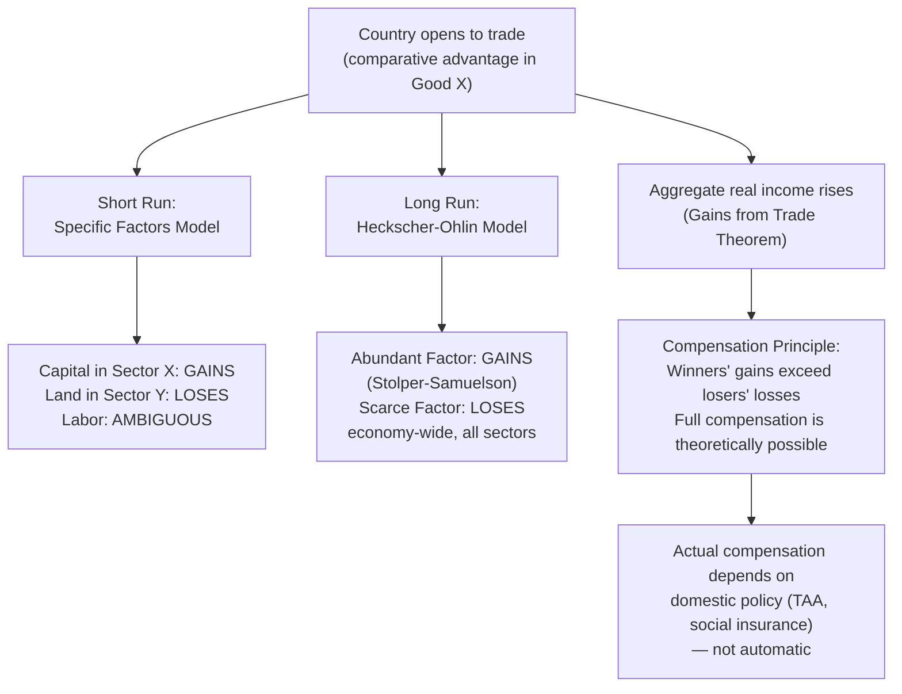

## Trade and the Distribution of Income within a Country

### Overview

This topic synthesizes the income-distribution implications of trade across the specific factors and Heckscher-Ohlin frameworks, connecting the theoretical results to the broader question of *why trade creates both aggregate gains and internal winners and losers*. While trade theory establishes that a country as a whole gains from trade (in the sense of expanding its consumption possibilities), it says nothing about how those gains are shared — and in general, they are **not** shared evenly. This is one of the most policy-relevant results in international trade theory, underpinning debates over compensation, protectionism, and the political economy of globalization.

### The Core Tension: Aggregate Gains vs. Distributional Effects

**Key Points**

- The gains-from-trade theorem shows that a country's aggregate real income (or utility, under a representative-agent framing) is weakly higher under free trade than autarky — trade expands the consumption possibility frontier beyond the production possibility frontier.
- This aggregate result is fully compatible with **some individuals being made strictly worse off** by trade, since "the country gains" is a statement about the *potential* for compensation (a Kaldor-Hicks efficiency criterion), not a guarantee that gains are actually redistributed.
- The specific factors and Heckscher-Ohlin models are the workhorse frameworks for identifying *who*, specifically, gains and loses.

### Two Frameworks, Two Different Distributional Logics

**Key Points**

**Specific Factors Model (short/medium run):**

- Distributional conflict is organized by **sector**, not factor type.
- Specific factors in the export-expanding sector gain unambiguously; specific factors in the import-competing (contracting) sector lose unambiguously.
- The mobile factor (labor)'s welfare change is ambiguous, depending on its consumption basket.

**Heckscher-Ohlin Model (long run):**

- Distributional conflict is organized by **factor type**, not sector.
- Via the Stolper-Samuelson theorem, owners of the abundant factor gain unambiguously; owners of the scarce factor lose unambiguously — and this holds economy-wide, regardless of which specific industry they work in.
- E.g., in a capital-abundant country, *all* labor (not just labor in the import-competing sector) is predicted to see falling real wages from trade liberalization in the long run.

### The Compensation Principle

**Key Points**

- Since the aggregate gains from trade exceed the losses to any losing group (this is what "the country gains" formally means), it is theoretically possible for the winners to fully compensate the losers and still be better off — this is the **Kaldor-Hicks compensation criterion**.
- In practice, compensation is rarely full, automatic, or targeted precisely at the actual losers — it depends on domestic tax-and-transfer policy, social insurance systems, and political will.
- This gap between theoretical compensability and actual compensation is central to debates over Trade Adjustment Assistance (TAA) and similar programs, and to broader critiques of "free trade" as a policy absent redistribution mechanisms.

### Formal Statement: Gains from Trade with Redistribution

If $U^A$ is aggregate utility under autarky and $U^T$ under trade, the gains-from-trade result guarantees:

$$U^T \geq U^A$$

evaluated using a **hypothetical redistribution** of the trade-induced income changes (typically via lump-sum transfers) that could make every individual at least as well off as in autarky, with someone strictly better off. Without such redistribution, individual utility levels $U_i^T$ may satisfy $U_i^T < U_i^A$ for some agents $i$ (the losers), even though the aggregate condition holds.

### Illustrating the Distributional Split

### Magnitude of Distributional Effects: The Magnification Effect

**Key Points**

- Both models predict that factor-price changes can be **larger in percentage terms** than the goods-price changes that caused them (the magnification effect) — meaning distributional stakes from trade can be substantial even when the terms-of-trade shift is modest.
- In the H-O/Stolper-Samuelson case: $\hat{r}_K > \hat{p}_X > \hat{p}_Y > \hat{w}$ (for capital-intensive good $X$ whose price rises) — the *percentage* change in factor returns exceeds the percentage change in goods prices, in opposite directions for the two factors.
- This magnification result is one reason trade liberalization can generate disproportionately intense political mobilization relative to its aggregate efficiency gains, which are typically diffuse and comparatively small as a share of GDP in standard CGE (computable general equilibrium) estimates.

### Empirical Evidence on Trade and Within-Country Inequality

**Key Points**

- **Wage inequality and skill premia**: Empirical work (e.g., Feenstra and Hanson on outsourcing, and broader skill-biased technical change literature) has examined whether rising trade with labor-abundant developing countries has contributed to widening skill premia in developed countries, broadly consistent with a Stolper-Samuelson-type mechanism when "skilled labor" is treated as the relatively abundant factor in advanced economies.
- **The "China Shock" literature** (Autor, Dorn, and Hanson, and related work): Documents substantial, geographically concentrated, and persistent local labor market disruption from a large trade shock (import competition from China), with adjustment costs far larger and more localized than traditional long-run H-O models would suggest — supporting the specific-factors/short-run view that factor mobility across regions and industries is far from instantaneous.
- **Terms-of-trade and factor content studies**: Various HOV-based and factor-content-based empirical exercises have attempted to quantify how much of observed wage/income distribution changes are attributable to trade versus other forces (technology, domestic policy) — this remains an active and debated area of empirical trade research, with estimates of trade's *share* of the explanation varying substantially across studies. [Inference: characterizing the state of consensus — while most researchers agree trade has *some* effect on distribution, the *magnitude* relative to technological change is genuinely disputed in the literature rather than settled.]

### Policy Implications

**Key Points**

1. **Trade Adjustment Assistance (TAA)**: Programs providing targeted support (retraining, income support, relocation assistance) to workers and communities displaced by import competition — a direct policy response to the specific-factors-model insight that losses are concentrated, not diffuse, in the short/medium run.
2. **Social insurance and progressive taxation**: Broader safety-net policies can implement the Kaldor-Hicks compensation logic at the economy-wide level, redistributing from aggregate winners to aggregate losers without needing to identify specific "trade-displaced" individuals.
3. **Gradualism and phased liberalization**: Extending the transition period for tariff reductions allows more of the short-run specific-factors adjustment to occur gradually, converting sharper short-run sectoral losses into more moderate factor-type-based long-run effects.
4. **Political economy of protection**: The concentrated nature of specific-factor losses (relative to diffuse consumer gains from cheaper imports) provides a standard explanation (per the "concentrated costs, diffuse benefits" logic of collective action, Olson 1965) for why import-competing industries are disproportionately effective at securing protectionist policy despite representing a small share of the economy.

### Distinguishing "Losers from Trade" vs. "Losers from Adjustment"

**Key Points**

- The theoretical models describe **equilibrium** distributional outcomes — they do not, by themselves, capture the transitional unemployment, search frictions, and localized economic disruption that accompany the *process* of adjusting to a new trade equilibrium.
- Much of the political salience of trade's distributional effects (job losses in specific towns/industries) reflects this adjustment-process dimension, which is more directly modeled in search-and-matching or spatial-equilibrium extensions than in the static specific-factors/H-O comparative-statics framework itself.

### Related Topics

- Effects of trade on returns to specific and mobile factors
- Stolper-Samuelson theorem and the magnification effect
- Gains from trade theorem and the compensation principle
- Trade Adjustment Assistance program design and effectiveness
- The "China Shock" literature (Autor, Dorn, Hanson)
- Skill-biased technical change vs. trade as explanations for wage inequality
- Political economy of trade protection (concentrated costs, diffuse benefits)
- Kaldor-Hicks efficiency and compensation criteria