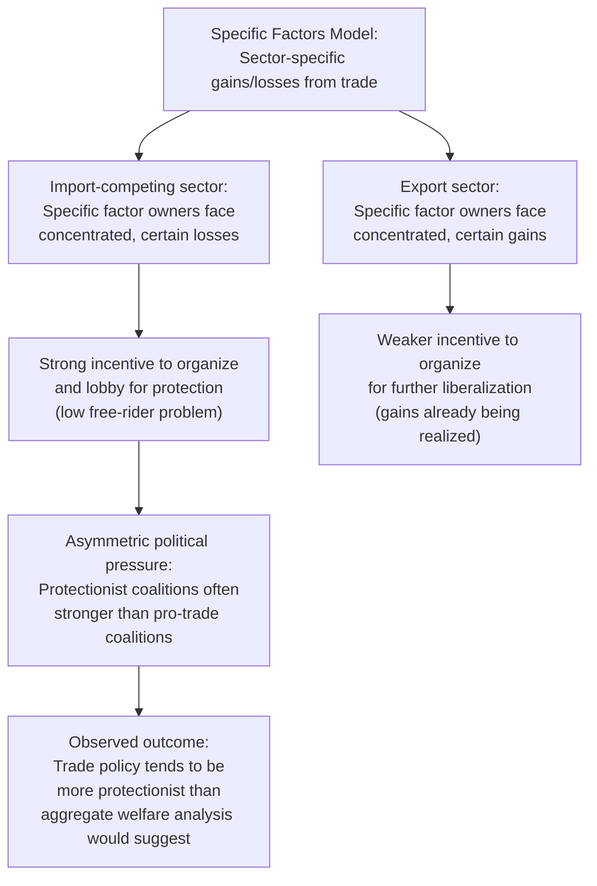

## Political Implications of the Specific Factors Model

### Overview

The specific factors model does more than generate comparative-statics predictions about wages and rents — it provides a structural explanation for the *pattern* of trade politics observed empirically: why lobbying coalitions organize by **industry** rather than by **factor type** (labor vs. capital) in the short-to-medium run, and why protectionist pressure is often intense and concentrated even when the aggregate efficiency costs of protection are comparatively small and diffuse. This topic connects the model's positive (descriptive) predictions to political economy theory, particularly collective action theory and the study of endogenous trade policy formation.

### The Central Insight: Sector-Based, Not Class-Based, Coalitions

**Key Points**

- Because specific factors (capital, land, industry-specific skills) cannot easily exit their sector in the short run, their owners have a direct and concentrated stake in *that sector's* relative price — not in the price of capital-intensive vs. labor-intensive goods generally.
- This means real-world trade lobbying coalitions predicted by the specific factors model are organized as **capital owners of the steel industry** and **labor employed in the steel industry** jointly lobbying for steel protection — not as "capital" as a class lobbying together against "labor" as a class (which is the coalition structure predicted by Heckscher-Ohlin/Stolper-Samuelson in the long run).
- Empirically, this sector-based coalition pattern (an industry's management, unions, and shareholders lobbying together for the same protectionist policy) is what is actually observed in most trade-policy episodes — a point emphasized in the political economy trade literature (e.g., Magee, Brock, and Young's work on tariff formation, and the broader "protection for sale" literature building on Grossman and Helpman 1994).

### Contrast with the Heckscher-Ohlin (Stolper-Samuelson) Political Prediction

| Model | Predicted Coalition Structure | Predicted Political Cleavage |
| --- | --- | --- |
| Specific Factors (short run) | By **industry**: capital + labor within a sector coalesce | Export sectors vs. import-competing sectors |
| Heckscher-Ohlin (long run) | By **factor type**: all capital vs. all labor (Stolper-Samuelson) | Capital-owning class vs. labor-owning class, economy-wide |

**Key Points**

- Rogowski (1989), in *Commerce and Coalitions*, applied the Stolper-Samuelson long-run logic to explain historical political alignments (e.g., landed elites vs. labor in different factor-abundance contexts across countries and eras) — a factor-type-based political economy account.
- The specific factors model instead predicts what is sometimes called the **"industry" or "sector" cleavage**, and much of the empirical political science and political economy literature (particularly studies using firm- or industry-level lobbying data) finds this sector-based pattern to be a better empirical fit for short/medium-run trade politics than the pure class-based Stolper-Samuelson prediction.

### Concentrated Costs, Diffuse Benefits: The Collective Action Logic

**Key Points**

- The specific factors model's prediction that losses from import competition are **concentrated** on a small number of specific-factor owners (in one contracting industry) while the gains from trade (cheaper imports) are **diffuse** across all consumers maps directly onto Mancur Olson's (1965) theory of collective action.
- Small, concentrated groups (e.g., domestic steel producers) face lower organizational costs and stronger per-capita incentives to lobby than large, diffuse groups (e.g., all consumers of steel products), even though the aggregate consumer gain from free trade in steel may exceed the aggregate producer loss.
- This asymmetry in organizational capacity is a standard explanation for why protectionist policy is often observed even when it is aggregately inefficient — the political process is biased toward the better-organized, concentrated losers.

### Formal Political Economy Extension: "Protection for Sale"

**Key Points**

- **Grossman and Helpman (1994)** formalized industry lobbying for trade protection in a model where organized industries (specific-factor owners, effectively) offer political contributions to a government that weighs both social welfare and campaign contributions.
- The model predicts that industries with **better organization** (lower free-rider problems, often correlating with capital concentration in a specific-factors sense) and industries with **lower import penetration elasticities** receive more protection — directly building on the specific-factors intuition that concentrated, sector-specific stakeholders are the primary drivers of trade policy lobbying.
- This literature treats the specific factors model's distributional predictions as the *primitive* generating each industry's willingness-to-pay for protection.

### Diagram: From Model to Political Outcome

### Why Import-Competing Industries Lobby More Intensely Than Export Industries Benefit from Advocacy

**Key Points**

- Export-sector specific factors already gain from existing trade openness — their political energy is more often directed at *maintaining* market access (e.g., opposing foreign tariffs, negotiating trade agreements) rather than domestic policy change.
- Import-competing specific factors face a *concentrated, first-order threatened loss*, which historically generates more intense, defensive lobbying (tariff petitions, anti-dumping cases, safeguard actions) than the comparatively diffuse advocacy for further liberalization.
- This asymmetry helps explain the historically observed **status-quo bias** in trade policy — it is generally easier to prevent tariff reduction (or secure new protection) than to enact large-scale unilateral liberalization, absent reciprocal negotiating leverage (which is itself a mechanism, via GATT/WTO reciprocity norms, designed to mobilize export-sector interests as a counterweight).

### Time Horizon and the Persistence of Sector-Based Politics

**Key Points**

- Because actual capital reallocation across sectors is slow and costly (consistent with the specific factors model's short/medium-run assumptions), the sector-based political coalition structure can persist for extended periods — decades, in some cases (e.g., agricultural protection in many advanced economies, textile/apparel protection historically) — rather than dissolving into the long-run Heckscher-Ohlin factor-class coalition structure.
- This provides a political-economy rationale for why real-world trade policy debates are so often framed industry-by-industry ("save the steel industry," "protect American textiles") rather than in the classical factor-type terms ("protect capital" or "protect labor") that dominate purely long-run theoretical treatments.

### Empirical Tests of Coalition Structure

**Key Points**

- Studies examining campaign contributions, lobbying expenditures, and public tariff-petition data by industry (rather than by broad factor-type classifications) have generally found stronger empirical support for sector-based (specific-factors) coalition patterns than for pure factor-type (Stolper-Samuelson) coalition patterns in short/medium-run trade politics.
- **Scheve and Slaughter (2001)**, by contrast, found some evidence for factor-type-based political attitudes (skill-based divisions in individual trade policy preferences) using survey data, suggesting that both mechanisms can be empirically present depending on the level of analysis (individual attitudes vs. organized industry lobbying) and time horizon considered. [Inference: reconciling these different empirical findings is an active area within the political economy of trade literature rather than a fully settled question, since individual attitude surveys and organized lobbying behavior can reflect different underlying mechanisms.]

### Related Topics

- Trade and the distribution of income within a country
- Short run versus long run factor mobility
- Grossman-Helpman "Protection for Sale" model
- Collective action theory and Olson's concentrated-costs/diffuse-benefits logic
- Stolper-Samuelson theorem and factor-type political coalitions (Rogowski's thesis)
- Endogenous trade policy formation
- GATT/WTO reciprocity norms as a mechanism for mobilizing export interests
- Political economy of tariffs, anti-dumping, and safeguard measures