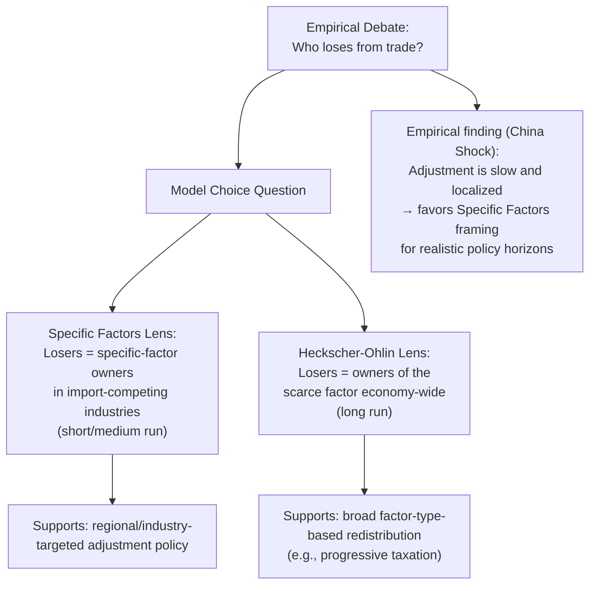

## The Debate over Who Loses from Trade

### Overview

While the specific factors and Heckscher-Ohlin models provide clean theoretical predictions about who gains and loses from trade, translating these predictions into empirical identification of *actual* losers has proven far more contentious. This debate spans theoretical modeling choices, empirical methodology, and disagreement over the relative importance of trade versus other forces (technology, domestic policy, market structure) in driving observed distributional outcomes. This topic surveys the major fault lines in this debate.

### Fault Line 1: Trade vs. Technology as the Driver of Rising Inequality

**Key Points**

- Beginning in the 1980s-90s, wage inequality (particularly the skill premium — the wage gap between college-educated and non-college-educated workers) rose substantially in the United States and several other advanced economies, coinciding with expanding trade with labor-abundant developing countries.
- **Trade-based explanation**: Consistent with Stolper-Samuelson logic, if advanced economies are relatively skilled-labor-abundant, trade with skill-scarce developing countries should raise the skilled wage premium and depress relative wages of unskilled labor.
- **Skill-biased technical change (SBTC) explanation**: An alternative and, for much of the 1990s-2000s literature, dominant explanation attributes rising skill premia primarily to technological change (particularly computerization) that increased relative demand for skilled labor, largely independent of trade exposure.
- **Krugman (2008)** and others revisited this debate as China's trade integration accelerated, arguing that the trade channel's importance had likely been underestimated in earlier literature calibrated to a period (1980s) when developing-country trade volumes were still relatively modest.
- [Inference: characterizing the state of the field] Most trade economists today would describe this as a matter of *relative magnitude* rather than an either/or dispute — both channels are generally accepted as real, with disagreement centering on their quantitative contribution, which varies by country, time period, and industry studied.

### Fault Line 2: Aggregate/Long-Run Models vs. Local/Short-Run Adjustment Costs

**Key Points**

- Traditional H-O/Stolper-Samuelson-based empirical work often implicitly assumed relatively rapid, frictionless reallocation of labor and capital across sectors and regions — consistent with the model's long-run assumptions.
- The **"China Shock" literature** (Autor, Dorn, and Hanson, beginning with their 2013 paper "The China Syndrome") documented that in practice, local labor markets exposed to import competition experienced **large, persistent, geographically concentrated** declines in employment and wages, with adjustment taking many years to over a decade — far slower than frictionless long-run models would predict.
- This finding reoriented much of the empirical trade-and-labor literature toward regional/local general equilibrium models with costly labor mobility, explicitly incorporating specific-factors-style short-run rigidities rather than assuming H-O long-run convergence.
- **Critiques and extensions**: Subsequent work (e.g., by Feenstra, and others) has debated the precise magnitude of the "China shock" employment effects, appropriate econometric identification strategies (given that import penetration is not randomly assigned across regions), and the extent to which the finding generalizes beyond the specific U.S.-China episode studied.

### Fault Line 3: Who Counts as a "Loser" — Absolute vs. Relative Losses

**Key Points**

- A worker whose real wage *rises* but rises by less than it would have absent trade is a "loser" only in a relative (counterfactual) sense — this is a conceptually distinct claim from a worker experiencing an absolute decline in real income.
- Much of the political debate conflates these two senses: Stolper-Samuelson technically predicts the scarce factor's real return can *fall in absolute terms* under certain conditions, but empirically, whether real wages for less-skilled U.S. workers *actually declined in absolute terms* due to trade (versus merely growing more slowly than they otherwise would have) is a harder and more disputed empirical claim.
- This distinction matters significantly for policy framing: "trade slowed wage growth for some workers" is a much weaker and more defensible empirical claim than "trade caused absolute declines in living standards," yet both are sometimes invoked interchangeably in public discourse.

### Fault Line 4: General Equilibrium Feedback and Consumer Gains

**Key Points**

- Even workers who lose as *producers* (facing import competition in their industry) may partially or fully offset this loss as *consumers*, since import competition typically lowers prices of the goods affected — a channel emphasized by trade economists such as Broda and Romalis, who find that lower-income households, who spend a disproportionate share of income on tradable goods, may capture larger relative consumer-price benefits from trade.
- Critics of a purely producer-side "loser" framing argue that a complete distributional accounting must net out these consumption-side gains, which are diffuse and less visible than concentrated job losses but can be economically significant for the same households.
- [Inference: the degree to which consumer-side gains offset producer-side losses for the *same individuals* — as opposed to offsetting in aggregate across different individuals — remains an empirically difficult and somewhat unsettled question, since the workers most exposed to import competition in their jobs are not necessarily the same households capturing the largest consumer-price benefits.]

### Fault Line 5: Model Choice — Specific Factors vs. Heckscher-Ohlin as the Right Lens

**Key Points**

- Which theoretical lens is empirically more appropriate has direct policy implications: if the specific-factors, sector/region-based framing is more accurate over realistic policy timeframes, targeted adjustment assistance is the more natural remedy; if the H-O, factor-type framing dominates, broader redistributive taxation aimed at capital vs. labor income is more directly indicated.
- The weight of post-2013 empirical evidence (led by the China Shock literature) has shifted mainstream trade economics toward taking short/medium-run, geographically-concentrated, specific-factors-style effects considerably more seriously than earlier generations of trade theory, which tended to emphasize long-run H-O aggregate efficiency results.

### Fault Line 6: Methodological Debates in Identification

**Key Points**

- A central empirical challenge is that trade exposure is not randomly assigned: regions/industries with declining competitiveness for reasons unrelated to trade may also happen to be more exposed to import competition, biasing naive comparisons.
- The Autor-Dorn-Hanson approach and related work use instrumental variables (e.g., import growth in *other* developed countries facing similar Chinese competition, as an instrument for U.S. import exposure) to address this endogeneity concern — a methodological innovation central to the "credibility revolution" in trade-and-labor empirics.
- Critics have raised concerns about instrument validity, the appropriate geographic unit of analysis (commuting zones vs. other definitions), and the generalizability of estimates derived from a specific historical episode (China's WTO accession and subsequent export surge) to other trade-liberalization contexts.

### Where the Debate Currently Stands

[Inference: this is a synthesis characterization of an active research area rather than a settled textbook consensus] Most contemporary trade economists appear to accept that: (1) trade has real, non-trivial distributional effects that are more concentrated and slower to dissipate than mid-20th-century long-run models suggested; (2) technology remains a major, independent driver of skill-premium changes, with its relative importance to trade varying by period and context; (3) aggregate efficiency gains from trade are real but do not by themselves resolve the political and welfare challenges posed by concentrated losses; and (4) the appropriate policy response likely requires some combination of adjustment assistance (specific-factors-informed) and broader redistributive policy (H-O-informed), rather than relying on either framework alone.

### Related Topics

- Trade and the distribution of income within a country
- The "China Shock" literature (Autor, Dorn, Hanson) and its critiques
- Skill-biased technical change vs. trade as inequality drivers
- Political implications of the specific factors model
- Instrumental variable identification strategies in trade empirics
- Consumer price effects of trade (Broda-Romalis research)
- Trade Adjustment Assistance program design and effectiveness