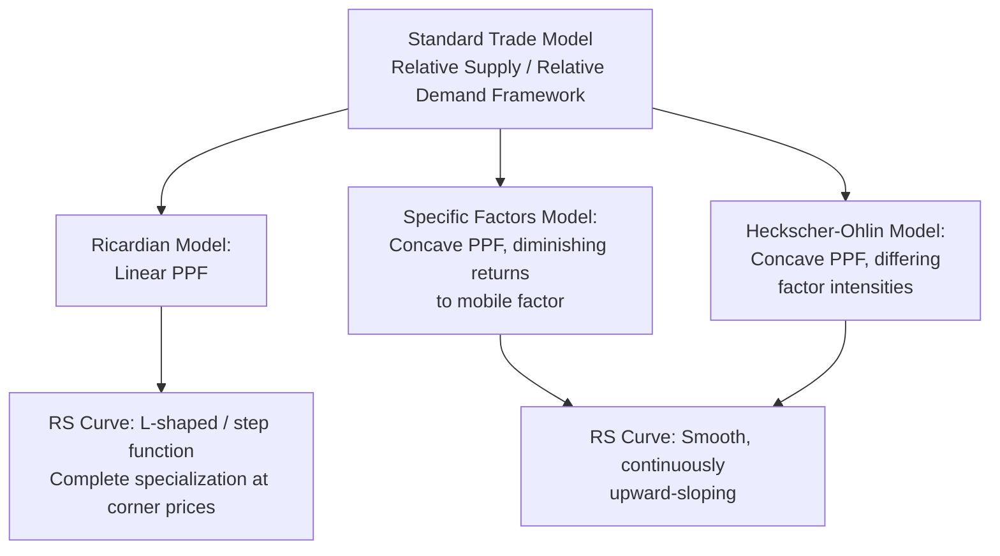

## Relative Supply and Relative Demand for Goods

### Overview

The relative supply and relative demand framework is the core analytical apparatus of the **standard trade model**, a generalization that nests the Ricardian, specific factors, and Heckscher-Ohlin models as special cases. Rather than tracking absolute quantities and prices of each good separately, the standard model works with the **relative price** of one good in terms of the other and the **relative quantity** produced/consumed — allowing a single, unified diagram (relative supply and relative demand curves) to determine equilibrium and analyze the effects of shocks, growth, and trade regardless of which underlying production-side model (Ricardian, specific factors, or H-O) generated the supply side.

### Setting Up the Model

**Key Points**

- Two goods: $X$ (say, exportable) and $Y$ (importable), with prices $p_X$ and $p_Y$.
- The key variable of interest is the **relative price** $p_X/p_Y$, and the corresponding **relative quantities**: relative supply $Q_X/Q_Y$ and relative demand $D_X/D_Y$ (or, in the trade context, relative quantities produced and consumed).
- The production possibility frontier (PPF), whatever its underlying shape (linear for Ricardian, bowed-out/concave for specific factors or H-O), together with the price ratio, determines the economy's production point and hence relative supply.
- Relative demand is derived from consumer preferences (typically represented via community indifference curves under homothetic preferences).

### Relative Supply (RS) Curve

**Key Points**

- The relative supply curve plots $Q_X/Q_Y$ as a function of the relative price $p_X/p_Y$.
- **Upward-sloping**: as $p_X/p_Y$ rises, producers reallocate resources toward $X$, raising $Q_X$ relative to $Q_Y$ — this holds generally whenever the PPF is concave (bowed outward), reflecting increasing opportunity costs of production (true in the specific factors and multi-good Ricardian models with diminishing returns, and in the H-O model with differing factor intensities).
- **Special case — Ricardian model**: with a linear PPF (constant opportunity cost), the relative supply curve is not smoothly upward sloping but instead is an **L-shaped (or "step") curve**: the economy specializes completely in $X$ if $p_X/p_Y$ exceeds the autarky opportunity cost ratio, is indifferent (a horizontal segment) exactly at that ratio, and specializes completely in $Y$ below it.
- **Specific factors / H-O case**: production responds smoothly and continuously to price changes (per the Rybczynski-type reallocation mechanics of the specific factors model), giving a smoothly upward-sloping RS curve without the discontinuous jump of the Ricardian case.

### Relative Demand (RD) Curve

**Key Points**

- The relative demand curve plots $D_X/D_Y$ as a function of $p_X/p_Y$, derived from utility maximization subject to the budget constraint.
- **Downward-sloping**: as $p_X$ rises relative to $p_Y$, consumers substitute away from the now relatively more expensive good $X$ toward $Y$ — a standard substitution-effect result, assuming well-behaved (convex) preferences.
- Under **homothetic preferences** (a common simplifying assumption in trade theory), the relative demand curve is independent of the level of income — only relative prices matter for the ratio $D_X/D_Y$, which considerably simplifies welfare and terms-of-trade analysis since income effects on the *relative* demand ratio can be set aside.

### Equilibrium: Autarky and World Relative Price

**Key Points**

- In a **closed economy (autarky)**, equilibrium relative price $(p_X/p_Y)^A$ is where domestic RS = domestic RD.
- When the economy **opens to trade**, it faces the **world relative price** $(p_X/p_Y)^W$, determined by the intersection of *world* relative supply and *world* relative demand (aggregating both trading partners' RS and RD curves).
- If the country's autarky relative price of $X$ is *lower* than the world relative price, the country has a comparative advantage in $X$ and becomes an exporter of $X$ under trade (standard comparative-advantage logic, now expressed in relative-price/relative-quantity terms rather than absolute labor-cost terms).

### Diagram: Relative Supply and Relative Demand Equilibrium

<svg xmlns="http://www.w3.org/2000/svg" viewBox="0 0 700 450">
<text x="350" y="24" font-size="16" text-anchor="middle" fill="#1a1a1a" font-family="sans-serif" font-weight="bold">Relative Supply and Relative Demand (svg_diagram)</text>
<line x1="80" y1="380" x2="640" y2="380" stroke="#333" stroke-width="2" />
<line x1="80" y1="380" x2="80" y2="50" stroke="#333" stroke-width="2" />

<text x="360" y="410" font-size="13" text-anchor="middle" font-family="sans-serif">Relative Quantity Q_X / Q_Y</text>

<text x="45" y="215" font-size="13" text-anchor="middle" font-family="sans-serif" transform="rotate(-90 45 215)">Relative Price p_X / p_Y</text>

<path d="M 130 340 Q 300 220 480 100" stroke="#2563eb" stroke-width="3" fill="none" />
<text x="500" y="90" font-size="13" fill="#2563eb" font-family="sans-serif" font-weight="bold">RS</text>

<path d="M 130 100 Q 300 220 550 330" stroke="#dc2626" stroke-width="3" fill="none" />
<text x="560" y="335" font-size="13" fill="#dc2626" font-family="sans-serif" font-weight="bold">RD</text>

<circle cx="300" cy="220" r="5" fill="#16a34a" />
<line x1="300" y1="220" x2="300" y2="380" stroke="#16a34a" stroke-width="1.5" stroke-dasharray="4,3" />
<line x1="80" y1="220" x2="300" y2="220" stroke="#16a34a" stroke-width="1.5" stroke-dasharray="4,3" />
<text x="315" y="215" font-size="12" fill="#16a34a" font-family="sans-serif" font-weight="bold">Equilibrium</text>
<text x="300" y="398" font-size="12" text-anchor="middle" fill="#16a34a" font-family="sans-serif">(Q_X/Q_Y)*</text>
<text x="60" y="216" font-size="12" text-anchor="end" fill="#16a34a" font-family="sans-serif">(p_X/p_Y)*</text>
</svg>

### Deriving Relative Supply from the PPF Explicitly

At any point on the PPF, profit-maximizing producers equate the relative price to the marginal rate of transformation (MRT):

$$\frac{p_X}{p_Y} = MRT_{XY} = -\frac{dQ_Y}{dQ_X}$$

As $p_X/p_Y$ rises, the economy moves along the PPF toward greater $Q_X$ production and lower $Q_Y$ production (a "clockwise" movement along a concave PPF), tracing out the upward-sloping RS curve. The specific shape and curvature of RS (how steep or flat) reflects the elasticity of transformation, which is governed by the underlying production model:

- **Ricardian**: infinite elasticity along the linear PPF segment (until specialization), zero elasticity at the corners.
- **Specific factors / H-O**: finite, generally increasing marginal opportunity cost, giving smooth, continuously upward-sloping RS.

### Deriving Relative Demand from Consumer Preferences

Utility-maximizing consumers set the marginal rate of substitution (MRS) equal to the relative price:

$$\frac{p_X}{p_Y} = MRS_{XY} = \frac{\partial U/\partial Q_X}{\partial U/\partial Q_Y}$$

Tracing out the tangency between the budget line (with slope $-p_X/p_Y$) and successive indifference curves as $p_X/p_Y$ varies generates the downward-sloping RD curve.

### Diagram: Model Nesting and RS Curve Shape

### Using RS/RD to Analyze Shocks

**Key Points**

The RS/RD framework's main analytical value is that any shock can be classified as shifting RS, shifting RD, or both, with the resulting change in equilibrium relative price and quantity read directly off the diagram:

- **Economic growth** (biased or unbiased): shifts RS (analyzed via Rybczynski-type effects for biased growth)
- **Change in preferences/tastes**: shifts RD
- **Tariffs and trade policy**: can shift both the effective domestic RS/RD faced by producers/consumers (via the wedge between world and domestic prices) and, at the world level, the world RS or RD if the country is "large"
- **Terms-of-trade determination**: the equilibrium relative price at the intersection of *world* RS and RD **is** the terms of trade, making this framework the natural starting point for terms-of-trade analysis (see subsequent chapter topics on terms-of-trade determination and effects of growth on terms of trade)

### Welfare Representation: The Offer Curve Connection

**Key Points**

- The RS/RD diagram is closely related to, but distinct from, the offer curve (reciprocal demand curve) approach to depicting trade equilibrium — RS/RD is typically drawn in relative-price/relative-quantity space for a single (often small open) economy or the world as a whole, while offer curves plot each country's desired exports/imports against each other directly.
- Both frameworks are used interchangeably in different textbook treatments to determine the equilibrium terms of trade; the RS/RD version is generally considered more transparent for illustrating the underlying production and consumption microfoundations, while offer curves are more convenient for depicting two-country strategic/bilateral trade equilibrium directly.

### Related Topics

- Terms of trade determination in the standard trade model
- Effects of economic growth on relative supply (Rybczynski-type biased growth)
- Immiserizing growth and its RS/RD interpretation
- Offer curves and the reciprocal demand framework
- Community indifference curves and homothetic preferences in trade theory
- Terms-of-trade effects of tariffs and trade policy
- Transfer problem analysis using RS/RD