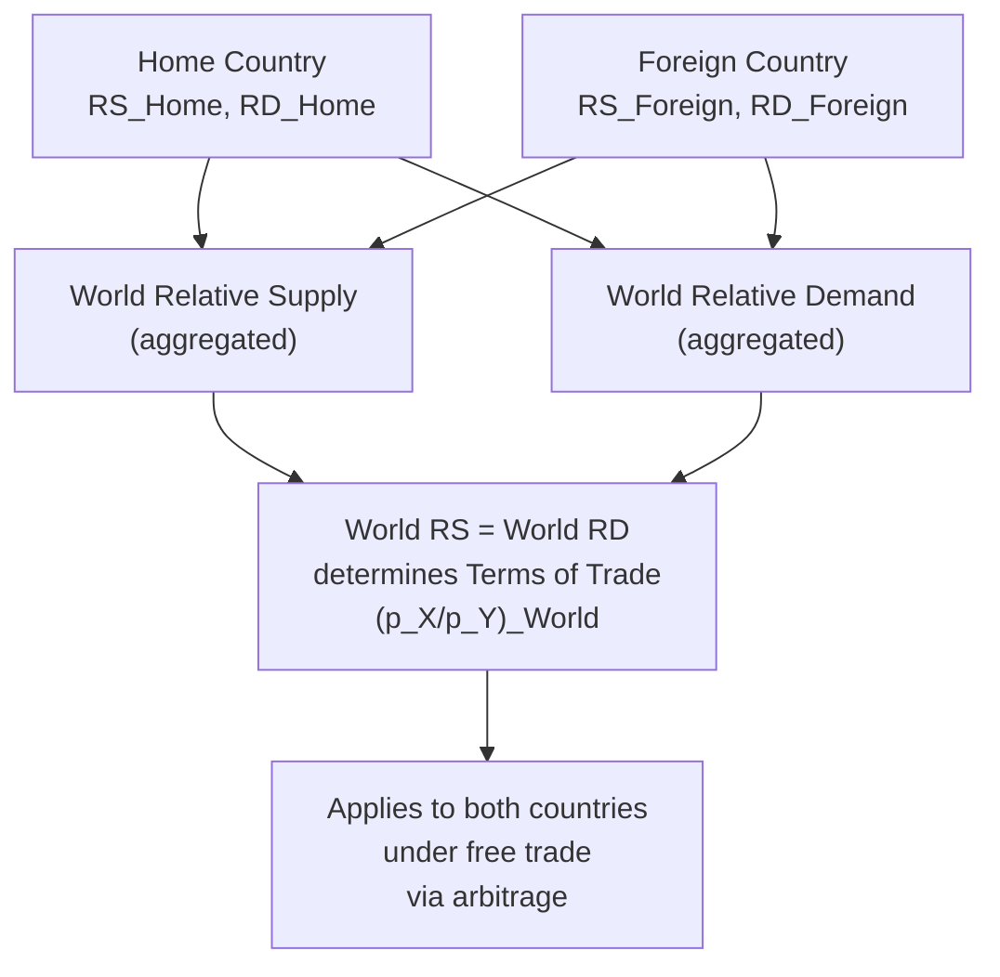

## Determination of the Terms of Trade

### Overview

The terms of trade (TOT) is the relative price at which a country exchanges its exports for imports on world markets, and its determination is the central equilibrium result of the standard trade model. Formally, the terms of trade equalize world relative supply and world relative demand for traded goods, and its level directly determines how the gains from trade are split between trading partners. This topic develops the formal determination mechanism, the role of country size, and the welfare implications of terms-of-trade levels and changes.

### Formal Definition

For a country exporting good $X$ and importing good $Y$, the terms of trade is conventionally defined as:

$$TOT = \frac{p_X}{p_Y}$$

A **rise** in the terms of trade (an increase in $p_X/p_Y$) means the country's exports have become more valuable relative to its imports — it can obtain more imports per unit of exports, an unambiguous welfare improvement for a small country taking prices as given (holding domestic production and consumption technology fixed).

### World Equilibrium: Intersection of World RS and World RD

**Key Points**

- Each country has its own relative supply (RS) curve, reflecting its production technology and factor endowments, and its own relative demand (RD) curve, reflecting its preferences and income.
- **World relative supply** is the horizontal summation (in relative-quantity terms, appropriately aggregated) of both countries' RS curves; **world relative demand** is the analogous aggregation of RD curves.
- The equilibrium **world relative price** — the terms of trade — is determined where world RS equals world RD:

$$RS^{World}\left(\frac{p_X}{p_Y}\right) = RD^{World}\left(\frac{p_X}{p_Y}\right)$$

- This single equilibrium price then applies to *both* countries under free trade (absent transport costs or trade barriers), since arbitrage ensures a single world price for each traded good.

### Diagram: World Equilibrium and the Terms of Trade

### Bounding the Terms of Trade: The Role of Autarky Prices

**Key Points**

- The equilibrium world terms of trade must lie **between** the two countries' autarky relative prices — this is the formal expression of comparative advantage determining the *direction* of trade, while the position within that range determines the *split of gains*.
- If Home's autarky price ratio is $(p_X/p_Y)^A_{Home} < (p_X/p_Y)^A_{Foreign}$, then Home has comparative advantage in $X$, and the equilibrium world TOT will satisfy:

$$\left(\frac{p_X}{p_Y}\right)^A_{Home} < \left(\frac{p_X}{p_Y}\right)^{World} < \left(\frac{p_X}{p_Y}\right)^A_{Foreign}$$

- Where exactly within this range the world TOT settles depends on the **relative sizes** of the two countries' RS and RD curves — this is a key departure from the simple Ricardian two-country model (where, with linear PPFs, the world TOT is *entirely* pinned down by relative country size and demand strength, since RS is flat/step-shaped within the specialization range).

### Country Size and the Terms of Trade

**Key Points**

- **Small country case**: if Home is small relative to Foreign, Home's own RS/RD curves have a negligible effect on world aggregates — the world (and thus Home's) terms of trade converges to Foreign's autarky relative price. A small country is a "price taker" in world markets and cannot influence its own terms of trade through domestic policy.
- **Large country case**: if both countries are of comparable economic size, each country's RS/RD curves meaningfully influence the world equilibrium price — this is the standard setting in which a country's trade policy (e.g., an optimal tariff) can shift the terms of trade in its own favor, a mechanism explored formally in the optimal tariff / terms-of-trade-manipulation literature.
- The **large-country vs. small-country distinction** is one of the most consequential simplifying choices in trade policy analysis: small-country models rule out any terms-of-trade rationale for protection, while large-country models permit it (at the potential cost of retaliation).

### Terms of Trade in the Ricardian Special Case

**Key Points**

- With linear PPFs (constant opportunity costs) in both countries, the world RS curve is a step function: flat at Home's opportunity cost for $X$ while Home is incompletely specialized in $X$, flat at Foreign's (higher) opportunity cost once Foreign becomes the sole supplier of $Y$, and vertical (fully inelastic) at the point of complete world specialization in each good if both countries are fully specialized.
- In this case, the terms of trade is generically determined by the intersection of this step-shaped world RS with world RD, and the specific numeric TOT is highly sensitive to the relative size of the two countries (a smaller version of the classic Ricardian "gains split" example with wine and cloth).

### Diagram: TOT Bounded Between Autarky Prices

<svg xmlns="http://www.w3.org/2000/svg" viewBox="0 0 700 380">
<text x="350" y="24" font-size="16" text-anchor="middle" fill="#1a1a1a" font-family="sans-serif" font-weight="bold">Terms of Trade Bounded by Autarky Prices (svg_diagram)</text>
<line x1="80" y1="320" x2="640" y2="60" stroke="#999" stroke-width="1" stroke-dasharray="2,2" />
<line x1="100" y1="300" x2="100" y2="80" stroke="#2563eb" stroke-width="3" />
<text x="100" y="330" font-size="12" text-anchor="middle" fill="#2563eb" font-family="sans-serif">Home autarky (p_X/p_Y)^A</text>
<line x1="580" y1="300" x2="580" y2="80" stroke="#dc2626" stroke-width="3" />
<text x="580" y="330" font-size="12" text-anchor="middle" fill="#dc2626" font-family="sans-serif">Foreign autarky (p_X/p_Y)^A</text>
<line x1="330" y1="300" x2="330" y2="80" stroke="#16a34a" stroke-width="3" stroke-dasharray="5,3" />
<text x="330" y="60" font-size="12" text-anchor="middle" fill="#16a34a" font-family="sans-serif" font-weight="bold">World Terms of Trade</text>
<text x="330" y="345" font-size="11" text-anchor="middle" fill="#16a34a" font-family="sans-serif">Between the two autarky prices</text>
<line x1="80" y1="360" x2="640" y2="360" stroke="#333" stroke-width="2" />
<text x="360" y="365" font-size="12" text-anchor="middle" font-family="sans-serif" dy="15">Relative Price p_X / p_Y (increasing →)</text>
</svg>

### Terms of Trade and the Split of Gains from Trade

**Key Points**

- A country whose terms of trade settles **close to its own autarky price** captures a **smaller** share of the total gains from trade (it is barely better off than autarky).
- A country whose terms of trade settles **close to its trading partner's autarky price** captures a **larger** share of the gains (it obtains the good it imports at a price close to what the partner would have charged domestically, near the partner's opportunity cost).
- This is a formalization of a classical result (traceable to Mill's theory of reciprocal demand): the country with the "stronger" (larger, or with relatively less elastic/more inelastic import demand) economic weight in world markets tends to see the terms of trade settle closer to the *other* country's autarky price, capturing more of the gains — an intuition often summarized loosely as "large countries benefit more from trade with small countries" (though the precise result depends on relative demand elasticities, not size alone).

### Dynamic and Policy-Relevant Extensions

**Key Points**

- **Economic growth**: shifts in a country's RS or RD curve (from biased growth, population change, or preference shifts) move the equilibrium TOT — this is the basis for analyzing whether growth is "immiserizing" (see related topic) for a country whose growth worsens its own terms of trade sufficiently to offset the direct gains from growth.
- **Optimal tariffs**: a large country can use a tariff to manipulate its terms of trade in its own favor (by reducing its import demand, which — for a large country — lowers the world price of its imports), a strategy formalized in the terms-of-trade theory of optimal tariffs, though it invites retaliation and is a negative-sum strategy at the world level if adopted by all trading partners.
- **Real-world measurement**: empirically, countries' terms of trade are tracked via export and import price indices; commodity-exporting developing countries in particular have historically experienced high terms-of-trade volatility tied to global commodity price cycles, a subject of extensive development-economics literature (e.g., the Prebisch-Singer hypothesis on secularly declining terms of trade for primary-commodity exporters).

### Related Topics

- Relative supply and relative demand for goods
- Effects of economic growth on the terms of trade
- Immiserizing growth
- Optimal tariff theory and terms-of-trade manipulation
- Offer curves and reciprocal demand
- Prebisch-Singer hypothesis and commodity terms-of-trade trends
- Small country vs. large country trade policy models